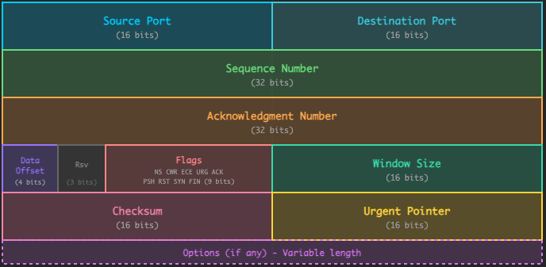

# Networking Deep Dive for System Design Interviews

Every system design interview involves networking. Whether you are designing a chat application, URL shortener, or video streaming platform, data must travel between clients and servers across networks. 
Understanding networking fundamentals helps you make better design decisions and explain your choices to interviewers.
This chapter covers networking from the ground up. We will start with how data moves through the network stack, then dive into TCP, UDP, DNS, and HTTP. We will explore real-time communication with WebSockets, security with TLS, and the unique challenges of networking in distributed systems.
# 1. The Network Stack: OSI vs TCP/IP
When you click a link in your browser, dozens of things happen before the page appears. Your computer looks up the IP address, establishes a connection, negotiates encryption, sends the request, and receives the response. Each step involves a different protocol, and these protocols are organized into layers.
Why layers? Because networking is complex, and we need a way to manage that complexity. Each layer handles one concern, whether that is routing packets across the internet or ensuring data arrives without corruption.

## 1.1 The OSI Model
The OSI (Open Systems Interconnection) model divides networking into 7 layers. Think of it like an assembly line where each station does one job and passes the work to the next.

#### Why 7 layers?
Each layer abstracts complexity from the layers above it. 
When you write an HTTP request, you do not think about packet routing or electrical signals. The layers below handle that. This abstraction lets you focus on application logic while trusting the network stack to deliver your data.
More importantly, understanding layers helps you debug problems. If your service cannot reach a database, is it a DNS issue (Layer 7)? A firewall blocking the port (Layer 4)? A routing problem (Layer 3)? Knowing the stack helps you ask the right questions.

## 1.2 The TCP/IP Model
The OSI model is a teaching tool. In the real world, the TCP/IP model is what actually runs the internet. It combines several OSI layers and maps directly to the protocols you will use.
| TCP/IP Layer | OSI Layers | Protocols |
| --- | --- | --- |
| Application | 7, 6, 5 | HTTP, HTTPS, DNS, FTP, SMTP |
| Transport | 4 | TCP, UDP |
| Internet | 3 | IP, ICMP, ARP |
| Network Access | 2, 1 | Ethernet, WiFi, PPP |

## 1.3 Data Encapsulation
Here is where it gets interesting. When your application sends data, it does not go directly to the network. Instead, each layer wraps the data with its own header, like putting a letter in an envelope, then putting that envelope in a package, then putting that package in a shipping container.
When you encounter a network problem, use the layers to narrow down the cause. "Connection refused" means TCP cannot reach the port, likely a firewall or the service is not running. 
"No route to host" points to IP routing, maybe a misconfigured VPC or security group. "SSL handshake failed" indicates a certificate or TLS configuration problem. Thinking in layers helps you troubleshoot systematically.
# 2. IP Addressing and Routing
Every device on a network needs an address. Without addresses, packets would have no way to find their destination. IP addresses are like phone numbers, they identify where to send data.

## 2.1 IPv4 vs IPv6
When the internet was designed in the 1980s, 4.3 billion addresses seemed like plenty. That assumption has not aged well. With smartphones, IoT devices, and cloud services, we ran out of IPv4 addresses years ago.
**IPv4** uses 32-bit addresses like `192.168.1.1`. These addresses are scarce, so we resort to tricks like NAT (Network Address Translation) to share them.
**IPv6** solves this with 128-bit addresses like `2001:db8::1`. The address space is so large that we could assign an IP to every atom on Earth and still have addresses left over. Adoption has been slow, but it is happening.
For system design, IPv4 remains the default. You will occasionally see IPv6 in discussions about global scale or mobile networks, but most internal systems still run on IPv4.

## 2.2 Public vs Private IP Addresses
Not all IP addresses are created equal. Some addresses work only within private networks. Others are routable across the public internet.
This distinction matters for system design. Your database server should have a private IP that is not reachable from the internet. Your load balancer needs a public IP so users can reach it. Getting this wrong creates either security vulnerabilities or connectivity issues.
| Range | Type | Use |
| --- | --- | --- |
| 10.0.0.0/8 | Private | Large organizations |
| 172.16.0.0/12 | Private | Medium networks |
| 192.168.0.0/16 | Private | Home/small office |
| Everything else | Public | Internet-routable |

**NAT (Network Address Translation)** allows multiple devices with private IPs to share a single public IP. Your home router performs NAT.

## 2.3 Subnetting and CIDR
When you design a system on AWS, GCP, or any cloud provider, one of the first decisions is how to carve up your network. CIDR notation helps you specify IP ranges concisely.
The notation `192.168.1.0/24` means "the first 24 bits are the network, the remaining 8 bits are for hosts." That gives you 256 addresses (254 usable, since one is the network address and one is broadcast).
The smaller the number after the slash, the larger the network:
| CIDR | Subnet Mask | Hosts | Use Case |
| --- | --- | --- | --- |
| /8 | 255.0.0.0 | 16.7M | Large cloud providers |
| /16 | 255.255.0.0 | 65,534 | VPCs, large networks |
| /24 | 255.255.255.0 | 254 | Typical subnets |
| /28 | 255.255.255.240 | 14 | Small subnets |
| /32 | 255.255.255.255 | 1 | Single host |

#### Why bother with subnets?
Subnets let you segment your network for security and control. A typical production setup might look like this:
The public subnet holds your load balancer, which has a public IP. The private subnet holds your application servers, which are not directly reachable from the internet. The data subnet holds your database, isolated from everything except the application servers. If someone compromises a server in the public subnet, they still cannot reach your database directly.

## 2.4 How Routing Works
IP addresses tell us where to send data, but they do not tell us how to get there. That is the job of routing. Every router along the path looks at the destination IP and decides which direction to forward the packet.
Every router has a routing table that maps destination networks to next hops:
The router checks each destination against its table, finds the most specific match (longest prefix), and forwards the packet. If no specific route matches, it uses the default route (`0.0.0.0/0`).
Packets may take different paths across the internet, even within the same connection. Routers make independent decisions, and conditions change. This is why TCP needs sequence numbers to reassemble data in order.
Network topology affects latency. Services in the same availability zone communicate in under a millisecond. Cross-region traffic adds tens of milliseconds. If two services talk frequently, put them in the same region, or better, the same AZ.
# 3. TCP Deep Dive
TCP is the workhorse of the internet. Every HTTP request, database query, and microservice call typically runs over TCP. It handles the messy reality of networking, packets get lost, arrive out of order, or get corrupted, and makes it look like a reliable stream of bytes to your application.
Understanding TCP helps you make better design decisions. Why does a new connection start slowly? Why do short-lived connections waste resources? Why does high packet loss devastate performance? The answers are all in how TCP works.

## 3.1 TCP Connection Lifecycle
Before sending data, TCP establishes a connection. This takes a round trip, which is why connection reuse matters at scale.

#### Why a 3-way handshake?
The handshake has to accomplish two things: verify that both sides can send and receive, and agree on initial sequence numbers.
1. **SYN:** Client picks a random sequence number (say, 1000) and sends it. "I want to connect, starting at sequence 1000."
2. **SYN-ACK:** Server picks its own sequence number (say, 5000) and acknowledges the client's. "Got it, I am starting at 5000, and I acknowledge your 1000."
3. **ACK:** Client acknowledges the server's sequence number. "Got your 5000, we are ready."

Why random sequence numbers? If they were predictable, an attacker could inject fake packets into a connection. Random numbers make this much harder.
Why not two steps? With only two steps, the server would not know if the client received its response. Old, delayed SYN packets could trick the server into allocating resources for connections that will never complete.

## 3.2 TCP Header Structure

**Key fields:**
| Field | Purpose |
| --- | --- |
| Source/Dest Port | Identify application endpoints |
| Sequence Number | Order bytes in the stream |
| Acknowledgment | Confirm received bytes |
| Flags (SYN, ACK, FIN) | Control connection state |
| Window | Flow control (how much data sender can send) |
| Checksum | Error detection |

## 3.3 Reliability Mechanisms
IP is unreliable. Packets can get lost, duplicated, corrupted, or arrive out of order. TCP adds reliability on top of IP through four mechanisms that work together.

#### 1. Acknowledgments and Retransmission
Every segment of data gets acknowledged. When the sender does not receive an ACK within a timeout period, it assumes the packet was lost and retransmits it.

#### 2. Sequence Numbers
Each byte in the stream has a sequence number. If packet 3 arrives before packet 2, the receiver holds packet 3 until packet 2 shows up, then delivers both in order. If the same packet arrives twice (a retransmission that was not needed), the receiver ignores the duplicate.

#### 3. Checksums
Every TCP segment includes a checksum computed over the header and data. If the receiver's checksum does not match, the packet was corrupted in transit, and TCP discards it silently. The sender will eventually retransmit.

#### 4. Sliding Window
Waiting for an ACK after every packet is slow, especially over high-latency links. The sliding window lets the sender have multiple packets "in flight" simultaneously.

## 3.4 Flow Control
What happens if the sender transmits faster than the receiver can process? Without flow control, the receiver's buffers overflow, and packets get dropped. TCP prevents this by having the receiver advertise how much data it can accept.
This back-pressure mechanism is automatic. Your application just writes to the socket, and TCP handles the pacing. But if the receiver is consistently slower than the sender, you have a design problem that flow control cannot fix.

#### Window Scaling for Modern Networks
The original TCP header has a 16-bit window field, limiting it to 64KB. That was fine in the 1980s, but on a 1 Gbps link with 100ms latency, you can have 12.5MB of data in flight. Modern TCP uses a window scaling option negotiated during the handshake to support windows up to 1GB.

## 3.5 Congestion Control
Flow control prevents overwhelming the receiver. Congestion control prevents overwhelming the network.
Imagine a router in the middle of the internet handling traffic from thousands of connections. If everyone sends as fast as possible, the router's queues overflow, packets get dropped, and everyone's performance suffers. TCP tries to be a good citizen by detecting congestion and backing off.
**Slow Start:** A new connection does not know how much bandwidth is available. It starts with a small congestion window (typically 10 segments) and doubles every round trip. This exponential growth quickly finds the available capacity.
**Congestion Avoidance:** Once the window hits a threshold (or after recovering from loss), growth becomes linear. Add one segment per RTT. This cautious probing avoids triggering congestion.
**Fast Recovery:** If the sender receives three duplicate ACKs (same acknowledgment number three times), it means a packet was lost but subsequent packets arrived. The sender retransmits immediately and halves its window, rather than starting over.
**Timeout:** If no ACK arrives at all, something is seriously wrong. The sender resets to slow start with a minimal window.
| Situation | What Happens | Impact |
| --- | --- | --- |
| New connection | Slow start | First few RTTs are slow |
| Stable network | Congestion avoidance | Gradual optimization |
| Minor loss | Fast recovery | Brief slowdown |
| Major loss | Timeout reset | Significant slowdown |

New TCP connections start slow. On a high-latency link (100ms RTT), it takes several round trips just to ramp up to full speed. If your system makes many short-lived connections, most of the time is spent in slow start, never reaching peak throughput.
This is why connection pooling and HTTP keep-alive are important. Reusing connections avoids the slow start penalty. Database connection pools, HTTP/2 multiplexing, and gRPC streaming all exist partly because of this TCP behavior.

#### Modern Congestion Control Algorithms
The classic algorithms (Reno, New Reno) use packet loss as the signal of congestion. Modern algorithms are smarter:
| Algorithm | Approach | Best For |
| --- | --- | --- |
| CUBIC | Aggressive after loss recovery | Linux default, high bandwidth |
| BBR | Measures bandwidth and RTT directly | Variable networks, Google's choice |
| Vegas | Detects congestion before loss | Low-latency applications |

## 3.6 TCP Tuning Parameters
You rarely need to tune TCP, but when you do, these are the parameters that matter:

#### When You Hit TCP Limits
| Symptom | Likely Cause | Fix |
| --- | --- | --- |
| "Connection refused" under load | Listen queue full | Increase somaxconn |
| Thousands of TIME-WAIT sockets | Many short connections | Enable tw_reuse, use connection pooling |
| Slow bulk transfers | Small buffers on high-latency link | Increase buffer sizes |
| High latency for first request | TCP + TLS handshakes | Enable TCP Fast Open |
| Connections dropping after idle | Firewall killing idle connections | Tune keepalive or use application-level pings |

# 4. UDP and When to Use It
TCP does a lot of work: connection setup, reliability, ordering, flow control, congestion control. That work takes time and bandwidth. Sometimes you do not need it. That is where UDP comes in.
UDP strips away all the complexity. It just takes your data, adds source and destination ports, and sends it. No handshakes, no acknowledgments, no retransmissions. If a packet gets lost, UDP does not care. If packets arrive out of order, UDP delivers them that way.

## 4.1 UDP vs TCP
The trade-off is fundamental: reliability versus latency.
| Aspect | TCP | UDP |
| --- | --- | --- |
| Connection | Required handshake | None |
| Reliability | Guaranteed delivery | Best effort |
| Ordering | Maintained | Not guaranteed |
| Header size | 20–60 bytes | 8 bytes |
| Use cases | HTTP, databases, file transfer | DNS, video streaming, gaming |

## 4.2 UDP Header
Just 8 bytes. No sequence numbers, no acknowledgments, no connection state.

## 4.3 When to Use UDP
The question is not "is reliability important?" but rather "who should handle reliability?"
**DNS:** A DNS query is tiny (a few hundred bytes) and expects a quick response. If the response does not arrive in 2 seconds, the client just asks again. TCP's handshake would take longer than the actual query. UDP fits perfectly.
**Video Streaming:** When you are watching a video, a lost frame is annoying but tolerable. Waiting to retransmit it is worse because now multiple frames are stale. The video player interpolates or shows a brief glitch and moves on. UDP with application-level buffering works better than TCP here.
**Online Gaming:** In a multiplayer game, you send player position 60 times per second. If packet 42 is lost but packet 43 arrives, you do not want the old position. You want the latest state. TCP would deliver packet 42 first, adding latency and giving you outdated information.
**Voice/Video Calls:** Similar to gaming. A brief audio glitch is better than a half-second delay while TCP retransmits. Our brains are surprisingly good at filling in gaps.
**IoT Sensors:** A temperature sensor sending readings every second does not need guaranteed delivery. If one reading is lost, the next one arrives in a second anyway. UDP keeps the protocol stack minimal for constrained devices.

## 4.4 Building Reliability on UDP
Sometimes you want UDP's speed but need reliability for certain messages. The solution is to implement reliability at the application layer, but only where you need it.

#### QUIC (HTTP/3)
Google built QUIC to fix TCP's limitations. It runs on UDP but implements its own reliability, ordering, and congestion control. The key innovation is that it can multiplex multiple streams without head-of-line blocking. If one stream loses a packet, other streams keep flowing. QUIC also has 0-RTT connection establishment for repeat visitors.

#### Game Networking
A game might have three types of messages:
1. **Unreliable:** Player position (60 times/second, old data is useless)
2. **Reliable unordered:** Chat messages (must arrive, order does not matter)
3. **Reliable ordered:** Game state changes (must arrive in order)

The game protocol uses UDP underneath but tracks sequence numbers and acknowledgments only for the reliable messages.
# 5. DNS: The Internet's Directory
Humans remember names. Computers need numbers. DNS bridges this gap, translating `google.com` into `142.250.80.46`.
DNS seems simple until you realize it is the most heavily relied-upon distributed system in the world. Every web request, API call, and email delivery starts with a DNS lookup. If DNS is slow, everything is slow. If DNS is down, nothing works.

## 5.1 DNS Hierarchy
DNS is not a single database. It is a hierarchical, distributed system with millions of servers worldwide.
When you look up , the query flows from your browser through multiple servers:
This looks slow, but caching makes it fast. Most queries hit a cache at some level and return immediately. A full recursive lookup only happens when no cached answer exists.

## 5.2 DNS Record Types
| Record | Purpose | Example |
| --- | --- | --- |
| A | Domain to IPv4 | google.com -> 142.250.80.46 |
| AAAA | Domain to IPv6 | google.com -> 2607:f8b0:4004:800::200e |
| CNAME | Alias to another domain | www.google.com -> google.com |
| MX | Mail server | google.com -> smtp.google.com |
| TXT | Arbitrary text | SPF, DKIM, verification |
| NS | Nameserver for domain | google.com -> ns1.google.com |
| SOA | Start of authority | Zone configuration |
| SRV | Service location | _http._tcp.example.com |

## 5.3 DNS Caching
Without caching, the internet would collapse. Every click would trigger multiple round trips across the globe. Caching makes DNS fast, but it also creates interesting trade-offs.

#### The TTL Dilemma
Every DNS record has a TTL (Time To Live) that controls how long it can be cached. Choosing the right TTL is a trade-off:
| TTL | Propagation Time | DNS Load | Use Case |
| --- | --- | --- | --- |
| 60 seconds | ~1 minute | High | Active failover, blue-green deploys |
| 300 seconds | ~5 minutes | Medium | Most production services |
| 3600 seconds | ~1 hour | Low | Stable services |
| 86400 seconds | ~1 day | Minimal | Static assets, rarely-changing configs |

**The catch:** Caches do not always respect TTL. Some ISPs cache longer than they should. Corporate proxies add their own caching. When you change a DNS record, some users will see the old IP for longer than you expect. Plan for this during migrations.

## 5.4 DNS in System Design
DNS is more than name resolution. It is a tool for traffic management.

#### Round-Robin Load Balancing
Return multiple A records and let clients pick one:
This spreads traffic across servers, but with significant limitations:
- **No health checks:** DNS keeps returning dead servers
- **Caching undermines distribution:** A cached response sends all requests to one server
- **No session awareness:** The same user might hit different servers on each request

For these reasons, DNS load balancing is usually a first layer, with a real load balancer behind it.

#### Geographic Routing
DNS can route users to the nearest data center based on the source IP of their DNS resolver.

#### Service discovery
SRV records let you discover not just the IP but also the port and priority of a service:
Kubernetes and service meshes often use DNS for internal service discovery, though they may use specialized resolvers like CoreDNS rather than public DNS.
# 6. HTTP/HTTPS Protocol
HTTP is how the web talks. Every API call, every page load, every image download uses HTTP. It is a simple request-response protocol built on top of TCP, and understanding its details helps you design better APIs and debug production issues.

## 6.1 HTTP Request/Response
An HTTP transaction is simple: the client sends a request, the server sends a response.
**Request components:**
| Component | Purpose | Example |
| --- | --- | --- |
| Method | Action to perform | GET, POST, PUT, DELETE |
| Path | Resource identifier | /api/users/123 |
| Headers | Metadata | Authorization, Content-Type |
| Body | Data payload | JSON, form data |

**Response components:**
| Component | Purpose | Example |
| --- | --- | --- |
| Status Code | Result indicator | 200, 404, 500 |
| Headers | Metadata | Content-Type, Cache-Control |
| Body | Response data | JSON, HTML |

## 6.2 HTTP Methods
HTTP methods have semantic meaning. Using them correctly makes your API predictable.
| Method | Purpose | Idempotent | Safe | Request Body |
| --- | --- | --- | --- | --- |
| GET | Retrieve resource | Yes | Yes | No |
| POST | Create resource | No | No | Yes |
| PUT | Replace resource entirely | Yes | No | Yes |
| PATCH | Partial update | No | No | Yes |
| DELETE | Remove resource | Yes | No | Optional |
| HEAD | Get headers only | Yes | Yes | No |
| OPTIONS | Get allowed methods | Yes | Yes | No |

**Idempotent** means you can retry safely. Sending the same PUT request twice leaves the resource in the same state. This matters for reliability, if the network drops and you are not sure if the request succeeded, you can retry an idempotent request without fear.
**Safe** means no side effects. GET requests should never modify data. This lets proxies cache them and lets browsers retry them automatically.

#### Common mistakes:
- Using GET for actions that modify data (breaks caching, causes accidental repeats)
- Using POST for everything (loses idempotency guarantees)
- Treating PATCH as idempotent (it is not, by default)

## 6.3 HTTP Status Codes
**Common status codes:**
| Code | Meaning | When to Use |
| --- | --- | --- |
| 200 | OK | Successful GET, PUT |
| 201 | Created | Successful POST |
| 204 | No Content | Successful DELETE |
| 301 | Moved Permanently | URL changed permanently |
| 302 | Found | Temporary redirect |
| 304 | Not Modified | Cached version valid |
| 400 | Bad Request | Invalid input |
| 401 | Unauthorized | Missing/invalid auth |
| 403 | Forbidden | Valid auth, no permission |
| 404 | Not Found | Resource does not exist |
| 429 | Too Many Requests | Rate limited |
| 500 | Internal Server Error | Server bug |
| 502 | Bad Gateway | Upstream server error |
| 503 | Service Unavailable | Server overloaded |
| 504 | Gateway Timeout | Upstream timeout |

## 6.4 HTTP/1.1 vs HTTP/2 vs HTTP/3

#### HTTP/1.1: The Problem
In HTTP/1.1, each connection handles one request at a time. If you need 10 resources, you either wait for them sequentially or open multiple connections. Browsers limit themselves to 6 connections per domain, so you can fetch 6 resources in parallel at most. Developers worked around this with domain sharding (spreading assets across cdn1.example.com, cdn2.example.com, etc.).

#### HTTP/2: Multiplexing
HTTP/2 allows multiple requests on a single connection. All those requests interleave as "streams." No more connection limits, no more domain sharding. The protocol is binary rather than text, enabling better compression and parsing.
But HTTP/2 has a subtle problem: it runs on TCP. If a single TCP packet is lost, all streams are blocked until retransmission, even streams whose data arrived fine. This is TCP-level head-of-line blocking.

#### HTTP/3: QUIC to the Rescue
HTTP/3 uses QUIC instead of TCP. QUIC implements its own reliability per-stream, so a lost packet only blocks its own stream. Other streams continue flowing. QUIC also enables 0-RTT resumption, meaning repeat visitors can send data immediately without waiting for a handshake.
| Feature | HTTP/1.1 | HTTP/2 | HTTP/3 |
| --- | --- | --- | --- |
| Transport | TCP | TCP | QUIC (UDP) |
| Multiplexing | No | Yes | Yes |
| Header compression | No | HPACK | QPACK |
| Server push | No | Yes | Yes |
| Head-of-line blocking | Yes | Partial | No |

## 6.5 HTTP Caching
Caching is the most effective way to improve performance. A request that never reaches your server is infinitely fast.

#### Cache-Control headers
The `Cache-Control` header tells browsers and CDNs what to cache and for how long:
| Directive | What It Means |
| --- | --- |
| public | CDNs and proxies can cache |
| private | Only the user's browser can cache |
| max-age=N | Fresh for N seconds |
| no-cache | Must check with server before using |
| no-store | Never write to disk (PII, tokens) |
| immutable | Will never change, cache forever |

#### Conditional Requests: Efficient Revalidation
When a cached response expires, the browser can ask "has this changed?" rather than re-downloading everything:
# 7. TLS/SSL and Security
HTTPS is HTTP with encryption. Without TLS, anyone on the network path, your ISP, a coffee shop router, a compromised backbone router, can read your traffic. With TLS, they see encrypted bytes.
TLS provides three things:
1. **Encryption:** Data cannot be read in transit
2. **Authentication:** You are talking to who you think you are
3. **Integrity:** Data cannot be modified without detection

## 7.1 TLS Handshake
Before encrypted communication begins, client and server must agree on encryption keys. This is the TLS handshake.

#### TLS 1.3 improvements
TLS 1.2 requires two round trips. TLS 1.3 cuts this to one.
TLS 1.3 also removes outdated cipher suites, encrypts more of the handshake (hiding which website you are visiting from observers), and supports 0-RTT resumption for repeat visitors.

## 7.2 Certificate Chain
How do you know you are really talking to google.com and not an attacker? Certificates.
Your browser trusts a set of Certificate Authorities (CAs). When a server presents its certificate, the browser verifies it was signed by a trusted CA.

#### What the browser checks:
1. Certificate chain leads to a trusted root CA
2. Every signature in the chain is valid
3. No certificate is expired or revoked
4. The domain in the certificate matches the requested domain

If any check fails, the browser shows a warning. Never train users to click through these warnings.

## 7.3 TLS Termination Strategies
Where do you decrypt HTTPS traffic? This is a key architectural decision.
| Strategy | When to Use | Trade-offs |
| --- | --- | --- |
| Edge termination | Most web apps | Simple, but internal traffic is unencrypted |
| End-to-end TLS | Compliance requirements, zero-trust | Certificate rotation becomes complex |
| Mutual TLS | Service-to-service auth | Both sides need certificates, adds latency |

For most applications, edge termination at the load balancer is sufficient. Your internal network is protected by VPCs and security groups. But for PCI compliance or zero-trust architectures, you may need end-to-end encryption.

## 7.4 HTTPS Best Practices

#### Use Modern Cipher Suites
TLS 1.3 simplifies this, it only includes modern ciphers. For TLS 1.2, prefer:
Disable anything with "CBC", "3DES", or "RC4".

#### Security Headers
These HTTP headers strengthen your security posture:

#### Automate Certificate Management
Manual certificate renewal is a recipe for outages at 3 AM on a Saturday. Use:
- **Let's Encrypt/ACME:** Free, automated certificates
- **AWS Certificate Manager:** Handles rotation automatically for AWS services
- **HashiCorp Vault:** For internal PKI and service certificates

# 8. WebSockets and Real-Time Communication
HTTP is designed for request-response: client asks, server answers. But many applications need the server to push data to the client without being asked. Chat messages, stock prices, live scores, collaborative editing, all require real-time updates.
There are several ways to achieve this, each with different trade-offs.

## 8.1 Polling vs Long Polling vs SSE vs WebSocket
Let us compare the options:
**Short Polling:** Client asks repeatedly, "Any updates?" Most requests get empty responses. Simple but wastes resources.
**Long Polling:** Client asks, server holds the request until there is data (or timeout). More efficient than short polling, but still one request per update.
**Server-Sent Events (SSE):** Server pushes events over a long-lived HTTP connection. Simple, built into browsers, but one-way only.
**WebSocket:** Full bidirectional communication over a single persistent connection. Most efficient for frequent two-way messaging.
| Technique | Direction | Connection Overhead | Best For |
| --- | --- | --- | --- |
| Short polling | Client → Server | High (new request each time) | Infrequent updates, simple implementations |
| Long polling | Client → Server | Medium | Notifications, fallback when WebSocket blocked |
| SSE | Server → Client | Low (single connection) | News feeds, dashboards, one-way streams |
| WebSocket | Bidirectional | Lowest | Chat, gaming, real-time collaboration |

## 8.2 Choosing Real-Time Approach
# 9. Network Performance and Latency
Users do not care about your architecture. They care about how fast your app feels. And that "feel" is dominated by latency, the time between clicking and seeing a response.
At scale, network latency often exceeds processing time. Your database query might take 5ms, but the network round trip to the user takes 100ms. Understanding where latency comes from helps you design faster systems.

## 9.1 Latency Components
When you send a packet across the internet, where does the time go?
| Component | Definition | Typical Values |
| --- | --- | --- |
| Propagation | Time for signal to travel | ~5ms per 1000km |
| Transmission | Time to put data on wire | Depends on bandwidth |
| Processing | Router/server processing | <1ms typically |
| Queuing | Wait time in buffers | Variable, can spike |

## 9.2 Latency Numbers Every Developer Should Know
These numbers shape system design decisions:
**The key insight:** Once you leave the machine, latency jumps by orders of magnitude. A database query taking 1ms is dwarfed by 100ms of network latency to the user. Optimizing your code from 2ms to 1ms saves less than moving your servers closer to users.

## 9.3 Bandwidth vs Latency
People often confuse these. They are different things, and optimizing for one does not help the other.
**Bandwidth:** How much data can flow per second. Think of it as pipe width.
**Latency:** How long it takes for the first byte to arrive. Think of it as pipe length.
**For small requests (API calls, web pages):** Latency dominates. Sending 10KB on a 1 Gbps link takes 0.08ms. But if latency is 100ms, total time is 100.08ms. The bandwidth was irrelevant.
**For large transfers (backups, video):** Bandwidth dominates. Sending 1GB takes 8 seconds on 1 Gbps, 80 seconds on 100 Mbps. Latency of 100ms is noise.
For web applications serving small responses, focus on latency. For batch data pipelines, focus on bandwidth.

## 9.4 Reducing Latency
You cannot beat the speed of light. But you can reduce the distance it travels and the number of trips it makes.

#### 1. Move computation closer to users
CDNs for static content, edge functions for dynamic content, and multi-region deployments for global applications.

#### 2. Reduce round trips
Every round trip adds latency. Batch multiple operations into one request. Use HTTP/2 multiplexing. Keep connections alive instead of reconnecting.

#### 3. Cache aggressively
The fastest request is one you do not make. Cache at every layer: browser, CDN, application, database.

#### 4. Compress data
Less data = less transmission time. Use gzip or Brotli for text. Use efficient binary formats (Protocol Buffers, MessagePack) for internal APIs.

#### 5. Process asynchronously
Return a quick acknowledgment, process in the background, notify when done. The user sees a fast response even if the actual work takes time.

## 9.5 Tail Latency
Average latency lies. If 99% of your requests take 10ms but 1% take 5 seconds, your average looks fine while some users have a terrible experience.

#### Why p99 matters more than average:
A single page load might make 50+ requests. If any one of them is slow, the page feels slow.
A user loading a page with 50 API calls has a 39% chance of experiencing p99 latency. Monitor p99, not averages.

#### Common Causes of Tail Latency:
| Cause | Symptom | Fix |
| --- | --- | --- |
| GC pauses | Random spikes | Tune GC, allocate less |
| Cold cache | Spikes after deploy | Pre-warm caches |
| Resource contention | Correlates with load | Better isolation |
| Slow dependencies | Consistent tail | Timeouts, circuit breakers |
| Database locks | Transaction-heavy spikes | Optimize queries, shorter transactions |

# 10. Networking in Distributed Systems
Everything we have discussed so far gets harder in distributed systems. Instead of one server, you have dozens or thousands. Instead of one network hop, you have many. Instead of occasional failures, you have constant failures somewhere in the system.
The network is not just a pipe between your laptop and a server. It is a complex mesh connecting thousands of machines, and something is always broken.

## 10.1 The Network is Unreliable
In a distributed system, you cannot distinguish between "the network is slow" and "the server is down." Both look the same: no response.
**Dealing with failures:**
| Failure | Detection | Response |
| --- | --- | --- |
| Packet loss | Timeout, no ACK | Retry |
| Delay | Timeout (false positive possible) | Retry, may cause duplicate |
| Partition | Timeout from multiple nodes | Failover, accept inconsistency |

## 10.2 Timeouts
When a request does not get a response, how long do you wait? This simple question has no good answer.
**Too short:** You give up on requests that would have succeeded. You trigger retries that create duplicate work. Under load, you make things worse.
**Too long:** Users wait forever. Resources (connections, threads) stay tied up. You detect failures slowly.
**Strategies:**
| Strategy | How It Works | Best For |
| --- | --- | --- |
| Static | Fixed value (e.g., 5s) | Simple cases |
| Adaptive | Based on recent p99 + buffer | Variable latency |
| Deadline propagation | Pass remaining budget to downstream | Multi-hop requests |
| Circuit breaker | Stop trying after N failures | Failing dependencies |

**In practice:** Set connection timeout short (1-2s), read timeout based on expected operation time. For chained calls, propagate deadlines, if you have 5 seconds total and already spent 2 seconds, downstream only gets 3 seconds.

## 10.3 Retries and Idempotency
You sent a request. It timed out. What happened?
You cannot tell which case you are in. The solution is idempotency: design operations so that doing them twice has the same effect as doing them once.

#### Which Operations Are Naturally Idempotent?
| Operation | Idempotent? | Why |
| --- | --- | --- |
| GET /users/123 | Yes | Reading never changes state |
| PUT /users/123 {data} | Yes | Sets to specific value |
| DELETE /users/123 | Yes | Already deleted = still deleted |
| POST /orders | No | Creates new order each time |
| POST /transfer $100 | No | Transfers $100 each time |

#### Making Non-Idempotent Operations Safe
Use an idempotency key:
Many payment APIs (Stripe, PayPal) require idempotency keys for this reason. A retry will not charge the customer twice.

## 10.4 Service Discovery
In a dynamic environment, IP addresses change. Servers come and go. How does Service A find Service B?
| Approach | Complexity | Features | Best For |
| --- | --- | --- | --- |
| DNS | Low | Basic resolution | Simple setups |
| Service registry | Medium | Health checks, metadata | Microservices |
| Service mesh | High | mTLS, observability, traffic control | Complex systems, security requirements |

Most cloud environments use a combination. Kubernetes uses DNS (CoreDNS) internally, with optional service mesh (Istio, Linkerd) for advanced features.

## 10.5 Load Balancing in Distributed Systems
Load balancers distribute traffic across servers. The choice of algorithm affects performance and reliability.

#### Layer 4 vs Layer 7

#### Load balancing algorithms
| Algorithm | How It Works | Best For |
| --- | --- | --- |
| Round robin | Each request to next server | Uniform requests, stateless |
| Least connections | Route to server with fewest active connections | Long-lived connections, variable duration |
| Weighted | Higher weight = more traffic | Mixed server capacity |
| Consistent hashing | Same user/key hits same server | Caching, session affinity |
| Random (power of 2) | Pick 2 random servers, choose less loaded | Large clusters |

#### Server-Side vs Client-Side
| Approach | Pros | Cons |
| --- | --- | --- |
| Server-side LB | Simple clients, central control | Extra hop, potential bottleneck |
| Client-side | Direct connection, no bottleneck | Clients need discovery logic |

# 11. Common Interview Questions
These questions test your understanding of networking concepts. The answers below show what interviewers are looking for.

## 11.1 Conceptual Questions
**Q: What happens when you type google.com in a browser?**
This classic question tests whether you understand the full stack. Walk through each layer:
**Key insight to mention:** Most of this happens in parallel or is cached on repeat visits. Second visits skip DNS (cached), TCP (keep-alive), and often TLS (session resumption).
**Q: Explain the TCP handshake and why it's needed.**
**Q: When would you use UDP instead of TCP?**

## 11.2 Design Questions
**Q: How would you design a system for low latency globally?**
**Q: How do you handle network partitions?**

## 11.3 Troubleshooting Questions
**Q: How would you debug high latency?**
**Q: Connection timeouts vs read timeouts?**

## 11.4 Quick Reference
| Topic | Key Points |
| --- | --- |
| TCP | Reliable, ordered, connection-oriented, flow/congestion control |
| UDP | Unreliable, unordered, connectionless, low overhead |
| DNS | Hierarchical, cached, TTL-based, UDP typically |
| HTTP | Request-response, stateless, versions 1.1/2/3 |
| TLS | Encryption, authentication, integrity |
| WebSocket | Full-duplex, persistent, low overhead after handshake |
| Latency | Propagation + transmission + processing + queuing |
| Timeouts | Only failure detection method, choose carefully |
| Retries | Require idempotency for safety |
| Load balancing | L4 (transport) vs L7 (application) |

# Summary
Networking knowledge separates good system designs from great ones. Here are the key takeaways:
1. **Understand the stack.** Know which layer handles what. TCP provides reliability, IP provides routing, HTTP provides application semantics. Problems at different layers require different solutions.
2. **TCP is not magic.** It provides reliability through acknowledgments, retries, and ordering. These features have costs: latency, overhead, head-of-line blocking. Know when UDP is better.
3. **Latency is often the bottleneck.** At scale, network latency dominates processing time. Design to minimize round trips, move computation close to users, and cache aggressively.
4. **Networks fail.** Design for packet loss, delays, partitions, and total failures. Use timeouts, retries with idempotency, and circuit breakers.
5. **DNS is critical infrastructure.** Understand TTLs, caching, and how DNS enables geographic load balancing and failover.
6. **HTTP evolves.** HTTP/2 and HTTP/3 address HTTP/1.1 limitations. Know the differences and when they matter.
7. **Security is not optional.** TLS protects data in transit. Understand handshakes, certificates, and termination strategies.
8. **Real-time needs different approaches.** WebSockets, SSE, and polling each have trade-offs. Choose based on direction, frequency, and infrastructure constraints.
9. **Distributed systems amplify network challenges.** Service discovery, load balancing, and handling partial failures become essential.
10. **Monitor and measure.** Track latency percentiles, not averages. Instrument at every layer. Distributed tracing is invaluable.

When discussing networking in interviews, be specific. Do not just say "use HTTP." Explain why HTTP/2 multiplexing helps, how you would handle connection pooling, what timeout values you would choose, and how you would detect and recover from failures. This depth demonstrates real understanding.
# References
- [High Performance Browser Networking](https://hpbn.co/) - Ilya Grigorik's comprehensive guide to networking for web developers
- [Computer Networking: A Top-Down Approach](https://gaia.cs.umass.edu/kurose_ross/index.php) - Kurose and Ross's classic textbook
- [RFC 793: TCP Specification](https://tools.ietf.org/html/rfc793) - The original TCP specification
- [Cloudflare Learning Center](https://www.cloudflare.com/learning/) - Excellent explanations of DNS, HTTP, and web protocols
- [Google's BBR Congestion Control](https://cloud.google.com/blog/products/networking/tcp-bbr-congestion-control-comes-to-gcp-your-internet-just-got-faster) - Modern congestion control algorithm
- [Designing Data-Intensive Applications](https://dataintensive.net/) - Martin Kleppmann's book with excellent coverage of distributed systems networking

# Quiz

## Networking Quiz
In the OSI model, which layer is primarily responsible for routing packets between networks?