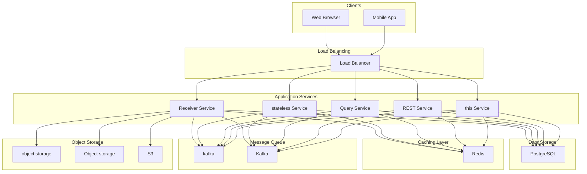
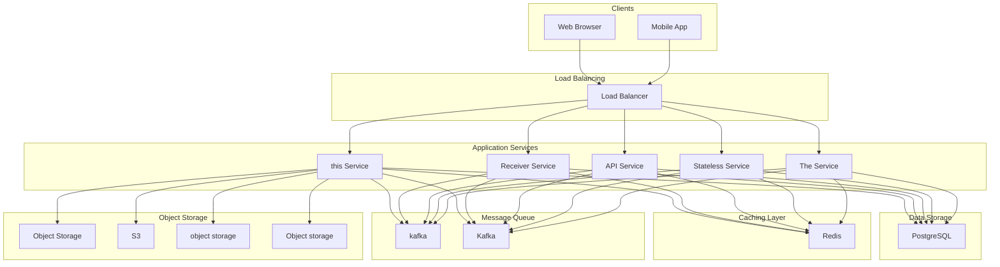
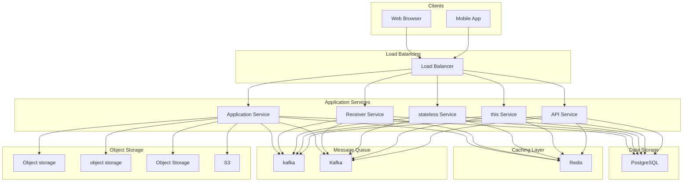

# Design Ad Click Aggregator

An ad click aggregator is a system that collects, deduplicates, and aggregates billions of ad click events to provide accurate metrics for billing advertisers and powering analytics dashboards.
The core challenge is processing massive volumes of click data in real-time while guaranteeing accuracy. Every click directly translates to money, so the system cannot afford to lose events or count duplicates. Advertisers pay per click, and publishers get paid per click, making data integrity paramount.
**Popular Examples:** Google Ads reporting, Meta Ads Manager, Amazon Advertising analytics, Twitter/X Ads dashboard
What makes this problem fascinating from a system design perspective is the combination of challenges it presents. 
You need to handle extreme write volumes (hundreds of thousands of events per second), guarantee exactly-once processing (no duplicates, no missed events), support flexible aggregations across multiple dimensions, and serve queries with low latency.
These requirements often conflict with each other, forcing you to make interesting trade-offs.
In this chapter, we will explore the **high-level design of an ad click aggregator**.
Lets start by clarifying the requirements.
# 1. Clarifying Requirements
Before starting the design, it's important to ask thoughtful questions to uncover hidden assumptions, clarify ambiguities, and define the system's scope more precisely.
Here is an example of how a discussion between the candidate and the interviewer might unfold:
**Candidate:** "What is the expected scale? How many ad clicks should the system handle per day?"
**Interviewer:** "Let's design for 10 billion ad clicks per day, with peak traffic during major shopping events like Black Friday reaching 3x normal load."
**Candidate:** "What aggregation granularity do we need? Should we aggregate by minute, hour, or day?"
**Interviewer:** "We need minute-level granularity for real-time dashboards and hourly/daily rollups for reporting and billing."
**Candidate:** "What dimensions should we aggregate by? Just ad_id, or multiple dimensions?"
**Interviewer:** "We need to aggregate by ad_id, campaign_id, advertiser_id, publisher_id, country, and device_type. Users should be able to query combinations of these dimensions."
**Candidate:** "How fresh should the data be? Is there a latency requirement for when a click shows up in dashboards?"
**Interviewer:** "Clicks should appear in real-time dashboards within 1-2 minutes. Billing reports can have up to 1 hour delay but must be 100% accurate."
**Candidate:** "How should we handle duplicate clicks? The same user might accidentally double-click, or network retries might send the same event twice."
**Interviewer:** "Great question. We must deduplicate clicks. Each click should only be counted once, even if we receive it multiple times."
**Candidate:** "What about late-arriving data? Mobile devices might send clicks hours after they occurred due to network issues."
**Interviewer:** "We should handle late data arriving up to 24 hours after the event. This is important for accurate billing reconciliation."
This conversation reveals several interesting constraints. The system is extremely write-heavy (billions of events), needs both real-time and batch processing paths, must guarantee exactly-once counting, and needs to handle late data gracefully. 
Let's formalize these into requirements.

## 1.1 Functional Requirements
Based on the discussion, here are the core features our system must support:
- **Click Ingestion:** Accept and store ad click events from multiple sources (web, mobile, SDKs).
- **Deduplication:** Ensure each click is counted exactly once, even with retries or network issues.
- **Real-time Aggregation:** Aggregate clicks by multiple dimensions (ad, campaign, advertiser, publisher, country, device) with minute-level granularity.
- **Query Interface:** Provide APIs to query aggregated data with flexible filtering and time ranges.
- **Late Data Handling:** Process clicks that arrive up to 24 hours after they occurred.

## 1.2 Non-Functional Requirements
Beyond features, we need to consider the qualities that make this system production-ready:
- **High Availability:** The system must be highly available (99.99% uptime). Losing click data means losing revenue.
- **Scalability:** Handle 10 billion clicks/day (115K QPS average, 350K QPS peak).
- **Low Latency:** Real-time dashboards should reflect clicks within 1-2 minutes.
- **Data Accuracy:** Exactly-once processing for billing accuracy. No duplicates, no missed clicks.
- **Durability:** Click data must never be lost. Support reprocessing if aggregation errors occur.

# 2. Back-of-the-Envelope Estimation
Before diving into the design, let's run some quick calculations to understand the scale we are dealing with. These numbers will guide our architectural decisions, particularly around ingestion infrastructure, storage, and processing capacity.

### 2.1 Traffic Estimates
Starting with the numbers from our requirements discussion:

#### Write Traffic (Click Ingestion)
We expect 10 billion ad clicks per day. Let's convert this to queries per second:
Traffic is never uniform. During peak shopping events like Black Friday or major product launches, we can expect 3x the normal load:
This is a massive write volume. For comparison, a typical web application might see a few thousand QPS. We are dealing with two orders of magnitude more.

#### Read Traffic (Dashboard Queries)
Read traffic is much lighter. Let's estimate:
- About 10,000 advertisers actively monitoring campaigns
- Each advertiser makes roughly 100 queries per day (refreshing dashboards, pulling reports)
- Total queries: 10,000 × 100 = 1 million queries per day

The system is **extremely write-heavy** with roughly a 10,000:1 write-to-read ratio. This asymmetry fundamentally shapes our architecture. We need to optimize for write throughput first and foremost, while reads can be served from pre-aggregated data.

### 2.2 Storage Estimates

#### Raw Click Events
Each click event needs to capture enough information for aggregation, deduplication, and auditing:
| Field | Size | Purpose |
| --- | --- | --- |
| click_id | 16 bytes | Unique identifier for deduplication |
| ad_id | 16 bytes | Which ad was clicked |
| campaign_id | 16 bytes | Parent campaign |
| advertiser_id | 16 bytes | Who pays for the click |
| publisher_id | 16 bytes | Who gets paid |
| user_id | 16 bytes | Anonymized user (for fraud detection) |
| timestamp | 8 bytes | When the click occurred |
| country | 4 bytes | Geographic dimension |
| device_type | 4 bytes | Device dimension |
| ip_address | 16 bytes | For fraud detection |
| user_agent | 30 bytes | Browser/app info |
| metadata | 20 bytes | Additional context |

**Total: approximately 150 bytes per click**
Now let's project storage growth:

#### Aggregated Data
Aggregated data is much more compact. With minute-level granularity across multiple dimensions:
- 1,440 minutes per day
- Approximately 1 million unique dimension combinations (ad × campaign × country × device)
- Each aggregated record: ~100 bytes (dimensions + count)

### 2.3 Key Insights
These estimates reveal several important design implications:
1. **Write-dominated workload:** With 115K writes per second vs 12 reads per second, the architecture must prioritize ingestion throughput. Traditional database architectures that optimize for reads will not work here.
2. **Storage is substantial but manageable:** 1.5 TB per day is significant but not extreme for modern infrastructure. Cloud storage can easily handle this. The real challenge is processing this volume in real-time.
3. **Aggregation dramatically reduces data:** Going from 1.5 TB of raw events to 140 GB of aggregations represents roughly 10x compression. This is why we pre-aggregate rather than querying raw events directly.
4. **Peak capacity planning is critical:** At 350K QPS during Black Friday, we need significant headroom. The system must be designed to handle 3x normal load without degradation.

# 3. Core APIs
With our requirements and scale understood, let's define the API contract. The ad click aggregator has two distinct interfaces: one for ingesting clicks (high-volume writes) and one for querying aggregations (lower-volume reads). Getting the details right matters for both usability and system performance.

### 3.1 Record Click Event

#### Endpoint: POST /clicks
This is the primary ingestion endpoint, called by ad SDKs, tracking pixels, and server-side integrations every time a user clicks an ad. Given the volume (115K+ calls per second), this endpoint must be extremely efficient.

#### Request Body:
| Parameter | Type | Required | Description |
| --- | --- | --- | --- |
| click_id | string | Yes | Client-generated unique identifier for deduplication. UUIDs work well here. |
| ad_id | string | Yes | ID of the ad that was clicked |
| campaign_id | string | Yes | ID of the advertising campaign |
| advertiser_id | string | Yes | ID of the advertiser (for billing) |
| publisher_id | string | Yes | ID of the publisher showing the ad (for revenue share) |
| timestamp | integer | Yes | When the click occurred (Unix milliseconds). Client-side timestamp. |
| user_id | string | No | Anonymized user identifier (for fraud detection and frequency capping) |
| country | string | No | Two-letter country code (e.g., "US", "IN") |
| device_type | string | No | One of "mobile", "desktop", "tablet" |
| ip_address | string | No | User's IP address (for fraud detection) |

#### Example Request:

#### Success Response (202 Accepted):
We return 202 (Accepted) rather than 201 (Created) because the click is queued for asynchronous processing. The system acknowledges receipt but has not yet processed the event.

#### Error Responses:
| Status | Meaning | When It Occurs |
| --- | --- | --- |
| 400 Bad Request | Invalid input | Missing required fields, malformed UUID, invalid timestamp |
| 429 Too Many Requests | Rate limited | Publisher or IP exceeding rate limits (potential fraud) |

### 3.2 Batch Record Clicks

#### Endpoint: POST /clicks/batch
Mobile SDKs often batch clicks to reduce network overhead and battery usage. Instead of sending each click individually, they accumulate events and send them in batches when connectivity is good.

#### Request Body:
| Parameter | Type | Required | Description |
| --- | --- | --- | --- |
| clicks | array | Yes | Array of click objects (same structure as single click) |

#### Example Request:

#### Success Response (202 Accepted):
The response tells the client exactly what happened with each click, which is useful for debugging SDK issues.

### 3.3 Query Aggregated Clicks

#### Endpoint: GET /aggregations
This is the primary query interface for dashboards and reports. Advertisers use it to answer questions like "How many clicks did campaign X get in Germany last week?"

#### Query Parameters:
| Parameter | Type | Required | Description |
| --- | --- | --- | --- |
| start_time | integer | Yes | Start of time range (Unix timestamp) |
| end_time | integer | Yes | End of time range (Unix timestamp) |
| granularity | string | Yes | One of "minute", "hour", "day" |
| group_by | array | Yes | Dimensions to group by (e.g., ["ad_id", "country"]) |
| filters | object | No | Filter conditions (e.g., {"advertiser_id": "adv_123"}) |
| limit | integer | No | Max results (default 1000, max 10000) |
| page_token | string | No | Cursor for pagination |

#### Example Request:

#### Success Response (200 OK):

#### Error Responses:
| Status | Meaning | When It Occurs |
| --- | --- | --- |
| 400 Bad Request | Invalid query | Time range too large, unknown dimension, invalid granularity |
| 401 Unauthorized | Auth failure | Missing or invalid API key |
| 403 Forbidden | Access denied | Querying data for another advertiser |
| 429 Too Many Requests | Rate limited | Too many concurrent queries |

### 3.4 Get Top Performers

#### Endpoint: GET /aggregations/top
A specialized endpoint optimized for leaderboard-style queries. Instead of returning aggregations by time bucket, it returns the top N items ranked by click count.

#### Query Parameters:
| Parameter | Type | Required | Description |
| --- | --- | --- | --- |
| start_time | integer | Yes | Start of time range |
| end_time | integer | Yes | End of time range |
| dimension | string | Yes | Dimension to rank by ("ad_id", "campaign_id", "publisher_id") |
| filters | object | No | Filter conditions |
| limit | integer | No | Number of results (default 10, max 100) |

#### Example Request:

#### Success Response (200 OK):
This endpoint exists because "show me my top performing ads" is one of the most common dashboard queries. By optimizing for this specific access pattern, we can serve it much faster than a generic aggregation query.
# 4. High-Level Design
Now we get to the interesting part: designing the system architecture. Rather than presenting a complex diagram upfront, we will build the design incrementally, starting with the simplest possible solution and adding components as we encounter challenges. This mirrors how you would approach the problem in an interview and helps build intuition about why each component exists.
Our system needs to handle three fundamental operations:
1. **Click Ingestion:** Accept billions of click events per day and store them durably.
2. **Aggregation:** Process raw clicks into aggregated metrics by multiple dimensions in near real-time.
3. **Query Serving:** Serve aggregated data to dashboards with low latency.

The extreme write-to-read ratio (10,000:1) tells us something important: we are not building a typical web application. Traditional architectures that optimize for reads will not work here. We need to prioritize ingestion throughput above almost everything else, and serve reads from pre-computed aggregations rather than querying raw data.
Let's build this architecture step by step, starting with click ingestion.

## 4.1 Requirement 1: Click Ingestion
When a user clicks an ad on a website or mobile app, we need to capture that event reliably. The key word here is "reliably." At 350K clicks per second during peak times, we cannot afford to drop events. Every missed click is lost revenue for someone.
The challenge is that we cannot process clicks synchronously at this volume. If we tried to validate, deduplicate, and aggregate each click before responding to the client, our latency would be unacceptable, and any hiccup in downstream processing would cause requests to pile up. Instead, we need to decouple ingestion from processing.

### Components for Click Ingestion

#### Click Receiver Service
This is a stateless service that receives HTTP requests containing click events. Think of it as a very fast bouncer at a club. Its job is simple: check that the request looks valid and let it through quickly.
The Click Receiver validates that required fields are present (click_id, ad_id, etc.), adds a server-side timestamp (useful when client clocks are wrong), and immediately forwards the click to a message queue. It does not wait for processing to complete before responding to the client.
Why stateless? Because we need to run many instances of this service behind a load balancer to handle peak traffic. Stateless services can be scaled horizontally without coordination.

#### Message Queue (Apache Kafka)
Kafka sits between ingestion and processing, acting as a shock absorber. When 350K clicks per second arrive during Black Friday, Kafka buffers them until the processing layer can catch up.
Why Kafka specifically? A few reasons:
- **Durability:** Kafka persists messages to disk before acknowledging receipt. Even if our entire processing layer goes down, we will not lose clicks.
- **Replay capability:** If we discover a bug in our aggregation logic, we can replay events from Kafka and recompute results. This is essential for a billing system.
- **Partitioning:** Kafka partitions data across multiple brokers, enabling parallel consumption. We partition by ad_id to ensure all clicks for the same ad go to the same partition (important for some aggregation patterns).
- **Ordering guarantees:** Within a partition, Kafka maintains strict ordering. This matters for handling late-arriving data correctly.

#### Data Lake (Long-term Storage)
Raw click events are written to a data lake (S3, Google Cloud Storage, or similar) for long-term retention. This serves two purposes:
1. **Auditing:** If an advertiser disputes their bill, we can go back to raw events and verify the counts.
2. **Reprocessing:** If our aggregation pipeline has bugs, we can replay raw events to recompute correct aggregations.

Think of the data lake as an append-only ledger. Once a click is written, it is never modified or deleted (until retention policies kick in years later).

### The Ingestion Flow
Let's trace through what happens when a user clicks an ad:
**Step 1:** User clicks an ad, which triggers the Ad SDK or tracking pixel to send a `POST /clicks` request.
**Step 2:** The Load Balancer routes the request to one of many Click Receiver instances. We use a simple round-robin or least-connections strategy since all receivers are identical.
**Step 3:** The Click Receiver validates the request. Are all required fields present? Is the click_id a valid format? Is the timestamp reasonable (not from the future or distant past)?
**Step 4:** If validation passes, the receiver publishes the click to Kafka, partitioned by ad_id. It waits for Kafka's acknowledgment to ensure the click is persisted.
**Step 5:** Once Kafka acknowledges, the receiver returns `202 Accepted` to the client immediately. The SDK knows the click was received; it does not need to wait for processing.
**Step 6:** A separate consumer reads from Kafka and writes raw clicks to the Data Lake in batches (for efficiency).
The 202 status code means "Accepted for processing." It signals to the client that the request was received but has not been fully processed yet. This is more accurate than 200, which implies the operation is complete.

## 4.2 Requirement 2: Click Aggregation
Raw clicks sitting in Kafka are not useful for dashboards. Advertisers do not want to query 10 billion individual events to answer "how many clicks did my campaign get today?" We need to aggregate these clicks in real-time, rolling them up by time windows and dimensions.

### Choosing an Aggregation Architecture
There are two mainstream approaches to stream aggregation, and the choice between them is worth discussing.

#### Lambda Architecture
The Lambda Architecture runs both stream (real-time) and batch processing in parallel:
The stream layer provides fast, approximate results. The batch layer periodically reprocesses all data to produce accurate results. The serving layer merges both views, preferring batch results when available.
**Pros:** The batch layer corrects any errors from stream processing. You get the best of both worlds.
**Cons:** You are maintaining two separate codebases that need to produce identical results. This is operationally complex and a common source of bugs. "Why do my real-time and batch numbers not match?" becomes a recurring investigation.

#### Kappa Architecture (Recommended)
The Kappa Architecture uses stream processing only, but designs it to be replayable:
All processing happens in the stream layer. If you need to reprocess (due to bugs or schema changes), you replay events from Kafka's retained log.
**Pros:** Single codebase, simpler operations. Everything goes through the same path.
**Cons:** The stream processor must handle exactly-once semantics correctly. If it miscounts, you need to replay to fix it.
We will use the **Kappa Architecture** for this design. Modern stream processors like Apache Flink have mature exactly-once semantics, making this approach production-ready. The simplicity of a single codebase outweighs the theoretical benefit of a batch correction layer.

### Components for Aggregation

#### Stream Processor (Apache Flink)
Flink consumes clicks from Kafka and produces aggregations in real-time. It handles several complex tasks:
1. **Deduplication:** Checks each click against a dedup store to ensure we do not count the same click twice.
2. **Time windowing:** Groups clicks into time windows (1-minute tumbling windows for real-time dashboards).
3. **Multi-dimensional aggregation:** Computes counts for every combination of dimensions (ad_id, campaign_id, country, device_type).
4. **Late data handling:** Incorporates clicks that arrive after their window has closed.

It has best-in-class support for exactly-once processing, sophisticated windowing semantics, and can handle millions of events per second. Alternatives like Spark Streaming or Kafka Streams would also work, but Flink is particularly strong for this use case.

#### Deduplication Store (Redis)
A Redis cluster stores click_ids that have been processed. When a click arrives, we check Redis to see if we have seen it before. If yes, we skip it. If no, we mark it as processed and continue.
Sub-millisecond latency for lookups, which is essential when processing 100K+ events per second. We will explore deduplication strategies in detail in the deep dive section.

#### Aggregation Store (ClickHouse)
Pre-computed aggregations are stored in ClickHouse, a columnar database optimized for analytical queries. When a time window closes, Flink writes the aggregated counts to ClickHouse.
Why ClickHouse? It is designed for exactly this use case: storing time-series aggregations and serving fast analytical queries. It handles billions of rows with sub-second query times, and its columnar storage provides excellent compression.

### The Aggregation Flow
Here is what happens as clicks flow through the aggregation pipeline:
**Step 1:** Flink consumes a batch of clicks from Kafka.
**Step 2:** For each click, Flink checks Redis to see if the click_id has been processed. We use Redis's `SET NX` (set if not exists) command, which atomically checks and sets in one operation.
**Step 3:** If the click is new (SET returned OK), we add it to the in-memory window state. The click is associated with its time window based on the event timestamp.
**Step 4:** If the click is a duplicate (SET returned nil), we skip it. No counting, no state update.
**Step 5:** When a time window closes (every 1 minute), Flink emits the aggregated counts. For each unique combination of (timestamp, ad_id, campaign_id, country, device_type), we have a click count.
**Step 6:** The aggregated counts are written to ClickHouse. We use an upsert operation so that late-arriving data can update existing aggregations.
**Step 7:** Once ClickHouse acknowledges the write, Flink commits its Kafka consumer offset. This ensures exactly-once semantics: if Flink crashes before committing, it will replay and reprocess the same events.

## 4.3 Requirement 3: Query Serving
Advertisers need to query aggregated data through dashboards and APIs. They ask questions like "How many clicks did campaign X get in Germany last week?" or "Show me my top 10 performing ads today."
These queries hit pre-aggregated data in ClickHouse, not raw events. This is the payoff for all the aggregation work we did upstream. Instead of scanning billions of rows, we query millions of pre-computed aggregation records.

### Components for Query Serving

#### Query Service
A stateless API service that handles aggregation queries. It parses query parameters, validates that the user has permission to access the requested data, routes queries to the appropriate storage, and formats results for the client.
This is a straightforward REST service. The interesting part is choosing the right storage to query based on the time range and granularity requested.

#### Cache Layer (Redis)
Recent aggregations are heavily queried. Advertisers refresh their dashboards frequently, often looking at the same "last 24 hours" view. Rather than hitting ClickHouse for every request, we cache query results in Redis.
Cache keys are based on the query parameters (time range, dimensions, filters). TTL is set short (5 minutes or less) because data is constantly changing.

### The Query Flow
**Step 1:** The advertiser's dashboard sends a `GET /aggregations` request with time range, granularity, and filters.
**Step 2:** The Query Service validates that the user has permission to access this data. Advertisers can only see their own campaigns.
**Step 3:** The service computes a cache key from the query parameters and checks Redis.
**Step 4:** On cache hit, results are returned immediately. On cache miss, the query goes to ClickHouse.
**Step 5:** ClickHouse executes the query against its aggregation tables. Results are cached in Redis before being returned to the client.

## 4.4 Putting It All Together
Now let's step back and see the complete architecture with all three requirements addressed:

### Component Summary
| Component | Purpose | Technology Choice |
| --- | --- | --- |
| Click Receiver | Validate and accept clicks at high throughput | Stateless service (Go/Java) |
| Kafka | Durable message queue, decouples ingestion from processing | Apache Kafka |
| Flink | Stream processing with exactly-once semantics | Apache Flink |
| Redis (Dedup) | Track processed click_ids for deduplication | Redis Cluster |
| Data Lake | Long-term raw event storage for auditing/replay | S3/GCS with Parquet |
| ClickHouse | Store pre-computed aggregations for fast queries | ClickHouse |
| Query Service | Serve aggregation queries to clients | Stateless service |
| Redis (Cache) | Cache frequently accessed query results | Redis Cluster |

### Data Flow Summary
| Path | Source | Destination | Latency Target |
| --- | --- | --- | --- |
| Ingestion | SDK | Kafka | < 100ms |
| Raw storage | Kafka | Data Lake | Minutes (batch) |
| Aggregation | Kafka | ClickHouse | 1-2 minutes |
| Query | Dashboard | Response | < 100ms |

The architecture cleanly separates concerns. Ingestion is optimized for throughput. Processing is optimized for correctness (exactly-once). Query serving is optimized for latency. Each layer can be scaled independently based on its bottleneck.
# 5. Database Design
With the high-level architecture in place, let's zoom into the data layer. Our system has three distinct storage needs, each with different access patterns and scale requirements. Choosing the right technology for each is critical for both performance and cost.

## 5.1 Storage Technology Choices
Let's think through the requirements for each storage layer and why we chose specific technologies.

### Raw Click Storage (Data Lake)
This is our system of record. Every click that enters the system gets written here, creating an immutable audit trail that we can replay if needed.

#### Requirements:
- Append-only writes at 115K events/second (1.5 TB/day)
- Bulk reads for reprocessing (rarely accessed, but must be fast when needed)
- Cost-effective for petabytes of data (we are keeping years of history)
- Partitioned by time for efficient range scans

#### Recommendation:
**Amazon S3 or Google Cloud Storage with Parquet format**
**Why object storage?** At 45 TB per month and growing, traditional databases become prohibitively expensive. Object storage costs around $0.02/GB/month compared to $0.10-0.20/GB for database storage. Over a year, this difference amounts to hundreds of thousands of dollars.
**Why Parquet?** It is a columnar format that compresses well and enables efficient analytical queries. When we need to reprocess data, we can scan only the columns we need (ad_id, timestamp, click_id) rather than reading entire rows. Compression typically reduces storage by 3-5x.
**Partitioning strategy:** Partition by date and hour (`/year=2024/month=01/day=15/hour=10/`). This allows efficient pruning when reprocessing specific time ranges.

### Deduplication Store
The dedup store answers one question very fast: "Have we seen this click_id before?" It needs to be fast because we are checking every single click at 115K+ per second.

#### Requirements:
- Check if click_id exists and mark as processed in one atomic operation
- Sub-millisecond latency (we are on the hot path of every click)
- Handle 350K operations/second at peak
- Data can expire after 24-48 hours (our duplicate window)

#### Recommendation
**Redis Cluster with TTL**
Why Redis? In-memory storage gives us sub-millisecond latency. The `SET NX` (set if not exists) command provides atomic check-and-set in a single operation. TTL (time-to-live) automatically expires old click_ids, keeping memory usage bounded.

#### Memory calculation:
- 10B clicks/day × 24-hour window = 10B click_ids in memory
- Each click_id: ~24 bytes (16-byte UUID + 8-byte overhead)
- Total: ~240 GB
- With Redis Cluster across 8-10 nodes, this is manageable

### Aggregation Store
This is where pre-computed aggregations live. Dashboards and APIs query this store, not raw events. The right choice here directly impacts query latency and user experience.

#### Requirements:
- Store time-series aggregations with multiple dimensions
- Fast queries by time range and dimension filters
- Support upserts for late-arriving data (update counts when late clicks come in)
- Handle billions of rows with sub-second query times

#### Recommendation
**ClickHouse**
Why ClickHouse? It is purpose-built for exactly this use case: storing time-series data and serving analytical queries. A few key features make it ideal:
- **Columnar storage:** Queries only read the columns they need. A query for "total clicks by country" does not touch the device_type column.
- **Excellent compression:** Time-series data compresses 10-20x. Our 140 GB/day of aggregations becomes 10-15 GB on disk.
- **MergeTree engine:** Supports efficient upserts through ReplacingMergeTree, which handles late-arriving data by merging duplicate keys.
- **Sub-second queries:** Billions of rows can be aggregated in milliseconds thanks to vectorized execution.

Alternative options like Apache Druid or TimescaleDB would also work, but ClickHouse has the best balance of performance, simplicity, and operational maturity for this use case.

## 5.2 Database Schema
Let's design the schema for each storage layer.

### Raw Clicks Table (Data Lake)
Stored in Parquet format on S3, partitioned by date and hour.
| Field | Type | Description |
| --- | --- | --- |
| click_id | String | Unique click identifier (for deduplication) |
| ad_id | String | ID of the clicked ad |
| campaign_id | String | Campaign containing the ad |
| advertiser_id | String | Advertiser owning the campaign |
| publisher_id | String | Publisher showing the ad |
| user_id | String | Anonymized user identifier |
| event_time | Timestamp | When click occurred (client-side timestamp) |
| server_time | Timestamp | When click was received (server-side timestamp) |
| country | String(2) | Two-letter country code |
| device_type | String | mobile/desktop/tablet |
| ip_address | String | User IP (hashed for privacy, used for fraud detection) |
| user_agent | String | Browser/app information |

**Partitioning:** `PARTITION BY (date, hour)`
This schema captures everything we need for aggregation, auditing, and fraud detection. The dual timestamps (event_time vs server_time) are important for handling clock skew and late-arriving data.

### Minute Aggregations Table (ClickHouse)
This is the primary table that powers real-time dashboards.
| Field | Type | Description |
| --- | --- | --- |
| minute_timestamp | DateTime | Timestamp truncated to minute |
| advertiser_id | String | Advertiser identifier (first in sort key) |
| campaign_id | String | Campaign identifier |
| ad_id | String | Ad identifier |
| publisher_id | String | Publisher identifier |
| country | String | Country code |
| device_type | String | Device type |
| click_count | UInt64 | Number of clicks |
| unique_users | AggregateFunction | Approximate unique users (HyperLogLog) |

**Why this ORDER BY?** The order of columns in the sort key matters for query performance. We put `advertiser_id` first because almost every query filters by advertiser (advertisers can only see their own data). Then `minute_timestamp` for time-range queries. This ordering enables ClickHouse to skip irrelevant data blocks efficiently.
**Why ReplacingMergeTree?** When late-arriving data comes in, we need to update existing aggregation records. ReplacingMergeTree merges rows with the same sort key, keeping only the latest version. This handles upserts efficiently.

### Hourly Aggregations Table
Pre-rolled hourly aggregations for longer time-range queries. Querying 7 days of minute-level data (10,080 buckets) is slower than querying 168 hourly buckets.
This table is populated by a scheduled job that rolls up minute aggregations into hourly buckets. The schema is identical to minute aggregations, just at a coarser granularity.

### Query Routing by Time Range
The Query Service chooses which table to query based on the requested time range:
| Query Time Range | Table Used | Why |
| --- | --- | --- |
| Last 1 hour | minute_aggregations | Need minute-level granularity |
| Last 24 hours | minute_aggregations | Still reasonable at minute level |
| Last 7 days | hourly_aggregations | Too many minute buckets |
| Last 30 days | hourly_aggregations | Much faster with hourly data |

This tiered approach keeps queries fast regardless of the time range requested.
# 6. Design Deep Dive
The high-level architecture gives us a solid foundation, but system design interviews often go deeper into specific components. In this section, we will explore the trickiest parts of our design: deduplication, time windowing, exactly-once processing, and reconciliation.
These are the topics that distinguish a good system design answer from a great one. Let's dig in.

## 6.1 Click Deduplication
Duplicate clicks are the single biggest threat to billing accuracy. Think about all the ways the same click might be received multiple times:
- A user double-clicks an ad (common on mobile)
- Network timeout causes the SDK to retry the request
- The load balancer retries a request that timed out
- A bug in the SDK sends the same event twice
- Mobile devices cache events and re-send them when connectivity returns

Every duplicate that slips through means overcharging an advertiser. On the flip side, every legitimate click incorrectly marked as a duplicate means lost revenue for a publisher. Both are unacceptable in a billing system.
A robust deduplication strategy must achieve three things:
1. **Idempotency:** Processing the same click twice produces the same result as processing it once.
2. **Low latency:** The dedup check happens on every click (115K+ per second), so it must be fast.
3. **Scalability:** Must handle 350K dedup checks per second at peak.

Let's explore different approaches and understand the trade-offs.

### Approach 1: Database Unique Constraint
The simplest approach is to let the database handle uniqueness. Try to insert the click, and if it already exists, the database rejects it with a duplicate key error.
**How it works:** Each click goes directly to the database. The unique constraint on click_id ensures only the first insert succeeds. Subsequent inserts for the same click_id are silently ignored.
**Why it does not work for us:** Database writes are slow. Even with a fast database, you are looking at 5-10ms per write. At 350K writes per second, you would need thousands of database connections working in parallel, and the database would quickly become the bottleneck. Additionally, you would need to index every click_id forever, which grows without bound.
**Best for:** Low-throughput systems (hundreds of events per second) where simplicity outweighs performance concerns.

### Approach 2: In-Memory Bloom Filter
A Bloom filter is a space-efficient probabilistic data structure that can tell you if an element is "definitely not in the set" or "possibly in the set."
**How it works:** Each Flink worker maintains a local Bloom filter. For each click, check the Bloom filter first. If it says "definitely not exists," the click is new, process it and add to the filter. If it says "possibly exists," you need a secondary check (typically Redis) to confirm.
**The catch:** Bloom filters have false positives. A legitimate new click might be flagged as "possibly exists" and require a secondary check. They also cannot delete entries, so you need to periodically rebuild the filter. And in a distributed system, Bloom filters on different workers are out of sync.
**Best for:** A first-pass filter to reduce load on a secondary dedup store. Not suitable as the sole deduplication mechanism.

### Approach 3: Redis SET with TTL (Recommended)
Use Redis as a distributed deduplication store. This is the approach most production ad systems use.
**How it works:** For each incoming click, execute a single Redis command:
This command has three parts:
- `NX`: Only set if the key does not already exist
- `EX 86400`: Set an expiration time of 24 hours (86,400 seconds)
- The value `1` is just a placeholder; we only care about key existence

If SET returns `OK`, the key did not exist, this is a new click, process it. If SET returns `nil`, the key already existed, this is a duplicate, skip it.

#### Why this works well:
1. **Atomic:** The NX (set if not exists) operation is atomic. No race conditions between check and set.
2. **Fast:** Redis serves requests in sub-millisecond time. A Redis Cluster can easily handle 1M+ operations per second.
3. **Self-cleaning:** The TTL automatically expires old entries. We do not need to track 10 billion click_ids forever, just the last 24 hours.
4. **Scalable:** Redis Cluster shards data by key, distributing load across nodes.

#### Memory calculation:
Let's estimate the memory needed:
- 10 billion clicks per day
- Each click_id stored for 24 hours
- Each entry: ~24 bytes (16-byte UUID + Redis overhead)
- Total: 10B × 24 bytes = 240 GB

A Redis Cluster with 8-10 nodes (each with 32GB RAM) can handle this comfortably, with room for growth.
A longer TTL catches more duplicates (a click retried 18 hours later would still be deduplicated) but uses more memory. 24 hours is a reasonable default for ad systems. If your duplicate window is shorter (say, most duplicates arrive within minutes), you could use a shorter TTL and save memory.

### Approach 4: Two-Phase Deduplication
For extreme scale (1M+ QPS), you can combine a Bloom filter (fast, local) with Redis (accurate, distributed) in two phases:

#### How it works:
1. **Phase 1:** Check the local Bloom filter. If it says "definitely not exists," process the click immediately and add it to both the Bloom filter and Redis (async).
2. **Phase 2:** If the Bloom filter says "possibly exists," check Redis for confirmation. Redis is the source of truth.

This reduces Redis calls by 90%+ because most clicks are not duplicates. The Bloom filter handles the common case (new clicks) entirely locally, and Redis only gets involved for the rare duplicate checks.
**Trade-off:** Added complexity. You need to manage Bloom filter sizing, false positive rates, and periodic rebuilds. Only worth it if Redis becomes a bottleneck.

### Recommendation
| Strategy | Throughput | Accuracy | Complexity | Best For |
| --- | --- | --- | --- | --- |
| DB Unique Constraint | Low | Perfect | Simple | < 1K QPS |
| Bloom Filter Only | High | Approximate | Medium | When approximate is OK |
| Redis SET NX | High | Perfect | Low | Most production systems |
| Two-Phase | Very High | Perfect | High | > 1M QPS |

For most ad click aggregators, **Redis SET NX** offers the best balance. It is fast, accurate, and operationally simple. Only consider two-phase deduplication if you are hitting Redis limits at extreme scale.

## 6.2 Time Windowing and Late Data Handling
Stream processing systems need to decide when a time window is "complete" and emit results. This sounds simple until you realize that events can arrive late. A user might click an ad at 10:00:30 AM, but due to network delays, the event does not reach our servers until 10:02:00 AM. By then, we may have already closed the 10:00-10:01 window and emitted results.
This is one of the trickiest problems in stream processing, and getting it wrong directly impacts billing accuracy.

### The Late Data Problem
Let's walk through a concrete example to understand the challenge:
If we close the window exactly at 10:01:00, we miss both clicks. If we wait indefinitely, dashboards become stale and advertisers cannot monitor their campaigns in real-time.
We need a strategy that balances **freshness** (showing results quickly) with **completeness** (including all the data).

### Watermarks: Tracking Progress Through Time
A **watermark** is stream processing's answer to the late data problem. Think of it as a moving timestamp that represents: "We believe all events with event_time before this watermark have arrived."

#### How watermarks work:
1. Track the maximum event_time seen so far from incoming events
2. Subtract a buffer (the "allowed lateness") to account for stragglers
3. The watermark advances as new events arrive
4. When the watermark passes a window's end time, close that window

The window stays open until the watermark advances past 10:01:00. This gives late-arriving events time to make it into the correct window.

#### Configuring allowed lateness:
Different use cases need different lateness configurations:
| Use Case | Allowed Lateness | Why |
| --- | --- | --- |
| Real-time dashboards | 1-2 minutes | Advertisers need timely feedback |
| Hourly reports | 10-15 minutes | More accuracy, still timely |
| Billing | 24 hours | Accuracy is paramount |

### Handling Data That Arrives After Window Closes
Even with watermarks, some events arrive after their window has closed. A mobile user might be offline for hours before their clicks sync. What do we do with these extremely late events?

#### Strategy 1: Drop Late Data
The simplest approach is to discard events that arrive after their window has closed.
**Pros:** Simple and predictable. You know exactly what is in each window.
**Cons:** Data loss. For a billing system, dropping legitimate clicks is unacceptable.

#### Strategy 2: Side Output for Batch Reprocessing
Route late events to a separate stream for batch processing later.
**Pros:** Dashboards stay fast (stream results), billing stays accurate (batch correction).
**Cons:** Two separate systems to maintain. Results can differ between real-time and batch views, causing confusion.

#### Strategy 3: Upsert/Merge (Recommended)
Allow aggregations to be updated when late data arrives. Instead of treating windows as immutable, treat them as "eventually accurate."
**How it works:**
1. When a late event arrives, determine which time window it belongs to
2. Look up the current aggregation for that window in the store
3. Increment the count and write back
4. Use a database operation that handles the merge

ClickHouse's ReplacingMergeTree or PostgreSQL's upsert can handle this pattern efficiently.
**Pros:** Single system, eventually accurate. Late data is incorporated automatically.
**Cons:** Aggregations are not final until the late data window closes (24 hours in our case). Requires idempotent handling to avoid counting the same late event twice.

### Recommended Approach
Use a tiered strategy that balances freshness and accuracy:
1. **Tier 1 (Real-time):** Close windows after a short delay (1-2 minutes). Dashboards show these "preliminary" results.
2. **Tier 2 (Late data):** For the next 24 hours, any late-arriving events are upserted into the aggregation store. Dashboard queries automatically pick up the updated counts.
3. **Tier 3 (Reconciliation):** A daily batch job reads raw events from the data lake and recomputes aggregations. This catches any events the stream missed and becomes the source of truth for billing.

This approach gives advertisers real-time visibility while ensuring billing accuracy through reconciliation.

## 6.3 Exactly-Once Processing
In a billing system, the processing semantics matter enormously. Consider the three possibilities:
- **At-most-once:** We might miss some clicks (publisher loses revenue)
- **At-least-once:** We might count some clicks twice (advertiser gets overcharged)
- **Exactly-once:** Each click is counted precisely once (correct billing)

Only exactly-once is acceptable for our use case. But achieving it in a distributed system is surprisingly difficult.

### Why Exactly-Once Is Hard
Distributed systems can fail at any point. Consider what happens when our Flink processor crashes at an unfortunate moment:
The problem is that we cannot atomically update both ClickHouse (the aggregation) and Kafka (the consumer offset). If we write to ClickHouse first and crash before committing the offset, Kafka replays the events and we count them twice.
This is the fundamental challenge of exactly-once processing: coordinating state across multiple systems.

### Approach 1: Idempotent Writes with Deduplication
The key insight is that we already have a deduplication mechanism in place. We can use it to make our writes idempotent.

#### How it works:
1. Before processing a click, check if its click_id is in the dedup store
2. If yes, skip it (we have already processed it, even if we crashed before committing)
3. If no, process it and atomically write the click_id to the dedup store

On replay, the dedup check catches events we have already processed, preventing duplicates.
**The critical requirement:** The dedup store write must happen atomically with the aggregation write. If we write the aggregation but crash before writing to the dedup store, we will reprocess and create duplicates.

### Approach 2: Transactional Outbox Pattern
Use database transactions to ensure atomicity across multiple writes.

#### How it works:
1. Begin a database transaction
2. Write the aggregation update
3. Write the processed click_id to a dedup table (in the same database)
4. Commit the transaction
5. On successful commit, commit the Kafka consumer offset

If anything fails before the database commit, the transaction rolls back and Kafka replays the message. Since nothing was committed, the replay processes a "fresh" event.
If the system crashes after the database commit but before the Kafka commit, Kafka replays the message. But now the click_id exists in the dedup table, so we skip it.
**Trade-off:** This requires the dedup table and aggregation table to be in the same database (or use distributed transactions, which are complex and slow).

### Approach 3: Kafka Transactions (Recommended)
Apache Kafka supports exactly-once semantics (EOS) with transactional producers. When both input and output are Kafka topics, we can achieve true exactly-once without external coordination.

#### How it works:
Kafka transactions allow you to atomically:
- Consume messages from input topics
- Produce messages to output topics
- Commit consumer offsets

All of these happen as a single atomic operation. Either everything succeeds, or nothing does.
Apache Flink has built-in support for Kafka transactions through its checkpointing mechanism. When a checkpoint completes:
1. All state is persisted
2. Kafka offsets are committed
3. Any pending output is written

If the system crashes, it restores from the last checkpoint and replays only the events after that checkpoint.
**When this works:** When your output is also a Kafka topic. If you are writing directly to ClickHouse, you still need the idempotent writes approach.

### Recommended Strategy
For an ad click aggregator, we use a combination:
1. **Kafka Transactions** for the stream processing pipeline (reading clicks, producing aggregated results to an intermediate topic)
2. **Idempotent Writes** for the final write to ClickHouse (the consumer of the intermediate topic checks the dedup store)

This gives us exactly-once semantics end-to-end: from raw click ingestion through to the final aggregation in ClickHouse.

## 6.4 Data Partitioning for Query Performance
With billions of aggregation records and queries that need sub-second response times, the physical layout of data becomes critical. How we partition and index our data determines whether a query scans 1 million rows or 1 billion.

### Time-Based Partitioning
The most important partitioning dimension for time-series data is time itself. We partition the minute_aggregations table by day:

#### Why this matters:
1. **Query pruning:** A query for "clicks in the last 24 hours" only scans 1-2 partitions, not the entire table. ClickHouse can skip irrelevant partitions entirely.
2. **Efficient retention:** When data ages out (say, after 90 days), we can drop entire partitions rather than deleting individual rows. Partition drops are instantaneous.
3. **Tiered storage:** Recent partitions can stay on fast SSD storage while older partitions move to cheaper object storage.

### Sort Key Optimization
Within each partition, the ORDER BY clause determines how data is physically sorted and indexed. The order of columns matters significantly.

#### Why this order?
Almost every query filters by advertiser (advertisers can only see their own data). By putting `advertiser_id` first, we ensure all data for a single advertiser is physically colocated. A query filtered by advertiser touches a contiguous range of data blocks.
Next comes `minute_timestamp` because time-range filters are universal. After that, we include the most commonly filtered dimensions.

### Multi-Granularity Aggregations
Querying minute-level data for a 30-day report would mean scanning 43,200 time buckets. That is slow and wasteful. Instead, we pre-aggregate at multiple time granularities:
The Query Service routes to the optimal table based on the requested time range:
| Query | Table Used | Records Scanned |
| --- | --- | --- |
| Last 1 hour | minute_aggregations | ~60 time buckets |
| Last 24 hours | minute_aggregations | ~1,440 time buckets |
| Last 7 days | hourly_aggregations | ~168 time buckets |
| Last 30 days | daily_aggregations | ~30 time buckets |

This tiered approach keeps query times consistent regardless of the time range.

### Materialized Views for Common Queries
Some queries are so common that it makes sense to pre-compute them entirely:

#### Common materialized views for ad systems:
- Top 100 ads per advertiser (updated hourly)
- Geographic distribution per campaign
- Device breakdown per ad
- Hourly click trends for trending analysis

These views are refreshed on a schedule and serve queries instantly without any aggregation at query time.

## 6.5 Reconciliation and Data Accuracy
Even with all our safeguards, deduplication, exactly-once processing, and late data handling, discrepancies can still occur. A reconciliation system is our safety net, ensuring that billing is accurate even when something goes wrong.

### Why Reconciliation Is Necessary
Several things can cause stream aggregations to differ from the "true" count:
- **Bugs:** A deployment introduces a bug that miscounts for 2 hours before we notice
- **Late data:** Events arrive after the 24-hour late window closes
- **Partial failures:** A Flink task fails and loses in-memory state before checkpointing
- **Clock skew:** Events are assigned to the wrong time window due to clock drift

For a billing system, we cannot simply trust the stream results. We need an independent verification.

### The Reconciliation Process

#### How it works:
1. **Daily batch job runs** (typically at 2-3 AM, after the late data window closes)
2. **Read all raw clicks** for the previous day from the Data Lake
3. **Recompute aggregations** with full deduplication (using the same logic as stream)
4. **Compare** batch results with stream results
5. **Flag discrepancies** above a threshold (typically 0.1%)
6. **Auto-correct** if within tolerance, alert if above

### Example Reconciliation

### Metrics to Track
| Metric | Description | Alert Threshold | Action |
| --- | --- | --- | --- |
| Stream vs Batch Delta | % difference in click counts | > 0.5% | Page on-call |
| Late Data Ratio | % of clicks arriving after window | > 5% | Tune watermarks |
| Dedup Hit Rate | % of duplicates detected | Sudden spike | Check for SDK bugs |
| Missing Data Gaps | Gaps in minute aggregations | Any gap | Investigate immediately |
| Reconciliation Duration | Time to complete batch job | > 4 hours | Add resources |

### Tiered Response to Discrepancies
Not all discrepancies are equal. We respond differently based on severity:
| Discrepancy | Response |
| --- | --- |
| < 0.1% | Auto-correct to batch value, log for monitoring |
| 0.1% - 1% | Alert on-call, investigate root cause, use batch for billing |
| > 1% | Page on-call, potentially halt billing until resolved |

The goal is to automate the common case (small discrepancies) while escalating anything unusual.

## 6.6 Fraud Detection
Ad click fraud is a billion-dollar problem. Fraudsters use bots, click farms, and sophisticated techniques to generate fake clicks, draining advertiser budgets without delivering real value. While building a comprehensive fraud detection system is a topic in itself, our aggregator should include basic protections.

### Types of Click Fraud
Understanding the threats helps us design defenses:
1. **Bot clicks:** Automated scripts that click ads. Often distributed across many IPs to avoid detection.
2. **Click farms:** Real humans, often in low-wage countries, paid to click ads repeatedly. Harder to detect than bots because behavior is more human-like.
3. **Competitor clicks:** Competitors systematically clicking on ads to drain budgets. Usually targeted at specific advertisers.
4. **Publisher fraud:** Publishers generating fake clicks on ads they host to increase their revenue share.

### Fraud Signals to Capture
We store additional signals with each click that downstream fraud systems can analyze:
| Signal | What It Reveals |
| --- | --- |
| IP address | Click farms operate from limited IPs |
| User agent | Bots often have unusual or missing user agents |
| Click timing | Time between impression and click (< 100ms is suspicious) |
| Geographic data | Clicks from unexpected regions for the campaign |
| Session behavior | Did the user interact after clicking, or bounce immediately? |
| Device fingerprint | Multiple clicks from "different users" on the same device |

### Real-Time Fraud Filtering
Simple rules applied during ingestion can catch obvious fraud:

#### Example rules:

#### What happens to suspicious clicks:
1. Stored in a separate `suspicious_clicks` table for analysis
2. Excluded from billing aggregations (advertisers are not charged)
3. Included in fraud reports that advertisers can review
4. Fed to ML models for pattern learning

### Fraud Metrics for Advertisers
The aggregator provides advertisers with transparency into fraud filtering:
| Metric | Description |
| --- | --- |
| Total clicks received | All clicks before filtering |
| Valid clicks | Clicks included in billing |
| Filtered clicks | Clicks excluded due to fraud signals |
| Filter breakdown | Which rules caught which clicks |

This transparency builds trust. Advertisers can see that we are protecting their budgets, and they can appeal if they believe legitimate clicks were filtered.
# References
- [Apache Flink Documentation](https://nightlies.apache.org/flink/flink-docs-lts/) - Stream processing with exactly-once guarantees
- [ClickHouse Documentation](https://clickhouse.com/docs) - Columnar database for real-time analytics
- [Kafka Exactly-Once Semantics](https://www.confluent.io/blog/exactly-once-semantics-are-possible-heres-how-apache-kafka-does-it/) - Deep dive into Kafka's EOS implementation
- [The Dataflow Model Paper](https://research.google/pubs/pub43864/) - Google's approach to stream and batch unification
- [Apache Druid](https://druid.apache.org/) - Alternative OLAP database for real-time analytics

# Quiz

## Design Ad Click Aggregator Quiz
In an ad click aggregator, what is the primary purpose of using a unique click_id?