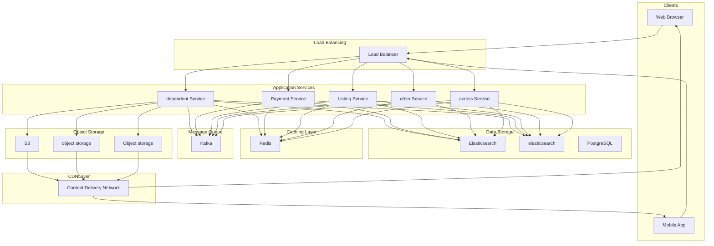

# Design Airbnb

## What is Airbnb?

**Airbnb** is an online marketplace that connects property owners (hosts) with travelers (guests) seeking short-term accommodations.
The platform enables hosts to list their properties, set availability and pricing, while guests can search for accommodations based on location, dates, and preferences, then book and pay securely through the platform.
**Popular Examples:** Airbnb, Vrbo, Booking.com
This system design problem covers multiple complex subsystems: geo-spatial search, real-time availability management, booking with concurrency control, and payment processing.
In this chapter, we will explore the **high-level design of Airbnb**.
Let's start by clarifying the requirements:

# 1. Clarifying Requirements

Before sketching any architecture diagrams, we need to understand exactly what we are building.
Airbnb has dozens of features, from messaging between hosts and guests to pricing recommendations to experience bookings. We cannot design all of that in a 45-minute interview.
The first step is scoping the problem. Here is how a requirements discussion might unfold:
**Candidate:** "What is the expected scale? How many listings and bookings should we support?"
**Interviewer:** "Let's aim for 10 million active listings globally, with 1 million bookings per day during peak season."
**Candidate:** "Should the search support filtering by location, price, amenities, and dates?"
**Interviewer:** "Yes, location-based search is critical. Users should be able to search by city or coordinates, filter by price range, property type, amenities, and check availability for specific dates."
**Candidate:** "How should we handle booking conflicts? What if two users try to book the same property for overlapping dates?"
**Interviewer:** "We need to prevent double bookings. The first user to complete payment should get the reservation."
**Candidate:** "Should we support instant booking, or does the host need to approve each request?"
**Interviewer:** "Support both modes. Some hosts prefer instant booking, while others want to review and approve requests."
**Candidate:** "What are the latency requirements for search and booking?"
**Interviewer:** "Search results should load within 500ms. The booking flow should complete within a few seconds, but correctness is more important than speed."
This conversation reveals several important constraints. Let's formalize them into requirements.

## 1.1 Functional Requirements

Based on the discussion, here are the core features our system must support:

- **Listing Management:** Hosts can create, update, and delete property listings with details like photos, descriptions, amenities, and house rules.
- **Search:** Guests can search for properties by location, check-in/check-out dates, number of guests, and apply filters (price, property type, amenities).
- **Availability Management:** Hosts can set availability calendars and pricing for different dates.
- **Booking:** Guests can reserve properties for specific dates with payment processing.
- **Reviews:** Guests can leave reviews after their stay.

## 1.2 Non-Functional Requirements

Beyond features, we need to consider the qualities that make the system production-ready:

- **High Availability:** The system must be highly available (99.99%), especially for the search and booking flows.
- **Low Latency:** Search results should return within 500ms (p99).
- **Consistency:** Booking system must be strongly consistent to prevent double bookings.
- **Scalability:** Support millions of concurrent users searching and thousands of bookings per minute.

# 2. Back-of-the-Envelope Estimation

Before diving into architecture, let's run some quick calculations to understand the scale we are dealing with. These numbers will guide our decisions about storage, caching, and database selection.

### 2.1 Traffic Estimates

Starting with the numbers from our requirements discussion:

#### Search Traffic (Reads)

This is our primary traffic driver. Most users browse multiple listings before booking, so reads vastly outnumber writes.

#### Booking Traffic (Writes)

Bookings are much less frequent than searches. Most users browse many listings but book only one.
Notice the massive asymmetry: search traffic is roughly 250 times higher than booking traffic. This tells us that we should invest heavily in optimizing the read path.
Caching and search indexing will be critical.

### 2.2 Storage Estimates

Let's estimate how much storage we need for different types of data.

#### Listing Metadata

Each listing has attributes like title, description, location coordinates, amenities, and references to photos.

#### Images

Photos are the largest storage component. High-quality property photos are essential for the user experience.

#### Booking Records

Each booking stores references to the listing, guest, dates, and payment information.

#### Availability Data

This is where storage gets interesting. We need to track availability for each listing for each date.

| Data Type | Volume | Storage | Notes |
| --- | --- | --- | --- |
| Listing Metadata | 10M listings | 500 GB | Includes descriptions, amenities |
| Images | 100M photos | 50 TB | Object storage, CDN-served |
| Booking Records | 365M/year | 180 GB/year | Grows over time |
| Availability | 3.65B date records | 180 GB | Rolling window |

**Key insight:** Images dominate storage (50 TB vs ~1 TB for everything else). We should store images in object storage (S3) and serve them through a CDN. The actual database only needs to store metadata and references.

### 2.3 Key Design Implications

These estimates reveal several important architectural decisions:

1. **Read-heavy workload:** With 250x more searches than bookings, we should use caching aggressively and optimize the search path with specialized indexing.

2. **Images need object storage:** 50 TB of images does not belong in a database. Object storage with CDN distribution is the right choice.

3. **Availability data is manageable:** 180 GB of availability data can fit in a well-indexed relational database, though caching hot data in Redis will help performance.

4. **Geographic distribution matters:** With users worldwide, we need to consider how to serve data from regions close to users.

# 3. Core APIs

With our requirements and scale understood, let's define the API contract. A clean API design makes the system easier to build, test, and evolve.
We will design RESTful APIs for the three core operations: searching for listings, creating bookings, and managing listings.

### 3.1 Search Listings

#### Endpoint: GET /api/v1/listings/search

This is the most frequently called endpoint. It needs to handle geo-spatial queries, date-based availability filtering, and various property filters efficiently.

#### Request Parameters:

| Parameter | Type | Required | Description |
| --- | --- | --- | --- |
| location | string | Yes | City name or "lat,lon" coordinates |
| check_in | date | Yes | Check-in date (YYYY-MM-DD) |
| check_out | date | Yes | Check-out date (YYYY-MM-DD) |
| guests | integer | Yes | Number of guests |
| min_price | integer | No | Minimum price per night |
| max_price | integer | No | Maximum price per night |
| property_type | string | No | apartment, house, villa, etc. |
| amenities | string[] | No | Required amenities (wifi, pool, parking) |
| page | integer | No | Page number for pagination |
| limit | integer | No | Results per page (default 20) |

#### Example Request:

#### Success Response (200 OK):

#### Error Responses:

| Status | When It Occurs |
| --- | --- |
| 400 Bad Request | Invalid date range (check_out before check_in) or missing required parameters |
| 429 Too Many Requests | Rate limit exceeded |

### 3.2 Create Booking

#### Endpoint: POST /api/v1/bookings

This endpoint handles the critical booking flow. It needs to check availability, process payment, and create the reservation atomically.

#### Request Body:

| Parameter | Type | Required | Description |
| --- | --- | --- | --- |
| listing_id | string | Yes | The property to book |
| check_in | date | Yes | Check-in date |
| check_out | date | Yes | Check-out date |
| guests | integer | Yes | Number of guests |
| payment_method_id | string | Yes | Saved payment method identifier |
| special_requests | string | No | Message to host |

#### Example Request:

#### Success Response (201 Created):

#### Error Responses:

| Status | When It Occurs |
| --- | --- |
| 409 Conflict | Dates are no longer available (someone else booked first) |
| 402 Payment Required | Payment processing failed |
| 404 Not Found | Listing does not exist |

The 409 Conflict response is particularly important. It tells the client that a race condition occurred and the dates were booked by another guest.

### 3.3 Create Listing

#### Endpoint: POST /api/v1/listings

Hosts use this endpoint to create new property listings.

#### Request Body:

| Parameter | Type | Required | Description |
| --- | --- | --- | --- |
| title | string | Yes | Property title (max 100 chars) |
| description | string | Yes | Detailed description |
| property_type | string | Yes | apartment, house, villa, etc. |
| location | object | Yes | Address and coordinates |
| price_per_night | decimal | Yes | Base nightly rate |
| max_guests | integer | Yes | Maximum occupancy |
| bedrooms | integer | Yes | Number of bedrooms |
| bathrooms | decimal | Yes | Number of bathrooms |
| amenities | string[] | No | List of amenities |

#### Success Response (201 Created):

### 3.4 Update Availability

#### Endpoint: PUT /api/v1/listings/{listing_id}/availability

Hosts use this to manage their calendar, blocking dates or setting custom pricing.

#### Request Body:

#### Success Response (200 OK):

If any dates have existing bookings, they appear in the `conflicts` array and cannot be blocked.

# 4. High-Level Design

At a high level, our system must satisfy three core requirements:

1. **Search:** Guests must be able to search for available properties by location and dates.

2. **Booking:** Guests must be able to reserve properties without double bookings.

3. **Listing Management:** Hosts must be able to manage their properties and availability.

Since search traffic vastly exceeds booking traffic (9,000 QPS vs 35 QPS at peak), we will separate the read and write paths and optimize each independently.
**Note:** Instead of presenting the full architecture at once, we'll build it incrementally by addressing one requirement at a time.

The most frequent operation is searching for available properties. Guests search by location, dates, and various filters.

### Components Needed

#### Search Service

Handles search queries from guests. It must efficiently filter millions of listings by geographic location, date availability, and property attributes.
**Responsibilities:**
- Parse search queries and validate parameters.
- Execute geo-spatial queries to find nearby listings.
- Filter by availability for the requested dates.
- Apply additional filters (price, amenities, property type).
- Rank and return results.

#### Elasticsearch Cluster

A distributed search engine optimized for full-text search and geo-spatial queries.
**Why Elasticsearch?**
- Native support for geo-point queries (find listings within X km of a location).
- Fast filtering and aggregations.
- Horizontal scaling through sharding.
- Near real-time indexing.

#### Listing Database

The source of truth for all listing data. When hosts create or update listings, changes are written here first, then propagated to Elasticsearch.

#### Availability Cache (Redis)

A fast cache storing availability data for the next 90 days. This avoids querying the database for every search request.

### Flow: Searching for Properties

1. Guest sends a search request with location, dates, and filters.

2. The **Load Balancer** routes the request to an available **Search Service** instance.

3. The Search Service queries **Elasticsearch** with Geo-distance filter (listings within 25km of the location) and Property filters (type, price range, amenities).

4. For the candidate listings, the service checks **Redis** to verify availability for the requested dates.

5. Results are ranked by relevance (rating, price, distance) and returned to the guest.

## 4.2 Requirement 2: Property Booking

When a guest wants to book a property, the system must ensure the dates are available and prevent double bookings.

### Additional Components Needed

#### Booking Service

Handles the entire booking lifecycle: reservation creation, payment processing, and confirmation.
**Responsibilities:**
- Validate booking requests.
- Check and lock availability.
- Process payments.
- Create booking records.
- Send confirmations.

#### Booking Database

Stores all booking records with strong consistency guarantees. We use a relational database (PostgreSQL) here because:

- Bookings require ACID transactions.
- We need strong consistency to prevent double bookings.
- The write volume (35 QPS peak) is easily handled by a single primary with replicas.

#### Payment Service

Integrates with payment processors (Stripe, PayPal) to handle charges and refunds.

#### Message Queue (Kafka)

Decouples the booking flow from downstream operations like sending notifications, updating analytics, and syncing availability.

### Flow: Booking a Property

1. Guest submits a booking request with listing ID, dates, and payment info.

2. The **Booking Service** starts a database transaction.

3. It acquires a lock on the availability rows for the requested dates using `SELECT FOR UPDATE`. This prevents other concurrent bookings from proceeding.

4. If dates are available, the service calls the **Payment Service** to charge the guest.

5. On successful payment: Insert the booking record, mark the dates as unavailable and commit the transaction.

6. Publish a `BookingCreated` event to **Kafka** for downstream processing (notifications, analytics).

7. Return confirmation to the guest.

**What if payment fails?** The transaction is rolled back, and the dates remain available for other guests.

## 4.3 Requirement 3: Listing Management

Hosts need to create listings, upload photos, and manage availability calendars.

### Additional Components Needed

#### Listing Service

Handles CRUD operations for property listings.
**Responsibilities:**
- Validate and store listing data.
- Coordinate photo uploads.
- Trigger search index updates.

#### CDN (Content Delivery Network)

Serves listing photos from edge locations worldwide. Photos are uploaded to object storage (S3) and distributed via CDN.

#### Image Processing Service

Processes uploaded photos: resizing, compression, and generating thumbnails.

### Flow: Creating a Listing

1. Host submits listing details (title, description, location, price, amenities).

2. The **Listing Service** validates and stores the record in the **Listing Database**.

3. Host uploads photos directly to **S3** using pre-signed URLs.

4. The **Image Processing Service** generates thumbnails and optimized versions.

5. The listing is indexed in **Elasticsearch** asynchronously.

6. Confirmation is returned to the host.

## 4.4 Putting It All Together

Here is the complete architecture combining all requirements:

### Core Components Summary

| Component | Purpose |
| --- | --- |
| Load Balancer | Distributes traffic across service instances |
| CDN | Serves static assets (photos) from edge locations |
| Search Service | Handles geo-spatial search and filtering |
| Booking Service | Manages reservations and payment processing |
| Listing Service | CRUD operations for property listings |
| Payment Service | Integrates with payment processors |
| Notification Service | Sends emails, push notifications, SMS |
| Elasticsearch | Search index for listings with geo-queries |
| PostgreSQL | Primary database for bookings and listings |
| Redis | Availability cache and session storage |
| Kafka | Event streaming for async communication |
| S3 | Object storage for photos and documents |

# 5. Database Design

With the high-level architecture in place, let's zoom into the data layer. The database schema needs to support our query patterns efficiently while maintaining data integrity.

## 5.1 Choosing the Right Database

Different parts of our system have different data characteristics. Let's think through the requirements for each:

#### Bookings and Listings Data:

- Need ACID transactions (especially for bookings)
- Complex queries with joins (listing + host + availability)
- Strong consistency required for booking operations
- Moderate write volume, high read volume

#### Search Index:

- Needs geo-spatial queries
- Full-text search for descriptions
- Eventually consistent is acceptable (slight delay from database is fine)
- Optimized for read-heavy access pattern

#### Availability Data:

- High read frequency (every search checks availability)
- Moderate write frequency (bookings, host calendar updates)
- Simple key-value access pattern
- Can tolerate brief staleness

Given these requirements, we use a polyglot persistence approach:

- **PostgreSQL** for listings, bookings, users, and reviews. These are relational data that benefit from joins and transactions.
- **Elasticsearch** for search index. Synced from PostgreSQL, optimized for geo-queries and filtering.
- **Redis** for availability cache. Fast lookups for the hot path (search).

## 5.2 Database Schema

Let's design the PostgreSQL schema. We have five main entities: Users, Listings, Availability, Bookings, and Reviews.

### Listings Table

This is the core entity representing a property.

| Field | Type | Description |
| --- | --- | --- |
| listing_id | UUID | Primary key |
| host_id | UUID (FK) | Reference to users table |
| title | VARCHAR(200) | Property title for display |
| description | TEXT | Detailed description |
| property_type | ENUM | apartment, house, villa, cabin, etc. |
| latitude | DECIMAL(10,8) | Location for geo-queries |
| longitude | DECIMAL(11,8) | Location for geo-queries |
| address | JSONB | Structured address (street, city, country) |
| price_per_night | DECIMAL(10,2) | Base nightly rate |
| max_guests | INTEGER | Maximum occupancy |
| bedrooms | INTEGER | Number of bedrooms |
| bathrooms | DECIMAL(3,1) | Number of bathrooms (allows 1.5) |
| amenities | JSONB | Array of amenity codes |
| status | ENUM | draft, pending_review, active, inactive |
| instant_book | BOOLEAN | Whether guests can book without approval |
| created_at | TIMESTAMP | Creation time |
| updated_at | TIMESTAMP | Last modification time |

**Key indexes:**

### Availability Table

Tracks the availability and pricing for each listing for each date.

| Field | Type | Description |
| --- | --- | --- |
| listing_id | UUID (PK, FK) | Reference to listings |
| date | DATE (PK) | The specific date |
| status | ENUM | available, booked, blocked |
| price_override | DECIMAL(10,2) | Custom price for this date (null = use base price) |
| booking_id | UUID (FK) | Reference to booking if status is 'booked' |

**Composite primary key:** `(listing_id, date)` ensures one record per listing per date.
**Key indexes:**

### Bookings Table

Records every reservation made through the platform.

| Field | Type | Description |
| --- | --- | --- |
| booking_id | UUID | Primary key |
| listing_id | UUID (FK) | The booked property |
| guest_id | UUID (FK) | The guest who booked |
| check_in | DATE | Check-in date |
| check_out | DATE | Check-out date |
| guests_count | INTEGER | Number of guests staying |
| total_price | DECIMAL(10,2) | Total amount charged |
| service_fee | DECIMAL(10,2) | Platform fee |
| status | ENUM | pending, confirmed, cancelled, completed |
| payment_intent_id | VARCHAR(100) | Stripe payment reference |
| confirmation_code | VARCHAR(10) | Human-readable booking code |
| created_at | TIMESTAMP | When booking was created |

**Key indexes:**

### Users Table

Stores both guests and hosts (many users are both).

| Field | Type | Description |
| --- | --- | --- |
| user_id | UUID | Primary key |
| email | VARCHAR(255) | Login email (unique) |
| password_hash | VARCHAR(255) | bcrypt hash |
| name | VARCHAR(100) | Display name |
| phone | VARCHAR(20) | Contact phone |
| profile_photo_url | VARCHAR(500) | Profile image URL |
| is_host | BOOLEAN | Has created at least one listing |
| created_at | TIMESTAMP | Registration time |

### Reviews Table

Stores guest reviews after completed stays.

| Field | Type | Description |
| --- | --- | --- |
| review_id | UUID | Primary key |
| booking_id | UUID (FK, unique) | One review per booking |
| listing_id | UUID (FK) | Denormalized for efficient queries |
| guest_id | UUID (FK) | Review author |
| overall_rating | DECIMAL(2,1) | 1.0 to 5.0 |
| cleanliness | INTEGER | 1-5 score |
| accuracy | INTEGER | 1-5 score |
| communication | INTEGER | 1-5 score |
| location | INTEGER | 1-5 score |
| value | INTEGER | 1-5 score |
| comment | TEXT | Written review |
| created_at | TIMESTAMP | Review submission time |

**Note:** The `listing_id` is denormalized (we could get it from the booking). This saves a join when displaying reviews for a listing.

# 6. Design Deep Dive

Now that we have the architecture and schema in place, let's dive deeper into the trickiest parts of the design. These are the topics that distinguish a good system design answer from a great one.

## 6.1 Geo-Spatial Search

Location-based search is the foundation of Airbnb's discovery experience. When a guest searches for "San Francisco," we need to efficiently find relevant listings from millions of records worldwide.

### The Challenge

Given a user's search location (coordinates like `37.7749, -122.4194` or a city name) and an implicit search radius (typically 25 km), we need to:

1. Find all listings within that geographic area

2. Filter by availability, price, and amenities

3. Rank and return results within 500ms

A naive approach would scan all 10 million listings, computing the distance to each one. With the Haversine formula for Earth distances, that is millions of trigonometric calculations per query.
Far too slow.

### Approach 1: Database Geo-Queries (PostGIS)

PostgreSQL with the PostGIS extension supports spatial data types and geo-indexes.

#### How It Works:

Store each listing's location as a `GEOGRAPHY` point. Create a spatial index (GIST) that organizes points for efficient geographic queries.
The GIST index uses an R-tree structure that organizes geographic points into bounding boxes.
This allows the database to quickly eliminate large portions of the world that are definitely outside the search radius.

#### Pros:

- Simple to implement using existing PostgreSQL infrastructure
- All data stays in one place (no sync needed)
- Good for moderate scale (hundreds of thousands of listings)

#### Cons:

- Performance degrades with millions of listings
- Complex queries combining geo + filters + availability become slow
- Database becomes a bottleneck for read-heavy search traffic

### Approach 2: Elasticsearch Geo-Queries (Recommended)

Elasticsearch provides native support for geo-point data and efficient spatial queries. This is our recommended approach for Airbnb-scale search.

#### How It Works:

We maintain a search index in Elasticsearch, synced from PostgreSQL. Each listing document includes a `geo_point` field for its location.
Queries combine geo-filtering with other criteria:

#### How Elasticsearch handles geo-queries efficiently:

Elasticsearch uses a technique called geohash indexing internally. It divides the world into a grid of cells, where each cell has a short string identifier (like "9q8y" for San Francisco).
Points within the same cell share a common prefix. This allows Elasticsearch to quickly identify which grid cells intersect with the search radius and only examine documents in those cells.

#### Pros:

- Handles millions of listings with sub-100ms latency
- Combines geo-filters with text search and faceted filtering in one query
- Horizontal scaling through sharding
- Built-in relevance scoring

#### Cons:

- Eventually consistent (brief delay between database changes and search index)
- Additional infrastructure to maintain
- Data duplication between PostgreSQL and Elasticsearch

### Approach 3: Geohash-Based Sharding

For extreme scale (hundreds of millions of listings), you can partition data geographically.
Each shard handles a region of the world, and queries are routed to relevant shards based on the search location.

#### Pros:

- Linear scalability by adding region shards
- Queries only touch relevant data

#### Cons:

- Complex shard management
- Queries near shard boundaries need to hit multiple shards
- Uneven distribution (NYC has more listings than rural Montana)

### Recommendation

For Airbnb's scale (10 million listings), **Elasticsearch with geo-point queries** is the right choice:

- Well-suited for the 1-100 million listing range
- Combines geo-search with filters efficiently
- Mature operational tooling

Keep PostgreSQL as the source of truth and sync changes to Elasticsearch asynchronously via Kafka events.

| Approach | Scale | Latency | Complexity | Best For |
| --- | --- | --- | --- | --- |
| PostGIS | < 1M listings | 100-500ms | Low | Prototypes, small markets |
| Elasticsearch | 1M-100M | 10-100ms | Medium | Most production systems |
| Geohash Sharding | > 100M | 10-50ms | High | Global-scale platforms |

### Complete Search Flow

Here is how all the pieces fit together for a search query:

## 6.2 Preventing Double Bookings

The booking system must guarantee that no two guests can book the same property for overlapping dates.
This is not just a nice-to-have; a double booking means real people showing up at the same property, expecting to stay there. It is a disaster.

### The Problem

Consider this timeline:
Without proper concurrency control, both transactions might check availability, find it open, and proceed to create bookings.
The database would happily insert both records because neither violates any constraints yet.

### Approach 1: Optimistic Locking

Check availability before booking, then use a version number to detect concurrent modifications.

#### How It Works:

Each availability row has a `version` column. When booking:

1. Read availability rows with their version numbers

2. Attempt to update with `WHERE version = expected_version`

3. If rows affected = 0, another transaction modified the data; retry or fail

#### Pros:

- No locks held during the availability check
- Good performance when contention is low

#### Cons:

- Higher failure rate when multiple users compete for the same listing
- Users may see "available" but fail to book (frustrating UX)
- Requires retry logic

### Approach 2: Pessimistic Locking with SELECT FOR UPDATE (Recommended for Moderate Scale)

Lock the availability rows at the start of the transaction, preventing concurrent modifications.

#### How It Works:

The `FOR UPDATE` clause acquires row-level locks. Any other transaction trying to lock the same rows will wait (block) until this transaction commits or rolls back.

#### Pros:

- Guarantees no double bookings
- Simple to understand and implement
- First transaction to acquire locks wins

#### Cons:

- Locks are held during payment processing (1-3 seconds)
- Potential for deadlocks if rows are locked in different orders
- Reduced concurrency for popular listings

### Approach 3: Two-Phase Booking with Temporary Holds (Recommended for High Scale)

Separate the booking into two phases: first create a temporary hold, then confirm with payment.

#### Phase 1: Create Hold

When a guest initiates booking, create a short-lived hold on the dates (10 minutes TTL). This marks the dates as "held" so other guests see them as unavailable.

#### Phase 2: Confirm or Release

The guest proceeds to enter payment details. When payment succeeds, convert the hold to a confirmed booking:
If payment fails or the user abandons, a background job releases expired holds:

#### Pros:

- Database locks are held only during hold creation (milliseconds, not seconds)
- Better user experience (guest can take time on payment page)
- Automatic cleanup of abandoned bookings

#### Cons:

- More complex implementation with two-phase flow
- Risk of "hold hoarding" if users create holds without completing
- Requires background job for cleanup

### Booking State Machine

Here is how booking states transition through the process:

### Recommendation

| Approach | Lock Duration | Complexity | Best For |
| --- | --- | --- | --- |
| Optimistic Locking | None (retry on conflict) | Low | Low contention, simple cases |
| Pessimistic Locking | Through payment (seconds) | Medium | Moderate traffic, simpler code |
| Two-Phase Hold | Milliseconds for hold creation | High | High traffic, production systems |

For Airbnb's scale, the **Two-Phase Hold** approach provides the best balance: short database locks, good user experience, and automatic cleanup of abandoned bookings.
For an interview or simpler implementation, **Pessimistic Locking** works well and is easier to reason about.

## 6.3 Availability Calendar Management

Hosts need to manage availability for their properties: blocking dates they are unavailable, setting custom prices for holidays, and seeing which dates are booked.
The system must efficiently store and query availability for millions of listings across a 365+ day window.

### Data Model Options

#### Option 1: Row Per Date

Store one row per listing per date.

#### Storage calculation:

#### Pros:

- Simple queries: `WHERE listing_id = X AND date BETWEEN Y AND Z`
- Easy to update individual dates
- Natural fit for availability checks

#### Cons:

- Large table (3.65 billion rows for one year)
- Inserting 365 rows for each new listing
- Range updates require touching many rows

#### Option 2: Date Ranges

Store availability as contiguous date ranges.

#### Pros:

- Fewer rows (one per range, not per date)
- Efficient for bulk operations

#### Cons:

- Complex queries for overlapping ranges
- Splitting ranges when booking in the middle is tricky
- Harder to answer "is date X available?"

#### Option 3: Bitmap Encoding

Encode availability as a bitmap where each bit represents a date.

#### Pros:

- Compact storage (46 bytes per listing per year)
- Fast bitwise operations for availability checks

#### Cons:

- Complex implementation
- Harder to track booking references per date
- Limited metadata per date

### Recommendation

**Row Per Date** is the recommended approach:
- Simplest to implement and query
- 180 GB is manageable with proper indexing and partitioning
- Easy to add metadata per date (booking reference, price overrides)
- Natural fit for the `SELECT ... FOR UPDATE` locking pattern

Optimize with:

- **Table partitioning by month**: Keeps each partition manageable, allows dropping old partitions
- **Redis caching for hot dates**: Cache the next 90 days in memory
- **Archiving**: Move dates more than 1 year old to cold storage

### Caching Availability in Redis

Every search query needs to check availability. Hitting PostgreSQL for every search is inefficient. We cache availability in Redis for fast lookups.

#### Cache Structure:

#### Checking availability for a date range:

If any date is not "available," the listing does not match the search criteria.

#### Cache Invalidation:

When a booking is created or a host updates their calendar:

1. Update the source of truth (PostgreSQL)

2. Invalidate the affected cache keys

3. Publish an event for other services

We use TTL (1 hour) as a safety net so stale data eventually expires even if invalidation fails.

## 6.4 Search Ranking

When a guest searches for properties, the order of results significantly impacts both user experience and booking conversion.
A good ranking algorithm surfaces listings that are relevant, high-quality, and likely to be booked.

### Ranking Factors

#### 1. Distance from Search Location

Closer properties are generally more relevant. The score decreases with distance, often using a decay function:

#### 2. Quality Score

A composite score based on:

- Average rating (1-5 stars)
- Number of reviews (more reviews = more confidence)
- Response rate (how quickly host responds to inquiries)
- Acceptance rate (percentage of booking requests accepted)
- Superhost status (badge for top hosts)

#### 3. Price Competitiveness

Properties priced near the median for their type and location rank higher. Both overpriced listings and suspiciously cheap ones may rank lower.

#### 4. Booking History

- Conversion rate (what percentage of viewers book)
- Cancellation rate (lower is better)
- Recent booking activity (active listings rank higher than stale ones)

#### 5. Listing Completeness

- Number of photos (more photos = more information)
- Description length and quality
- All required fields filled
- Verified information

### Implementation Approaches

#### Approach 1: Elasticsearch Function Score

Elasticsearch allows combining multiple scoring factors using `function_score` queries:
The `gauss` function applies distance decay, and `field_value_factor` boosts by rating and review count. The weights control the relative importance of each factor.

#### Approach 2: Machine Learning Ranking

For more sophisticated ranking, train an ML model on historical search and booking data.
**Features:**
- Distance to search location
- Price relative to area median
- Rating and review count
- Photo count and quality score
- Host response metrics
- Historical conversion rate for this listing

**Training data:**
- Positive examples: Listings that were viewed and then booked
- Negative examples: Listings that were viewed but not booked

**Model types:**
- Learning to Rank (LTR): LambdaMART, RankNet
- Gradient Boosted Trees: XGBoost, LightGBM
- Neural networks for complex feature interactions

### Recommendation

Start with **Elasticsearch function_score** for an initial ranking system. It handles the common cases well, is easy to tune, and does not require ML infrastructure.
As the platform grows and you accumulate booking data, introduce **ML-based ranking** to optimize for conversion. A/B test ranking changes to measure their impact on bookings.

## 6.5 Handling High Traffic for Popular Listings

Some properties receive disproportionate traffic. A beautifully photographed treehouse in a popular destination might get 100x more views than an average listing.
During peak seasons or when a listing goes viral on social media, this concentration can overwhelm systems.

### The Problem

A viral listing might receive:

- 100,000 views per hour
- 1,000 booking attempts per hour

Without protections, this could:

- Overwhelm the database with repeated reads
- Create lock contention as many users try to book simultaneously
- Degrade performance for all users, not just those viewing the popular listing

### Solutions

#### 1. Aggressive Caching

Cache listing details and availability at multiple layers.
For a popular listing, 95%+ of requests can be served from cache, dramatically reducing database load.

#### 2. Rate Limiting

Prevent any single user or IP from making excessive requests.
Implement using Redis with sliding window counters. When a user exceeds limits, return HTTP 429 with a `Retry-After` header.

#### 3. Booking Queue for Hot Listings

For extremely popular listings (detected by monitoring), switch from synchronous to queued booking.
Instead of attempting the booking immediately:

1. Accept the booking request and return a ticket/position number

2. Add to a per-listing queue

3. Process queue sequentially (one at a time for that listing)

4. Notify user of success or failure via push notification/email

This prevents database lock contention and provides fair ordering (first request, first served).

#### 4. Circuit Breaker for Downstream Services

If a dependent service (payment, notification) is struggling, do not keep hammering it. Implement circuit breakers that temporarily reject requests when failure rates exceed a threshold.

### Recommendation

Implement protections in this order:

1. **Aggressive caching** (immediate impact, low complexity)

2. **Rate limiting** (prevents abuse, protects system)

3. **Monitoring and alerting** (detect hot listings early)

4. **Booking queue** (for specific problematic listings during flash sales)

# References

- [Airbnb Engineering Blog](https://medium.com/airbnb-engineering) - Technical deep dives from Airbnb's engineering team
- [Elasticsearch Geo Queries](https://www.elastic.co/guide/en/elasticsearch/reference/current/geo-queries.html) - Official documentation on geo-spatial search
- [PostgreSQL PostGIS](https://postgis.net/) - Spatial database extension for PostgreSQL

# Quiz

## Design Airbnb Quiz

Which subsystem typically dominates read traffic in an Airbnb-like system?