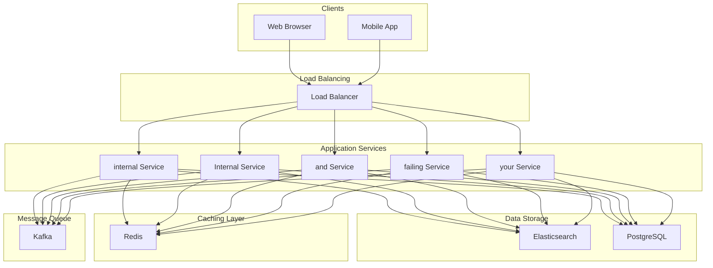
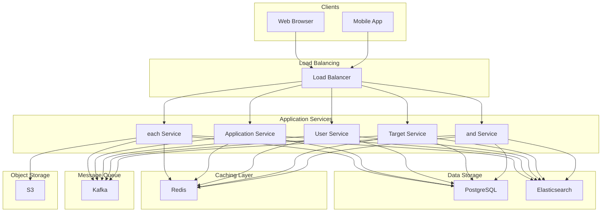
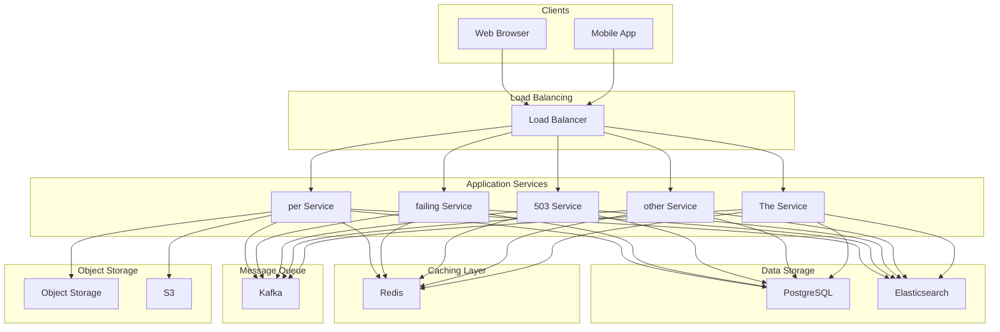

# Design API Gateway

## What is an API Gateway?

An API Gateway is a server that acts as a single entry point for all client requests to your backend services. It sits between clients and your microservices, handling cross-cutting concerns like authentication, rate limiting, and request routing.
Think of it as a smart reverse proxy. Instead of clients directly calling dozens of microservices (each with different protocols, authentication schemes, and endpoints), they interact with one unified API. The gateway abstracts away the complexity of your internal architecture, presenting a clean, consistent interface to the outside world.
**Popular Examples:** Amazon API Gateway, Kong, NGINX Plus, Apigee
API gateways are fundamental to modern microservices architectures. Understanding how to design one demonstrates knowledge of distributed systems, security, performance optimization, and service orchestration.
In this chapter, we will explore the **high-level design of an API Gateway**.
Lets start by clarifying the requirements.
# 1. Clarifying Requirements
Before starting the design, it's important to ask thoughtful questions to uncover hidden assumptions, clarify ambiguities, and define the system's scope more precisely.
Here is an example of how a discussion between the candidate and the interviewer might unfold:
**Candidate:** "What is the expected scale? How many API requests per second should the gateway handle?"
**Interviewer:** "The gateway should handle up to 100,000 requests per second at peak traffic, serving hundreds of backend microservices."
**Candidate:** "What authentication mechanisms should we support? OAuth, API keys, JWT tokens?"
**Interviewer:** "We need to support multiple authentication methods: API keys for simple integrations, JWT tokens for user authentication, and OAuth 2.0 for third-party access."
**Candidate:** "Should the gateway handle rate limiting? If so, at what granularity?"
**Interviewer:** "Yes, rate limiting is critical. We need per-client, per-API, and global rate limits to protect backend services from overload."
**Candidate:** "Do we need request/response transformation capabilities, like protocol translation or payload modification?"
**Interviewer:** "Yes, the gateway should be able to transform requests (e.g., REST to gRPC) and modify responses (e.g., filtering sensitive fields)."
**Candidate:** "How should we handle backend service failures? Should the gateway implement circuit breakers?"
**Interviewer:** "Absolutely. The gateway should detect failing services and fail fast rather than cascading failures to other services."
**Candidate:** "What latency overhead is acceptable for the gateway?"
**Interviewer:** "The gateway should add no more than 10-20ms of latency per request. Performance is critical."
After gathering the details, we can summarize the key system requirements.

## 1.1 Functional Requirements
- **Request Routing:** Route incoming requests to appropriate backend services based on URL path, headers, or other criteria.
- **Authentication & Authorization:** Validate client identity using API keys, JWT tokens, or OAuth 2.0, and enforce access control policies.
- **Rate Limiting:** Throttle requests per client, per API, or globally to protect backend services.
- **Request/Response Transformation:** Modify requests and responses (protocol translation, header manipulation, payload transformation).
- **Load Balancing:** Distribute traffic across multiple instances of backend services.
- **Caching:** Cache responses to reduce backend load and improve latency.

## 1.2 Non-Functional Requirements
- **High Availability:** The gateway must be highly available (99.99% uptime) since it's on the critical path for all traffic.
- **Low Latency:** Should add minimal overhead (< 20ms) to request processing.
- **High Throughput:** Handle up to 100,000 requests per second at peak.
- **Scalability:** Should scale horizontally to handle traffic growth.
- **Observability:** Provide detailed logging, metrics, and distributed tracing for debugging and monitoring.

# 2. Back-of-the-Envelope Estimation
Before diving into the design, let's run some quick calculations to understand the scale we are dealing with. These numbers will guide our architectural decisions, particularly around connection management, caching, and state storage.

### 2.1 Traffic Estimates
Starting with the numbers from our requirements discussion:

#### Request Volume
We are designing for 100,000 requests per second at peak. Let's work backwards to understand daily and average traffic:
Three billion requests per day is significant. Every inefficiency in our design gets multiplied by that number.

#### Backend Services
The gateway routes to approximately 200 microservices, each running an average of 10 instances. That gives us 2,000 backend endpoints to manage. The gateway needs to track the health of each instance and make intelligent routing decisions.

### 2.2 Bandwidth Estimates
How much data flows through the gateway?
1.5 GB/s of egress at peak is substantial but manageable with modern infrastructure. A 10 Gbps network connection provides plenty of headroom.

### 2.3 Rate Limiting State
If we are tracking rate limits per client, we need to estimate the state requirements:
100 MB fits comfortably in Redis or even in-memory on each gateway node. This is good news: rate limiting will not be a storage bottleneck.

### 2.4 Caching Potential
What percentage of responses can we cache?
A 1 GB cache can significantly reduce backend load. If 30% of requests hit the cache, we reduce backend traffic from 100K RPS to 70K RPS at peak.

### 2.5 Key Insights
These estimates tell us several important things:
1. **Connection management is critical.** At 100K RPS, we cannot afford to create a new connection for each request. Connection pooling to backend services is essential.
2. **State must be distributed.** With multiple gateway instances handling traffic, rate limiting and caching state need to be shared. Redis is the obvious choice.
3. **Bandwidth is significant but manageable.** 1.5 GB/s at peak requires attention to network configuration but is not extreme.
4. **Caching provides substantial relief.** A 30% cache hit rate meaningfully reduces backend load.

# 3. Core APIs
An API Gateway exposes two categories of APIs: management APIs for configuration and the runtime interface for client traffic. Let's define both.

### 3.1 Register API Route

#### Endpoint: POST /admin/routes
This endpoint registers a new route, telling the gateway how to handle requests matching a specific pattern. Every time you add a new backend service or expose a new API, you create a route.

#### Request Parameters:
| Parameter | Required | Description |
| --- | --- | --- |
| path | Yes | URL path pattern to match (e.g., /api/v1/users/*) |
| methods | Yes | Allowed HTTP methods (e.g., ["GET", "POST"]) |
| backend_service | Yes | Target service name or URL |
| strip_prefix | No | Remove path prefix before forwarding (default: false) |
| timeout_ms | No | Request timeout in milliseconds (default: 30000) |
| retry_count | No | Number of retries on failure (default: 0) |

#### Example Request:

#### Success Response (201 Created):

#### Error Cases:
| Status | Meaning | When It Occurs |
| --- | --- | --- |
| 400 Bad Request | Invalid configuration | Malformed path pattern or missing required fields |
| 409 Conflict | Route collision | A route with the same path already exists |

### 3.2 Configure Rate Limit
**Endpoint:** `POST /admin/rate-limits`
Sets up rate limiting rules to protect your backend services. You can limit at different granularities depending on what you are trying to protect.

#### Request Parameters:
| Parameter | Required | Description |
| --- | --- | --- |
| target_type | Yes | What to limit: api, client, or global |
| target_id | Yes | The specific API route or client ID to limit |
| requests_per_window | Yes | Maximum requests allowed in the window |
| window_seconds | Yes | Length of the rate limit window |
| burst_size | No | Allow brief bursts above the limit |

**Example:** Limit the search API to 100 requests per minute per client:

### 3.3 Register API Client

#### Endpoint: POST /admin/clients
Registers a new API client and generates credentials. Every external system that calls your API needs to be registered so you can track usage, apply rate limits, and revoke access if needed.

#### Request Parameters:
| Parameter | Required | Description |
| --- | --- | --- |
| name | Yes | Human-readable name for the client application |
| allowed_routes | No | List of route IDs this client can access (empty = all) |
| rate_limit_tier | No | Rate limit tier: free, standard, or premium |

#### Success Response:
The API key and secret are returned only once at creation time. Store them securely. The secret is hashed before storage and cannot be retrieved later.

### 3.4 Get Gateway Metrics

#### Endpoint: GET /admin/metrics
Returns real-time metrics about gateway performance. This is what your monitoring dashboards will poll.

#### Response:
These metrics are essential for understanding system health at a glance. When the error rate spikes or latency increases, you know immediately.
# 4. High-Level Design
Now we get to the interesting part: designing the system architecture. Rather than presenting a complex diagram upfront, we will build the design incrementally. Each requirement introduces new components, and by the end, we will have a complete picture of how everything fits together.
Our gateway needs to handle four core responsibilities:
1. **Request Routing:** Direct incoming requests to the correct backend service.
2. **Security:** Authenticate clients and enforce access policies.
3. **Traffic Management:** Rate limit, cache, and transform requests.
4. **Resilience:** Handle backend failures without cascading problems.

Let's tackle each one, building up the architecture as we go.

## 4.1 Requirement 1: Request Routing
The most fundamental job of an API Gateway is receiving requests from clients and forwarding them to the right backend service. This sounds simple, but there are several moving parts.

### Components Needed

#### Gateway Core
This is the main request processing engine. Every request enters here, gets processed through a series of middleware components, and exits with a response. The core needs to be highly optimized since it handles 100,000 requests per second.
The Gateway Core accepts HTTP/HTTPS connections, parses request attributes like path and headers, matches requests against configured routes, forwards them to backends, and returns responses to clients. It must do all of this with minimal latency overhead.

#### Route Registry
The Route Registry stores all API route configurations. When a request comes in for `/api/v1/users/123`, the registry knows that this path maps to the User Service.
The registry needs to support flexible pattern matching (exact paths, wildcards, path parameters) and allow hot-reload of routes without restarting the gateway. In a dynamic microservices environment, new routes get added frequently.

#### Service Discovery
With 200 services and 2,000 instances, we cannot hardcode backend addresses. The Service Discovery component integrates with your service registry (Consul, etcd, Kubernetes DNS) to find healthy instances of each service.
When the gateway needs to route to the User Service, Service Discovery provides a list of healthy instances. The gateway then picks one, either round-robin, weighted, or based on other load balancing strategies.

### How Routing Works
Let's trace a request through the routing flow:
1. A client sends `GET /api/v1/users/123` to the gateway.
2. The **Gateway Core** receives the request and extracts the path.
3. The **Route Registry** is consulted. It matches `/api/v1/users/*` to the `user-service`.
4. **Service Discovery** returns a list of healthy User Service instances.
5. The gateway selects an instance (say, instance 2) and forwards the request.
6. The backend processes the request and returns a response.
7. The gateway forwards the response back to the client.

Notice that the gateway might modify the request path before forwarding. If the route is configured with `strip_prefix: true`, the gateway removes `/api/v1` before sending to the backend. The User Service just sees `/users/123`.

## 4.2 Requirement 2: Security (Authentication and Authorization)
Routing requests is useless if anyone can access any API. The gateway must verify that clients are who they claim to be and have permission to access the requested resources.

### Additional Components Needed

#### Auth Handler
The Auth Handler processes authentication for all incoming requests. It supports multiple authentication methods because different clients have different needs. Mobile apps might use JWT tokens, partner integrations might use API keys, and third-party developers might use OAuth.
When a request arrives, the Auth Handler extracts credentials from headers (typically `Authorization`), validates them against the appropriate backend (token signature verification, API key lookup, OAuth introspection), and either rejects the request or attaches user context for downstream processing.

#### Policy Engine
Authentication tells us who the caller is. Authorization tells us what they can do. The Policy Engine enforces access rules based on client identity and request attributes.
Can this client access this particular API? Does their subscription tier allow this many calls? Is this IP address on the allowlist? The Policy Engine answers these questions.

### The Authentication Flow
Here is how a request with JWT authentication flows through the system:
1. Client sends a request with `Authorization: Bearer eyJ...` header.
2. The **Auth Handler** detects this is a JWT and extracts the token.
3. The token signature is verified locally using the public key. No database lookup needed.
4. Claims are extracted: user ID, roles, expiration time.
5. The **Policy Engine** checks if this user can access the requested route.
6. If authorized, the request proceeds with user context attached (e.g., `X-User-ID` header).
7. If not authorized, the gateway returns `403 Forbidden` immediately.

The beauty of JWT is that most authentication can happen without any network calls. The token contains everything needed for verification. This keeps latency low.

## 4.3 Requirement 3: Traffic Management
With routing and security in place, we need to protect our backend services from overload and optimize performance. This is where rate limiting and caching come in.

### Additional Components Needed

#### Rate Limiter
The Rate Limiter controls request flow to prevent any single client from overwhelming the system. It tracks request counts per client, per API, and globally, enforcing configured limits.
When a client exceeds their rate limit, the gateway rejects requests immediately with `429 Too Many Requests`. This protects backend services and ensures fair access for other clients.

#### Response Cache
For GET requests that return stable data, the gateway can cache responses. If the same request comes in again before the cache expires, we return the cached response without calling the backend.
Caching is particularly valuable for data that does not change frequently: product catalogs, user profiles, configuration settings. Even a short TTL of 60 seconds can dramatically reduce backend load during traffic spikes.

#### Request Transformer
Sometimes the client's request format does not match what the backend expects. The transformer can modify headers, rewrite URLs, translate protocols (REST to gRPC), or filter response fields.
This decouples clients from backend implementation details. The backend can evolve independently while the gateway maintains a stable external interface.

### Traffic Management Flow
The traffic management flow adds several decision points:
1. **Rate limit check:** Before doing any real work, we check if this client has exceeded their rate limit. If so, reject immediately. There is no point wasting resources on a request we are going to reject anyway.
2. **Cache lookup:** For GET requests, check if we have a valid cached response. A cache hit means we skip the backend entirely, returning a response in milliseconds.
3. **Transformation:** If the request needs modification (protocol translation, header additions), do it before forwarding.
4. **Cache population:** After receiving a backend response for a cacheable request, store it for future use.

This ordering matters. Rate limiting comes first because it is the cheapest check. Why do expensive cache lookups if we are going to rate-limit anyway?

## 4.4 Requirement 4: Resilience
Backend services fail. Networks partition. Databases slow down. A resilient gateway handles these failures gracefully instead of cascading them to clients.

### Additional Components Needed

#### Circuit Breaker
When a backend service starts failing, continuing to send requests just makes things worse. Connection pools fill up, timeouts pile up, and soon the gateway itself is struggling.
The Circuit Breaker pattern prevents this cascade. It monitors failure rates for each backend. When failures exceed a threshold, the circuit "opens," and requests fail immediately without trying to reach the backend. Periodically, it allows a few test requests through. If they succeed, the circuit closes and normal operation resumes.

#### Health Checker
The Health Checker proactively monitors backend service health. Instead of waiting for requests to fail, it periodically pings backends with health check requests. Unhealthy instances are removed from the pool before they cause user-visible failures.

### Circuit Breaker States
The circuit breaker operates in three states:
**Closed (Normal):** Requests flow through normally. The breaker monitors failure rates. If failures exceed the threshold (say, 50% of requests failing over the last 100 requests), the circuit opens.
**Open (Failing Fast):** All requests fail immediately with a 503 error. No attempt is made to contact the backend. This gives the failing service time to recover without being hammered with requests.
**Half-Open (Testing):** After a timeout period (typically 30 seconds), the breaker allows a limited number of probe requests through. If these succeed, the circuit closes and normal operation resumes. If they fail, the circuit reopens.

## 4.5 Putting It All Together
Now let's see the complete architecture with all components in place. Every request flows through multiple stages, each handling a specific concern.

### The Request Processing Pipeline
Every request flows through the same pipeline of middleware components. Each stage can either pass the request to the next stage or short-circuit with an immediate response.
Short-circuits happen at several points:
- **Auth** rejects unauthenticated requests with `401 Unauthorized`
- **Rate Limit** rejects over-quota requests with `429 Too Many Requests`
- **Cache** returns cached responses without hitting backends
- **Circuit Breaker** rejects requests when backends are failing with `503 Service Unavailable`

Each short-circuit saves resources by avoiding unnecessary downstream work.

### Component Summary
| Component | Purpose | Scaling Strategy |
| --- | --- | --- |
| Load Balancer | Distribute traffic across gateway nodes | Managed service (auto-scales) |
| Gateway Nodes | Process requests through middleware pipeline | Horizontal (add instances) |
| Auth Handler | Validate client credentials | Part of gateway (scales with it) |
| Rate Limiter | Enforce request quotas | Uses Redis for shared state |
| Router | Match requests to backend services | In-memory routing table |
| Circuit Breaker | Prevent cascade failures | Per-backend, in-memory state |
| Transformer | Modify requests and responses | Part of gateway (scales with it) |
| Redis | Shared cache and rate limit state | Redis Cluster |
| Config Store | Route and policy configurations | etcd/Consul cluster |

# 5. Database Design
Unlike a typical application where the database is central to operation, an API Gateway is primarily an **in-memory, real-time system**. Most of what the gateway does happens in memory: routing decisions, rate limit checks, authentication. Databases play a supporting role, storing configuration and tracking usage.

## 5.1 Storage Strategy
Different types of data have different requirements. Let's match each data type to the appropriate storage:
| Data Type | Storage | Why This Choice |
| --- | --- | --- |
| Route configurations | etcd/Consul + Memory | Need versioning, fast reads, and hot-reload capability |
| Client credentials | PostgreSQL + Memory cache | Secure storage with encrypted fields, cached for fast auth |
| Rate limit counters | Redis | Distributed, atomic increment, automatic expiration |
| Response cache | Redis | Shared across gateway nodes, fast reads |
| Request logs | Kafka to Elasticsearch | High volume, async processing, searchable |
| Metrics | Prometheus/InfluxDB | Time-series optimized, aggregation support |

The key insight is separation of concerns. Configuration lives in systems designed for distributed coordination (etcd, Consul). Fast lookups use in-memory caches. High-volume operational data flows through pipelines designed for scale.

## 5.2 Configuration Schemas

### Routes Table
Stored in PostgreSQL (replicated to etcd for distribution):
| Field | Type | Description |
| --- | --- | --- |
| route_id | VARCHAR(64) | Unique identifier |
| path_pattern | VARCHAR(255) | URL pattern (e.g., /api/v1/users/*) |
| methods | VARCHAR[] | Allowed HTTP methods |
| backend_service | VARCHAR(128) | Target service name |
| strip_prefix | BOOLEAN | Remove prefix before forwarding |
| timeout_ms | INTEGER | Request timeout |
| retry_count | INTEGER | Retry attempts on failure |
| cache_ttl_seconds | INTEGER | Cache duration (0 = no cache) |
| auth_required | BOOLEAN | Require authentication |
| rate_limit_id | VARCHAR(64) | Associated rate limit rule |
| priority | INTEGER | Route matching priority |
| created_at | TIMESTAMP | Creation time |
| updated_at | TIMESTAMP | Last modification |

### Clients Table
| Field | Type | Description |
| --- | --- | --- |
| client_id | VARCHAR(64) | Unique identifier |
| name | VARCHAR(255) | Application name |
| api_key_hash | VARCHAR(255) | Hashed API key (never store plain text) |
| secret_hash | VARCHAR(255) | Hashed client secret |
| allowed_routes | VARCHAR[] | Permitted route IDs (empty = all) |
| rate_limit_tier | ENUM | free/standard/premium |
| status | ENUM | active/suspended/revoked |
| created_at | TIMESTAMP | Registration time |

### Rate Limits Table
| Field | Type | Description |
| --- | --- | --- |
| rate_limit_id | VARCHAR(64) | Unique identifier |
| target_type | ENUM | api/client/global |
| target_id | VARCHAR(64) | Route or client ID |
| requests_per_window | INTEGER | Maximum requests allowed |
| window_seconds | INTEGER | Time window duration |
| burst_size | INTEGER | Temporary burst allowance |

### Rate Limit Counters (Redis)
Rate limit state lives in Redis for fast, atomic operations:
The window timestamp in the key ensures old counters expire automatically. No cleanup job needed.
# 6. Design Deep Dive
The high-level architecture gives us a solid foundation, but system design interviews often dive deeper into specific components. 
In this section, we will explore the trickiest parts of our design: request routing strategies, authentication mechanisms, rate limiting algorithms, caching approaches, circuit breaker implementation, request transformation, observability, and scaling.

## 6.1 Request Routing Strategies
Routing is the core function of an API Gateway. When a request arrives for `/api/v1/users/123/orders`, the router must quickly determine which backend service should handle it. This needs to happen in microseconds, not milliseconds. At 100K RPS, even small inefficiencies multiply into significant overhead.

### Route Matching Patterns
The router needs to support several types of patterns, each with different matching semantics:

#### Exact Match
The simplest form. The request path must exactly match the configured route.
Exact matches are fast (O(1) hash lookup) but inflexible. They work well for static endpoints like health checks or documentation.

#### Prefix Match
Matches any path that starts with the configured prefix. This is the most common pattern for API routing.

#### Path Parameters
Captures dynamic segments of the path. The captured values can be used for logging, passed to backends, or used in transformation rules.

#### Regex Match
The most flexible but slowest option. Allows complex pattern matching when the other options are not expressive enough.

### Routing Data Structures
How you store and search routes matters for performance. Let's compare the options.

#### Trie (Prefix Tree)
A trie is a tree structure where each node represents a path segment. To find a route, you walk down the tree one segment at a time.
For a path like `/api/v1/users/123`, we start at the root and walk down: `/` → `api` → `v1` → `users` → `*`. Each step is a simple hash lookup. Time complexity is O(number of path segments), which is typically 3-6.
Tries are memory-efficient when many routes share common prefixes, which is exactly how RESTful APIs are structured.

#### Radix Tree (Compressed Trie)
A radix tree compresses chains of single-child nodes. Instead of separate nodes for `api`, `v1`, it stores `api/v1` as a single node. This reduces memory usage and can speed up lookups by reducing tree depth.
Most production gateways (NGINX, Kong) use radix trees for route matching.

### Route Priority
When multiple routes match the same path, we need clear priority rules. Otherwise, behavior becomes unpredictable.

#### Priority Order (highest to lowest):
1. **Exact match** - Takes precedence if path matches exactly
2. **Path parameter match** - Longer path wins among param routes
3. **Prefix match** - Longer prefix wins among prefix routes
4. **Regex match** - First defined wins (order-dependent)

This ordering makes behavior predictable. If you want a specific handler for `/users/me` (the current user's profile), define it as an exact match and it will take precedence over the general `/users/{id}` route.

## 6.2 Authentication Mechanisms
The gateway supports multiple authentication methods because different clients have different needs. Internal services might use simple API keys. Mobile apps use JWTs for user sessions. Third-party integrations use OAuth for delegated access.
Each method has trade-offs in complexity, security, and performance.

### API Key Authentication
API keys are the simplest form of authentication. The client includes a key in a header, and the gateway validates it against a registry.

#### How it works:
1. Client includes API key in the `X-API-Key` header.
2. Gateway hashes the key (never store or compare plain-text keys).
3. Hash is looked up in the client registry.
4. If found and active, request proceeds with client context attached.

#### Implementation considerations:
- **Never store plain-text keys.** Hash them with a secure algorithm like SHA-256 or Argon2.
- **Use constant-time comparison** to prevent timing attacks that could leak key information.
- **Support key rotation** with grace periods. When a client needs to rotate keys, allow both old and new keys to work briefly.

#### When to use API keys:
- Machine-to-machine communication
- Simple integrations that do not need user context
- Internal services where you control both ends

#### Limitations:
- No user context (just identifies the application)
- If leaked, compromised until manually rotated
- Cannot express fine-grained permissions

### JWT Authentication
JWTs (JSON Web Tokens) are self-contained tokens that include claims about the user. The gateway can validate them without any database lookup, making them ideal for high-throughput scenarios.

#### How it works:
1. Client includes JWT in the `Authorization: Bearer <token>` header.
2. Gateway base64-decodes the token to extract header and payload.
3. Signature is verified using the public key (or shared secret for HS256).
4. Expiration (`exp` claim) is checked against current time.
5. If valid, claims are extracted and attached to the request for downstream use.

#### Why JWTs are fast:
The public key is cached in the gateway. Signature verification is pure computation, no network call needed. This makes JWT auth extremely fast, often under 1 millisecond.

#### The revocation problem:
JWTs cannot be revoked once issued. If a user logs out or is banned, their token remains valid until expiration. Solutions include:
- Short expiration times (5-15 minutes) with refresh tokens
- Token blacklist checked on each request (adds a lookup)
- Token versioning in user records

#### When to use JWTs:
- User-facing APIs where you need user identity
- Mobile and web applications
- Single sign-on scenarios
- High-throughput systems where database lookups per request are expensive

### OAuth 2.0 Authentication
OAuth 2.0 is the standard for delegated authorization. It allows third-party applications to access your APIs on behalf of users, without the user sharing their password.

#### How it works:
1. Client has obtained an access token via the OAuth flow (e.g., authorization code grant).
2. Client includes token in requests to the gateway.
3. Gateway calls the auth server's introspection endpoint to validate the token.
4. Auth server returns token status, scopes, and user information.
5. Gateway checks if the scopes match what the endpoint requires.

#### Introspection vs. JWT:
| Approach | Pros | Cons |
| --- | --- | --- |
| Introspection | Real-time validation, instant revocation | Extra network hop per request |
| JWT access tokens | No external call needed | Cannot revoke until expiry |

Many systems use a hybrid: short-lived JWTs (5 minutes) that can be verified locally, with introspection as a fallback for tokens approaching expiration.

#### When to use OAuth:
- Third-party developer access to your APIs
- Fine-grained permission scopes
- Enterprise integrations
- Any scenario requiring explicit user consent

### Authentication Comparison
| Method | Validation | Revocation | User Context | Performance | Best For |
| --- | --- | --- | --- | --- | --- |
| API Key | Registry lookup | Immediate | No | Fast (cached) | Machine-to-machine |
| JWT | Local signature | At expiry | Yes | Fastest | User-facing APIs |
| OAuth 2.0 | Introspection | Immediate | Yes | Slower | Third-party access |

## 6.3 Rate Limiting Algorithms
Rate limiting protects your backend services from overload and ensures fair access across clients. But implementing it correctly is tricky. The wrong algorithm can reject legitimate traffic or allow bursts that overwhelm backends.

### Rate Limiting Dimensions
Before choosing an algorithm, decide what you are limiting:
| Dimension | Description | Example |
| --- | --- | --- |
| Per Client | Each API consumer gets a quota | 1,000 requests/minute per API key |
| Per API | Specific endpoints have limits | 100 requests/minute on /search |
| Per User | Authenticated users get limits | 500 requests/minute per user ID |
| Global | System-wide limit | 1 million requests/minute total |

Most gateways combine these. A client might have a 1,000/minute quota, but the search API is limited to 100/minute regardless of client quota.

### Fixed Window Counter
The simplest algorithm. Divide time into fixed windows (e.g., each minute) and count requests within each window.

#### How it works
Maintain a counter for the current window. Increment on each request. Reject if counter exceeds the limit. Reset when the window changes.

#### The boundary problem
Fixed windows have a nasty edge case. A client could send 100 requests at 12:00:59 (end of window) and another 100 at 12:01:00 (start of new window). That is 200 requests in 2 seconds, twice the intended rate.
Despite this flaw, fixed windows are popular because they are simple and memory-efficient. For many use cases, occasional boundary spikes are acceptable.

### Sliding Window Log
To eliminate boundary spikes, track the timestamp of every request within the window.
No boundary problem because we are always looking at the last 60 seconds, regardless of clock alignment.

#### The downside
Memory usage scales with request rate. At 1,000 requests/minute, you store 1,000 timestamps per client. For 1 million clients, that is 1 billion timestamps. Not practical at scale.

### Sliding Window Counter
A clever hybrid that gives smooth limiting with fixed window memory usage. It works by weighting the previous window based on how far into the current window we are.

#### How it works:
1. Keep counters for current and previous windows.
2. On each request, calculate how far into the current window we are (15/60 = 25%).
3. Weight the previous window by the overlap (75% of 60 seconds remains).
4. Estimated count = (previous × overlap) + current = 80 × 0.75 + 20 = 80.
5. 80 < 100, allow the request.

This is an approximation, but it is smooth and memory-efficient. Redis can implement it with just two counters per client.

### Token Bucket
Token buckets model rate limiting differently. Instead of counting requests, imagine a bucket that fills with tokens at a constant rate. Each request consumes a token. If the bucket is empty, requests are rejected.

#### How it works:
1. Bucket has a maximum capacity (100 tokens).
2. Tokens are added at a constant rate (10/second).
3. Each request consumes one token.
4. If no tokens available, request is rejected.

#### Burst handling
The bucket capacity determines the maximum burst size. A full bucket with 100 tokens allows 100 requests instantly. After that, the client is limited to the refill rate.
This is useful when you want to allow legitimate bursts (page loads that trigger multiple API calls) while enforcing long-term rates.

### Leaky Bucket
Leaky bucket is similar but works in reverse. Requests enter a queue (the bucket) and drain at a constant rate.
The key difference from token bucket: leaky bucket smooths output rate, while token bucket allows bursts. Leaky bucket is useful when backends require consistent load.

### Algorithm Comparison
| Algorithm | Burst Handling | Memory | Accuracy | Best For |
| --- | --- | --- | --- | --- |
| Fixed Window | Poor (boundary) | Low | Approximate | Simple cases |
| Sliding Log | Excellent | High | Exact | Low-volume, precise |
| Sliding Counter | Good | Low | Approximate | General purpose |
| Token Bucket | Controlled bursts | Low | Good | Burst-tolerant APIs |
| Leaky Bucket | No bursts | Medium | Good | Constant backend load |

**Our recommendation:** Use **Token Bucket** for most APIs since it handles legitimate bursts gracefully. Use **Sliding Window Counter** when memory is tight or you need simpler implementation.

### Distributed Rate Limiting
With multiple gateway nodes, rate limit state must be shared. A client should not get 100 requests per node. They should get 100 requests total across all nodes.
Redis is the standard solution. It provides atomic operations (INCR, DECR) that prevent race conditions and automatic key expiration for window-based algorithms.

#### Lua scripting for atomicity:
The Lua script runs atomically on Redis, preventing race conditions when multiple gateways check limits simultaneously.

## 6.4 Caching Strategies
Caching at the gateway level reduces backend load and improves response latency. For read-heavy APIs, a good cache can handle 70-90% of requests without touching backends.

### What to Cache
Not everything should be cached. Here is a quick guide:
| Cacheable | Not Cacheable |
| --- | --- |
| GET requests with stable data | POST, PUT, DELETE requests |
| Public resources | User-specific data (unless per-user cache) |
| Product catalogs, configurations | Real-time data (stock prices, inventory) |
| Responses with Cache-Control: max-age | Responses with Set-Cookie |
| Static reference data | Authenticated session data |

The key question: "If I return stale data, what is the impact?" For a product catalog, showing a price from 5 minutes ago is usually fine. For an account balance, it is not.

### Cache Key Design
A good cache key uniquely identifies the response. If two requests should return the same response, they should have the same cache key.
**Always sort query parameters.** `?a=1&b=2` and `?b=2&a=1` are semantically identical but would produce different cache keys if not sorted.

### Cache Flow
**Cache revalidation** is an important optimization. Instead of discarding stale entries, we can ask the backend "has this changed since I last fetched it?" using conditional requests (`If-None-Match` with ETags). If the content has not changed, the backend returns 304 and we serve the cached version.

### Cache Invalidation
Cache invalidation is one of the "two hard things in computer science." Here are common strategies:
| Strategy | How It Works | Best For |
| --- | --- | --- |
| TTL-based | Entries expire after a fixed time | Most cases |
| Event-based | Invalidate when data changes | Real-time accuracy |
| Tag-based | Group entries by tags, invalidate by tag | Related content |

For an API Gateway, TTL-based expiration is usually sufficient. Backend services should set appropriate `Cache-Control` headers, and the gateway respects them.

### HTTP Cache Headers
The gateway should respect standard HTTP caching headers:
| Header | Purpose | Example |
| --- | --- | --- |
| Cache-Control: max-age=300 | Cache for 5 minutes | Product data |
| Cache-Control: no-store | Never cache | User sessions |
| Cache-Control: private | Only cache for this user | User preferences |
| ETag | Version identifier for revalidation | Any cacheable content |
| Vary: Accept-Encoding | Different cache entries per encoding | Compressed content |

When the backend says `Cache-Control: private`, the gateway can still cache, but only for that specific user (keyed by user ID).

## 6.5 Circuit Breaker Pattern
When a backend service starts failing, continuing to send requests is counterproductive. Timeouts pile up, connection pools exhaust, and soon the gateway itself is overwhelmed. The circuit breaker pattern prevents this cascade.

### Why Circuit Breakers Matter
Consider what happens without a circuit breaker:
With a circuit breaker:

### Circuit Breaker Implementation

### Configuration Parameters
A circuit breaker needs several configuration values:
**failure_threshold:** What percentage of requests must fail to trip the circuit. 50% is a common default.
**request_volume:** Minimum number of requests before we evaluate the threshold. Without this, a single failed request would trip the circuit.
**sleep_window:** How long to wait in open state before trying to recover. 30 seconds gives most transient issues time to resolve.

### Fallback Strategies
When the circuit is open, you have options beyond just returning an error:
| Strategy | Description | Example |
| --- | --- | --- |
| Static Response | Return cached or default data | Cached product list |
| Degraded Response | Partial functionality | "Ratings unavailable" instead of error |
| Alternative Service | Route to backup | Secondary recommendation engine |
| Fail Fast | Return error immediately | 503 with Retry-After header |

The right strategy depends on the API. For a product catalog, returning slightly stale cached data is better than an error. For a payment API, failing fast with a clear error is safer.

## 6.6 Request and Response Transformation
Sometimes clients and backends do not speak the same language. The client expects REST/JSON, but the backend uses gRPC/Protobuf. Or the backend returns internal IDs that should be hidden from external clients. The transformation layer bridges these gaps.

### Common Transformations

#### Header Manipulation
Add, remove, or modify headers as requests pass through:

#### URL Rewriting
Transform the URL path before forwarding:
This decouples your external API versioning from internal service paths.

#### Protocol Translation
Clients send REST/JSON. The gateway translates to gRPC/Protobuf for the backend, then translates the response back to JSON. The client never knows the backend uses gRPC.

#### Response Filtering
Remove sensitive fields before returning responses:
This is defense in depth. Even if the backend accidentally includes sensitive data, the gateway removes it before the response reaches clients.

#### Response Aggregation
Combine responses from multiple backends into a single client response:
Instead of the mobile app making 3 separate API calls (expensive on cellular networks), it makes 1 call to the gateway. The gateway fans out to the three backends in parallel and combines the results.
This is particularly valuable for mobile clients where network latency and battery usage are concerns.

## 6.7 Observability and Monitoring
A production API Gateway needs comprehensive observability. When something goes wrong at 3 AM, you need to quickly determine: Is it the gateway? A backend? The network? A spike in traffic?

### The Three Pillars

#### Logging
Capture structured logs for every request:
Structured JSON logs are searchable and aggregatable. You can quickly answer questions like "what percentage of requests to user-service are hitting the cache?" or "which clients are being rate-limited most often?"

##### Best practices:
- Use JSON format for machine parsing
- Include correlation IDs for distributed tracing
- Log at appropriate levels (INFO for requests, ERROR for failures)
- Ship logs asynchronously to avoid blocking request processing

#### Metrics
Quantitative measurements for dashboards and alerting:
| Metric | Type | Description |
| --- | --- | --- |
| gateway_requests_total | Counter | Total requests by route, status |
| gateway_request_duration_seconds | Histogram | Latency distribution |
| gateway_active_connections | Gauge | Current open connections |
| gateway_circuit_breaker_state | Gauge | 0=closed, 1=open, 2=half-open |
| gateway_rate_limit_exceeded_total | Counter | Rejected requests |
| gateway_cache_hit_ratio | Gauge | Cache effectiveness |

##### Key dashboards:
- Request rate and error rate (the most important)
- Latency percentiles (p50, p95, p99)
- Backend health status per service
- Rate limit utilization per client

#### Distributed Tracing
Track requests as they flow through multiple services:
Traces show exactly where time is spent. In this example, most latency is in the database query (35ms of the 40ms backend time). Without tracing, you would just see "slow requests" without understanding why.

##### Implementation:
- Propagate trace headers (W3C Trace Context or B3 format)
- Integrate with Jaeger, Zipkin, or cloud tracing services
- Sample traces (1-10% of requests) to reduce overhead

## 6.8 High Availability and Scaling
The API Gateway is on the critical path for all traffic. If it goes down, everything goes down. High availability is not optional.

### Horizontal Scaling
Gateway nodes are stateless. All shared state (rate limits, cache) lives in Redis. This means you can add or remove nodes without coordination. When traffic spikes, spin up more instances. When it drops, scale down to save costs.

### Scaling Strategies by Component
| Component | Strategy | Notes |
| --- | --- | --- |
| Gateway Nodes | Add more instances | Linear scaling, auto-scale on CPU |
| Redis (Rate Limits) | Redis Cluster | Shard by client ID |
| Redis (Cache) | Redis Cluster or separate cache | Can tolerate loss (rebuilt from backends) |
| Config Store | etcd/Consul cluster | 3-5 nodes for quorum |
| Load Balancer | Managed service | AWS ALB/NLB auto-scales |

### Zero-Downtime Deployments
You cannot take the gateway down for deployments. Use one of these strategies:
**Rolling Updates:** Replace nodes one at a time. Each new node must pass health checks before the next is replaced. Simple and reliable.
**Blue-Green:** Run two complete environments. Switch traffic from blue to green atomically. Instant rollback if something goes wrong.
**Canary:** Route a small percentage of traffic (1-5%) to the new version. Monitor for errors. Gradually increase if healthy.

### Configuration Hot-Reload
Routes and policies change frequently. Restarting the gateway for each change is unacceptable.
The gateway should watch the config store (etcd, Consul) for changes. When configuration updates:
1. Config store notifies gateway nodes.
2. Nodes fetch the updated configuration.
3. New requests use the new config.
4. In-flight requests complete with old config (no interruption).

This allows operations teams to update routes, add rate limits, or modify policies without any downtime.
# References
- [Kong Gateway Documentation](https://docs.konghq.com/) - Comprehensive guide to Kong API Gateway features and plugins
- [Amazon API Gateway Developer Guide](https://docs.aws.amazon.com/apigateway/) - AWS documentation on building and managing APIs
- [NGINX API Gateway](https://www.nginx.com/solutions/api-gateway/) - NGINX approach to API gateway implementation
- [Building Microservices by Sam Newman](https://samnewman.io/books/building_microservices_2nd_edition/) - Chapter on API Gateways in microservices architecture
- [The Circuit Breaker Pattern](https://martinfowler.com/bliki/CircuitBreaker.html) - Martin Fowler's explanation of the circuit breaker pattern
- [Rate Limiting Strategies](https://cloud.google.com/architecture/rate-limiting-strategies-techniques) - Google Cloud's guide to rate limiting techniques

# Quiz

## Design API Gateway Quiz
What is the primary role of an API Gateway in a microservices architecture?