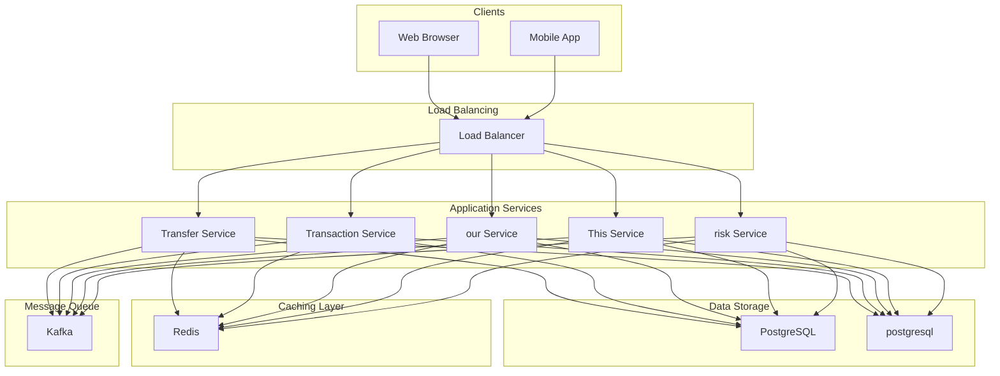

# Design Digital Wallet Service

## What is a Digital Wallet?

A digital wallet is a service that allows users to store, send, and receive money electronically without the need for physical cash or cards.
At its core, a digital wallet maintains a balance for each user and enables instant transfers between users, top-ups from external sources (bank accounts, credit cards), and withdrawals to external accounts.
The system must ensure that every transaction is accurate, every balance is correct, and no money is ever created or lost.
**Popular Examples:** PayPal, Venmo, Apple Pay, Google Pay, Cash App, Paytm, Alipay
What makes digital wallets fascinating from an engineering perspective is the zero tolerance for errors.
In most systems, a bug might cause a bad user experience or data inconsistency that can be fixed later.
In a wallet system, a bug could mean money appearing out of thin air or vanishing without a trace.
Every transaction must be exact. If Alice sends Bob $100, exactly $100 must leave Alice's account and exactly $100 must arrive in Bob's account. Not $99.99, not $100.01. Exactly $100.

This system design problem tests your understanding of distributed transactions, consistency guarantees, concurrent access handling, and financial system constraints.
Unlike simple CRUD applications, digital wallets have zero tolerance for balance errors.
In this article, we will explore the **high-level design of a digital wallet service**.
Let's start by clarifying the requirements.

# 1. Clarifying Requirements

Before jumping into architecture diagrams, we need to understand what we are building.
Digital wallets can range from simple peer-to-peer payment apps to complex financial platforms supporting multiple currencies, merchant payments, and credit lines.
Here is how a requirements discussion might unfold in an interview:
**Candidate:** "What is the expected scale? How many users and transactions should the system handle?"
**Interviewer:** "Let's design for 100 million users with 50 million transactions per day."
**Candidate:** "What types of transactions should we support?"
**Interviewer:** "Focus on peer-to-peer transfers between users, top-ups from external sources, and withdrawals. Merchant payments can be discussed if time permits."
**Candidate:** "What are the consistency requirements? Can a user ever see an incorrect balance or have a negative balance?"
**Interviewer:** "Absolutely not. Balances must always be accurate and consistent. Users should never be able to spend more than they have."
**Candidate:** "Should we support multiple currencies?"
**Interviewer:** "Start with single currency. Multi-currency support is a nice-to-have."
**Candidate:** "What latency is acceptable for a transfer between users?"
**Interviewer:** "Transfers should complete within 1-2 seconds. Users expect near-instant feedback."
**Candidate:** "Do we need to handle concurrent transactions from the same user?"
**Interviewer:** "Yes, a user might initiate multiple transfers simultaneously from different devices. The system must handle this correctly without double-spending."
This conversation reveals several critical constraints.
The consistency requirement stands out: unlike a social media feed where showing slightly stale data is fine, a wallet showing an incorrect balance can lead to failed transactions, user frustration, or even financial loss.
Let's formalize what we learned.

## 1.1 Functional Requirements

Based on the discussion, here are the core features our system must support:

- **Wallet Management:** Create wallets for users and retrieve current balance.
- **Top-up:** Add funds to wallet from external sources (bank transfer, card payment).
- **Withdraw:** Transfer funds from wallet to external bank account.
- **P2P Transfer:** Transfer funds between user wallets instantly.
- **Transaction History:** View complete history of all transactions.

## 1.2 Non-Functional Requirements

- **Strong Consistency:** Balance must always be accurate. No double-spending allowed.
- **High Availability:** Target 99.99% uptime. Wallet unavailability blocks all user transactions.
- **Low Latency:** P2P transfers should complete within 1-2 seconds.
- **Durability:** Zero transaction loss. Every completed transaction must be permanently recorded.
- **Scalability:** Support 100 million users and 50 million daily transactions.
- **Auditability:** Complete audit trail for regulatory compliance.

# 2. Back-of-the-Envelope Estimation

Before diving into the design, let's run some quick calculations to understand the scale we are dealing with.
These numbers will guide our architectural decisions, particularly around database selection, caching strategy, and how aggressively we need to optimize for concurrency.

### 2.1 Traffic Estimates

Starting with the numbers from our requirements discussion:

#### Users and Activity

We are designing for 100 million total users. Not all of them are active daily.
Based on typical fintech patterns, about 10% of users transact on any given day, giving us 10 million daily active users.

#### Transaction Volume

With 50 million transactions per day, let's convert this to queries per second:
Traffic is never uniform. During peak hours, such as lunch time when people split bills or the end of the month when rent is due, we might see 5x the average load:

#### Transaction Breakdown

Not all transactions are equal. P2P transfers dominate since that is what users do most often:

| Transaction Type | Percentage | Daily Volume |
| --- | --- | --- |
| P2P transfers | 60% | 30 million |
| Top-ups | 25% | 12.5 million |
| Withdrawals | 15% | 7.5 million |

This breakdown matters because P2P transfers require updating two wallets atomically, while top-ups and withdrawals involve external systems with their own latency and failure modes.

### 2.2 Storage Estimates

Each piece of data in our system has a different storage profile:

#### Wallet Data

Each wallet record contains user reference, balance, currency, status, and timestamps. This comes to roughly 200 bytes per wallet:
20 GB is tiny by modern standards. The entire wallet table fits comfortably in memory, which is great for performance.

#### Transaction Records

Each transaction stores significantly more data:

- Transaction ID, sender, receiver (~100 bytes)
- Amount, currency, type (~50 bytes)
- Status, timestamps, metadata (~150 bytes)

Total: approximately **300 bytes per transaction**

#### Ledger Entries

Here is where storage grows quickly. Each transaction creates at least 2 ledger entries (one debit, one credit). For a transfer with a fee, we might have 3 entries. At 150 bytes per entry:

### 2.3 Key Insights

These estimates reveal several important design implications:

1. **Modest compute requirements:** 2,900 TPS at peak is well within what a handful of application servers can handle. The challenge is not raw throughput but correctness under concurrent access.

2. **Database is critical:** With strong consistency requirements and the need for ACID transactions across wallet updates, our database choice and schema design matter enormously.

3. **Ledger grows fast:** The ledger is append-only and grows to terabytes quickly. We need to think about partitioning or archival strategies early.

4. **Wallet data is hot:** Users check their balance constantly. With only 20 GB of wallet data, aggressive caching makes sense, but we need to be careful about cache consistency.

# 3. Core APIs

With our requirements and scale understood, let's define the API contract.
A wallet API needs to be both simple for everyday use and robust enough to handle the edge cases that come with financial transactions.
We will design a RESTful API with five core operations. Pay close attention to the idempotency keys, which are required on all write operations.
Network failures happen, clients retry requests, and without proper idempotency handling, a user might accidentally send the same payment twice.
Let's walk through each endpoint.

### 3.1 Get Wallet Balance

#### Endpoint: GET /v1/wallets/{wallet_id}/balance

This is the most frequently called endpoint. Users check their balance constantly, often multiple times before making a payment. The response needs to be fast and always accurate.

#### Sample Response:

#### Response Fields:

| Field | Description |
| --- | --- |
| wallet_id | Unique identifier for the wallet |
| balance | Current balance in smallest currency unit (cents for USD) |
| currency | ISO 4217 currency code |
| updated_at | Last balance update timestamp |

Notice that we store balances in the smallest currency unit (cents) rather than dollars. This avoids floating-point precision issues. $150.00 is stored as 15000 cents.

#### Error Cases:

| Status Code | Meaning |
| --- | --- |
| 404 Not Found | Wallet does not exist |
| 401 Unauthorized | Invalid authentication |

### 3.2 Top-up Wallet

#### Endpoint: POST /v1/wallets/{wallet_id}/topup

This endpoint adds funds from an external payment source. The user has already linked a bank account or card, and we use a tokenized reference to charge it.

#### Request Parameters:

| Parameter | Required | Description |
| --- | --- | --- |
| amount | Yes | Amount to add in smallest currency unit |
| payment_method_id | Yes | Linked bank account or card token |
| idempotency_key | Yes | Unique key to prevent duplicate top-ups |

#### Sample Response:

#### Error Cases:

| Status Code | Meaning |
| --- | --- |
| 400 Bad Request | Invalid amount (negative or zero) |
| 402 Payment Required | External payment failed (card declined, insufficient bank funds) |
| 409 Conflict | Idempotency key reused with different parameters |

### 3.3 Withdraw Funds

#### Endpoint: POST /v1/wallets/{wallet_id}/withdraw

Withdrawals move money from the wallet back to an external bank account.
Unlike instant P2P transfers, withdrawals often take 1-3 business days because they go through traditional banking rails (ACH, wire transfers).

#### Request Parameters:

| Parameter | Required | Description |
| --- | --- | --- |
| amount | Yes | Amount to withdraw in smallest currency unit |
| bank_account_id | Yes | Destination bank account |
| idempotency_key | Yes | Unique key to prevent duplicate withdrawals |

#### Sample Response:

Notice the `status: "pending"` and `estimated_arrival` fields. Withdrawals are not instant, and the API response reflects this reality.
The wallet balance is debited immediately (preventing double-spending), but the bank transfer happens asynchronously.

#### Error Cases:

| Status Code | Meaning |
| --- | --- |
| 400 Bad Request | Amount exceeds available balance |
| 404 Not Found | Bank account not found |
| 422 Unprocessable Entity | Withdrawal limit exceeded |

### 3.4 Transfer Between Wallets (P2P)

#### Endpoint: POST /v1/transfers

This is the core functionality that users interact with daily. Transfers between wallets are instant since both wallets are within our system.

#### Request Parameters:

| Parameter | Required | Description |
| --- | --- | --- |
| from_wallet_id | Yes | Source wallet |
| to_wallet_id | Yes | Destination wallet |
| amount | Yes | Transfer amount in smallest currency unit |
| idempotency_key | Yes | Unique key to prevent duplicate transfers |
| note | No | Message to recipient ("Thanks for dinner!") |

#### Sample Response:

#### Error Cases:

| Status Code | Meaning |
| --- | --- |
| 400 Bad Request | Insufficient balance or invalid amount |
| 404 Not Found | Source or destination wallet not found |
| 409 Conflict | Idempotency key reused with different parameters |
| 422 Unprocessable Entity | Transfer to self not allowed |

### 3.5 Get Transaction History

#### Endpoint: GET /v1/wallets/{wallet_id}/transactions

Users need to see their transaction history for budgeting, disputes, and simply remembering who they paid. This endpoint returns a paginated list of all transactions for a wallet.

#### Query Parameters:

| Parameter | Required | Description |
| --- | --- | --- |
| limit | No | Number of transactions per page (default: 20, max: 100) |
| cursor | No | Pagination cursor for next page |
| type | No | Filter by transaction type (topup, withdrawal, transfer) |

#### Sample Response:

# 4. High-Level Design

Now we get to the interesting part: designing the system architecture.
Rather than presenting a complex diagram upfront, we will build the design incrementally, starting with the simplest possible solution and adding components as we encounter real challenges.
This mirrors how you would approach the problem in an interview.
Our system needs to handle three fundamental operations:

1. **Balance Management:** Maintain accurate balances for millions of wallets, with reads that are always consistent.

2. **Transaction Processing:** Handle transfers, top-ups, and withdrawals reliably, even when external systems fail.

3. **Consistency Guarantees:** Ensure no double-spending and no balance errors, ever.

The fundamental challenge of a digital wallet is ensuring that money is neither created nor destroyed during transactions.
When Alice sends $100 to Bob, exactly $100 must leave Alice's wallet and exactly $100 must arrive in Bob's wallet. Not approximately. Exactly.
And atomically, meaning either both things happen or neither does.
Let's build our architecture step by step, starting with the simplest requirement and adding complexity only when needed.

The foundation of any wallet system is maintaining accurate balances for each user.
This sounds simple, but there's a subtle design decision to make: should we store the balance as a single field, or compute it from transaction history every time?
**Option 1: Stored Balance** stores the current balance directly in the wallet record. Fast reads with a single row lookup, but requires careful update logic to maintain consistency.
**Option 2: Computed Balance** calculates the balance by summing all transactions. Always consistent with transaction history, but expensive for wallets with thousands of transactions.
**Recommendation: **Use stored balance for reads with a double-entry ledger as the source of truth. Periodically reconcile the stored balance against the ledger sum to catch any discrepancies. This gives us both speed and auditability.

### Components for Balance Management

Let's introduce the components we need to make this work.

#### API Gateway

Every request enters through the API Gateway.
Think of it as the front door to our system, handling concerns that are common across all requests: authenticating users via tokens, enforcing rate limits to prevent abuse, routing requests to the appropriate service, and terminating SSL/TLS connections.

#### Wallet Service

This service manages everything wallet-related: creating new wallets for users, returning current balances, validating wallet ownership, and managing wallet status (active, frozen, closed).
It's the single point of truth for "what is this user's balance right now?"

#### Wallet Database

Stores wallet records and current balances. We need fast lookups by wallet ID and reliable storage. PostgreSQL is a natural fit here since we need ACID guarantees and the data is relational.

### The Balance Check Flow

Here's how all these components work together when a user checks their balance:
Let's trace through this step by step:

1. **Request arrives at API Gateway:** The client sends a GET request. The gateway authenticates the user and verifies they have permission to view this wallet.

2. **Check the cache first:** Before hitting the database, the Wallet Service checks Redis for a cached balance. Since users check their balance frequently, this cache hit rate should be high.

3. **Cache miss fallback:** If the balance is not cached (first request or cache expired), we query the database and populate the cache for future requests.

4. **Return the balance:** The client receives the current balance. Total latency is typically under 50ms for cache hits, under 100ms for cache misses.

**Important consideration:** Caching balances is tricky. We need to invalidate the cache whenever the balance changes (after any transaction). We will see how to handle this when we discuss transfers.

    S5 --> QueueKafka

## 4.2 Requirement 2: P2P Transfer Processing

The core feature of a digital wallet is transferring money between users instantly. This is where things get interesting. When Alice sends Bob $100, several things need to happen atomically:

1. Verify Alice has at least $100

2. Debit Alice's wallet by $100

3. Credit Bob's wallet by $100

4. Record the transaction for history

5. Create ledger entries for audit

If any of these steps fail, none of them should happen. A partial transfer where Alice is debited but Bob is not credited would be a disaster.

### Additional Components Needed

To handle transfers reliably, we need to introduce a few more components.

#### Transaction Service

This is the brain of our operation for any money movement.
It orchestrates the entire transfer workflow: validating the request, checking that the sender has sufficient balance, executing the transfer atomically, recording the transaction, and handling idempotency for safe retries.
We keep this service stateless so we can run multiple instances behind a load balancer. All state lives in the database.

#### Ledger Service

Every financial system needs an audit trail. The Ledger Service maintains an immutable record of all money movements using double-entry bookkeeping.
For every transaction, it creates matching debit and credit entries that must always balance. This gives us both an audit trail for compliance and a way to verify that our wallet balances are correct.

#### Idempotency Store

Network failures happen. Users click the "Send" button twice. Clients retry requests on timeout. Without idempotency handling, any of these could result in duplicate transactions.
The Idempotency Store (implemented in Redis for speed) tracks which requests we have already processed and returns cached results for duplicates.

### The P2P Transfer Flow

This is the most critical flow in our system. Let's trace through what happens when Alice sends $100 to Bob:
Let's break down the key steps:
**1. Idempotency check comes first.** Before doing anything else, we check if we have already processed this request. If the idempotency key exists and the previous request completed, we return the cached result immediately. This handles the case where a network timeout caused the client to retry.
**2. Lock both wallets before reading.** We use `SELECT ... FOR UPDATE` to acquire exclusive locks on both Alice's and Bob's wallet rows. This prevents any concurrent transaction from modifying these balances until we are done. The order matters: we always lock wallets in a consistent order (by wallet ID) to prevent deadlocks.
**3. Validate and execute atomically.** Within the same database transaction, we verify Alice has sufficient balance, debit her wallet, and credit Bob's wallet. If any step fails, the entire transaction rolls back and neither balance changes.
**4. Record everything.** We insert a transaction record for history and create ledger entries for audit. These are part of the same database transaction, so they either all succeed or all fail together.
**5. Invalidate cache last.** After the transaction commits, we invalidate the cached balances for both Alice and Bob. Their next balance check will fetch fresh data from the database.

## 4.3 Requirement 3: External Transactions (Top-up and Withdrawal)

P2P transfers happen entirely within our system. Top-ups and withdrawals are different because they involve external systems: payment processors for card charges, and banking networks for transfers.
These external systems have their own failure modes, latency characteristics, and eventual consistency models.
The key insight is that we need to handle these transactions in two phases:

1. The internal state change (update our wallet balance)

2. The external operation (charge the card or initiate bank transfer)

The order of these phases matters and differs between top-ups and withdrawals.

### Additional Components Needed

#### Payment Gateway Service

This service integrates with external payment processors like Stripe, Adyen, or Braintree for card payments.
It handles the complexity of tokenized card references, processor-specific APIs, retry logic for failed charges, and webhook callbacks when payments complete.

#### Bank Transfer Service

Handles withdrawals to external bank accounts via ACH, wire transfers, or instant transfer networks like RTP. Unlike card payments which are near-instant, bank transfers can take 1-3 business days.
This service manages the asynchronous nature of these transfers, processing status updates from banking partners.

#### Message Queue

Decouples the synchronous API response from the asynchronous external processing.
When a user initiates a withdrawal, we want to respond quickly ("your withdrawal is in progress") rather than waiting for the bank transfer to complete.
The message queue (Kafka or similar) ensures reliable processing of these async operations.

### The Top-up Flow: Charge First, Credit Second

For top-ups, the order is critical: we charge the external source first, then credit the wallet. Why?
If we credited the wallet first and the card charge failed, the user would have money they didn't pay for.
**What if the card charge fails?** We simply return an error to the user. No money was moved, no cleanup needed. The pending transaction record gets marked as failed.
**What if the database update fails after the card was charged?** This is trickier. The user was charged but their balance was not credited. We have a few options:
1. Retry the database update (most common)

2. If retries fail, trigger an automatic refund via the Payment Gateway

3. Flag for manual review

The transaction record in "pending" state helps us identify and resolve these edge cases.

### The Withdrawal Flow: Debit First, Transfer Second

Withdrawals work in the opposite order from top-ups. We debit the wallet first, then initiate the bank transfer. Why?
If we transferred first and the debit failed, the user could initiate multiple withdrawals for the same balance.
Notice that the API returns immediately with a "pending" status. The user's wallet balance is already reduced, but the actual bank transfer happens asynchronously.
This is the expected UX: users understand that bank transfers take time.
**What if the bank transfer fails?** The Bank Transfer Service receives a failure callback from the bank. It then credits the amount back to the user's wallet and marks the withdrawal as "failed". The user sees the funds reappear in their balance.

## 4.4 Putting It All Together

Now that we have designed each flow individually, let's step back and see the complete architecture. We have built up quite a few components, each with a specific responsibility.
The architecture follows a layered approach, with each layer having a specific responsibility:
**Client Layer:** Users interact with our system through mobile apps, web browsers, or third-party integrations via API.
**Gateway Layer:** The API Gateway handles all cross-cutting concerns: authentication, rate limiting, and request routing. This keeps our services focused on business logic.
**Application Layer:** The Wallet Service handles balance queries, while the Transaction Service orchestrates all money movements. The Ledger Service maintains the immutable audit trail. All three services are stateless and horizontally scalable.
**External Integration Layer:** The Payment Gateway Service talks to card processors for top-ups. The Bank Transfer Service handles withdrawals via ACH or wire transfer networks.
**Data Layer:** PostgreSQL stores wallet records and the ledger. Redis provides both caching for fast balance lookups and the idempotency store for safe retries.
**Async Layer:** Kafka enables reliable async processing for withdrawals and other background operations.

### Component Summary

| Component | Technology | Purpose |
| --- | --- | --- |
| API Gateway | Kong/NGINX | Authentication, rate limiting, routing |
| Wallet Service | Stateless app servers | Balance queries, wallet management |
| Transaction Service | Stateless app servers | Orchestrates all money movements |
| Ledger Service | Stateless app servers | Double-entry bookkeeping, audit trail |
| Payment Gateway | Internal service | External payment processor integration |
| Bank Transfer Service | Internal service | ACH/wire transfer processing |
| Idempotency Store | Redis | Duplicate transaction prevention |
| Balance Cache | Redis | Fast balance lookups |
| Wallet/Ledger DB | PostgreSQL | ACID-compliant storage |
| Message Queue | Kafka | Async processing for external transfers |

# 5. Database Design

With the high-level architecture in place, let's zoom into the data layer. The database choice is perhaps the most important decision for a wallet system.
Get it wrong, and you are fighting an uphill battle for correctness.

## 5.1 Why SQL for Financial Data

The database choice for a digital wallet is not particularly controversial. Let's think through what we need:
**ACID Transactions:** When Alice sends Bob $100, we need to debit Alice and credit Bob in a single atomic operation. If either fails, both must fail. NoSQL databases with eventual consistency models cannot guarantee this.
**Strong Consistency:** Users must always see accurate balances. A user seeing an outdated balance might try to spend money they have already spent, or miss money they just received.
**Row-Level Locking:** When two transactions try to modify the same wallet, the database must serialize them correctly. PostgreSQL's `SELECT ... FOR UPDATE` gives us exactly this.
**Referential Integrity:** Every transaction must reference valid wallets. Foreign key constraints prevent orphaned records and data corruption.
**NUMERIC Type:** Financial calculations require precision. Floating-point arithmetic leads to rounding errors. PostgreSQL's NUMERIC type stores exact decimal values.
Given these requirements, **PostgreSQL** is the clear choice. It provides everything we need out of the box, with decades of battle-testing in financial systems.

## 5.2 Database Schema

Let's design the core tables. We need to store wallets, transactions, ledger entries, and external account references.

### Wallets Table

This is the core table. Each row represents one wallet with its current balance.

| Field | Type | Description |
| --- | --- | --- |
| wallet_id | UUID (PK) | Unique identifier for the wallet |
| user_id | UUID (FK) | Owner of the wallet |
| balance | NUMERIC(19,4) | Current balance with 4 decimal places |
| currency | CHAR(3) | ISO 4217 currency code (USD, EUR, etc.) |
| status | ENUM | active, frozen, closed |
| version | INTEGER | For optimistic locking |
| created_at | TIMESTAMP | Wallet creation time |
| updated_at | TIMESTAMP | Last balance update |

#### Key Design Decisions:

**NUMERIC(19,4)** gives us up to 15 digits before the decimal point (more than enough for any balance) and 4 decimal places for precision. This handles everything from sub-cent calculations to multi-billion dollar balances.
**version** column enables optimistic locking. Each update increments the version. If two transactions try to update the same wallet simultaneously, one will see a version mismatch and can retry.

#### Indexes:

- Primary key on `wallet_id` for fast lookups
- Index on `user_id` for listing a user's wallets
- Index on `status` for admin queries on frozen/closed wallets

### Transactions Table

Every money movement creates a transaction record. This is the user-facing history: "You sent $50 to Bob", "You received $100 from Alice".

| Field | Type | Description |
| --- | --- | --- |
| transaction_id | UUID (PK) | Unique identifier for the transaction |
| idempotency_key | VARCHAR(255) | Client-provided deduplication key (UNIQUE) |
| type | ENUM | transfer, topup, withdrawal |
| status | ENUM | pending, completed, failed, reversed |
| from_wallet_id | UUID (FK) | Source wallet (null for top-ups) |
| to_wallet_id | UUID (FK) | Destination wallet (null for withdrawals) |
| amount | NUMERIC(19,4) | Transaction amount |
| currency | CHAR(3) | ISO 4217 currency code |
| reference_id | VARCHAR(255) | External reference (Stripe charge ID, bank ref) |
| note | TEXT | User-provided message ("Dinner last night") |
| metadata | JSONB | Additional data (IP address, device info) |
| created_at | TIMESTAMP | Transaction initiation time |
| completed_at | TIMESTAMP | Transaction completion time |

#### Key Design Decisions:

The **idempotency_key** has a UNIQUE constraint. Attempting to insert a duplicate key will fail at the database level, providing a second layer of protection beyond our Redis-based idempotency check.
**from_wallet_id** and **to_wallet_id** are nullable because they have different meanings for different transaction types. A top-up has no source wallet (money comes from external). A withdrawal has no destination wallet (money goes to external).

#### Indexes:

- Unique index on `idempotency_key`
- Composite index on `(from_wallet_id, created_at)` for sender history
- Composite index on `(to_wallet_id, created_at)` for receiver history
- Index on `(status, created_at)` for finding pending transactions

### Ledger Entries Table

This is the financial audit trail. Every money movement creates at least two entries: a debit from one account and a credit to another. The ledger is append-only and never modified.

| Field | Type | Description |
| --- | --- | --- |
| entry_id | UUID (PK) | Unique identifier for this entry |
| transaction_id | UUID (FK) | Associated transaction |
| wallet_id | UUID (FK) | The wallet being debited/credited |
| entry_type | ENUM | debit, credit |
| amount | NUMERIC(19,4) | Entry amount (always positive) |
| balance_before | NUMERIC(19,4) | Wallet balance before this entry |
| balance_after | NUMERIC(19,4) | Wallet balance after this entry |
| created_at | TIMESTAMP | Entry creation time |

#### Key Design Decisions:

**balance_before** and **balance_after** capture the wallet state at the time of the entry. This enables point-in-time balance reconstruction for audits and dispute resolution.
The ledger is **append-only**. We never update or delete entries. To reverse a transaction, we create new reversal entries. This immutability is required for financial compliance.

#### Indexes:

- Index on `(wallet_id, created_at)` for reconstructing balance history
- Index on `transaction_id` for finding all entries for a transaction

### External Accounts Table

Stores tokenized references to linked bank accounts and cards. We never store actual account numbers or card details.

| Field | Type | Description |
| --- | --- | --- |
| account_id | UUID (PK) | Unique identifier |
| user_id | UUID (FK) | Owner of the account |
| type | ENUM | bank_account, card |
| provider | VARCHAR(50) | stripe, plaid, etc. |
| token | VARCHAR(255) | Tokenized account reference from provider |
| last_four | CHAR(4) | Last 4 digits for display ("****4242") |
| status | ENUM | active, removed, failed_verification |
| created_at | TIMESTAMP | When account was linked |

The **token** field contains a reference that only the external provider can resolve to actual account details. This keeps sensitive financial data out of our systems.

# 6. Design Deep Dive

The high-level architecture gives us a solid foundation, but system design interviews often go deeper into specific components.
In this section, we will explore the trickiest parts of our design: preventing double-spending, handling high-volume wallets, implementing double-entry ledgers, and managing idempotency.
These are the topics that distinguish a good system design answer from a great one.

## 6.1 Preventing Double-Spending

Double-spending is the nightmare scenario for any wallet system. It occurs when a user spends the same money twice. Let's understand exactly how it can happen and the mechanisms to prevent it.

### The Race Condition Problem

Consider this scenario: Alice has $100 and tries to send $100 to two different people at the same time, perhaps from two different devices.
Both requests read the same balance, both see sufficient funds, and both debit. The result: Alice has a negative balance and effectively stole $100 from the system.

### Solution 1: Pessimistic Locking (Row-Level Lock)

The most straightforward solution is to lock the wallet row before reading it. The lock prevents any other transaction from reading or modifying that row until we are done.

#### How it prevents double-spending:

When Request A executes `SELECT ... FOR UPDATE`, it acquires an exclusive lock on Alice's wallet row. Request B, trying to do the same, blocks at its SELECT statement, waiting for the lock.
Once Request A commits, the lock is released. Request B finally acquires the lock and reads the balance. But now the balance is $0, not $100. Request B sees insufficient funds and fails gracefully.

#### Pros:

- Simple to implement and reason about
- Guaranteed correctness

#### Cons:

- Reduces concurrency since requests queue up
- Risk of deadlocks when locking multiple wallets (must lock in consistent order)
- Higher latency under contention

### Solution 2: Optimistic Locking (Version Check)

Instead of locking upfront, optimistic locking assumes conflicts are rare. We read the data, do our work, and only check for conflicts at write time using a version number.

#### How it prevents double-spending:

Both requests read version=5. Request A's UPDATE succeeds and changes the version to 6. When Request B tries its UPDATE with `version = 5`, no row matches (the version is now 6).
The UPDATE affects 0 rows, signaling a conflict.

Request B then retries the entire operation: read the new balance ($0), see insufficient funds, fail gracefully.

#### Pros:

- Better concurrency for low-contention scenarios
- No blocking between readers
- Works well when conflicts are rare

#### Cons:

- Requires retry logic in the application
- High retry rates under contention can hurt performance

### Solution 3: Atomic Check-and-Update

The simplest approach is to combine the balance check and update into a single SQL statement. The database guarantees atomicity.
If the balance is less than 100, the WHERE clause does not match, the UPDATE affects 0 rows, and we know the transfer failed.

#### Pros:

- Simplest implementation, just one statement
- Inherently atomic
- No explicit locking or retry logic

#### Cons:

- Cannot distinguish between "wallet not found" and "insufficient balance" without an additional query
- Harder to implement complex validation (e.g., daily limits, fraud checks)

### Recommendation

For P2P transfers involving two wallets, we recommend **pessimistic locking** with careful lock ordering.
The atomic check-and-update is too simple for multi-wallet transactions, and optimistic locking adds retry complexity.
**Why lock ordering matters:** If Request A locks Alice then Bob, but Request B locks Bob then Alice, they could deadlock (each waiting for the other's lock). By always locking in wallet_id order, all requests agree on the lock sequence.

## 6.2 Handling High-Volume Wallets

Pessimistic locking works well for regular users, but what happens when a wallet receives thousands of transactions per second? This is common for merchant wallets.
Think of Starbucks receiving payments from millions of customers daily, or a popular streamer receiving donations during a live event.

### The Hot Wallet Problem

With pessimistic locking, every transaction to a merchant wallet must wait for the previous one to complete.
If each transaction takes 10ms (including network latency), we can only process 100 transactions per second to that single wallet.
All transactions queue up, waiting for that single row lock. This is unacceptable for high-volume wallets.

### Solution 1: Batch Processing

Instead of updating the balance for each individual payment, we collect multiple payments and apply them in a single batch.

#### How it works:

1. Incoming credits queue up for a short window (e.g., 100ms or 100 transactions, whichever comes first)

2. A batch processor sums all credits: $50 + $75 + $25 = $150

3. Single database update: `UPDATE balance = balance + 150`

4. All queued transactions are marked complete

#### Pros:

- Dramatically reduces database contention (100 payments become 1 update)
- Scales linearly with batch size

#### Cons:

- Slight delay before balance reflects new payments (up to the batch window)
- Only works for credits. Debits still need real-time balance checks to prevent overdrafts
- Adds complexity: need reliable queue, batch processor, failure handling

### Solution 2: Wallet Sharding (Sub-wallets)

Instead of one wallet row, split the merchant's balance across multiple "sub-wallets". Each sub-wallet has its own row and therefore its own lock.

#### How it works:

1. A merchant wallet is split into N sub-wallets (e.g., 10)

2. Incoming payments are distributed across sub-wallets using round-robin or consistent hashing

3. Each sub-wallet can be locked independently

4. Total balance = SUM of all sub-wallet balances

#### Pros:

- Distributes lock contention across N rows
- Throughput scales linearly with sub-wallet count
- Works for both credits and debits (with careful handling)

#### Cons:

- Balance queries are more expensive (must sum all sub-wallets)
- Withdrawals need coordination to consolidate from multiple sub-wallets
- Adds schema and application complexity

### Solution 3: Event Sourcing (Async Balance)

For wallets that only receive credits (no debits), we can take a different approach: record the event immediately, update the balance asynchronously.

#### How it works:

1. A payment creates an immutable event: "Credit $100 to wallet X at timestamp T"

2. Return success to the payer immediately (the event is durably stored)

3. A background worker processes events and updates the materialized balance

4. The merchant sees a balance that lags slightly behind actual credits

#### Pros:

- Extremely high write throughput (no balance-update contention)
- Events are the source of truth, enabling powerful audit and replay

#### Cons:

- Eventual consistency: balance may be stale by seconds or minutes
- Cannot use for debits (cannot verify balance in real-time)
- Only suitable for receive-only wallets like merchant collection accounts

### Which Approach to Use?

| Wallet Type | Recommended Approach | Why |
| --- | --- | --- |
| Regular user | Pessimistic locking | Low contention, correctness matters most |
| High-volume merchant (credits) | Batch processing | Simple, works well for receive-heavy |
| Extremely high-volume | Sub-wallet sharding | Scales to arbitrary throughput |
| Receive-only accounts | Event sourcing | Maximum throughput, eventual consistency OK |

## 6.3 Double-Entry Ledger Design

Every financial institution uses double-entry bookkeeping, a system invented in 15th century Italy that has stood the test of time.
The principle is simple: every money movement is recorded as two entries, a debit from one account and a credit to another.

### Why Double-Entry Matters

The fundamental accounting equation must always hold:
If this equation is ever violated, money has been created or destroyed. In the real world, that means either a bug in our system or fraud.
The ledger gives us a built-in consistency check that we can run at any time.

### Understanding Debits and Credits

In double-entry accounting, user wallet balances are liabilities from the company's perspective. We owe the users their money. This affects how we record entries:

- **Debit a user wallet** = decrease their balance (they have less)
- **Credit a user wallet** = increase their balance (they have more)

Let's see how common transactions are recorded:

### Transaction Examples

**P2P Transfer: Alice sends $100 to Bob**

| Entry | Account | Debit | Credit |
| --- | --- | --- | --- |
| 1 | Alice's Wallet | $100 |  |
| 2 | Bob's Wallet |  | $100 |

Total Debits = Total Credits = $100. The books balance.
**Top-up: Alice adds $500 from bank**

| Entry | Account | Debit | Credit |
| --- | --- | --- | --- |
| 1 | Bank Clearing Account | $500 |  |
| 2 | Alice's Wallet |  | $500 |

Money comes from the bank (debit the clearing account) and goes to Alice (credit her wallet).
**Withdrawal: Bob withdraws $200 to bank**

| Entry | Account | Debit | Credit |
| --- | --- | --- | --- |
| 1 | Bob's Wallet | $200 |  |
| 2 | Bank Clearing Account |  | $200 |

Money leaves Bob's wallet (debit) and goes to the bank clearing account (credit).
**Transfer with Fee: Alice sends $100 to Bob, $2 fee charged**

| Entry | Account | Debit | Credit |
| --- | --- | --- | --- |
| 1 | Alice's Wallet | $102 |  |
| 2 | Bob's Wallet |  | $100 |
| 3 | Fee Revenue |  | $2 |

Total Debits: $102, Total Credits: $102. The $2 difference goes to revenue.

### Ledger Implementation Best Practices

#### 1. Append-Only (Never Modify)

The ledger is immutable. We never update or delete entries. To correct a mistake or reverse a transaction, we create new entries that offset the original ones.
This immutability is required for financial audits. Regulators need to see exactly what happened and when, without any possibility that records were altered after the fact.

#### 2. Atomic Entry Creation

All entries for a transaction must be created together. If we create the debit entry but crash before creating the credit entry, the ledger is corrupted (debits ≠ credits).
If the commit fails, no entries are created. The ledger remains balanced.

#### 3. Periodic Reconciliation

The stored wallet balance should always equal the sum of all ledger entries for that wallet. We run periodic reconciliation jobs to verify this:
Discrepancies should be rare. If they occur, they indicate a bug that needs investigation.

## 6.4 Idempotency for Financial Operations

Network failures, timeouts, and client retries are inevitable. A user clicks "Send $100" and the request times out. Did the transfer happen? They click again.
Without proper idempotency, they might send $200 instead of $100.
Idempotency ensures that performing the same operation multiple times has the same effect as performing it once.

### Designing Idempotency Keys

The client generates a unique key for each logical operation and includes it in the request.
If the server receives the same key twice, it returns the cached result from the first request instead of processing again.

#### Key Requirements:

- Unique per logical operation (not per request)
- Generated by the client (the server cannot know if a request is a retry)
- Enough entropy to avoid collisions (UUIDs work well)
- Scoped to user for security (one user cannot replay another's key)

**Recommended Format:**

Example: `user_abc:transfer:550e8400-e29b-41d4-a716-446655440000`

### The Idempotency Flow

The key insight is that we insert the idempotency key *before* processing. If two identical requests arrive simultaneously, only one will successfully insert.
The other sees a duplicate key and knows to wait or return the cached result.

### Storage Schema

We store idempotency keys in Redis for speed, with a backup in PostgreSQL for durability:

### Important Edge Cases

#### Parameter Mismatch

If a client reuses an idempotency key with different parameters (different amount, different recipient), we reject the request. This prevents subtle bugs and potential abuse.

#### Stuck in Processing

If a request crashes while processing, the key is left in "processing" state forever. We set a timeout (e.g., 5 minutes).
If a key is still "processing" after the timeout, we assume the original request failed and allow a retry.

#### Cleanup

Idempotency keys should expire. A 24-72 hour TTL is typical. Users will not retry a week-old request, and we do not want the table growing forever.

## 6.5 Transaction State Machine

A transaction is not just "done" or "not done". It goes through a lifecycle of states, and managing these transitions correctly is essential for reliability and debugging.

### Transaction States

### State Definitions

| State | Description | Can Transition To |
| --- | --- | --- |
| pending | Transaction created, awaiting validation | processing, failed |
| processing | Validation passed, executing operations | completed, failed |
| completed | All operations successful, money moved | reversed |
| failed | Transaction failed, no money moved | (terminal) |
| reversed | Completed transaction was reversed | (terminal) |

### Handling Failed Transactions

**Scenario:** A P2P transfer debits the sender but fails to credit the receiver.
This should **never happen** if using database transactions correctly:

#### For external operations (top-up, withdrawal):

If the external operation fails after internal state changes, you need compensation:

### Reversal Process

For completed transactions that need to be undone (disputes, errors):

1. Create a new "reversal" transaction

2. Create opposite ledger entries (credit what was debited, debit what was credited)

3. Update balances accordingly

4. Link reversal to original transaction

## 6.6 Fraud Detection and Risk Management

Digital wallets are prime targets for fraud. Fraudsters try to take over accounts, launder money, or abuse promotional credits.
A robust system needs multiple layers of protection, and the right balance: too strict and you block legitimate users; too lenient and you lose money to fraud.

### Types of Fraud to Watch For

| Fraud Type | Description | Detection Method |
| --- | --- | --- |
| Account Takeover | Unauthorized access to account | Unusual login patterns, device fingerprinting |
| Money Laundering | Moving illicit funds | Transaction pattern analysis, velocity checks |
| Friendly Fraud | Legitimate user disputes valid transactions | Transaction history, behavioral analysis |
| Synthetic Identity | Fake accounts for fraud | Identity verification, network analysis |

### Real-Time Risk Checks

Before processing any transaction, run through risk rules:

### Common Risk Rules

#### 1. Velocity Limits

#### 2. Amount Limits

#### 3. Behavioral Anomalies

### Implementation Architecture

The Risk Service should be:

- **Synchronous** for blocking decisions (< 100ms latency)
- **Non-blocking** for the transaction flow (if risk service is down, use default rules)
- **Configurable** rules that can be updated without deployment

# References

- [Square's Double-Entry Bookkeeping](https://developer.squareup.com/blog/books-an-immutable-double-entry-accounting-database-service/) - Ledger design patterns
- [Stripe's Idempotency](https://stripe.com/docs/api/idempotent_requests) - Idempotency implementation guide
- [Database Transactions and Locking](https://www.postgresql.org/docs/current/explicit-locking.html) - PostgreSQL locking mechanisms
- [Event Sourcing for Financial Systems](https://martinfowler.com/eaaDev/EventSourcing.html) - Martin Fowler on event sourcing

# Quiz

## Design Digital Wallet Quiz

In a digital wallet, what is the primary reason to store amounts in the smallest currency unit (for example, cents) instead of decimals?