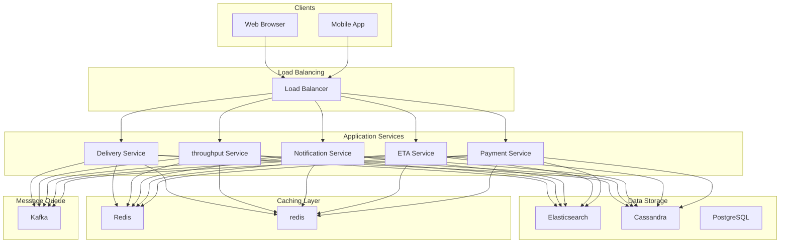
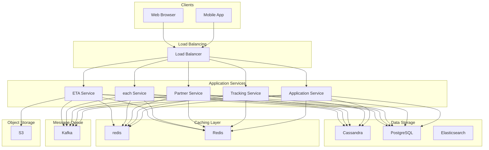
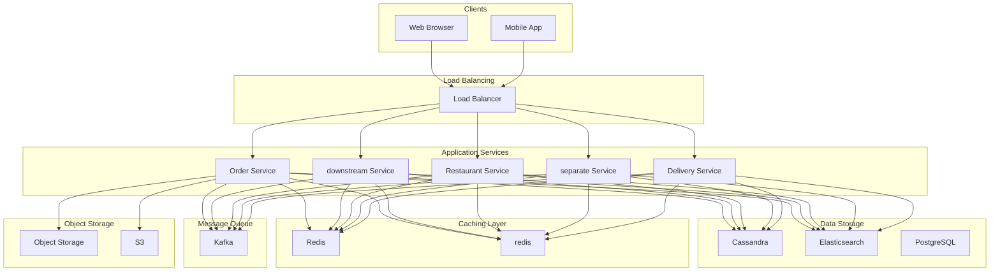

# Design Food Delivery Service

A food delivery service connects hungry customers with nearby restaurants and facilitates the delivery of meals to their doorstep through a network of delivery partners.
The platform handles the entire lifecycle: browsing menus, placing orders, processing payments, assigning delivery partners, and providing real-time tracking until the food arrives. It must coordinate three distinct user types (customers, restaurants, delivery partners) while ensuring fast delivery times and a smooth experience for everyone.
**Popular Examples:** DoorDash, Uber Eats, Swiggy, Zomato, Grubhub
This system design problem touches on many interesting challenges: real-time location tracking, geo-spatial queries for finding nearby entities, coordinating multiple actors with different needs, optimizing competing constraints (fast delivery vs fair partner distribution vs cost), and handling traffic spikes during lunch and dinner rushes.
In this chapter, we will explore the **high-level design of a food delivery service**.
Lets start by clarifying the requirements:
# 1. Clarifying Requirements
Before starting the design, it's important to ask thoughtful questions to uncover hidden assumptions, clarify ambiguities, and define the system's scope more precisely.
Here is an example of how a discussion between the candidate and the interviewer might unfold:
**Candidate:** "What is the expected scale? How many orders per day and how many active delivery partners?"
**Interviewer:** "Let's design for 10 million orders per day with 500,000 active delivery partners and 200,000 restaurants."
**Candidate:** "Should customers be able to track their order and delivery partner in real-time?"
**Interviewer:** "Yes, real-time tracking is essential. Customers should see the delivery partner's location updated every few seconds."
**Candidate:** "How should we assign delivery partners to orders? Should we optimize for fastest delivery or fair distribution among partners?"
**Interviewer:** "Primarily optimize for fastest delivery time, but also consider partner availability and current workload."
**Candidate:** "Do we need to support scheduled orders for later delivery, or only on-demand orders?"
**Interviewer:** "Focus on on-demand orders for now. Scheduled orders are nice-to-have."
**Candidate:** "Should we handle payments within our system or integrate with external payment providers?"
**Interviewer:** "Assume we integrate with external payment gateways. Focus on order flow rather than payment internals."
**Candidate:** "What about surge pricing during peak hours?"
**Interviewer:** "Yes, the system should support dynamic pricing based on demand and supply."
This conversation reveals the key constraints and priorities for our system. Let's formalize these into requirements.

## 1.1 Functional Requirements
Based on our discussion, here are the core features our system must support:
- **Restaurant Discovery:** Customers can browse nearby restaurants and their menus based on location.
- **Order Placement:** Customers can place orders with multiple items from a single restaurant.
- **Real-time Tracking:** Customers can track order status and delivery partner location in real-time.
- **Delivery Partner Assignment:** System assigns the optimal delivery partner for each order.
- **Order Management:** Restaurants can accept/reject orders and update preparation status.
- **ETA Calculation:** Provide accurate estimated delivery times.

## 1.2 Non-Functional Requirements
- **High Availability:** The system must be highly available (99.99%), especially during peak meal times.
- **Low Latency:** Restaurant search and order placement should complete within 200ms. Location updates should be near real-time (< 3 seconds).
- **Scalability:** Handle 10 million orders per day with traffic spikes during lunch and dinner hours.
- **Consistency:** Order and payment data must be strongly consistent. Location data can be eventually consistent.

# 2. Back-of-the-Envelope Estimation
Before diving into the architecture, let's run some quick calculations to understand the scale we are dealing with. These numbers will guide our decisions about storage, caching, and which components need the most attention.

### 2.1 Order Traffic
Starting with the numbers from our requirements discussion:

#### Order Volume
We expect 10 million orders per day. Let's convert this to queries per second:
But food delivery traffic is far from uniform. Most orders come during lunch and dinner hours. If we assume peak hours see 5x the average load:
600 orders per second during peak hours is substantial but manageable for a well-designed distributed system.

### 2.2 Location Update Traffic
This is where things get interesting. Location tracking generates much higher traffic than orders.
50,000 location updates per second is a completely different scale than 600 order requests. This tells us that the location tracking system needs special attention in our design.

### 2.3 Restaurant Search Traffic
Every order typically involves several search operations as customers browse restaurants, view menus, and compare options:

### 2.4 Storage Requirements
Let's estimate storage needs for a year of operation:

#### Orders Table
Each order record includes order details, items, addresses, status history, and timestamps. A reasonable estimate:

#### Location History
This is where storage gets interesting. If we want to retain location history for analytics and dispute resolution:
Location data dominates our storage if we keep it long-term. Most systems only retain detailed location history for a short window (7 days) and aggregate older data.

### 2.5 Key Insights
These estimates reveal several important design implications:
1. **Location tracking dominates traffic:** At 50,000 QPS, location updates are 83x the order volume. This system needs dedicated infrastructure.
2. **Peak traffic is significant:** 5-10x traffic spikes during meal times mean we need auto-scaling and cannot size for average load.
3. **Storage is manageable:** Even at 10 million orders per day, annual storage is under 10 TB for orders. Location history needs aggressive retention policies.
4. **Read-heavy for restaurants:** Search traffic exceeds order traffic, so restaurant data should be heavily cached.

# 3. Core APIs
The food delivery service requires APIs for three distinct user types, each with very different needs. Customers browse and order, restaurants manage incoming orders, and delivery partners update their location and status. Let's walk through the key endpoints.

### 1. Search Restaurants

#### Endpoint: GET /restaurants
This is the entry point for customers. They open the app, and we need to show them relevant nearby restaurants quickly.

#### Request Parameters:
| Parameter | Type | Required | Description |
| --- | --- | --- | --- |
| latitude | float | Yes | Customer's current latitude |
| longitude | float | Yes | Customer's current longitude |
| radius_km | float | No | Search radius in kilometers (default: 5km) |
| cuisine | string | No | Filter by cuisine type (e.g., "italian", "chinese") |
| sort_by | string | No | Sort results by "rating", "delivery_time", or "distance" |

#### Response:
Returns a list of restaurants with their basic information, estimated delivery times, and distance from the customer. The estimated delivery time is crucial for helping customers decide where to order.

#### Error Cases:
- `400 Bad Request`: Invalid coordinates (outside valid lat/lng ranges)

### 2. Place Order

#### Endpoint: POST /orders
Once a customer has selected their items, this endpoint handles the entire order creation flow.

#### Request Parameters:
| Parameter | Type | Required | Description |
| --- | --- | --- | --- |
| customer_id | UUID | Yes | ID of the customer placing the order |
| restaurant_id | UUID | Yes | ID of the selected restaurant |
| items | array | Yes | Array of items with item_id and quantity |
| delivery_address | object | Yes | Contains latitude, longitude, and address string |
| payment_method_id | string | Yes | Customer's selected payment method |

#### Response:
Returns the created order with its unique ID, initial status, estimated delivery time, and total amount including delivery fee.

#### Error Cases:
- `400 Bad Request`: Invalid items, restaurant is closed, or malformed request
- `402 Payment Required`: Payment authorization failed
- `404 Not Found`: Restaurant or menu items not found

### 3. Update Order Status (Restaurant)

#### Endpoint: PUT /orders/{order_id}/status
Restaurant staff use this endpoint to move orders through their lifecycle, from acceptance to ready for pickup.

#### Request Parameters:
| Parameter | Type | Required | Description |
| --- | --- | --- | --- |
| status | enum | Yes | New status: ACCEPTED, PREPARING, READY_FOR_PICKUP, or REJECTED |
| estimated_prep_time | int | No | Updated preparation time in minutes |

#### Error Cases:
- `403 Forbidden`: Restaurant is not authorized for this order
- `409 Conflict`: Invalid status transition (e.g., jumping from PENDING to READY)

### 4. Update Delivery Partner Location

#### Endpoint: POST /partners/{partner_id}/location
Delivery partners send their location every few seconds while online. This is our highest-traffic endpoint.

#### Request Parameters:
| Parameter | Type | Required | Description |
| --- | --- | --- | --- |
| latitude | float | Yes | Current latitude |
| longitude | float | Yes | Current longitude |
| timestamp | long | Yes | Client-side timestamp for ordering |
| heading | int | No | Direction of travel in degrees (0-360) |
| speed | float | No | Current speed in km/h |

#### Response:
Returns acknowledgment and includes any active order assignment for the partner.

### 5. Get Order Tracking

#### Endpoint: GET /orders/{order_id}/tracking
Customers poll this endpoint (or receive WebSocket updates) to see their order progress and delivery partner location.

#### Response:
Returns the current order status, delivery partner's location (if assigned and en route), updated ETA, and optionally the route being taken.
# 4. High-Level Design
Now we get to the interesting part: designing the system architecture. Rather than presenting a complex diagram upfront, we will build the design incrementally. We will start simple and add components as we encounter challenges. This mirrors how you would approach the problem in an interview.
Our system needs to handle four core requirements:
1. **Restaurant Discovery:** Help customers find nearby restaurants quickly
2. **Order Management:** Process orders through restaurant confirmation and preparation
3. **Delivery Partner Assignment:** Match orders with optimal delivery partners
4. **Real-time Tracking:** Provide live updates on order and delivery status

The system involves three distinct actors (customers, restaurants, delivery partners) with very different interaction patterns. Customers browse and order, restaurants process and prepare, partners pick up and deliver. This naturally leads to a microservices architecture where each service handles a specific domain.
**Note:** Instead of presenting the final architecture upfront, we will build it piece by piece. This approach is easier to follow and demonstrates your thought process in an interview.

## 4.1 Requirement 1: Restaurant Discovery
When a hungry customer opens the app, the first thing they need is a list of nearby restaurants. This seems simple, but there is interesting complexity: we need to query by geographic location, filter by various attributes, rank results intelligently, and do it all in under 200ms.

### The Challenge
Finding "nearby" restaurants is not a simple database query. We cannot just do `WHERE distance < 5km` because distance calculations are expensive, and we have 200,000 restaurants to consider. We need specialized data structures and indexing for geo-spatial queries.

### Components Needed

#### Restaurant Service
This service owns all restaurant data: profiles, menus, operating hours, ratings, and average preparation times. When restaurants update their menus or hours, those changes flow through this service.
The Restaurant Service maintains data in two places: PostgreSQL for the authoritative record (which supports complex queries and transactions) and Elasticsearch for fast full-text and geo-spatial search.

#### Location Service
Handles geo-spatial queries to find entities near a given point. This service answers questions like "which restaurants are within 5km of this location?" and "which delivery partners are near this restaurant?"
The Location Service uses spatial indexing (like geohashing or R-trees) to make proximity queries fast. Instead of calculating distance to every restaurant, it quickly narrows down to candidates in the relevant area.

#### Discovery Service
Orchestrates the search experience. It takes the customer's location and preferences, calls the Location Service to find nearby restaurants, enriches the results with data from the Restaurant Service, and ranks everything for display.
The Discovery Service also handles caching. Since restaurant data changes infrequently (maybe a few times per day), we can cache search results aggressively.

### The Search Flow in Detail
Let's walk through what happens when a customer searches for restaurants:
1. **Request arrives:** The customer's app sends their location and any filters (cuisine type, max delivery time, etc.)
2. **Check cache first:** The Discovery Service looks for cached results for this geographic area. We use a grid-based cache key (e.g., geohash of the location), so nearby customers share cache hits.
3. **Find nearby restaurants:** On cache miss, we query the Location Service. This returns restaurant IDs and their distances from the customer, using a geo-spatial index for fast lookups.
4. **Enrich with details:** With the list of nearby restaurant IDs, we batch-fetch full details from the Restaurant Service: menus, ratings, current operating status, and average preparation times.
5. **Calculate ETAs and rank:** For each restaurant, we estimate delivery time based on preparation time, distance, and current partner availability. Results are ranked by relevance (some combination of distance, rating, delivery time, and possibly personalization).
6. **Cache and return:** Results are cached for a few minutes (restaurant data does not change frequently) and returned to the customer.

## 4.2 Requirement 2: Order Placement and Management
Once a customer selects items and taps "Place Order," a cascade of events needs to happen: validate the order, authorize payment, notify the restaurant, track the order through preparation, and eventually hand it off for delivery.

### Components Needed

#### Order Service
This is the central nervous system for orders. It owns the order lifecycle from creation through delivery, coordinates with other services, and maintains the authoritative order state.
The Order Service implements a state machine that enforces valid transitions. An order cannot jump from PENDING to DELIVERED; it must progress through each state.

#### Payment Service
Handles integration with external payment gateways. For order placement, we authorize (but do not charge) the payment. The actual charge happens after delivery is confirmed.
Keeping payment as a separate service isolates this critical, compliance-heavy functionality. It also allows us to support multiple payment providers and handle payment-specific concerns like PCI compliance.

#### Notification Service
Sends notifications to all parties: push notifications to customer apps, alerts to restaurant tablets, and messages to delivery partner apps.
This service abstracts the complexity of multiple notification channels (push, SMS, email) and handles delivery guarantees, retry logic, and rate limiting.

### The Order Flow in Detail
Here is what happens when a customer places an order:
1. **Order submitted:** Customer sends their cart with items, delivery address, and payment method.
2. **Payment authorization:** Before creating the order, we authorize the payment. This puts a hold on the funds but does not charge the card. If authorization fails, we reject the order immediately.
3. **Order creation:** With payment authorized, we create the order record with status `PENDING_RESTAURANT_CONFIRMATION`. This is atomic: either the order is created successfully, or we release the payment hold.
4. **Restaurant notification:** The Notification Service sends a push notification to the restaurant's tablet or device. The restaurant has a time window (usually 3-5 minutes) to respond.
5. **Restaurant accepts:** When the restaurant taps "Accept," the order moves to `CONFIRMED`. The customer receives a notification that their order is being prepared.
6. **Preparation updates:** The restaurant updates the order as it progresses through their kitchen: `PREPARING` when they start, `READY_FOR_PICKUP` when complete.

### Order State Machine
Orders follow a strict state machine. This prevents invalid transitions and makes the system behavior predictable.
Each transition has rules:
- **PENDING → CONFIRMED:** Only the assigned restaurant can accept
- **PENDING → CANCELLED:** Restaurant can reject (no charge), or customer can cancel (no charge)
- **CONFIRMED → CANCELLED:** Customer can cancel but may incur a fee since the restaurant started work
- **PREPARING → CANCELLED:** Rare and requires manual intervention; full refund

The state machine prevents bugs like accidentally charging a customer for a cancelled order or marking an order delivered before it was picked up.

## 4.3 Requirement 3: Delivery Partner Assignment
When a restaurant marks an order as ready (or close to ready), we need to find the best delivery partner to pick it up. This is one of the most interesting optimization problems in the system. A good assignment algorithm should minimize customer wait time while being fair to partners.

### The Challenge
Finding a good partner is not as simple as "pick the closest one." Consider this scenario:
- Partner A is 1 km from the restaurant but driving away from it
- Partner B is 2 km away but driving toward the restaurant
- Partner C is 1.5 km away, has a 4.9 rating, and has been idle for 10 minutes

Who should get the order? The answer depends on your optimization goals, and in a real system, we need to balance multiple factors.

### Components Needed

#### Partner Service
Manages delivery partner profiles, availability status, and performance metrics. When a partner goes online or offline, updates their vehicle type, or completes a delivery, those changes flow through this service.

#### Assignment Service
The brain of partner matching. It considers multiple factors (location, direction of travel, current workload, ratings, fairness) to select the best partner for each order.

#### Location Tracking Service
Ingests real-time location updates from partners and maintains their current positions. This is a high-throughput service (50,000 updates per second during peak) that needs specialized infrastructure.

### The Assignment Flow
Here is how partner assignment works:
1. **Trigger:** When an order status changes to `PREPARING` (or a configurable trigger), the Order Service requests a partner assignment. We do this before the food is ready so the partner can start heading to the restaurant.
2. **Find candidates:** The Assignment Service queries the Location Tracking Service for all partners within a radius of the restaurant (typically 3-5 km). This uses geo-spatial indexing for fast lookups.
3. **Enrich with details:** We fetch partner details from the Partner Service: their rating, current status (available vs. on another delivery), vehicle type, and acceptance rate.
4. **Score and rank:** Each candidate gets a score based on multiple factors (we will dive into the algorithm later). Partners are ranked by score.
5. **Send assignment:** The top partner receives a notification with order details. They have a time window (typically 30 seconds) to accept.
6. **Handle rejection:** If the partner rejects or does not respond, we immediately try the next partner on the list. This continues until someone accepts or we exhaust candidates (rare).

## 4.4 Requirement 4: Real-time Tracking
Once an order is out for delivery, customers expect to see their partner's location updating in real-time. This live tracking is one of the features that transformed food delivery from "your food will arrive in 30-45 minutes" to a precise, engaging experience.

### The Challenge
Real-time tracking sounds simple: show the partner's location on a map. But consider the scale: 250,000 partners sending updates every 5 seconds, each update potentially being pushed to one or more customers watching their orders. That is 50,000 updates per second in, and potentially more going out.

### Components Needed

#### WebSocket Gateway
Maintains persistent connections with customer apps. Unlike HTTP request-response, WebSockets allow us to push data to clients without them asking for it. This is essential for smooth real-time updates.
The WebSocket Gateway is the bridge between our backend event stream and the customer's phone. When a location update arrives for an active order, it pushes that update to all connected customers watching that order.

### The Tracking Flow
Here is how real-time tracking works:
1. **Customer subscribes:** When a customer opens the tracking screen, their app establishes a WebSocket connection and subscribes to updates for their order.
2. **Partner sends location:** The partner's app sends GPS coordinates every 5 seconds. This includes latitude, longitude, heading (direction), and speed.
3. **Store current location:** The Location Tracking Service updates the partner's current location in Redis. This is the authoritative "where is this partner right now" data, used for assignment and tracking.
4. **Publish event:** The update is also published to Kafka. This decouples the high-throughput ingestion from the potentially slow fan-out to customers.
5. **WebSocket delivery:** The WebSocket Gateway subscribes to location events for active orders. When an event arrives, it looks up which customers are watching that order and pushes the update to them.
6. **UI update:** The customer's app receives the update and smoothly animates the marker on the map. Good apps interpolate between updates so movement appears smooth even with 5-second intervals.

## 4.5 Putting It All Together
Now that we have designed each requirement individually, let's see how all the pieces fit together. This is the complete architecture for our food delivery service.

### How the Components Work Together
| Component | Purpose | Key Interactions |
| --- | --- | --- |
| Discovery Service | Restaurant search and ranking | Calls Location Service for geo queries, Restaurant Service for details |
| Order Service | Order lifecycle management | Coordinates Payment, Notification, and Assignment services |
| Restaurant Service | Restaurant and menu data | Syncs to Elasticsearch for search |
| Partner Service | Delivery partner profiles | Provides data to Assignment Service |
| Assignment Service | Order-to-partner matching | Uses Location Tracking for proximity, Partner Service for scoring |
| Location Tracking Service | Real-time location ingestion | High-throughput writes to Redis and Kafka |
| Location Service | Geo-spatial queries | Powers restaurant search and partner finding |
| ETA Service | Delivery time estimation | Uses Maps API for routing |
| Payment Service | Payment processing | Integrates with external gateways |
| Notification Service | Push notifications | Sends to all three user types |
| WebSocket Gateway | Real-time client updates | Subscribes to Kafka, pushes to customers |

### Data Flow Summary
The architecture separates concerns cleanly:
- **PostgreSQL** is the source of truth for transactional data (orders, users, restaurants)
- **Redis** provides low-latency access to hot data (current locations, session data)
- **Elasticsearch** powers search and geo-spatial queries
- **Kafka** decouples services and enables real-time event streaming

# 5. Database Design
With the high-level architecture in place, let's zoom into the data layer. Choosing the right databases and designing efficient schemas directly impacts performance, consistency, and how easily the system scales.

## 5.1 SQL vs NoSQL
Food delivery involves several types of data with very different characteristics. Rather than forcing everything into one database, we use different databases for different needs.

#### PostgreSQL for Transactional Data
Orders are the heart of our business, and they require ACID guarantees. When a customer places an order, we need to create the order record and authorize payment atomically. Either both succeed, or neither does.
PostgreSQL gives us:
- Strong consistency for order and payment data
- Complex queries for reporting and analytics
- Foreign key relationships between orders, users, and restaurants
- Mature tooling for backups, replication, and monitoring

#### Redis for Real-time Location
Current partner locations need to be readable in milliseconds. We are querying this data 3,000+ times per second for partner assignment alone. Redis provides:
- Sub-millisecond reads for current location
- Geo-spatial commands (GEOADD, GEORADIUS) built-in
- TTL-based expiration (if a partner stops sending updates, their location expires)

#### TimescaleDB or Cassandra for Location History
Location updates are high-volume, append-only writes. We need to store them for analytics and dispute resolution. Traditional databases struggle with this pattern. TimescaleDB (time-series on PostgreSQL) or Cassandra handles:
- High write throughput (50,000 writes/second)
- Time-based partitioning for efficient queries
- Automatic data retention and compression

#### Elasticsearch for Search
Restaurant discovery requires full-text search (find "Italian" restaurants), faceted filtering (cuisine, rating, price), and geo-spatial queries (within 5km). Elasticsearch excels at all of these.

## 5.2 Database Schema
Let's look at the core tables and their relationships.

### Orders Table
This is our most important table. Every order flows through here.
| Field | Type | Description |
| --- | --- | --- |
| order_id | UUID | Primary key |
| customer_id | UUID | Who placed the order |
| restaurant_id | UUID | Where the food comes from |
| partner_id | UUID | Who delivers (nullable until assigned) |
| status | ENUM | Current state in the lifecycle |
| delivery_address | JSONB | Lat/lng and formatted address |
| total_amount | DECIMAL | Total including fees |
| delivery_fee | DECIMAL | Delivery charge |
| created_at | TIMESTAMP | When order was placed |
| estimated_delivery_at | TIMESTAMP | Expected delivery time |
| delivered_at | TIMESTAMP | Actual delivery time (nullable) |

**Indexes:**

### Order Items Table
Each order contains multiple items. We store them separately for normalization and to support item-level operations (partial refunds, item-specific issues).
| Field | Type | Description |
| --- | --- | --- |
| order_item_id | UUID | Primary key |
| order_id | UUID | Parent order |
| menu_item_id | UUID | Reference to menu item |
| quantity | INTEGER | How many |
| unit_price | DECIMAL | Price at time of order |
| special_instructions | TEXT | "No onions", "Extra spicy" |

### Restaurants Table
Restaurant profiles and operational data.
| Field | Type | Description |
| --- | --- | --- |
| restaurant_id | UUID | Primary key |
| name | VARCHAR | Restaurant name |
| cuisine_type | VARCHAR[] | Array of cuisines |
| latitude | DECIMAL | Location |
| longitude | DECIMAL | Location |
| address | TEXT | Full address |
| rating | DECIMAL | Average rating (1-5) |
| avg_prep_time_mins | INTEGER | Typical preparation time |
| is_active | BOOLEAN | Currently accepting orders |
| operating_hours | JSONB | Weekly schedule |

### Delivery Partners Table
Partner profiles and current status.
| Field | Type | Description |
| --- | --- | --- |
| partner_id | UUID | Primary key |
| name | VARCHAR | Partner name |
| phone | VARCHAR | Contact number |
| vehicle_type | ENUM | BIKE, SCOOTER, CAR |
| rating | DECIMAL | Average rating |
| status | ENUM | ONLINE, BUSY, OFFLINE |
| current_latitude | DECIMAL | Last known position |
| current_longitude | DECIMAL | Last known position |
| location_updated_at | TIMESTAMP | When location was last updated |

### Partner Location History (TimescaleDB)
Time-series data for partner movements. This is a hypertable partitioned by time.
| Field | Type | Description |
| --- | --- | --- |
| partner_id | UUID | Which partner |
| timestamp | TIMESTAMP | When |
| latitude | DECIMAL | Where |
| longitude | DECIMAL | Where |
| speed | DECIMAL | How fast |
| heading | INTEGER | Which direction (0-360) |

# 6. Design Deep Dive
The high-level architecture gives us a solid foundation, but system design interviews often dig into the tricky parts. In this section, we will explore the most challenging aspects of our design: the partner assignment algorithm, real-time location tracking at scale, ETA calculation, handling peak load, order batching, and failure scenarios.

## 6.1 Partner Assignment Algorithm
The assignment algorithm is arguably the most impactful component in the entire system. A good algorithm means faster deliveries, happier customers, and partners who feel fairly treated. A bad algorithm means cold food, frustrated users, and partners who churn to competitors.

### What Makes This Hard
The naive solution, "pick the closest partner", sounds reasonable but fails in practice:
- **Distance is not time:** A partner 2km away on a clear road reaches the restaurant faster than one 1km away in traffic
- **Direction matters:** A partner driving toward the restaurant will arrive sooner than one driving away
- **Fairness:** Always picking the closest partner means some partners get all the orders while others sit idle
- **Quality:** A highly-rated partner might be worth a slightly longer wait

We need an algorithm that balances all these factors.

### Approach 1: Nearest Available Partner
The simplest approach: find all available partners near the restaurant, sort by distance, pick the closest.

#### Pros:
- Simple to implement and understand
- Fast execution (single geo-query plus sort)
- Predictable behavior

#### Cons:
- Ignores partner direction of travel
- No load balancing (partners near busy areas get overwhelmed)
- Does not consider partner quality or order value

This approach works for an MVP but quickly shows its limitations at scale.

### Approach 2: Scoring-Based Assignment
Instead of just distance, we compute a score for each candidate partner that considers multiple factors.
Where:
- `distance`: Straight-line distance to restaurant
- `eta_to_restaurant`: Actual travel time considering traffic and direction
- `partner_rating`: Historical customer ratings (1-5)
- `current_orders`: Active orders (0 if available, >0 if batching allowed)
- `acceptance_rate`: How often the partner accepts assignments
- `idle_time`: How long since their last order (for fairness)
- `w1...w6`: Weights that can be tuned

#### Example Calculation:
| Partner | Distance | ETA | Rating | Idle Time | Score |
| --- | --- | --- | --- | --- | --- |
| A | 1.2 km | 4 min | 4.8 | 2 min | 87 |
| B | 0.8 km | 6 min | 4.2 | 15 min | 82 |
| C | 2.0 km | 5 min | 4.9 | 8 min | 79 |

Partner A wins despite not being the closest. They have the best ETA (maybe driving toward the restaurant) and a great rating. Partner B is closest but has a longer ETA (maybe in traffic) and lower rating.

#### Pros:
- Balances multiple factors for better overall outcomes
- Weights are tunable based on business priorities
- Can incorporate fairness to prevent partner burnout

#### Cons:
- More complex implementation
- Requires ETA calculations which may need external API calls
- Weight tuning requires experimentation and A/B testing

### Approach 3: Batched Optimization
For high-volume periods, we can batch multiple orders and use optimization algorithms to find the globally optimal assignment.

#### How it works:
1. Collect orders over a short window (30 seconds)
2. Collect available partners in the service area
3. Model as a bipartite matching problem
4. Use the Hungarian algorithm or linear programming to minimize total delivery time

#### Pros:
- Globally optimal: considers all orders and partners together
- Can efficiently handle order batching (multiple pickups per partner)
- Reduces total fleet travel distance

#### Cons:
- Added latency: orders wait for the batching window
- Complex implementation
- Benefits diminish in low-volume areas

### Recommendation
| Approach | Best For | Complexity |
| --- | --- | --- |
| Nearest Partner | MVP, low volume | Simple |
| Scoring-Based | Most production systems | Medium |
| Batched Optimization | High-volume metro areas | High |

For most food delivery platforms, **scoring-based assignment** hits the sweet spot. It is sophisticated enough to handle real-world complexity but not so complex that it becomes a maintenance burden. Start here, and add batched optimization only for your busiest markets.

## 6.2 Real-time Location Tracking at Scale
With 250,000 partners sending location updates every 5 seconds, the location tracking system handles **50,000 writes per second** during peak hours. This is a different scale than most of our other systems.

### The Requirements
1. **High write throughput:** 50,000 updates per second, every second
2. **Low-latency reads:** Assignment service needs current locations in milliseconds
3. **Real-time streaming:** Customers should see movement within 3 seconds
4. **Data volume:** 1.4 billion updates per day, need at least 7 days of history

### Architecture

### Layer by Layer

#### Ingestion (Location Service)
Multiple stateless instances behind a load balancer. Each instance:
- Validates incoming location updates
- Writes to Redis for current location
- Publishes to Kafka for streaming and history

The service is stateless and horizontally scalable. Add more instances as traffic grows.

#### Current Location (Redis Cluster)
Redis stores the "where is this partner right now" data. We use two data structures:
- **Hash for partner details:**

- **Geo index for proximity queries:**

The TTL ensures stale data expires automatically. If a partner's app crashes and stops sending updates, their location disappears after 60 seconds.

#### Event Streaming (Kafka)
Every location update is published to Kafka. This provides:
- Decoupling between ingestion and consumers
- Replay capability for debugging
- Multiple consumers (WebSocket gateway, analytics, ML pipelines)

We partition by `partner_id` to ensure ordered updates per partner.

#### Real-time Delivery (WebSocket Gateway)
The gateway subscribes to Kafka and pushes updates to connected customers. It maintains mappings:
- `order_id → partner_id`: Which partner is delivering this order
- `partner_id → [connections]`: Which customers are watching this partner

When a location event arrives, it looks up connected customers and pushes the update.

### Optimizations
**Batching from clients:** Instead of one HTTP request per location, partners can batch 3-5 updates in a single request. This reduces connection overhead.
**Delta compression:** If a partner is not moving (stuck in traffic, waiting at restaurant), skip duplicate updates. Only send when position changes significantly.
**Selective streaming:** Only stream location updates for orders that are `OUT_FOR_DELIVERY`. No need to push updates for partners who are picking up or idle.

## 6.3 ETA Calculation
"Your order will arrive in 32 minutes" - this simple sentence hides significant complexity. Getting ETA wrong frustrates customers (if it is too optimistic) or loses orders (if it is too pessimistic). Good ETA calculation is a competitive advantage.

### Components of ETA
Total delivery time has three parts:
1. **Partner to Restaurant:** How long until the partner arrives at the restaurant
2. **Restaurant Prep Time:** How long to prepare the food
3. **Restaurant to Customer:** How long from pickup to delivery

### Travel Time Estimation

#### Option A: External Maps API
Use Google Maps, Mapbox, or HERE for routing and travel time.
- **Pros:** Highly accurate, accounts for traffic, road closures, etc.
- **Cons:** Cost per request (adds up at scale), external dependency, added latency

#### Option B: Pre-computed Travel Times
Divide the city into a grid and pre-compute average travel times between cells.
- **Pros:** Fast (local lookup), no external dependency, predictable cost
- **Cons:** Less accurate, needs periodic recalculation, does not adapt to real-time traffic

**Recommendation:** Use a hybrid approach. Pre-computed times for initial estimates (search results, order placement). Maps API for final ETA once an order is placed and during delivery for updates.

### Restaurant Prep Time Estimation
Prep time varies based on several factors:
Where:
- `Base_Time`: Restaurant's historical average (learned from past orders)
- `Queue_Factor`: 1.0 + (0.1 × pending_orders). More orders in queue = longer wait
- `Rush_Multiplier`: 1.2-1.5 during peak hours
- `Item_Adjustment`: Some dishes take longer (pizza vs. salad)

We continuously refine these estimates by comparing predicted vs. actual prep times.

### Continuous Updates
ETA is not a one-time calculation. It updates throughout the order lifecycle:
- **Partner delayed in traffic:** Recalculate travel time
- **Restaurant running behind:** Adjust prep time based on actual progress
- **Partner takes a wrong turn:** Recalculate route

We push updated ETAs to customers when the change is significant (more than 2-3 minutes).

## 6.4 Handling Peak Load and Surge Pricing
Food delivery traffic is highly variable. Lunch and dinner rushes see 5-10x normal traffic. A big sporting event or bad weather can cause additional spikes. The system must handle these gracefully.

### Traffic Pattern

### Surge Pricing
When demand exceeds supply, surge pricing serves two purposes:
1. **Reduce demand:** Higher prices discourage some orders
2. **Increase supply:** Higher earnings attract more partners to go online

#### Surge Calculation:
Additional factors:
- **Weather:** Rain increases demand (people do not want to go out) and decreases supply (partners do not want to drive in rain)
- **Events:** Stadium nearby with a game ending
- **Time patterns:** Historical data for this time/day

### Handling Load Spikes
**Auto-scaling:** Scale application instances based on CPU and request queue depth. Pre-scale before known peaks (lunch/dinner).
**Graceful Degradation:** When overwhelmed:
1. Disable non-critical features (recommendations, detailed tracking)
2. Increase cache TTLs (serve slightly stale restaurant data)
3. Queue orders with small delay instead of rejecting
4. Limit orders per restaurant to prevent kitchen overload

**Circuit Breakers:** Protect downstream services:
- If Payment Service is slow, fail fast after timeout
- If Maps API is down, fall back to pre-computed ETAs
- If Notification Service is overloaded, queue notifications

## 6.5 Order Batching for Delivery Partners
Batching multiple orders for a single partner trip increases efficiency: more orders delivered per hour, lower cost per delivery, better partner earnings. But it adds complexity and risks customer experience.

### When to Batch
Batching makes sense when:
- Orders are from the same or nearby restaurants (within 1-2 km)
- Delivery locations are along a similar route
- Neither order's ETA is significantly impacted (< 10-15 min delay)

### Batch Feasibility Score

### Constraints
- **Maximum batch size:** 2-3 orders (more becomes unwieldy)
- **Maximum delay:** First order cannot be delayed more than 10-15 minutes
- **Restaurant proximity:** Pickups should be within 1-2 km
- **Food type:** Hot food degrades faster than cold items
- **Customer preference:** Some customers pay premium for dedicated delivery

## 6.6 Handling Failures and Edge Cases
Real systems fail in interesting ways. Let's walk through common failure scenarios and how to handle them.

### Partner Goes Offline Mid-Delivery
**Scenario:** Partner picks up food, then their phone dies or app crashes.
**Detection:** No location updates for 2+ minutes.
**Response:**
1. Mark order as `AT_RISK`
2. Attempt to contact partner via SMS and automated call
3. If no response in 5 minutes, reassign to nearby partner
4. If original partner returns online and is close to destination, let them complete
5. Compensate affected customer (credit, free delivery)

### Restaurant Cancels After Partner Assigned
**Scenario:** Restaurant realizes they are out of a key ingredient.
**Response:**
1. Restaurant marks order as `CANCELLED` with reason
2. Customer notified immediately with options:

- Full refund
- Modify order if possible
- Reorder from different restaurant with credit

1. Partner released and compensated for time spent
2. No charge to customer

### Customer Unreachable at Delivery
**Scenario:** Partner arrives but customer does not answer door or phone.
**Response:**
1. Partner triggers `CUSTOMER_UNREACHABLE` in app
2. System sends SMS, push notification, and auto-call
3. Timer starts (5-10 minutes)
4. If still unreachable:

- Order marked as delivered
- Partner instructed on food handling (dispose or keep)
- Customer charged (food was prepared and delivered)

### Duplicate Order Detection
**Scenario:** Customer accidentally places same order twice (double-tap, network retry).
**Response:**
1. Detect identical orders (same items, restaurant, address) within 5 minutes
2. Alert customer before processing second order
3. Require explicit confirmation for duplicate
4. Use idempotency keys to prevent accidental duplicates from retries

# References
- [DoorDash Engineering Blog](https://doordash.engineering/) - Technical deep dives from DoorDash
- [Redis Geo Commands Documentation](https://redis.io/docs/latest/commands/?group=geo) - Redis geospatial indexing
- [The Hungarian Algorithm for Assignment Problems](https://en.wikipedia.org/wiki/Hungarian_algorithm) - Optimal assignment algorithm

# Quiz

## Design Swiggy / Doordash Quiz
For a food delivery platform, which data typically requires strong consistency to avoid serious user-facing issues?