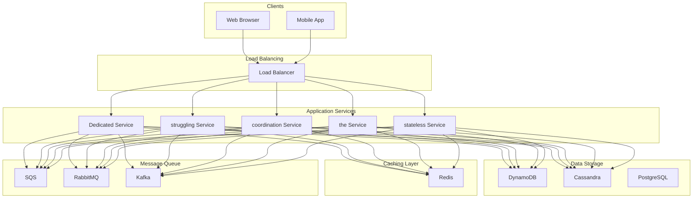
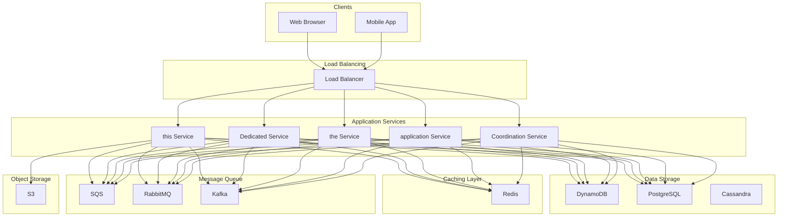
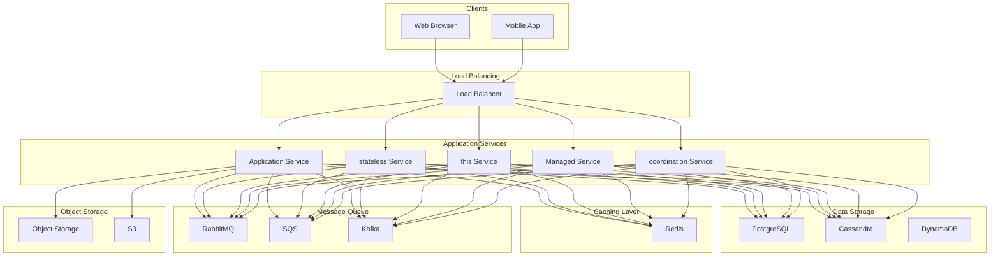

# Design a Distributed Job Scheduler

## What is a Job Scheduler?

A Job Scheduler is a system that manages the execution of tasks at specified times or intervals. Unlike a task queue where jobs are executed immediately upon submission, a job scheduler allows you to define **when** a job should run, whether that's a one-time execution in the future or a recurring pattern like "every day at midnight."
The core idea is to decouple the job definition from its execution. Users define what should run and when, and the scheduler ensures it happens reliably, even across distributed systems where multiple servers need to coordinate to prevent duplicate executions.
**Popular Examples:** [Linux Cron](https://en.wikipedia.org/wiki/Cron), [Kubernetes CronJobs](https://kubernetes.io/docs/concepts/workloads/controllers/cron-jobs/), [Apache Airflow](https://airflow.apache.org/), [AWS EventBridge Scheduler](https://aws.amazon.com/eventbridge/scheduler/), [Quartz Scheduler](http://www.quartz-scheduler.org/)
What makes this interesting from a system design perspective is the distributed coordination challenge. When you have multiple scheduler instances running for high availability (and you should), how do you ensure each job executes exactly once? If Scheduler A and Scheduler B both detect that a job is due at 9:00 AM, you need to prevent them from both executing it. 
This coordination problem, combined with the complexities of time zones, daylight saving, and failure recovery, makes job schedulers a rich topic for system design discussions.
In this article, we will explore the **high-level design of a distributed job scheduler**.
Let's start by clarifying the requirements.
# 1. Clarifying Requirements
Before starting the design, it's important to ask thoughtful questions to uncover hidden assumptions, clarify ambiguities, and define the system's scope more precisely.
Here is an example of how a discussion between the candidate and the interviewer might unfold:
**Candidate:** "What is the expected scale? How many scheduled jobs do we need to support?"
**Interviewer:** "Let's design for 10 million active jobs, with about 1 million job executions per day."
**Candidate:** "What types of schedules should we support? One-time jobs, recurring jobs, or both?"
**Interviewer:** "Both. We need one-time delayed jobs and recurring jobs with cron-like expressions."
**Candidate:** "How precise does the timing need to be? Can jobs be delayed by a few seconds?"
**Interviewer:** "Jobs should execute within a few seconds of their scheduled time. Sub-second precision is not required."
**Candidate:** "What happens if the system is down when a job is scheduled to run? Should we execute missed jobs?"
**Interviewer:** "Yes, we should have a configurable policy for handling missed executions."
**Candidate:** "Do we need to ensure exactly-once execution, or is at-least-once acceptable?"
**Interviewer:** "We must guarantee that a job runs exactly once per scheduled time. Duplicate executions would be problematic."
**Candidate:** "Should users be able to pause, resume, and delete scheduled jobs?"
**Interviewer:** "Yes, full lifecycle management is required."
This conversation reveals several important constraints that will influence our design. Let's formalize these into functional and non-functional requirements.

## 1.1 Functional Requirements
Based on the discussion, here are the core features our system must support:
- **Create Job:** Users can create one-time or recurring jobs with a schedule specification.
- **Job Execution:** Jobs execute at their scheduled times with configurable execution handlers.
- **One-Time Jobs:** Support jobs scheduled for a specific future timestamp.
- **Recurring Schedules:** Support cron-like expressions (e.g., "0 9 * * MON" for every Monday at 9 AM).
- **Job Lifecycle Management:** Users can pause, resume, and delete scheduled jobs.
- **Job Status and History:** Users can query the status and execution history of jobs.
- **Missed Job Handling:** Configurable policy for jobs that miss their scheduled time.

## 1.2 Non-Functional Requirements
Beyond features, we need to consider the qualities that make the system production-ready:
- **High Availability:** The system must be highly available (99.99% uptime).
- **Exactly-Once Execution:** Each job must execute exactly once per scheduled time, even in a distributed environment.
- **Scalability:** Support millions of active jobs across distributed nodes.
- **Low Latency Triggering:** Jobs should be triggered within seconds of their scheduled time.
- **Durability:** Job definitions must not be lost, even during failures.
- **Consistency:** All nodes must agree on which jobs to execute and when.

# 2. Back-of-the-Envelope Estimation
Before diving into the design, let's run some quick calculations to understand the scale we are dealing with. These numbers will guide our architectural decisions, particularly around database selection, queue sizing, and how aggressively we need to optimize the scheduler's polling mechanism.

### 2.1 Traffic Estimates
Starting with the numbers from our requirements discussion:

#### Job Execution Traffic
We have 10 million active jobs with 1 million executions per day. Let's convert this to queries per second (QPS):
But here is an important insight: job executions are rarely uniform throughout the day. Developers love scheduling jobs at "round" times, like midnight, the top of each hour, or 9 AM. This clustering means peak load can be dramatically higher than average:
This clustering is critical for our design. We need to handle bursts where thousands of jobs become due simultaneously.

#### Job Management Operations
Users creating, updating, and deleting jobs is a much smaller volume:

#### Status Queries
Users checking on their jobs, dashboards displaying execution history, monitoring systems polling for failures:

### 2.2 Storage Estimates
Each job needs to store several pieces of information:
| Component | Size | Description |
| --- | --- | --- |
| Job ID | 36 bytes | UUID for unique identification |
| Schedule Expression | 50 bytes | Cron expression or timestamp |
| Handler Configuration | 500 bytes | URL, headers, payload template |
| Metadata | 200 bytes | Status, timestamps, owner ID |

Total per job: approximately **800 bytes**
We also need to store execution history for auditing and debugging:
**Total storage requirement: approximately 14 GB**
This is modest by modern standards. A single PostgreSQL instance can handle this easily, with room to grow. Storage is not our bottleneck.

### 2.3 Key Insights
These estimates reveal several important design implications:
1. **Bursty execution pattern:** The clustering of jobs at popular times means we need to handle significant bursts. Our scheduler cannot just poll lazily; it needs to efficiently process hundreds of jobs that become due in the same second.
2. **Modest storage requirements:** 14 GB is small. We do not need a distributed database for storage capacity. However, we might need read replicas for query performance during bursts.
3. **Low management QPS:** Job creation and updates are infrequent. We do not need to optimize the write path aggressively.
4. **Execution is the hot path:** The scheduler's job scanning and execution triggering will see the most load. This is where we should focus optimization efforts.

# 3. Core APIs
With our requirements and scale understood, let's define the API contract. A job scheduler's API needs to handle job creation with various schedule types, lifecycle management, and status queries. Let's walk through each endpoint.

### 1. Create Job

#### Endpoint: POST /jobs
Creates a new scheduled job.

##### Request Parameters:
- **job_name** _(required)_: Human-readable name for the job.
- **schedule** _(required)_: Schedule specification. Either a cron expression or a timestamp.
- For cron: `{"type": "cron", "expression": "0 9 * * MON"}`
- For one-time: `{"type": "once", "timestamp": "2024-03-15T09:00:00Z"}`
- **handler** _(required)_: What to execute. Either an HTTP endpoint or a message queue topic.
- HTTP: `{"type": "http", "url": "https://api.example.com/process", "method": "POST"}`
- Queue: `{"type": "queue", "topic": "job-executions", "payload": {...}}`
- **timezone** _(optional)_: Timezone for cron expressions. Default: "UTC".
- **retry_policy** _(optional)_: Configuration for retrying failed executions.
- **missed_policy** _(optional)_: What to do if a scheduled time is missed ("skip", "execute_once", "execute_all").
- **metadata** _(optional)_: Custom key-value pairs for organization.

##### Sample Response:

##### Error Cases:
- `400 Bad Request`: Invalid schedule expression or handler configuration.
- `409 Conflict`: Job with the same name already exists for this user.
- `429 Too Many Requests`: Rate limit exceeded.

### 2. Get Job

#### Endpoint: GET /jobs/{job_id}
Retrieves job details and next scheduled execution.

##### Sample Response:

##### Error Cases:
- `404 Not Found`: Job ID does not exist.

### 3. Update Job

#### Endpoint: PUT /jobs/{job_id}
Updates job configuration. The job is paused during the update and resumed afterward.

##### Request Parameters:
Same as Create Job, all fields optional. Only provided fields are updated.

##### Error Cases:
- `404 Not Found`: Job ID does not exist.
- `400 Bad Request`: Invalid schedule expression.
- `409 Conflict`: Job is currently executing.

### 4. Delete Job

#### Endpoint: DELETE /jobs/{job_id}
Deletes a scheduled job. Any running execution completes, but no new executions are scheduled.

##### Sample Response:

### 5. Pause/Resume Job

#### Endpoint: POST /jobs/{job_id}/pause

#### Endpoint: POST /jobs/{job_id}/resume
Pauses or resumes job scheduling. A paused job does not execute until resumed.

##### Sample Response:

### 6. Get Execution History

#### Endpoint: GET /jobs/{job_id}/executions
Returns the execution history for a job.

##### Query Parameters:
- **limit** _(optional)_: Maximum results to return. Default: 20.
- **offset** _(optional)_: Pagination offset.
- **status** _(optional)_: Filter by execution status.

##### Sample Response:
# 4. High-Level Design
Now we get to the interesting part: designing the system architecture. Rather than presenting a complex diagram upfront, we will build the design incrementally, starting with the simplest pieces and adding components as we encounter challenges. This mirrors how you would approach the problem in an interview.
Our job scheduler needs to handle three fundamental operations:
1. **Job Storage:** Accept job definitions from users and store them durably
2. **Job Triggering:** Continuously scan for jobs that are due and initiate their execution
3. **Job Execution:** Actually run the jobs reliably, handling failures and retries

The interesting challenge is not any single operation, but how they work together in a distributed environment. When you have multiple scheduler instances for high availability, you need to ensure each job executes exactly once, not zero times, not twice. This coordination problem is at the heart of our design.
Let's tackle each challenge in turn.

## 4.1 Requirement 1: Job Storage
When a user creates a job, we need to accept the configuration, validate it, compute when the job should first run, and store everything durably. This is the "write path" of our system.

### Components for Job Storage

#### API Gateway
Every request enters through the API Gateway. Think of it as the front door to our system, handling concerns that are common across all requests.
The gateway terminates SSL connections, validates that requests are well-formed, enforces rate limits to prevent abuse, and routes requests to the appropriate backend service. By handling these cross-cutting concerns at the edge, we keep our application services focused on business logic.

#### Job Service
This is the brain of our operation for job management. It orchestrates the entire workflow: validating input, parsing schedule expressions, computing the next execution time, and persisting the job definition.
We want this service to be stateless so we can run multiple instances behind a load balancer. All state lives in the database, making horizontal scaling straightforward.

#### Job Database
Stores everything about jobs: their configurations, schedules, current status, and execution history. This is our source of truth. We need it to be durable (jobs must survive crashes), consistent (all reads see the latest writes), and fast enough to query millions of records efficiently.

### The Create Flow in Action
Let's trace through what happens when a user creates a new job:
Here is what happens step by step:
1. **Request arrives at API Gateway:** The client sends a POST request with the job configuration, including the schedule (cron expression or timestamp) and the handler (what to execute).
2. **Validation:** The gateway validates the request format and checks rate limits. The Job Service performs business-level validation, like ensuring the cron expression is syntactically correct.
3. **Schedule parsing:** For cron jobs, the service parses the expression and computes when the job should first execute. For a job scheduled to run "every Monday at 9 AM," we calculate the next Monday and store that timestamp.
4. **Persistence:** The job is stored in the database with status "active" and the computed `next_execution_time`. This timestamp is critical, as the scheduler will use it to find jobs that are due.
5. **Response:** The service returns the job details, including the next scheduled execution time, so users know when their job will first run.

## 4.2 Requirement 2: Job Triggering
This is the heart of the scheduler. We need to continuously monitor time, identify jobs that are due, and initiate their execution. The challenge is doing this efficiently at scale while ensuring exactly-once execution in a distributed environment.

### Additional Components Needed

#### Scheduler Service
The Scheduler Service is responsible for finding jobs that are due and triggering them. It runs a polling loop: every few seconds, it queries the database for jobs where `next_execution_time <= now()`, claims them, and dispatches them for execution.
We run multiple instances of this service for high availability. If one instance crashes, others continue processing. But this creates a coordination problem: how do we prevent two schedulers from both triggering the same job?

#### Coordination Service
To prevent duplicate executions, we need a way for schedulers to coordinate. When a scheduler wants to execute a job, it first needs to "claim" it, ensuring no other scheduler can also claim it.
We can use a distributed coordination service like ZooKeeper or etcd for this, or we can implement coordination through database-level locking. We will explore both approaches in the deep dive section.

### The Triggering Flow
Here is how the scheduler continuously finds and triggers due jobs:
The scheduler runs a tight loop:
1. **Query for due jobs:** Every few seconds, the scheduler queries the database for jobs where `next_execution_time <= now()`. This query needs to be efficient, so we index on this column.
2. **Claim the job:** Before processing a job, the scheduler attempts to claim it using a lock. Only one scheduler can hold the lock for a given job at a time. If another scheduler already claimed it, we skip and move on.
3. **Dispatch for execution:** Once claimed, the scheduler creates an execution record and enqueues the job to the execution queue. This decouples triggering from actual execution, which is important for reliability.
4. **Update next execution time:** For recurring jobs, we calculate the next occurrence and update the `next_execution_time` field. For one-time jobs, we might mark them as completed or delete them.

The key insight here is that the coordination happens at the job level, not at the scheduler level. Each job can be processed by any scheduler, but only one scheduler will successfully claim and process it for any given execution time.

## 4.3 Requirement 3: Job Execution
Once a job is triggered and sitting in the execution queue, something needs to actually run it. This is where the Executor Service comes in.

### Why Decouple Triggering from Execution?
You might wonder why we do not have the scheduler execute jobs directly. There are several good reasons:
1. **Isolation:** If an HTTP call hangs for 30 seconds, we do not want the scheduler blocked. It should keep processing other jobs.
2. **Scalability:** We can scale executors independently from schedulers. If jobs are slow, add more executors. If we have more jobs to scan, add more schedulers.
3. **Reliability:** If an executor crashes mid-execution, the job remains in the queue (with visibility timeout) and will be retried. No job is lost.
4. **Flexibility:** Different job types might need different executors. CPU-intensive jobs versus I/O-bound jobs can be handled by different worker pools.

### Components for Execution

#### Execution Queue
A message queue (like SQS, Kafka, or RabbitMQ) that buffers triggered jobs. The queue provides durability (jobs survive executor crashes) and load leveling (burst of triggers gets smoothed out).

#### Executor Service
Workers that pull jobs from the queue and perform the actual execution. An executor:
- Pulls a job from the queue
- Executes the configured handler (HTTP call, message publish, etc.)
- Reports the result back
- Handles failures according to the retry policy

### The Execution Flow
Let's trace through a job execution:
Here is what happens step by step:
1. **Pull job from queue:** The executor fetches the next available job. The queue marks it as "in-flight" so other executors do not pick it up.
2. **Execute handler:** Based on the job configuration, the executor performs the action. For HTTP handlers, it makes the configured HTTP request. For queue handlers, it publishes a message.
3. **Handle result:** On success, we update the execution record as completed. On failure, we check the retry policy. If retries remain, we re-enqueue the job with a backoff delay. If we have exhausted retries, we mark it as permanently failed.
4. **Acknowledge or release:** On success, we acknowledge the message (removing it from the queue). On failure with retry, we let the visibility timeout expire or explicitly release it back to the queue.

## 4.4 Putting It All Together
Now that we have designed each piece, let's step back and see the complete architecture. This diagram shows how all the components work together:
The architecture follows a layered approach, with each layer having a specific responsibility:
**Client Layer:** Users interact with our system through web dashboards, direct API calls, or automated pipelines. From our perspective, they are all just HTTP requests.
**Gateway Layer:** The load balancer distributes traffic across API Gateway instances. The gateway handles authentication, rate limiting, and request validation before passing requests to the application layer.
**Application Layer:** The Job Service contains our core business logic for managing jobs. It is stateless and horizontally scalable.
**Scheduling Layer:** Multiple Scheduler Service instances continuously scan for due jobs. They coordinate through ZooKeeper or etcd to prevent duplicate executions. This is the heart of our system.
**Execution Layer:** The execution queue buffers triggered jobs, and executor workers consume them to perform the actual work. This decoupling provides reliability and scalability.
**Storage Layer:** PostgreSQL stores job definitions and execution history. Redis provides fast caching for frequently accessed data.
**External Targets:** The actual destinations our jobs call: HTTP webhooks, message queues, or serverless functions.

### Component Responsibilities
| Component | Primary Responsibility | Scaling Strategy |
| --- | --- | --- |
| Load Balancer | Traffic distribution, health checks | Managed service or active-passive |
| API Gateway | Auth, rate limiting, validation | Horizontal (add instances) |
| Job Service | Job CRUD, lifecycle management | Horizontal (stateless) |
| Scheduler Service | Find and trigger due jobs | Horizontal with coordination |
| Coordination Service | Distributed locking, leader election | 3-5 node cluster (ZK/etcd) |
| Execution Queue | Buffer jobs, ensure delivery | Managed service (SQS) or cluster (Kafka) |
| Executor Service | Execute job handlers | Horizontal (add workers) |
| PostgreSQL | Persistent storage | Read replicas, then sharding |
| Redis | Hot data cache | Redis Cluster |

This architecture handles our requirements well: multiple schedulers provide high availability, the coordination service ensures exactly-once execution, the execution queue provides durability and load leveling, and the stateless services scale horizontally.
# 5. Database Design
With the high-level architecture in place, let's zoom into the data layer. Choosing the right database and designing an efficient schema are critical decisions that affect performance, scalability, and operational complexity.

## 5.1 Choosing the Right Database
The database choice is not always obvious. Let's think through our access patterns and requirements:

#### What we need to store:
- Millions of job definitions with various configurations
- Execution history for auditing and debugging
- Lock state for coordination (if using database-level locking)

#### How we access the data:
- The critical hot path: find all jobs where `next_execution_time <= now()` (scheduler query)
- Point lookups by job_id (user queries)
- Range queries by owner_id (listing a user's jobs)
- Time-range queries on execution history (debugging, analytics)

#### Consistency requirements:
- Strong consistency for job state transitions (cannot have two schedulers both thinking they claimed a job)
- Strong consistency for writes (user should see their job immediately after creation)

Given these requirements, a relational database like PostgreSQL is a strong fit:
1. **Efficient indexing:** The scheduler query needs to efficiently find jobs due now. PostgreSQL's B-tree indexes on `(status, next_execution_time)` make this fast even with millions of rows.
2. **Strong consistency:** We need ACID transactions for atomic job claiming. When a scheduler claims a job, we update its status in a transaction, preventing race conditions.
3. **Flexible querying:** User dashboards need various queries, filter by status, sort by creation time, paginate results. SQL handles this naturally.
4. **Mature operations:** Backups, replication, monitoring, and failover are well-understood with PostgreSQL.

**Could we use NoSQL?** Something like DynamoDB or Cassandra could work, but the varied query patterns (especially the scheduler's time-based query) are more naturally expressed in SQL. The benefits of NoSQL (extreme scale, eventual consistency) do not match our needs.

### Coordination: Database or Dedicated Service?
For distributed locking, we have two options:
1. **Database-level locking:** Use PostgreSQL's row-level locks or atomic updates to claim jobs
2. **External coordination:** Use ZooKeeper or etcd for distributed locks

We will explore both approaches in the deep dive section. For smaller deployments, database locking is simpler. For larger scale, a dedicated coordination service provides better performance.

## 5.2 Database Schema
Our schema needs three main tables: Jobs for storing job definitions, Executions for tracking history, and optionally Job_Locks for database-level coordination.

### Jobs Table
This is the heart of our schema. Each row represents one scheduled job.
| Field | Type | Description |
| --- | --- | --- |
| job_id | UUID (PK) | Unique identifier for the job |
| job_name | VARCHAR(255) | Human-readable name for display |
| owner_id | VARCHAR(100) | User or tenant who owns the job |
| schedule_type | VARCHAR(20) | "cron" for recurring, "once" for one-time |
| schedule_expression | VARCHAR(100) | Cron expression (e.g., "0 9 * * MON") or ISO timestamp |
| timezone | VARCHAR(50) | Timezone for cron evaluation (e.g., "America/New_York") |
| handler_type | VARCHAR(20) | "http", "queue", or "function" |
| handler_config | JSONB | Handler-specific configuration (URL, headers, payload template) |
| status | VARCHAR(20) | "active", "paused", or "deleted" |
| next_execution_time | TIMESTAMP | When the job should next execute (the scheduler's key query field) |
| last_execution_time | TIMESTAMP | When the job last executed (for display and debugging) |
| retry_policy | JSONB | Configuration for handling failures (max attempts, backoff) |
| missed_policy | VARCHAR(20) | "skip", "execute_once", or "execute_all" |
| created_at | TIMESTAMP | Creation timestamp |
| updated_at | TIMESTAMP | Last modification timestamp |

**Critical Index for the Scheduler:**
The scheduler needs to efficiently find jobs that are due. This query runs every few seconds:
To make this fast, we need a composite index:
The partial index (using WHERE clause) keeps the index small by only including active jobs.
**Other Indexes:**

### Executions Table
Stores the history of every job execution. This table grows continuously, so we might archive old records periodically.
| Field | Type | Description |
| --- | --- | --- |
| execution_id | UUID (PK) | Unique identifier for the execution |
| job_id | UUID (FK) | Reference to the job |
| scheduled_time | TIMESTAMP | When the job was supposed to run |
| started_at | TIMESTAMP | When execution actually started |
| completed_at | TIMESTAMP | When execution finished |
| status | VARCHAR(20) | "pending", "running", "success", or "failed" |
| duration_ms | INTEGER | How long execution took |
| attempt | INTEGER | Attempt number (1 for first try, 2 for first retry, etc.) |
| error_message | TEXT | Error details if the execution failed |
| executor_id | VARCHAR(100) | Which executor instance ran this (for debugging) |

**Indexes:**

### Job Locks Table (Optional)
If you are using database-level locking instead of ZooKeeper/etcd, this table tracks which scheduler has claimed each job.
| Field | Type | Description |
| --- | --- | --- |
| job_id | UUID (PK) | Job being locked |
| scheduler_id | VARCHAR(100) | Which scheduler instance holds the lock |
| locked_at | TIMESTAMP | When the lock was acquired |
| expires_at | TIMESTAMP | When the lock automatically expires |

The `expires_at` field is critical for handling scheduler failures. If a scheduler crashes while holding a lock, the lock automatically expires and another scheduler can claim the job.
# 6. Design Deep Dive
The high-level architecture gives us a solid foundation, but system design interviews often go deeper into specific components.
In this section, we will explore the trickiest parts of our design: coordinating distributed schedulers to prevent duplicate executions, handling time zones and cron expressions, dealing with missed jobs, and scaling the system.

## 6.1 Ensuring Exactly-Once Execution
This is the hardest problem in our design. When multiple scheduler instances are scanning for due jobs simultaneously, how do we ensure each job executes exactly once?
Consider this scenario: at 9:00:00 AM, a job becomes due. Scheduler A and Scheduler B both query the database at the same instant, and both see the job as ready for execution. 
Without coordination, both would trigger the job, resulting in duplicate execution. For jobs like "charge customer's credit card," this would be disastrous.
Let's explore three approaches to solving this problem, each with different trade-offs.

### Approach 1: Database-Level Locking
The simplest approach is to use the database itself for coordination. We leverage atomic updates to ensure only one scheduler can claim a job.

#### How It Works:
The key insight is that database updates are serialized. If two schedulers try to update the same row simultaneously, the database ensures only one succeeds.
The WHERE clause is carefully constructed:
- `status = 'active'`: Only claim jobs that are not already being executed
- `next_execution_time <= NOW()`: Only claim jobs that are due
- `locked_by IS NULL OR locked_at < ...`: Handle stale locks from crashed schedulers

If the UPDATE affects one row, this scheduler claimed the job. If zero rows were affected, another scheduler already claimed it, and we skip.
**Pros:**
- Simple to implement, no external coordination service needed
- Strong consistency from database ACID guarantees
- Easy to debug, all state visible in the database
- Works well for smaller deployments

**Cons:**
- Every scheduler polls the database frequently, increasing load
- High contention when many jobs become due simultaneously
- Database becomes the scalability bottleneck

This approach works well when you have 3-5 scheduler instances and moderate job volume. Beyond that, database contention becomes problematic.

### Approach 2: External Coordination Service
For larger deployments, a purpose-built distributed coordination system like ZooKeeper or etcd provides better performance.

#### How It Works:
Each job has a corresponding lock path in ZooKeeper (e.g., `/locks/jobs/{job_id}`). When a scheduler wants to execute a job, it attempts to create an ephemeral node at this path. Only one scheduler succeeds, and it proceeds with execution. The others see the node already exists and skip the job.
The magic is in "ephemeral nodes." If the scheduler that created the node crashes, ZooKeeper automatically deletes the node after a session timeout. This prevents jobs from being permanently locked by dead schedulers.
**Pros:**
- Purpose-built for distributed coordination, highly optimized
- Ephemeral nodes automatically handle scheduler crashes
- Low latency lock operations (single-digit milliseconds)
- Scales better than database locking

**Cons:**
- Additional operational complexity, another cluster to manage
- Requires understanding of ZooKeeper/etcd semantics
- If the coordination service fails, all schedulers are affected

### Approach 3: Partitioned Scheduling
The most scalable approach avoids per-job locking entirely by assigning each scheduler responsibility for a subset of jobs.

#### How It Works:
We partition jobs by hashing their job_id into a fixed number of buckets. Each scheduler is assigned certain partitions and only scans/executes jobs in its assigned partitions.
With this model, there is no race condition because each job has exactly one owner. Scheduler 1 only queries for jobs where `hash(job_id) % 12 IN (0, 1, 2, 3)`.
A coordination service (ZooKeeper/etcd) manages partition assignment. When a scheduler joins or leaves the cluster, partitions are rebalanced. This is similar to how Kafka consumer groups work.
**Pros:**
- No per-job locking overhead
- Horizontally scalable, add more schedulers to handle more jobs
- Predictable, clear ownership model
- Each scheduler has a smaller working set to scan

**Cons:**
- **Rebalancing complexity:** Adding/removing schedulers requires partition reassignment.
- **Hot partitions:** Some partitions may have more jobs than others.
- **Failover delay:** Partition reassignment takes time during failures.

### Which Approach Should You Choose?
| Strategy | Complexity | Scalability | Best For |
| --- | --- | --- | --- |
| Database Locking | Low | ~5 schedulers | Getting started, smaller deployments |
| External Coordination | Medium | ~20 schedulers | When you need HA without complexity |
| Partitioned Scheduling | High | 100+ schedulers | Large scale, millions of jobs |

#### Recommendation
Start with database-level locking. It is simple, requires no additional infrastructure, and works well for most use cases. Only move to partitioned scheduling when you have clear evidence that the database is becoming a bottleneck, likely when you need more than 5-10 scheduler instances.

## 6.2 Schedule Evaluation: Parsing and Computing Next Execution Time
Every time a job executes, we need to compute when it should run next. For one-time jobs, this is trivial, but for recurring jobs with cron expressions, it involves parsing the expression and finding the next matching time. Add timezones and daylight saving time into the mix, and things get complicated quickly.

### Understanding Cron Expressions
The standard cron format has five fields, each specifying a constraint on when the job should run:

#### Common Examples:
| Expression | Meaning |
| --- | --- |
| 0 9 * * * | Every day at 9:00 AM |
| 0 9 * * MON | Every Monday at 9:00 AM |
| */15 * * * * | Every 15 minutes |
| 0 0 1 * * | First day of every month at midnight |
| 0 0 * * 1-5 | Every weekday at midnight |
| 30 4 1,15 * * | 4:30 AM on the 1st and 15th of each month |

### Computing the Next Execution Time
Given a cron expression and the current time, we need to find the next moment that matches all five constraints. The algorithm is conceptually simple but has many edge cases:
1. Start from the current time, rounded up to the next minute
2. Check if the current minute matches the minute constraint. If not, find the next matching minute
3. Repeat for hour, day, month, and weekday
4. Handle rollover: if no matching day exists this month, advance to the next month

The tricky part is the interaction between day-of-month and day-of-week. Standard cron behavior treats them as an OR condition: run if either matches.

### The Timezone Problem
Here is where things get interesting. A user in New York schedules a job for "every day at 9 AM." What UTC time should we store?
The same schedule maps to different UTC times depending on whether daylight saving time is in effect. This means we cannot simply convert the schedule to UTC once, we must recompute after each execution.

#### The DST Edge Cases:
When clocks "spring forward" (e.g., 2:00 AM becomes 3:00 AM):
- A job scheduled for 2:30 AM does not exist that day. What do we do? Most systems skip to 3:00 AM.

When clocks "fall back" (e.g., 2:00 AM happens twice):
- A job scheduled for 2:30 AM could run twice. Most systems run it only on the first occurrence.

**Best Practice: **Store `next_execution_time` in UTC in the database, but also store the user's timezone. After each execution, recompute the next execution time using the timezone-aware schedule and convert to UTC.

### Optimization: Pre-computing Execution Times
Parsing cron expressions is computationally cheap, but for very high-scale systems, you can optimize by pre-computing:
1. When a job is created, compute the next N execution times (e.g., next 10)
2. Store these in a separate table or cache
3. The scheduler queries for pre-computed times, not cron expressions
4. After an execution, compute and store the next batch

This trades storage for compute and moves cron parsing from the hot path (scheduler loop) to the cooler path (job creation/update).

## 6.3 Handling Missed Executions
What happens when the system is down during a scheduled execution time? Or when the scheduler is so overloaded that it cannot process all due jobs in time? These are the missed execution scenarios, and how we handle them depends on the nature of the job.

### Why Do Executions Get Missed?
Several scenarios can cause a job to miss its scheduled time:
1. **System downtime:** The scheduler was down when the job was due. When it comes back up, the job's `next_execution_time` is in the past.
2. **Scheduler overload:** At popular times (midnight, top of the hour), thousands of jobs might become due simultaneously. Some get processed late.
3. **Long-running previous execution:** A recurring job cannot start its 10:00 AM execution because its 9:00 AM execution is still running.
4. **Clock skew:** In rare cases, server clocks drift, causing jobs to be missed or duplicated.

### The Three Policies
Different jobs need different handling when executions are missed. We support three configurable policies:

#### Policy 1: Skip
Simply move on to the next scheduled time. Do not execute the missed run.
When to use this: Jobs where late execution has no value. For example, "send morning news digest at 9 AM" is useless if sent at 3 PM. The user just wants tomorrow's digest at 9 AM.

#### Policy 2: Execute Once
Execute the job once (now), then resume the normal schedule. If multiple executions were missed, we still only run once.
When to use this: Jobs where catching up matters, but running multiple times for multiple misses would be wasteful. For example, a database cleanup job. If we missed three daily runs, we do not need to run cleanup three times, once is enough to catch up.

#### Policy 3: Execute All
Execute the job once for each missed scheduled time, then resume normal schedule.
When to use this: Jobs where every scheduled execution represents independent work that must be done. For example, daily billing calculations where each day's data must be processed separately.
**Caution with Execute All:** If the system was down for a week and we have 1,000 jobs with "execute all" policy, we suddenly need to run 7,000 catch-up executions. This can overwhelm the system. Consider adding a `max_missed_executions` limit.

### Implementation Considerations
When the scheduler detects a job with `next_execution_time` in the past:
1. Check the job's missed policy
2. Apply the policy logic
3. Update `next_execution_time` to the appropriate future time
4. Optionally log the miss for monitoring

A grace period (`missed_tolerance`) can help distinguish between "slightly late" (execute normally) and "truly missed" (apply policy). A job scheduled for 9:00:00 AM that runs at 9:00:05 AM is fine. A job that should have run 2 hours ago is missed.

## 6.4 Job Execution Strategies
When a job reaches the executor, something needs to actually "run" it. But what does running a job mean? It depends on the handler type. The executor might make an HTTP call, publish a message to a queue, or invoke a serverless function. Each has different considerations for reliability and failure handling.

### HTTP Handler Execution
The most common handler type. The executor makes an HTTP request to a configured endpoint, typically a webhook.

#### Key Considerations:
1. **Timeouts are critical.** If the target endpoint hangs, we cannot let the executor wait forever. Set a reasonable timeout (30-60 seconds) and treat timeouts as failures.
2. **The target should be idempotent.** Since we might retry on failure, the endpoint should handle receiving the same job multiple times gracefully. Including a unique `execution_id` in the request helps the target deduplicate.
3. **Define success clearly.** Typically, HTTP 2xx means success, 4xx means permanent failure (do not retry), and 5xx means transient failure (retry).
4. **Authentication.** Support standard mechanisms like API keys in headers, OAuth tokens, or request signing (like AWS Signature V4).

### Message Queue Handler Execution
Instead of calling an HTTP endpoint, publish a message to a queue for downstream processing. This is useful when the actual work is handled by a separate system.

#### Key Considerations:
1. **Delivery guarantees.** The publish should be atomic. If the executor crashes after publishing but before marking the job as executed, we might re-publish. The downstream consumer should handle duplicates.
2. **Message ordering.** If ordering matters, use the job_id as the partition key so all executions of the same job go to the same partition.
3. **Payload size.** Queues often have message size limits (SQS: 256 KB). For large payloads, store the data elsewhere and include a reference in the message.

### Retry Strategy
When execution fails, we do not immediately give up. Transient failures (network blips, temporary overload) often resolve themselves. A good retry strategy balances persistence with avoiding overwhelming a struggling service.

#### Exponential Backoff with Jitter:
For example, with `base_delay = 1 second` and `max_delay = 60 seconds`:
- Attempt 1: wait ~1 second
- Attempt 2: wait ~2 seconds
- Attempt 3: wait ~4 seconds
- Attempt 4: wait ~8 seconds
- ...
- Attempt 7+: wait ~60 seconds (capped)

The random jitter prevents the "thundering herd" problem where many failed jobs all retry at exactly the same moment.

#### Dead Letter Queue:
After exhausting retries, move the job to a dead letter queue for manual investigation. Do not just drop it, operators need visibility into what failed and why.

## 6.5 Scaling the Scheduler
As your job count grows from thousands to millions, the scheduler needs to scale horizontally. The challenge is scaling while maintaining correctness, more scheduler instances should mean more throughput, not more duplicate executions.

### Strategy 1: Add More Scheduler Instances
The most straightforward approach. With proper coordination (using any of the approaches from section 6.1), you can run multiple scheduler instances.

#### Trade-offs:
- With database locking, more instances mean more contention on hot rows
- With partitioning, more instances allow finer-grained partitions
- At some point, the database becomes the bottleneck regardless of scheduler count

### Strategy 2: Tiered Scanning
Here is an insight: not all jobs need millisecond precision. A job scheduled for next week does not need to be scanned every second. We can tier jobs by urgency:

#### How it works:
1. A background process scans the cold tier (database) every 10 minutes, promoting jobs that will be due within an hour to the warm tier
2. Another process scans the warm tier every minute, promoting jobs due within 5 minutes to the hot tier (Redis sorted set)
3. The main scheduler scans only the hot tier every second

This dramatically reduces database load. Instead of scanning 10 million rows every second, we scan a small Redis sorted set. The database only sees infrequent bulk queries.

### Strategy 3: Sharding by Time Window
Assign each scheduler to specific time windows, eliminating coordination overhead:
No locking needed because schedulers query non-overlapping time ranges. The trade-off is less flexibility in scaling, you need to adjust time windows when adding/removing schedulers.

### Database Optimization
The scheduler's critical query runs frequently:
**Index strategy:** Create a partial composite index:
This keeps the index small (only active jobs) and perfectly serves the scheduler query.
**Read replicas:** For read-heavy workloads, schedulers can query replicas. A few seconds of replication lag is acceptable, the scheduler will pick up the job on the next poll.
**Archival:** The executions table grows continuously. Partition it by time and archive old partitions to cold storage. Active queries only need recent data.

## 6.6 Handling Time-Based Edge Cases
Time seems simple until you start building systems that depend on it. In distributed systems, time is surprisingly treacherous. Here are the edge cases you should handle.

### Clock Skew Between Servers
Even with NTP (Network Time Protocol), different servers may have clocks that differ by milliseconds or even seconds.
**The Problem:** Scheduler A at 9:00:01 sees a job due at 9:00:00 as ready. Scheduler B at 8:59:58 does not. They might both try to claim it at slightly different moments, or one might miss it entirely.

#### Solutions:
1. Use database server time (`NOW()`) for all comparisons, not application server time
2. Add a small lookahead buffer (trigger jobs due within the next few seconds)
3. Monitor clock drift across your fleet and alert on excessive skew

### Daylight Saving Time Transitions
Twice a year, many timezones change their UTC offset. This creates ambiguous and non-existent times.
**Spring forward (2:00 AM becomes 3:00 AM):** A job scheduled for 2:30 AM in America/New_York does not exist on the transition day. The clock jumps from 1:59:59 AM directly to 3:00:00 AM.
**Fall back (2:00 AM happens twice):** A job scheduled for 2:30 AM could run twice, once before the clocks change and once after.
**Our recommendation:** Store `next_execution_time` in UTC internally. When computing the next execution time from a cron expression, use a robust timezone library that handles DST transitions correctly. For spring forward, skip to the next valid time. For fall back, run only on the first occurrence.

### Month Boundary Edge Cases
Cron expressions like "run on the 30th of every month" create problems because not every month has 30 days.

#### Options:
1. Skip months that do not have the specified day (user expectation varies)
2. Run on the last day of the month instead
3. Support special syntax like "L" for "last day of month" (common in extended cron)

### Leap Seconds
UTC occasionally adds a leap second to account for Earth's irregular rotation. While rare (about once every few years), this means 23:59:60 can exist.
**For most job schedulers, this is negligible.** Modern operating systems and cloud providers typically handle leap seconds by "smearing" them across a longer period, so your application never sees 23:59:60. Unless you are building systems for GPS synchronization or scientific computing, you can ignore leap seconds.
# Summary
Designing a job scheduler touches on many fundamental distributed systems challenges: coordination without duplication, time handling across timezones, failure recovery, and horizontal scaling. The key design decisions are:
1. **Coordination approach:** Start with database locking for simplicity, move to partitioned scheduling for scale
2. **Decouple triggering from execution:** Use a queue to buffer jobs between the scheduler and executors
3. **Handle time correctly:** Store times in UTC, use proper timezone libraries, plan for DST transitions
4. **Plan for failures:** Configure missed execution policies, implement retry with backoff, use dead letter queues
5. **Scale thoughtfully:** Use tiered scanning to reduce database load, partition jobs for horizontal scaling

The architecture we designed handles millions of jobs with high availability and exactly-once execution semantics. As with any system design, the specific choices depend on your requirements, but the patterns discussed here provide a solid foundation.
# References
- [How Airflow Works](https://airflow.apache.org/docs/apache-airflow/stable/core-concepts/overview.html) - Apache Airflow's architecture documentation, a popular workflow scheduler
- [Quartz Scheduler Documentation](http://www.quartz-scheduler.org/documentation/) - Detailed documentation of a mature Java job scheduling library
- [ZooKeeper Recipes and Solutions](https://zookeeper.apache.org/doc/current/recipes.html) - Distributed coordination patterns including leader election and distributed locks
- [Cron Expression Parser](https://crontab.guru/) - Interactive tool for understanding and validating cron expressions
- [Kubernetes CronJob](https://kubernetes.io/docs/concepts/workloads/controllers/cron-jobs/) - How Kubernetes implements scheduled job execution

# Quiz

## Design Job Scheduler Quiz
Which statement best distinguishes a job scheduler from a task queue?