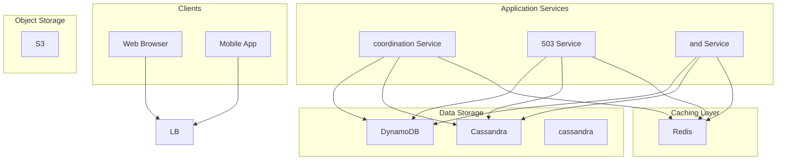

# Design a Distributed Key-Value Store

## What is a Key-Value Store?

A key-value store is a type of non-relational database that stores data as a collection of key-value pairs.
Each unique key maps to a single value, and the store provides fast retrieval based on the key.
The simplicity of this data model makes key-value stores extremely efficient for read and write operations.
They are widely used as caching layers, session stores, and the backbone of distributed systems.
**Popular Examples:** Redis, Amazon DynamoDB
This problem is a common choice in system design interviews because it tests your understanding of distributed systems fundamentals: partitioning, replication, consistency, and failure handling.
In this chapter, we will explore the **high-level design of a distributed key-value store**.
Lets start by clarifying the requirements:

# 1. Clarifying Requirements

Before starting the design, it's important to ask thoughtful questions to uncover hidden assumptions, clarify ambiguities, and define the system's scope more precisely.
Here is an example of how a discussion between the candidate and the interviewer might unfold:
**Candidate:** "What is the expected scale? How many key-value pairs do we need to store?"
**Interviewer:** "The system should store 1 billion key-value pairs with an average size of 10 KB per pair."
**Candidate:** "What is the expected read/write ratio and throughput?"
**Interviewer:** "Assume a 10:1 read-to-write ratio with 100,000 read operations per second at peak."
**Candidate:** "What are the latency requirements for read and write operations?"
**Interviewer:** "Both read and write operations should complete in under 10ms at p99."
**Candidate:** "What consistency model should we support? Strong consistency or eventual consistency?"
**Interviewer:** "We should support tunable consistency, but default to eventual consistency for higher availability."
**Candidate:** "Do we need to support automatic failover and recovery?"
**Interviewer:** "Yes, the system should continue operating even when some nodes fail."
After gathering the details, we can summarize the key system requirements.

## 1.1 Functional Requirements

- **PUT(key, value):** Store a key-value pair in the system.
- **GET(key):** Retrieve the value associated with a given key.
- **DELETE(key):** Remove a key-value pair from the system.
- **Automatic Scaling:** The system should scale horizontally by adding more nodes.

## 1.2 Non-Functional Requirements

- **High Availability:** The system must remain operational even when nodes fail (99.99% uptime).
- **Low Latency:** Read and write operations should complete within 10ms at p99.
- **Scalability:** Should handle 1 billion key-value pairs across distributed nodes.
- **Durability:** Data must not be lost once a write is acknowledged.
- **Tunable Consistency:** Support both strong and eventual consistency based on use case.

# 2. Back-of-the-Envelope Estimation

To understand the scale of our system, let's make some reasonable assumptions.

#### Storage

- Total key-value pairs: **1 billion**
- Average size per pair: **10 KB** (key + value + metadata)
- Total storage = `1,000,000,000 x 10 KB` = **10 TB**

With a replication factor of 3 (standard for fault tolerance):

- Total storage with replication = **30 TB**

#### Reads

- Peak read QPS: **100,000 QPS**
- Read bandwidth = `100,000 x 10 KB` = **1 GB/s**

#### Writes

- Read-to-write ratio: **10:1**
- Peak write QPS = `100,000 / 10` = **10,000 QPS**
- Write bandwidth = `10,000 x 10 KB` = **100 MB/s**

#### Node Estimation

Assuming each node can handle:

- 5,000 read QPS and 1,000 write QPS
- 2 TB storage

Number of nodes needed:

- For throughput: `100,000 / 5,000` = **20 nodes minimum**
- For storage: `30 TB / 2 TB` = **15 nodes minimum**

We need approximately **20-30 nodes** to handle our workload with room for growth.

# 3. Core APIs

The key-value store needs a simple but robust set of APIs. Below are the core APIs required for the basic functionality.

### 1. PUT (Store a Key-Value Pair)

#### Endpoint: PUT /kv/{key}

Stores or updates a value for the given key.

##### Request Parameters:

- **key** *(required)*: The unique identifier for the data (in URL path).
- **value** *(required)*: The data to store (in request body).
- **ttl** *(optional)*: Time-to-live in seconds. If set, the key expires after this duration.
- **consistency** *(optional)*: Desired consistency level (`ONE`, `QUORUM`, `ALL`).

##### Sample Response:

- **status**: Success or failure indicator.
- **version**: Version number of the stored value (for conflict resolution).
- **replicas_written**: Number of replicas that acknowledged the write.

##### Error Cases:

- `400 Bad Request`: If the key or value is invalid (too large, malformed).
- `503 Service Unavailable`: If the required number of replicas is not available.
- `408 Request Timeout`: If the operation exceeds the timeout threshold.

### 2. GET (Retrieve a Value)

#### Endpoint: GET /kv/{key}

Retrieves the value associated with the given key.

##### Request Parameters:

- **key** *(required)*: The unique identifier for the data.
- **consistency** *(optional)*: Desired consistency level for the read.

##### Sample Response:

- **value**: The stored data.
- **version**: Version number of the value.
- **last_modified**: Timestamp of the last update.

##### Error Cases:

- `404 Not Found`: If the key does not exist.
- `503 Service Unavailable`: If the required replicas are not reachable.

### 3. DELETE (Remove a Key-Value Pair)

#### Endpoint: DELETE /kv/{key}

Removes the key-value pair from the store.

##### Request Parameters:

- **key** *(required)*: The unique identifier to delete.

##### Sample Response:

- **status**: Success or failure indicator.

##### Error Cases:

- `404 Not Found`: If the key does not exist.
- `503 Service Unavailable`: If the required replicas are not available for the delete operation.

# 4. High-Level Design

At a high level, our distributed key-value store must satisfy several core requirements:

1. **Data Distribution:** Partition data across multiple nodes to handle large datasets.

2. **Fault Tolerance:** Replicate data to survive node failures.

3. **Request Routing:** Direct client requests to the correct node(s).

Instead of presenting the full architecture at once, we'll build it incrementally by addressing one requirement at a time.
This approach is easier to follow and mirrors how you would explain the design in an interview.

With 10 TB of data, we cannot store everything on a single node. We need to partition (shard) the data across multiple nodes.

### Components Needed

#### Coordinator Node

The coordinator receives client requests and routes them to the appropriate storage nodes.
**Responsibilities:**
- Accept client requests (GET, PUT, DELETE)
- Determine which nodes hold the requested key
- Forward requests to those nodes and aggregate responses

#### Storage Nodes

Storage nodes hold the actual key-value data for their assigned partition.
**Responsibilities:**
- Store and retrieve key-value pairs
- Handle replication with peer nodes
- Report health status to the cluster

### Flow: Writing a Key-Value Pair

1. Client sends a `PUT /kv/user:123` request with the value.

2. The **Coordinator** hashes the key to determine which partition it belongs to.

3. The Coordinator identifies the nodes responsible for that partition.

4. The request is forwarded to those **Storage Nodes**.

5. Once enough replicas acknowledge the write, the Coordinator returns success to the client.

    S3 --> CacheRedis

## 4.2 Requirement 2: Fault Tolerance via Replication

A single copy of data is vulnerable to node failures. We need to replicate each key-value pair across multiple nodes.

### Replication Strategy

For a replication factor of N (typically 3), each key-value pair is stored on N different nodes.
**How Replicas Are Chosen:**
- Using consistent hashing (covered in Deep Dive), each key maps to a primary node
- The next N-1 nodes clockwise on the hash ring become replica nodes

### Flow: Reading with Replication

1. Client sends a `GET /kv/user:123` request.

2. The **Coordinator** identifies all replica nodes for the key.

3. Depending on the consistency level:

4. If responses differ, the coordinator resolves conflicts (version-based).

5. Return the value to the client.

## 4.3 Putting It All Together

The complete architecture combines data distribution and replication with additional components for coordination.

### Core Components Summary

| Component | Purpose |
| --- | --- |
| Client | Applications that read/write key-value pairs |
| Coordinator | Routes requests to correct nodes, aggregates responses |
| Storage Nodes | Store key-value pairs, participate in replication |
| Hash Ring | Determines data placement using consistent hashing |

# 5. Database Design

## 5.1 Storage Engine Selection

For a key-value store, the storage engine is critical. Let's consider the options:
**Requirements:**
- Fast point lookups by key
- Efficient writes (append-mostly workload)
- Support for range scans (optional)
- Durability (data survives restarts)

**Options:**

| Engine Type | Examples | Pros | Cons |
| --- | --- | --- | --- |
| LSM Tree | LevelDB, RocksDB | Fast writes, space efficient | Read amplification |
| B-Tree | InnoDB, BoltDB | Fast reads, range queries | Write amplification |
| Hash Index | Bitcask | O(1) reads/writes | No range queries, memory bound |

**Recommendation:** Use an **LSM-tree based engine** like RocksDB. It provides excellent write performance, which is critical for handling high write throughput, and offers good read performance with bloom filters.

## 5.2 Data Schema

Each storage node maintains the following data structures:

#### 1. Key-Value Data

| Field | Type | Description |
| --- | --- | --- |
| key | String (PK) | Unique identifier for the data |
| value | Blob | The actual data stored |
| version | Integer | Version number for conflict resolution |
| timestamp | Long | Unix timestamp of last modification |
| ttl | Integer | Time-to-live in seconds (0 = no expiry) |
| checksum | String | Hash of value for integrity verification |

#### 2. Cluster Metadata

Stored in a coordination service (ZooKeeper/etcd):

| Field | Type | Description |
| --- | --- | --- |
| node_id | String (PK) | Unique identifier for each node |
| ip_address | String | Network address of the node |
| status | Enum | ALIVE, DEAD, LEAVING, JOINING |
| token_ranges | List | Hash ranges this node is responsible for |
| last_heartbeat | Timestamp | Last time this node was seen alive |

# 6. Design Deep Dive

Now that we have the high-level architecture in place, let's dive deeper into some critical design choices.

## 6.1 Data Partitioning with Consistent Hashing

Data partitioning is fundamental to any distributed key-value store. We need to decide which node stores which keys.

### The Problem with Simple Hashing

A naive approach is modular hashing: `node = hash(key) % N` where N is the number of nodes.
**Problem:** When N changes (node added or removed), almost all keys need to be remapped. This causes massive data movement and service disruption.

### Consistent Hashing Solution

Consistent hashing minimizes data movement when the cluster membership changes.

#### How It Works

##### 1. Create a Hash Ring

Imagine a ring of hash values from 0 to 2^32-1 (using a 32-bit hash function).

##### 2. Place Nodes on the Ring

Each node is hashed to a position on the ring using its identifier (IP address or node ID).

##### 3. Map Keys to Nodes

To find which node stores a key:

1. Hash the key to get a position on the ring

2. Walk clockwise until you find the first node

3. That node is responsible for the key

##### 4. Handle Node Additions/Removals

When a node is added:

- Only keys that would map to the new node need to move
- On average, only K/N keys are remapped (K = total keys, N = nodes)

When a node is removed:

- Its keys are redistributed to the next node clockwise

#### Virtual Nodes (VNodes)

A problem with basic consistent hashing is uneven load distribution. If nodes are not evenly spread on the ring, some nodes get more keys than others.
**Solution:** Each physical node creates multiple "virtual nodes" at different positions on the ring.
**Benefits:**
- More even distribution of keys
- When a node fails, its load is spread across many nodes (not just one)
- Heterogeneous hardware can have more or fewer virtual nodes based on capacity

**Trade-off:** More virtual nodes increase metadata size and lookup complexity.

#### Summary

| Aspect | Simple Hash | Consistent Hash |
| --- | --- | --- |
| Data movement on node change | ~100% of keys | ~K/N keys |
| Load balancing | Poor | Good (with VNodes) |
| Implementation complexity | Simple | Moderate |
| Metadata overhead | Minimal | Higher (VNode positions) |

## 6.2 Replication and Consistency

Replication provides fault tolerance but introduces consistency challenges. Let's explore the trade-offs.

### Replication Strategy

For a replication factor of N, each key is stored on N nodes. The question is: which N nodes?

#### Replica Placement

Using consistent hashing, replicas are placed on the N consecutive nodes clockwise from the key's position.
**Improvement for Fault Tolerance:** Ensure replicas are in different racks or data centers. Skip nodes in the same rack when selecting replicas.

### Consistency Levels

The CAP theorem tells us we cannot have perfect consistency and availability during network partitions. We offer tunable consistency so applications can choose their trade-off.

#### Write Consistency (W)

The number of replicas that must acknowledge a write before success is returned.

| Level | Behavior | Trade-off |
| --- | --- | --- |
| W=1 | Return success after 1 replica acknowledges | Lowest latency, risk of data loss |
| W=QUORUM | Wait for majority (N/2 + 1) | Balance of speed and safety |
| W=ALL | Wait for all N replicas | Highest durability, highest latency |

#### Read Consistency (R)

The number of replicas that must respond to a read.

| Level | Behavior | Trade-off |
| --- | --- | --- |
| R=1 | Return first response | Fastest, may return stale data |
| R=QUORUM | Wait for majority | May return stale data occasionally |
| R=ALL | Wait for all replicas | Always returns latest, slower |

#### Strong Consistency Formula

To guarantee strong consistency (always read what was last written):
**R + W > N**

For N=3:

- R=2, W=2 (QUORUM for both) guarantees at least one node has the latest value
- R=1, W=3 also works (write to all, read from one)

### Conflict Resolution

With eventual consistency, concurrent writes to different replicas can create conflicts.

#### Last-Write-Wins (LWW)

Each write includes a timestamp. The value with the highest timestamp wins.
**Pros:** Simple, deterministic**Cons:** Can lose data if clocks are skewed, arbitrary choice between concurrent writes

#### Vector Clocks

A more sophisticated approach that tracks causality between writes.
**How It Works:**

1. Each node maintains a vector of counters, one per node

2. When a node writes, it increments its own counter

3. When nodes sync, they merge vectors by taking max of each counter

4. Concurrent writes are detected when neither vector dominates the other

**Example:**
**Pros:** Detects true conflicts, preserves causality**Cons:** Vector size grows with cluster size, client must resolve conflicts

#### Recommendation

For most use cases, **LWW with synchronized clocks (NTP)** is sufficient. Use vector clocks when conflict detection is critical (collaborative applications, shopping carts).

## 6.3 Handling Failures

In a distributed system, failures are inevitable. Our key-value store must detect failures and continue operating.

### Failure Detection

How do we know when a node has failed?

#### Heartbeat Mechanism

Each node periodically sends heartbeat messages to a central coordinator or to peer nodes.
**Problem:** Centralized heartbeat creates a single point of failure.

#### Gossip Protocol

A decentralized failure detection mechanism where nodes randomly exchange state with peers.
**How It Works:**

1. Each node maintains a list of other nodes with their status and heartbeat counters

2. Periodically (every second), each node picks a random peer and exchanges membership lists

3. If a node's heartbeat counter hasn't increased after a threshold (e.g., 10 seconds), it's marked as suspected

4. After longer timeout (e.g., 30 seconds), it's marked as dead

**Benefits:**
- No single point of failure
- Scales well (each node only talks to a few peers)
- Eventually consistent view of cluster state

**Trade-off:** Takes time for failure information to propagate (O(log N) rounds).

### Handling Temporary Failures: Sloppy Quorum and Hinted Handoff

When a node is temporarily unavailable, we don't want writes to fail.

#### Sloppy Quorum

Instead of requiring writes to go to the designated replicas, accept writes on any N healthy nodes from a larger set (W + H healthy nodes).
**Example:** Key X normally maps to nodes [A, B, C]. Node C is down. Instead of failing, write to node D as a temporary holder.

#### Hinted Handoff

When a node accepts data on behalf of another:

1. Store the data with a "hint" indicating the intended recipient

2. Periodically check if the intended node is back online

3. When it recovers, transfer the data and delete the hint

**Benefit:** Maintains availability during temporary failures**Trade-off:** The hint storage adds overhead, and recovery adds latency

### Handling Permanent Failures: Anti-Entropy with Merkle Trees

For permanent failures or data corruption, we need a mechanism to detect and repair inconsistencies.

#### Merkle Trees

A Merkle tree is a hash tree where:

- Leaf nodes contain hashes of individual key-value pairs
- Parent nodes contain hashes of their children
- The root hash represents the entire dataset

#### How Anti-Entropy Works

1. Each node builds a Merkle tree for its data partitions

2. To compare data between nodes, compare root hashes

3. If roots differ, recursively compare child nodes to find divergent branches

4. Only sync the keys in divergent leaf nodes

**Benefit:** Comparing entire datasets requires only O(log N) hash comparisons instead of comparing every key.

## 6.4 Read Repair and Consistency

Even with replication, replicas can drift out of sync. Read repair helps maintain consistency during normal operations.

### How Read Repair Works

1. Client requests a key with R=QUORUM (read from multiple replicas)

2. Coordinator compares versions from all responding replicas

3. If versions differ:

### Active vs. Passive Anti-Entropy

| Type | When It Runs | Mechanism |
| --- | --- | --- |
| Read Repair | During reads | Repair stale replicas opportunistically |
| Merkle Tree Sync | Background | Periodic comparison and full sync |
| Hinted Handoff | After recovery | Transfer data held during outage |

**Best Practice:** Use all three mechanisms for comprehensive consistency:
- Read repair catches frequently-accessed keys
- Merkle trees catch rarely-accessed keys
- Hinted handoff handles recovery after failures

## 6.5 Write Path Optimization

For high write throughput, we need an efficient write path.

### Write-Ahead Log (WAL)

Before applying a write to the main storage, append it to a sequential log file.
**Benefits:**
- Sequential writes are fast (no random I/O)
- Durability: crash recovery replays the log
- Reduces latency: return success immediately after log write

### In-Memory Buffer (MemTable)

After logging, write to an in-memory sorted structure (like a skip list or red-black tree).
**Benefits:**
- Writes are extremely fast (memory speed)
- Maintains sorted order for efficient reads and compaction

### Flush to SSTable

When the MemTable reaches a threshold size (e.g., 64 MB):

1. Write it to disk as an immutable Sorted String Table (SSTable)

2. Create a new empty MemTable for incoming writes

### Compaction

Over time, multiple SSTables accumulate. Compaction merges them to:

- Remove deleted/overwritten keys
- Reduce read amplification (fewer files to check)
- Reclaim disk space

**Compaction Strategies:**
- **Size-Tiered:** Group SSTables by size, merge similar-sized tables
- **Leveled:** Organize SSTables into levels, more aggressive space management

## 6.6 Read Path Optimization

Reads must check multiple data structures. Here's how to optimize.

### Read Path Order

1. **MemTable:** Check if key is in memory (fastest)

2. **Bloom Filters:** For each SSTable, check bloom filter to skip files that definitely don't have the key

3. **SSTable Index:** Use sparse index to find the block containing the key

4. **SSTable Data:** Read and decompress the data block

### Bloom Filters

A probabilistic data structure that answers "is key X in this SSTable?"
**Properties:**
- False positives possible (says yes, but key isn't there)
- No false negatives (if it says no, key definitely isn't there)
- Very space efficient (10 bits per key for 1% false positive rate)

**Benefit:** Avoids unnecessary disk reads for keys that don't exist in an SSTable.

### Caching

Multiple cache layers improve read performance:

| Cache | Content | Hit Rate |
| --- | --- | --- |
| Row Cache | Full key-value pairs | Highest value for hot keys |
| Block Cache | SSTable data blocks | Good for range queries |
| Key Cache | SSTable index entries | Speeds up key lookups |

## Summary

Designing a distributed key-value store requires balancing several trade-offs:

| Aspect | Trade-off |
| --- | --- |
| Consistency vs. Availability | Tunable via quorum settings (R, W, N) |
| Write vs. Read Performance | LSM trees favor writes, add bloom filters for reads |
| Memory vs. Durability | WAL provides durability, MemTable provides speed |
| Simplicity vs. Correctness | LWW is simple but may lose data, vector clocks preserve causality |

The key insight for interviews is that there's no perfect solution. Strong candidates explain the trade-offs and choose appropriate techniques based on requirements.

## References

- [Dynamo: Amazon's Highly Available Key-value Store](https://www.allthingsdistributed.com/files/amazon-dynamo-sosp2007.pdf) - The foundational paper on distributed key-value stores
- [Cassandra Architecture Documentation](https://cassandra.apache.org/doc/latest/cassandra/architecture/) - Real-world implementation of these concepts
- [Designing Data-Intensive Applications by Martin Kleppmann](https://dataintensive.net/) - Chapter 5 covers replication, Chapter 6 covers partitioning
- [Consistent Hashing and Random Trees](https://www.cs.princeton.edu/courses/archive/fall09/cos518/papers/chash.pdf) - Original consistent hashing paper
- [The Log-Structured Merge-Tree (LSM-Tree)](https://www.cs.umb.edu/~pon) - Original LSM-tree paper

# Quiz

## Design Key-Value Store Quiz

In a distributed key-value store, what is the primary purpose of partitioning (sharding) the keyspace?