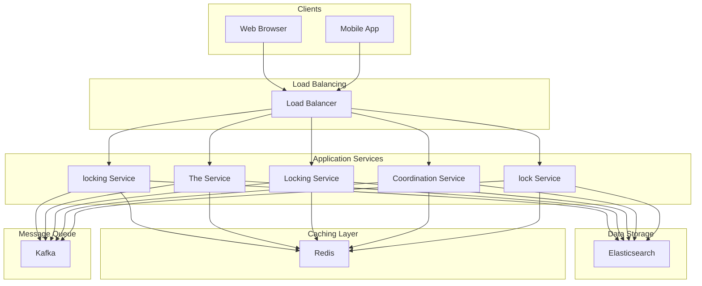

# Design Distributed Locking Service

A **Distributed Locking Service** is a coordination mechanism used in **distributed systems** to ensure that **only one process or node at a time can access or modify a shared resource,** even when that resource is spread across multiple machines or data centers.
In large-scale systems, this is essential to maintain **consistency** and **prevent conflicts** when multiple components operate concurrently.
Distributed locking is crucial for scenarios such as:
- **Job schedulers:** preventing the same job from running multiple times.
- **Database writes:** avoiding race conditions during concurrent updates.
- **Shared file systems:** ensuring only one node updates a file at a time.
- **Distributed transactions:** enforcing exclusive access to critical resources.

In this chapter, we’ll explore how to **design a Distributed Locking Service** discussing multiple design approaches used in real-world systems.
Lets start by clarifying the requirements.
# 1. Clarifying Requirements
A system design interview should always start with a conversation to scope the problem. Here’s an example of how a candidate–interviewer discussion might flow:
**Interviewer:** "Let's design a distributed locking service"
**Candidate:** "Okay. The primary goal is to provide mutual exclusion. A client should be able to `acquire` a lock for a specific resource, and no other client should be able to acquire the same lock until it's `released`. What happens if a client acquires a lock and then crashes?"
**Interviewer:** "That's a critical point. The system must handle that. A crashed client can't hold a lock indefinitely."
**Candidate:** "That implies locks must have a **timeout** or a **lease**. We should also consider high availability and fault tolerance. The lock service itself can't be a single point of failure."
After gathering the details, we can summarize the key system requirements.

### 1.1 Functional Requirements
- **Acquire Lock:** A client can request a lock on a resource. The call should be blocking or return immediately if the lock is unavailable.
- **Release Lock:** A client can explicitly release a lock it holds.
- **Lock with TTL (Lease):** Locks must have an associated Time-to-Live (TTL) to prevent deadlocks from client crashes. The lock is automatically released after the TTL expires.
- **Lock Renewal:** A client holding a lock should be able to extend its lease.

### 1.2 Non-Functional Requirements
- **High Availability:** The service must remain operational even if some of its nodes fail.
- **Correctness:** Under no circumstances should two clients believe they hold the same lock.
- **Low Latency:** Acquiring and releasing locks should be fast.
- **Deadlock Freedom:** The system should never enter a state where locks can’t be acquired again.

# 2. Key Challenges and Design Goals

### Challenges
Building a correct distributed locking service is notoriously difficult due to the inherent challenges of distributed systems.
- **Network Partitions:** The network can split, isolating nodes. During a partition, two different parts of the cluster might think the other has failed, potentially leading to two clients being granted the same lock (split-brain).
- **Process Crashes:** A client holding a lock can crash. The system must have a way to detect this and release the lock.
- **Clock Drift:** Nodes' clocks are never perfectly synchronized. Relying on timestamps for lease expiration can be risky if clocks drift significantly.
- **Race Conditions:** Multiple clients might try to acquire a lock at the exact same moment. The service must serialize these requests correctly.

#### Example
Lets say, the system has two lock nodes, `Lock Node 1` and `Lock Node 2`, that coordinate with each other to maintain a consistent lock state across the cluster. When **Client A** acquires a lock through `Lock Node 1`, all nodes agree that the resource is locked, preventing others from acquiring it.
Due to a network failure, **Partition A** and **Partition B** lose communication. The cluster is now divided into two isolated groups that can’t exchange state or heartbeat messages.
In **Partition A**, `Lock Node 1` still believes Client A holds the lock.  Meanwhile, in **Partition B**, `Lock Node 2` doesn’t see Client A’s lock and may allow **Client B** to acquire the same lock.
This results in **two clients holding the same lock simultaneously**, violating **mutual exclusion**. This situation is known as a **split-brain scenario**.
If not designed carefully, a temporary network glitch can cause **data corruption**, **double updates**, or **duplicate job executions**.

### Design Goals
To overcome above challenges, our design must prioritize four key goals:
1. **Safety (Correctness):** At any given moment, only one client can hold a lock for a given resource.
2. **Liveness (Deadlock Freedom):** All clients must eventually be able to acquire a lock (as long as it's not held forever). A crashed client must not be able to hold a lock indefinitely.
3. **Fault Tolerance:** The service must remain available and correct as long as a majority of its servers are running and can communicate.

# 3. API Design
The Distributed Locking Service provides three core REST endpoints to manage locks: **acquire**, **release**, and **renew**. Each endpoint ensures safe coordination among distributed clients.

### 1. Acquire Lock
**Method:** `POST /locks/{resource_id}`
**Request Body:**
**Response:**
- `200 OK` with a lock token if the lock is successfully acquired: `{ "lock_token": "..." }`
- `409 Conflict` if the resource is already locked by another client.

This API is used to obtain a lock on a shared resource for a specified duration (`ttl_ms`). If another client already holds the lock, the request will fail gracefully.

### 2. Release Lock
**Method:** `DELETE /locks/{resource_id}`
**Request Body:**
**Response:**
- `204 No Content`

This endpoint releases the lock if the client currently holds it, allowing other clients to acquire the same resource safely.

### 3. Renew Lock
**Method:** `PUT /locks/{resource_id}`
**Request Body:**
**Response:**
- `200 OK`

The renew API extends the lock’s time-to-live (TTL), preventing it from expiring while the client continues to perform work.
# 4. High-Level Architecture
On a high level, our distributed locking service consists of following components.
Our system consists of a cluster of lock service nodes that clients interact with via an SDK. The cluster uses a con

sensus algorithm to maintain a consistent state in a persistent store.

### Core Components

#### 1. Clients (SDK)
Clients are the applications that request to acquire, release, or renew locks. Instead of calling raw HTTP APIs directly, applications use a **client SDK** that abstracts away the complexity of:
- Retrying failed requests
- Renewing locks periodically
- Handling transient network issues
- Implementing exponential backoff and jitter

This ensures a simpler, more reliable integration with the locking system while keeping client logic lightweight.

#### 2. Load Balancer
The load balancer acts as the entry point to the system. It routes incoming requests from clients to available **Coordinator Nodes** based on health checks and routing logic.
- Ensures **even distribution** of load.
- Automatically reroutes requests if a node becomes unavailable.
- Can use **consistent hashing** on `resource_id` to improve cache locality and minimize lock contention across nodes.

#### 3. Coordinator Nodes
Coordinator nodes form the **core of the locking cluster**. Each node:
- Accepts client requests (via REST or gRPC).
- Validates lock ownership and token correctness.
- Persists lock metadata in the underlying consensus-based store.
- Implements TTL expiration and fencing token logic.

The cluster ensures that even if one node fails, others continue serving requests — eliminating single points of failure.

#### 4. Consensus Protocol
This is the **brain** of the system. The coordinator nodes use a **consensus algorithm** (such as Raft, Paxos, or Zab in ZooKeeper) to maintain a consistent view of lock states across replicas.
- Guarantees **linearizability** — all nodes agree on the order of lock operations.
- Prevents **split-brain scenarios** during network partitions.
- Automatically elects a new leader if the current one fails, maintaining availability.

This ensures that at any given moment, only one client holds a valid lock for a resource — the foundation of mutual exclusion.

#### 5. Metadata Store
The metadata store (often built on top of the consensus layer) keeps persistent information about each active lock, such as:
Typically, this store:
- Lives in-memory for fast access but persists to disk for durability.
- Automatically expires locks whose TTL has elapsed.
- Supports atomic compare-and-set (CAS) operations to ensure safe lock acquisition.

### Typical Workflow

#### 🔐 Acquire Lock
1. The client calls `acquire(resource_id, ttl_ms)`.
2. The coordinator node generates a unique `lock_token` and attempts an **atomic insert** in the metadata store.
3. If successful, the client receives the token — meaning it owns the lock.
4. If the resource is already locked, the service returns a **409 Conflict** or retries based on client policy.

#### 🕰️ tryAcquire with Timeout
1. The client calls `tryAcquire(resource_id, timeout_ms)`.
2. The SDK keeps retrying lock acquisition until either:
3. This is useful for non-blocking operations or batch jobs that can proceed without exclusive access if necessary.

#### 🔓 Release Lock
- The client sends `release(resource_id, lock_token)`.
- The coordinator verifies that the token matches the current lock owner.
- If valid, it removes the lock entry from the metadata store, freeing it for others.
- If invalid (e.g., stale token), the release is ignored to prevent accidental unlocks.

# 5. Detailed Design
There are several popular ways to build a distributed locking service, each with different trade-offs.

## Approach 1: Database-Based Locking
This is the simplest and most accessible approach. It leverages a relational database to act as the source of truth for lock ownership.

#### How It Works
You maintain a `locks` table with a unique primary key on the resource name.
A client attempts to acquire a lock by inserting a row.
The `INSERT ... ON CONFLICT DO NOTHING` command ensures atomicity; only the first client to insert the key will succeed. A TTL is managed via an `expires_at` timestamp.
To release the lock, the client simply attempts to delete the row.
The `WHERE` clause ensures that only the rightful owner can release the lock.
Each row in the table represents a lock on a specific resource.** **If the lock already exists, concurrent insert attempts will fail gracefully.
An expiration column (`expires_at`) ensures stale locks are automatically released after a defined TTL.

#### Pros:
- Extremely **simple to implement**.
- Leverages **transactional safety** of relational databases.
- **No new infrastructure** required. Works with your existing DB.

#### Cons:
- **Poor scalability** under high concurrency (DB becomes a bottleneck).
- **Not optimized** for low-latency or distributed environments.
- Requires **manual cleanup** of stale locks if TTL logic is not carefully managed.

#### Best Fit
**Adequate for low-concurrency tasks.** This approach is a reasonable choice for internal tools, background cron jobs, or simple systems where performance and high availability are not primary concerns.

## Approach 2: Redis-Based Locks
Redis is an **in-memory key-value store** known for its speed and atomic operations. It’s a natural choice for distributed locks, offering microsecond-level latency and built-in TTLs.
The core of Redis-based locking is a single, powerful command: 
`SET key value [NX] [PX milliseconds]`
- `key`: The name of the lock (e.g., `lock:resource1`).
- `value`: A unique, random string (a **lock token**) to identify the owner.
- `NX`: "Set if Not eXists." This ensures the operation is atomic—it only succeeds if the lock doesn't already exist.
- `PX milliseconds`: A built-in TTL that tells Redis to automatically delete the key after a set duration, preventing permanent deadlocks.

#### Acquire
A client generates a **unique token** (UUID) and runs:
- Returns `OK` → Lock acquired successfully.
- Returns `NULL` → Lock already held; client retries after a delay (with **exponential backoff**).

#### Release (The Tricky Part)
You **must not** simply delete the key, because of this failure scenario:
1. Client A acquires the lock.
2. Client A pauses (e.g., GC pause) beyond the TTL.
3. Redis expires the key; Client B acquires the lock.
4. Client A resumes and executes `DEL my_lock_name` → accidentally deletes **Client B’s lock**.

The solution is to use a **Lua script** to perform an atomic "check-and-delete," ensuring a client only deletes the lock if it is still the owner.
This ensures that the lock is only deleted if the stored token matches the client’s token guaranteeing safe ownership checks.

#### Pros
- **Simple** and easy to implement.
- **Extremely fast.** Ideal for latency-sensitive systems.
- Built-in **TTL** avoids deadlocks and stale locks.

#### Cons
- **Single-node Redis** is a single point of failure unless you run Redis Sentinel or Cluster.
- **Not strictly safe** in distributed environments (clock drift, partial failures).
- **Limited fault tolerance** unless extended with quorum-based locking (see Redlock).

#### Best Fit
Great for **non-critical coordination tasks**, **cache invalidation**, or **job deduplication** where eventual consistency is acceptable.

### Approach 2.1: The Redlock Algorithm (Redis + Quorum)
To improve safety and avoid a single point of failure, **Salvatore Sanfilippo** (creator of Redis) proposed **Redlock**, a distributed version of Redis-based locking.

#### How It Works
1. Deploy **N Redis nodes** (usually 5).
2. A client tries to acquire the lock on **a majority (N/2 + 1)** of them within a short time window (e.g., 50 ms).
3. If quorum is reached, the client considers the lock acquired.
4. On failure, it releases the lock on any nodes where it succeeded.

This approach mitigates issues caused by node crashes or network partitions since a lock is only valid if most replicas agree.

#### Pros
- Better **fault tolerance** than single-node Redis.
- **Low-latency** and **simple to implement**.
- Resilient against partial failures.

#### Cons
- **Complex** to implement correctly.
- **Safety guarantees are debated** (see Martin Kleppmann’s critique).
- Requires careful time synchronization and clock drift handling.

#### Best Fit
Useful when you already rely on Redis but need **higher availability and stronger consistency**.

## Approach 3: ZooKeeper Based Locking
Coordination services like ZooKeeper and etcd are built on **consensus algorithms** (Zab and Raft, respectively) and are designed from the ground up for consistency and fault tolerance.
They are the gold standard for critical locking scenarios.

### How it Works (Using ZooKeeper)
1. A client attempts to create an **ephemeral, sequential znode** under a parent lock path (e.g., `/locks/resource1/lock-`).
2. The znode is **ephemeral**, meaning it's automatically deleted if the client disconnects, solving the crashed client problem perfectly.
3. The znode is **sequential**, so ZooKeeper appends a unique, monotonically increasing number (e.g., `lock-00001`, `lock-00002`).
4. The client with the **lowest sequence number** owns the lock.
5. All other clients "watch" for the deletion of the znode immediately preceding theirs. When it's deleted, they are notified and can check if they are now the new lock holder. This "watch" mechanism avoids a thundering herd of clients polling constantly.

#### Release
The client simply deletes its ephemeral znode — instantly freeing the lock for the next waiting client.

#### Pros
- **Strong consistency** (CAP = CP).
- Automatic cleanup of **crashed or disconnected clients**.
- Built-in fairness and ordering.
- Ideal for distributed coordination (leader election, configuration, etc.).

#### Cons
- **Higher latency** than Redis.
- Requires running and maintaining a **ZooKeeper or etcd cluster**.
- **Lower throughput** due to consensus overhead.

#### Best Fit
Perfect for **high-stakes coordination** tasks — distributed databases, transaction managers, or leader election where correctness and consistency matter more than raw speed.
# 6. Summary
Designing a distributed locking service is a journey through the fundamental trade-offs of distributed systems. It forces you to confront challenges like network partitions, node failures, and clock drift head-on.
When designing a distributed lock, **the “right” approach depends on your priorities:**
- If you need **simplicity**, use the **database-based** model.
- If you need **speed**, use **Redis** (or Redlock).
- If you need **strong correctness**, use **ZooKeeper** or **etcd**.

Most production-grade systems today (like Kafka, Hadoop, Kubernetes, and Elasticsearch) rely on **ZooKeeper** or **etcd-style** approaches because correctness in distributed coordination is non-negotiable.
# Quiz

## Design Locking Service Quiz
What is the primary purpose of a distributed locking service?