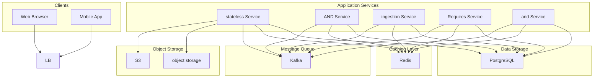

# Design Monitoring and Alerting System

## What is a Monitoring and Alerting System?

A **Monitoring and Alerting System** continuously collects metrics and logs from applications, servers, and infrastructure components. It analyzes this data to detect performance issues, errors, or anomalies and promptly notifies the appropriate teams so they can take action before users are impacted.
Popular tools that implement these ideas include **Prometheus**, **Datadog**, and **Nagios**.
In this chapter, we'll explore the **high-level design **of such a system including how it works, the key components involved, and the architecture behind real-time detection and alerting.
Let’s start by clarifying the requirements.
# 1. Clarifying Requirements
Before diving into the design, let's narrow down the scope of the problem. Here’s an example of how a discussion between candidate and interviewer might flow:
**Candidate:** "Should the system support both metrics and logs?"
**Interviewer:** "Lets focus only on metrics for this design"
**Candidate:** "Do we need to support real-time monitoring?"
**Interviewer:** "Yes, metrics should be collected and evaluated in near real time."
**Candidate:** "How should alerts be delivered?"
**Interviewer:** "Alerts should be sent through multiple channels such as email, SMS, and integrations with tools like Slack."
**Candidate:** "Should the system support custom alerting rules?"
**Interviewer:** "Yes, users should be able to define thresholds, anomaly detection rules, or queries."
**Candidate:** "Do we need visualization dashboards?"
**Interviewer:** "No, lets skip visualizations and dashboards for now."
**Candidate:** "What kind of scale should we assume?"
**Interviewer:** "Assume millions of metrics per second from thousands of servers and services."
**Candidate:** "Should the system support historical analysis?"
**Interviewer:** "Yes, metrics should be retained for weeks or months."

## 1.1 Functional Requirements
- **Data Collection:** Collect diverse metrics (CPU, memory, disk I/O, latency, error rates) from various sources (application servers, databases, containers).
- **Data Storage:** Efficiently store and manage metrics data with configurable retention periods.
- **Alerting:** Allow users to define rules like “CPU usage > 90% for 5 minutes” and trigger alerts accordingly.
- **Notifications:** Send alerts via email, SMS, Slack, PagerDuty, or other integrations.

#### Out of Scope:
- Collecting logs
- Visualization and Dashboards

## 1.2 Non-Functional Requirements
- **Scalability:** Handle millions of metrics per second across large, distributed systems.
- **Availability:** Stay operational even during failures or partial outages.
- **Low Latency:** Ensure alerts and dashboards reflect recent data within 1–2 minutes.
- **Durability:** Preserve historical data reliably for long-term analysis.
- **Extensibility:** Easy to integrate new metric sources, alert types and notification channels.

# 2. Capacity Estimation

#### Assumptions
**Number of servers:** 10,000
Each server emits: **100 metrics per minute**

#### Metrics Ingestion
- **Total metrics per minute:** 10,000 × 100 = **1,000,000 metrics/minute**
- **Per second:** 1,000,000 ÷ 60 ≈ **16,700 metrics/sec**

#### Storage Estimation
- Average size per metric: **150 bytes** (including metadata)
- **Per second:** 16,700 × 150 ≈ **2.5 MB/sec**
- **Per day:** 2.5 MB × 86,400 ≈ **216 GB/day**

#### Alerting Load
If 0.1% of the metrics generate alerts:
- 0.1% of 1,000,000 = **1,000 alerts/minute **≈ **17 alerts/sec**

# 3. High-Level Architecture
With our requirements clarified, let's outline the main components of our monitoring and alerting system and how they interact.
At a high level, the system can be divided into two main components:
1. **Metric Collection Pipeline:** responsible for collecting, processing, and storing time-series data.
2. **Alerting Pipeline:** responsible for evaluating rules and sending notifications when conditions are met.

Let's explore each one.

## 3.1 Metric Collection Pipeline
The **Metric Collection Pipeline** gathers performance data from various systems and ensures it’s safely stored for querying and alerting.

#### Data Sources (Applications, Databases, Containers)
This is where the metrics originate. They are the thousands of services and servers that run your business, each producing a constant stream of telemetry about their performance and health.

#### Metrics Agent (Collector)
These are lightweight piece of software running alongside your applications. Its only job is to efficiently collect local metrics (like CPU usage or request latency), enrich them with metadata, batch them, and send them to the ingestion layer.

#### Ingestion Service
This service acts as the system’s entry point for all metrics. It's a horizontally scalable service responsible for receiving, validating, pre-processing, and routing incoming metric data.

#### Message Queue (e.g., Kafka)
A durable, highly available distributed message broker. It acts as a buffer and decouples the ingestion pipeline from the storage layer, handling transient spikes and ensuring data durability.

#### Storage
This is the final destination for our metrics. It's a database optimized for storing and querying time-stamped data points efficiently. It must support high write throughput and fast range queries. We will discuss more on the storage design later.

## 3.2 Alerting Pipeline
The **Alerting Pipeline** continuously evaluates metric data against user-defined rules and notifies teams when thresholds are breached.

#### Query Service
It provides a simple, powerful API for asking complex questions about the data. When the Alerting Engine or a user's dashboard needs data, it sends a request to the Query Service, which knows the most efficient way to retrieve the answer from storage.

#### Alerting Engine
It continuously runs checks based on rules you define (e.g., `cpu_usage{service="api"} > 90% for 5 minutes`). It constantly asks the Query Service for the latest data to evaluate these rules. When a rule's condition is met, it fires an alert. It also manages alert state transitions (pending → firing → resolved) and groups related issues together to reduce noise.

#### Notification Service
Once the Alerting Engine declares an active alert, it hands it off to the Notification Service. This service is responsible for routing the alert to the correct people through the correct channels. It handles complex logic like escalation policies, retries if a channel is down, and formatting messages specifically for Email, Slack, or PagerDuty.
# 4. Database and Storage Design
We are dealing with two fundamentally different types of data, each with its own unique requirements:
1. **Time-Series Metrics:** This is the high-volume, high-velocity data that forms the bulk of our storage. It's append-only and needs to be read over time ranges.
2. **Alert Configurations:** This is low-volume, structured data that acts as the system's "rulebook." It requires transactional integrity and complex querying.

Using the right storage for each job is crucial for building a scalable and reliable system. Let's tackle each one.

## 4.1 Time-Series Metric Storage
At the heart of any monitoring system lies the **time-series database (TSDB),** a specialized storage engine built to handle **continuous streams of time-stamped data** efficiently.
Unlike traditional relational databases, which focus on transactional consistency (insert, update, delete), a TSDB optimizes for **high write throughput, fast time-range queries, and data compression**.
Let’s explore what makes time-series data unique, and how to design storage that scales from thousands to millions of data points per second.

#### Nature of Metric Data
Metric data is fundamentally different from transactional data, and understanding its characteristics is key to choosing the right storage model:
- **Massive Write Volume:** Millions of data points per second from thousands of servers.
- **Append-Only:** Metrics are almost never updated; they are simply appended over time.
- **High Cardinality:** Each unique metric + label combination becomes a separate time series.
- **Query Pattern:** Queries are almost always time-range scans (e.g., "get the average CPU for the last hour").
- **Highly Compressible:** Raw data is highly compressible, and effective compression is critical for managing costs.

#### Example Query Patterns
- **Short-term dashboards:** “Show 1-minute CPU usage over the past hour.”
- **Alert evaluations:** “Has latency exceeded 500 ms for 5 minutes?”
- **Long-term analysis:** “Compare monthly traffic for the past 6 months.”

Because of these characteristics, TSDBs use **columnar, append-only, and time-ordered storage** formats, often partitioned into fixed-size **chunks or blocks** for efficient writes and queries.

#### Storage Choices
Different workloads require different TSDB architectures. Below are the most common systems and where they shine:
| Scale | Recommended System | Description |
| --- | --- | --- |
| Small to Medium | Prometheus | Simple and self-contained. Ideal for local or small clusters. |
| Large Scale | Cortex / Thanos / Mimir | Horizontal scalability and long-term storage with S3/GCS backends. |
| Very High Query Load | ClickHouse | Excellent for analytical queries with high cardinality. |

In our design, we’ll assume a **Prometheus-compatible remote-write architecture** backed by **Cortex or Mimir** for scalability and **object storage (e.g., AWS S3, GCS)** for durability and cost-efficiency.

#### Conceptual Schema
Internally, most TSDBs store data in compressed binary chunks, but conceptually, you can think of metric data as a simple logical table:
| Timestamp | Metric Name | Value | Labels (key-value pairs) |
| --- | --- | --- | --- |
| 2025-06-21 10:00:00 | cpu_usage | 82.5 | instance=web-23, region=us-east, service=auth |
| 2025-06-21 10:00:00 | error_rate | 0.03 | instance=api-17, region=eu-west, service=search |

- **Timestamp:** Usually stored in seconds or milliseconds precision.
- **Metric Name:** Identifies what’s being measured (e.g., `cpu_usage`, `latency`).
- **Value:** Numeric reading for that timestamp.
- **Labels:** Metadata providing context (e.g., `region`, `service`, `instance`). Used for filtering and grouping in queries.

#### Storage Strategy
Different access patterns demand different storage layers. We use a **tiered storage strategy** to balance speed, cost, and retention.
- **Short-term**: Stored in local Prometheus or Redis/memory buffer for fast, recent queries
- **Long-term**: Offloaded to durable storage (e.g., S3, GCS) via Cortex or Thanos with compression

#### Retention Policy
Since metric data grows unbounded, retention policies are essential.
- Raw samples retained for 15–30 days
- Aggregated or downsampled data retained for 3–6 months or more
- Use TTLs and compaction to manage volume and cost

#### Data Partitioning and Indexing
To scale horizontally:
- Partition data by **tenant**, **metric name**, or **time range (day/week)**.
- Maintain **inverted indexes** on labels (region, service) for fast filtering.
- Use **Bloom filters** to skip irrelevant blocks during queries.

Example partitioning strategy:
This structure keeps recent metrics hot in cache and older data cold in object storage.

#### Query Optimization
Queries are typically time-range based and filter-heavy (e.g., `region="us-east" AND service="auth"`).
Optimizations include:
- **Chunk-level indexing** to skip irrelevant time blocks.
- **Label-based filtering** via inverted indexes.
- **Query result caching** for frequent dashboards.
- **Pre-aggregated rollups** for faster queries (1h, 1d windows).
- **Adaptive downsampling** depending on zoom level in dashboards.

## 4.2 Alert Configuration and State
While metrics form the raw signal, **alerts define the intelligence layer** that interprets those signals.

#### Data Characteristics:
- **Low Volume:** Thousands of rules instead of billions of data points.
- **Transactional Updates:** A rule change must be atomic. You can't have a half-saved rule causing false alarms.
- **Relations:** Rules are linked to users, teams, and notification channels.
- **Rich Queries:** You need to ask questions like, "Show me all critical alerts for 'Team-A' that notify a PagerDuty channel."

#### Storage Choice:
A **relational database (PostgreSQL)** is ideal since it offers:
- Strong consistency and transactions.
- Easy joins between tenants, rules, and channels.
- Flexible querying for dashboards and reports.

#### Alert Configuration Schema:

##### AlertRules
Stores alert conditions and thresholds.
| id | rule_name | expression | threshold | duration | severity | user_id |
| --- | --- | --- | --- | --- | --- | --- |
| 1 | High CPU | cpu_usage > 90 | 90 | 5m | critical | 1001 |
| 2 | High Latency | latency_ms > 300 | 300 | 10m | warning | 1002 |

##### AlertState
Tracks real-time state of each alert (pending, firing, resolved).
| alert_id | last_triggered_at | current_state | last_notified_at |
| --- | --- | --- | --- |
| 1 | 2025-06-21 10:05 | firing | 2025-06-21 10:05 |
| 2 | 2025-06-21 11:10 | pending | NULL |

##### Notification Channels
Stores user notification preferences (e.g., Slack, Email).
| id | type | endpoint | config |
| --- | --- | --- | --- |
| 1 | slack | https://slack-example[.]com | {"channel": "#oncall"} |
| 2 | email | devops@example[.]com | {"subject": "Critical Alert"} |

# 5. Design Deep Dives

## 5.1 Data Collection: Push vs. Pull
The first step is getting the data out of your systems.

### Approach 1 (Bad): Applications log metrics as plain text files.

### Approach 2 (Good): Applications expose HTTP endpoints (/metrics).

### Approach 3 (Great): Use lightweight agents that push/pull metrics.

### Push vs. Pull
When building a monitoring system, one of the first architectural decisions you need to make is:** **
> Should agents push data to the monitoring system, or should the system pull data from agents?

### Pull-Based Model
In the pull model, the monitoring system periodically **scrapes** metrics from agents running on servers.

#### How it works:
- A central server (e.g., Prometheus) pulls metrics from exporters via HTTP endpoints (`/metrics`).
- The agents expose current metrics; the central server decides when and how often to collect them.

**Example: Prometheus + Node Exporter**
Prometheus pulls from `http://<server_ip>:9100/metrics` every 15 seconds.

#### Advantages:
- **Simplicity**: No agent configuration needed for sending data.
- **Fine-grained control**: Centralized control over scrape intervals and targets.
- **Resilience**: If a target goes down, only that scrape fails — doesn’t overload the server.
- **No data duplication**: The server has full control over timestamp and value freshness.

#### Disadvantages:
- **Harder with dynamic environments**: Requires service discovery to find targets.
- **Scaling bottleneck**: One central server scraping thousands of endpoints may struggle.
- **Network reachability**: Firewalls or private networks can block scrape access to some nodes.

### Push-Based Model
In the push model, agents **send metrics** proactively to a centralized ingestion point or gateway.

#### How it works:
- Each agent pushes metrics to a server (e.g., a gateway, Kafka, or API endpoint) at defined intervals.
- The agent is responsible for formatting, timing, and transmitting the data.

**Example: StatsD**, **Telegraf**, or **Prometheus Pushgateway**
Metrics are sent via UDP, HTTP, or gRPC to an ingestion buffer or directly into a time-series database.

#### Advantages:
- **Easier for ephemeral systems**: Ideal for short-lived containers or jobs (e.g., CI pipelines).
- **Better decoupling**: Agents operate independently; no centralized polling logic needed.
- **Easier to scale horizontally**: Agents push to load-balanced ingestion services (e.g., Kafka).

#### Disadvantages:
- **More configuration overhead**: Each agent must be configured with the push endpoint.
- **Duplicate data risk**: Retries or network issues can result in overlapping or missing metrics.
- **Requires stronger backpressure handling**: The central system must absorb unpredictable traffic spikes.

### When to Use What
| Scenario | Recommended Model |
| --- | --- |
| Long-lived servers | Pull |
| Dynamic infrastructure (e.g., Kubernetes) | Push |
| One-shot jobs or batch scripts | Push |
| Simpler debugging and control | Pull |
| High-scale ingestion pipelines | Push |

### Hybrid Approach
Many modern systems use **both models**:
- **Prometheus** pulls from stable infrastructure (servers, VMs)
- **Pushgateway** handles short-lived batch jobs
- **Telegraf + Kafka** pushes metrics to a buffer before storing in TSDB
- Service discovery tools (like Consul, Kubernetes API, or ECS Metadata) help pull-based systems dynamically find scrape targets

## 5.2 High-Throughput Data Ingestion
In large-scale observability systems, **thousands of servers, containers, and applications** continuously emit metrics and logs. These events can easily reach **millions per second** across the fleet.
This section walks through how to design a **scalable**, **durable**, and **fault-tolerant** ingestion pipeline that remains **flexible for future extensions** or processing layers without major redesign.

### Goals of the Ingestion Pipeline
An ideal ingestion system should:
- Handle **millions of writes per second**
- **Absorb traffic spikes** gracefully
- Guarantee **durability and ordering** (where needed)
- **Decouple** producers (agents) from consumers (storage engines)
- Stay **extensible** — supporting new sinks like S3, Mimir, or BigQuery without redesigning the whole system

### High-Level Architecture
The pipeline is composed of three primary layers:
1. **Ingestion Service**
2. **Buffering Layer (Kafka)**
3. **Storage Writers (Consumers)**

#### 1. Ingestion Service
The **Ingestion Service** acts as the front door for all incoming metric data. Agents running on servers, containers, or applications send batched metric samples via HTTP/gRPC to this stateless service.
**Key Responsibilities:**
- **Authentication & Authorization:** Verify tenant tokens or API keys.
- **Validation:** Ensure metric names, labels, and timestamps are valid.
- **Rate Limiting:** Apply per-tenant and per-agent quotas to prevent abuse.
- **Throttling & Backpressure:** Reject or delay requests when downstream pressure rises.
- **Transformation:** Optionally enrich or normalize labels.
- **Routing:** Push validated batches into the buffering layer (Kafka).

**Example payload:**

### 2. Buffering Layer: Kafka
The **Kafka cluster** serves as a **durable, distributed buffer** that decouples ingestion from storage, enabling independent scaling and fault isolation.

##### Why Kafka?
- **Durability:** Messages are persisted to disk and replicated.
- **Scalability:** Partitioning allows parallel consumers and linear scaling.
- **Replayability:** Consumers can reprocess messages from any offset.
- **Decoupling:** Slow or failed consumers don’t block ingestion.

##### Partitioning Strategy
To maintain per-series ordering and balance load:
This ensures that all data points for a given metric series land in the same partition preserving order for aggregations, while distributing load evenly across brokers.

### 3. Workers (Storage Writers)
The **workers** (or **ingesters**) are the consumer layer that reads from Kafka partitions and writes to the appropriate storage backend.

##### Responsibilities:
- **Consume batches** of metric samples from Kafka partitions.
- **Pre-aggregate** short time windows (e.g., 1-minute averages) if required.
- **Transform or enrich** data (normalize labels, compute rates).
- **Compress** data batches before storage.
- **Write** to final destinations such as:
- **Retry failed writes** and push unprocessable data to a **Dead Letter Queue (DLQ)**.

##### Batch Writing
Instead of writing each metric point individually, workers **batch thousands of points** (grouped by tenant, series, and time window) into a single, efficient write.
This reduces IOPS, network overhead, and improves throughput dramatically.

### Optional: Stream Processing Layer (for Enrichment)
For real-time data transformations or alert pre-evaluation, you can insert a **stream processor** (e.g., Apache Flink, Kafka Streams, Spark Structured Streaming) between Kafka and the writers.
**Use cases:**
- Compute rolling aggregates like 1-min average or 95th percentile latency.
- Extract metadata or enrich logs.
- Route different tenants to different sinks.
- Trigger alert rules directly from the stream (low-latency alerting).

## 5.3 The Alerting System
The **alerting system** is the brain of your monitoring platform. It continuously analyzes incoming metrics, detects anomalies or threshold breaches, and ensures that the **right people are notified at the right time**, ideally **before users experience any impact**.

### What is an Alert?
An **alert** is a condition-based signal that is triggered when a **predefined rule** evaluates to *true* for a certain duration.

##### Example Rule:
> “Trigger a critical alert if CPU usage for the payments-api service stays above 90% for more than 5 minutes."

This means:
- The system must continuously monitor incoming CPU metrics for the `payments-api` service.
- If the condition (`cpu_usage > 90%`) holds true over a sliding 5-minute window, a **critical **severity alert gets triggered.
- The alert transitions from *pending* → *firing* → *notified* states.

### Key Responsibilities of Alerting System
A robust alerting system must handle the full lifecycle from evaluation to escalation.
- **Rule Evaluation**: Continuously evaluate alert expressions against metric data.
- **State Tracking**: Maintain alert states: pending, firing, resolved.
- **Deduplication: **Avoid sending duplicate alerts for the same condition.
- **Silencing & Suppression: **Temporarily disable or inhibit related alerts.
- **Routing: **Send alerts to the correct notification channels.
- **Escalation: **If no one acknowledges, escalate based on policy.

### Core Components
1. **Alert Evaluator:** This is the engine's core. Every 15-30 seconds, it queries the **Time-Series Database** and evaluates every single rule defined in the **Alert Rules Database**.
2. **Alert State Manager:** The evaluator doesn't trigger notifications directly. Instead, it tells the State Manager which alerts are currently active. The State Manager tracks the status of each unique alert, promoting it from `pending` to `firing` or marking it as `resolved`. This component is what prevents alert storms.
3. **Router & Grouper:** When the State Manager declares a new alert as `firing`, it's sent here. The Router checks the alert's labels (e.g., `team=payments`, `severity=critical`) and determines which notification channel it should go to. It also groups multiple related alerts (e.g., all alerts for the `payments` team) into a single payload.
4. **Notification Dispatcher:** This component receives the grouped alerts and formats them for the specific destination channels (Slack, PagerDuty, etc.), handling API calls, retries, and rate limiting.

### Alert Lifecycle
Every potential issue follows a clear, managed lifecycle, much like a smoke detector.
- **Pending: **A rule's condition has just become true (e.g., CPU > 90%). The system is now watching it closely. It doesn't blare the alarm yet, waiting to see if it clears.
- **Firing: **The condition has remained true for the configured `for` duration (e.g., 5 minutes). The issue is confirmed as persistent.
- **Notified: **A notification has been sent.
- **Acknowledged: **Someone has acknowledged the alert.
- **Resolved: **The rule's condition is no longer true (e.g., CPU has dropped back to 50%). The system marks the alert as resolved.

To avoid alert storms or duplicate alerts, the system maintains state in AlertState table (discussed in database design section.)
State allows:
- Suppressing repeat notifications
- Escalating unacknowledged alerts
- Showing current system health on dashboards

### Rule Evaluation
Each alert rule is expressed as a **query + condition** and evaluated periodically.
Example rule (PromQL-style):
The evaluator:
1. Fetches recent 5-minute CPU data from the metrics database.
2. Computes the average usage.
3. If above 0.9 (90%), marks the alert as **pending**.
4. If still true after 5 minutes, transitions to **firing**.
5. Sends the alert to the routing component.

### Alert Grouping and Routing
Large-scale systems can trigger thousands of alerts per minute. To avoid overwhelming on-call engineers, alerts are **grouped and routed intelligently**.
Alerts are grouped by label combinations such as:
- `job`
- `region`
- `severity`

Example grouping key:
Each group is routed to specific channels or teams based on configuration.
| Severity | Notification Channels |
| --- | --- |
| critical | PagerDuty, SMS |
| warning | Slack |
| info | Email Digest |

Routing logic is often rule-based (YAML/JSON configs) and supports **fan-out** to multiple destinations.
Example JSON structure for an alert sent to notification channels:

### Silencing and Inhibition
**Silencing** temporarily disables alerts during known events like maintenance or deployments.
For example:
> Silence all alerts for service=payments between 2 AM–3 AM UTC.

Silences can be applied via UI or API, scoped by label matchers and time windows.
**Inhibition** suppresses related downstream alerts when a parent alert is firing.For instance:
- If `cluster_down` is firing, suppress all `node_down` alerts within that cluster.

This prevents alert storms and focuses attention on the root cause.

### Escalation
Escalation policies handle situations where no one acknowledges the alert.
If no one acknowledges the alert within a defined time window:
1. After **5 minutes** → escalate to the **secondary on-call**.
2. After **15 minutes** → page the **engineering manager**.
3. After **30 minutes** → alert the **incident response team**.

## 5.4 Time-Series Database Internals (Optional)
A **Time-Series Database (TSDB)** is the **core engine** of any monitoring and observability platform. It’s designed from the ground up to efficiently **ingest**, **store**, and **query** massive volumes of **append-only, time-stamped data** such as CPU usage, memory consumption, or API latency at millisecond granularity and with sub-second query latency.
Unlike traditional OLTP databases that optimize for random reads/writes and transactions, a TSDB is optimized for **high-throughput sequential writes**, **time-based retrieval**, and **long-term compression**.

### What Is a Time Series?
A **time series** is simply a **sequence of data points indexed in time order**. Each metric you monitor (e.g., `cpu_usage`, `request_latency`) generates a continuous stream of observations over time.
A time series can be expressed as:
- `metric_name` identifies what is being measured (e.g., CPU usage).
- `labels` (also called tags) describe *where* or *what* the data came from (e.g., instance, region, job).
- Each metric produces a **stream of timestamped values**.

**Example:**
In this case:
- Metric name → `http_request_duration_seconds`
- Labels → `{job="frontend", status="200"}`
- Values → Response times in seconds over time

Each unique combination of metric name + labels is treated as a **distinct time series**.

### Data Model Overview
Internally, a TSDB treats metrics as **multi-dimensional data**, where each **dimension** (label) can be used for filtering and aggregation.
**Unique Time Series Identifier:** A combination of metric name + label set, often hashed internally
This `series_id` acts as the primary key for efficient lookup and indexing.

### Storage Internals: How Data Is Organized
Internally, TSDBs use **chunk-based, columnar storage** optimized for both write speed and compression.
Each block typically contains:
- **2 hours** of data for one time series
- **1000–10,000 samples** per chunk
- **Compression ratio** of 10x–20x using delta + XOR encoding

### Write Path
Let’s look under the hood of what happens when a metric sample arrives.

#### 1. Write-Ahead Log (WAL)
- Each incoming metric sample is appended to a **WAL segment** on disk.
- Provides **durability** — if the process crashes, the WAL is replayed on startup.
- Usually segmented by time (e.g., 128 MB segments).

#### 2. In-Memory Head Block
- Keeps the most recent few hours of data in **memory**.
- Organized as:
- Once full, it is **flushed** to a persistent block file.

#### 3. Block Files (Immutable Chunks)
- Each block covers a time range (e.g., 2 hours).
- The **index file** maps label sets to series and sample offsets for fast lookup.

### Read Path
When a query arrives, the TSDB performs several optimizations:
1. **Label Filtering:** Identify relevant series via inverted label indexes (e.g., `region="us-east"`).
2. **Block Pruning:** Skip blocks outside the query’s time range.
3. **Decompression & Scan:** Read compressed chunks into memory and decompress only relevant samples.
4. **Aggregation:** Apply query functions like `avg_over_time()`, `rate()`, `sum()`.
5. **Downsampling (Optional):** Use pre-aggregated data for long time spans to reduce load.

### Indexing and Label Management
Labels (tags) make metrics powerful but also **dangerous, **they can explode cardinality.
Each unique combination of labels creates a **new time series**.
For example:
If each label has:
- `region` = 5
- `instance` = 1000
- `endpoint` = 200
- `method` = 5
- `status` = 10

→ Total potential series = 5 × 1000 × 200 × 5 × 10 = **50 million series**.

#### Solutions:
- Use **label cardinality control** (limit unique label combinations).
- Build **inverted indexes** that map label → series IDs.
- Implement **Bloom filters** and **sharded indexes** for scalability.

### Compression Techniques
TSDBs rely heavily on compression to achieve scalability and efficiency.
- **Delta-of-Delta Encoding: **Store only differences of timestamp deltas.
- **XOR Encoding (Gorilla): **Store float deltas via XOR for repeating binary patterns.
- **Run-Length Encoding (RLE): **Compress long runs of identical values (e.g., zeros). Reduces space for sparse metrics.
- **Dictionary Encoding: **Map labels and strings to integer IDs.** **Reduces metadata footprint.

Facebook’s Gorilla paper demonstrated up to **12x compression** for typical metrics workloads, now a foundation for systems like **Prometheus**, **Mimir**, and **InfluxDB**.

### Compaction and Retention
Over time, millions of small blocks accumulate, so TSDBs perform **compaction**:
- Merge adjacent blocks to improve query performance.
- Deduplicate overlapping samples.
- Downsample older data to coarser intervals (e.g., 10s → 1m → 1h).

##### Retention Policies
- **Raw Metrics (15-30 days): **For real-time alerting and troubleshooting
- **Aggregated Data (3-6 months): **For trend analysis
- **Downsampled Data (6–12+ months): **For capacity planning and forecasting

Compaction + retention ensure long-term efficiency without overwhelming storage.

### Query Performance Optimizations
TSDBs use several query-level optimizations:
- **Block Cache**: Cache recently queried blocks in memory.
- **Query Result Cache**: Cache popular dashboards to avoid recomputation.
- **Parallel Scans**: Read multiple blocks concurrently.
- **Vectorized Aggregations**: Compute averages/sums using SIMD operations.
- **Precomputed Aggregates: **Store 1m/5m rollups for long-term queries.

These techniques enable dashboards to refresh within milliseconds, even when scanning billions of samples.
# Quiz

## Design Monitoring and Alerting System Quiz
In a monitoring system, what is the primary purpose of placing a durable message queue between ingestion and storage?