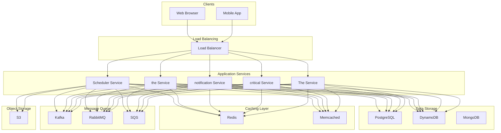

# Design a Scalable Notification Service

## What is a Notification Service?

A notification service is a system that delivers messages or alerts to users across multiple channels such as email, SMS, push notifications, or in-app messages.
Examples include Firebase Cloud Messaging (FCM), Amazon SNS, and notification systems built into apps like WhatsApp or Twitter.
In this chapter, we will walk through the **high-level design of a notification service.**

Let’s begin by clarifying the requirements.

# 1. Requirements Gathering

Before diving into the design, lets outline the functional and non-functional requirements.


### 1.1 Functional Requirements:

1. **Multi-channel Support**: The system must support sending notifications through various channels including email, SMS, push notifications, and in-app messages.

2. **Multiple Notification Types**: Support transactional (e.g., order confirmation), promotional (e.g., discount offers), and system-generated alerts (e.g., password reset).

3. **Scheduled Delivery**: Support scheduling of notifications for future delivery.

4. **Rate Limiting**: Ensure that users receive only a limited number of promotional messages in a given day to prevent spam.

5. **Retry Mechanism**: Handle notification delivery failures, retrying when necessary (e.g., failed SMS or email).


### 1.2 Non-Functional Requirements:

- **Scalability:** The system should handle millions of notifications per minute, supporting millions of concurrent users.
- **High availability:** Ensure minimal downtime so that notifications are delivered even in case of failures.
- **Reliability:** Guarantee at-least-once delivery of notifications, with the possibility of exactly-once semantics for certain use cases.
- **Low latency:** Notifications should be sent as quickly as possible to ensure timely delivery.


# 2. Scale Estimation

- **Users**: Assume the system serves **50 million daily users**.
- **Notifications per user**: On average, each user receives **5 notifications/day**.
- **Peak load**: Assume the peak time sees **1 million notifications** within 1 minutes (a common scenario during flash sales, for example).

This means the system should handle:

- **Notifications per day: **50 million x 5 = 250 million notifications/day
- **Peak notifications per second: **1 million / 60** = ~**17,000 notifications/second


### Storage Requirements

Assuming average notification and user data size of 1KB.

- **Storage for user data:** 50 million * 1 KB = 50GB
- **Daily Storage for notifications:** 50 million * 5 * 1 KB = 250GB


# 3. High Level Design

On a high level, our system will consist of the following components:


### 1. Notification Service

The **Notification Service** is the **entry point** for all notification requests, either from exter




nal applications or internal systems. It exposes **APIs** that various clients can call to trigger notifications.
These could be requests to send **transactional notifications** (e.g., password reset emails), **promotional notifications** (e.g., discount offers), or **system alerts** (e.g., downtime warnings).
Each request is **validated** to ensure it contains all the necessary information, such as the recipient’s ID, notification type, message content, and channels through which the notification should be sent (email, SMS, etc.).
For notifications that need to be sent at a future date or time, the Notification Service integrates with the **Scheduler** **Service**.
After processing the request, the Notification Service pushes the notifications to a **Notification Queue** (e.g., Kafka or RabbitMQ).
```


### 2. User Preference Service

The **User Preference Service** allows users to control how they receive notifications.
It stores and retrieves individual user preferences for receiving notifications across different channels.
The service tracks which types of notifications users have explicitly opted into or out of.
> Example: Users may opt out of marketing or promotional content

To prevent users from being overwhelmed by notifications, the User Preference Service enforces **frequency limits** for certain types of notifications, especially promotional messages.
> Example: A user may only receive 2 promotional notifications per day


### 3. Scheduler Service

The **Scheduler Service** is responsible for storing and tracking the **scheduled notifications**—notifications that need to be sent at a specific future time.
These can include reminders, promotional campaigns, or other time-sensitive notifications that are not sent immediately but must be triggered based on a predefined schedule.
> Example: A promotional message might be scheduled for delivery next week.

Once the scheduled time arrives, the Scheduler Service pulls the notification from its storage and sends it to the **Notification Queue**.


### 4. Notification Queue

The **Notification Queue **acts as a buffer between the **Notification Service** and the **Channel Processors**.
By decoupling the notification request submission from the notification delivery, the queue enables the system to scale much more effectively, particularly during high-traffic periods.
The Queue System provides guarantees around message delivery.
Depending on the use case, it can be configured for:

- **At-least-once delivery**: Ensures that every notification will be sent at least once, even if this results in duplicate messages in rare cases.
- **Exactly-once delivery**: Ensures that every notification is delivered exactly once, preventing duplicates while maintaining reliability.


### 5. Channel Processors

The **Channel Processors **are** **responsible for pulling notifications from the **Notification Queue** and delivering them to users via specific channels, such as **email**, **SMS**, **push notifications**, and **in-app notifications**.
By decoupling the Notification Service from the actual delivery, Channel Processors enable **independent scaling** and **asynchronous processing** of notifications.
This setup allows each processor to focus on its designated channel, ensuring reliable delivery with built-in retry mechanisms and handling failures efficiently.


### 6. Database/Storage

The **Database/Storage** layer manages large volumes of data, including notification content, user preferences, scheduled notifications, delivery logs, and metadata.
The system requires a mix of storage solutions to support various needs:

- **Transactional Data**: A relational database like **PostgreSQL** or **MySQL** stores structured data, such as notification logs and delivery status.
- **User Preferences**: **NoSQL databases** (e.g., DynamoDB, MongoDB) store large volumes of user-specific data, such as preferences and rate limits.
- **Blob Storage**: For notifications containing large attachments (e.g., email with images or PDFs), **Amazon** **S3** or similar services can store them.

# 4. Detailed Design


### Step 1: Notification Request Creation

An external system (e.g., an e-commerce platform, a system alert generator, or a marketing system) generates a notification request.

#### Sample Request:


### Step 2: Notification Service Ingestion

The **Notification Service** (via an **API Gateway / Load Balancer**) receives the notification request.
The request is **authenticated** and **validated** to ensure it’s coming from an authorized source and all necessary information (recipient, message, channels, etc.) is present and correct.


### Step 3: Fetching User Preferences

The **Notification Service** queries the **User Preference Service** to retrieve:

- **Preferred Notification Channels** (e.g., some users may prefer email for promotional messages but SMS for critical alerts).
- **Opt-in/Opt-out Preferences**: Ensures compliance with user preferences, such as not sending marketing emails if the user has opted out.
- **Rate Limits**: Ensures that the user does not exceed their configured notification limits (e.g., max 3 promotional SMS messages per day).

#### Sample Response from User Preference Service:


### Step 4: Scheduling (If Required)

If the notification is **scheduled for future delivery** (e.g., a reminder for tomorrow or a marketing email next week), the **Notification Service **sends the notification to **Scheduler Service** which stores the notification along with its scheduled delivery time in a **time-based database** or **NoSQL database **that allows for efficient querying based on time.
The `scheduled_notifications `table is partitioned on `scheduled_time `so that` `the system can efficiently retrieve only the notifications that fall within the relevant time range, rather than scanning the entire table.
The Scheduler Service continuously queries the storage for notifications that are **due for delivery**.
> Example: Every minute (or based on a more granular interval), the service queries for notifications that need to be delivered in the next time window (e.g., next 1–5 minutes).

When the scheduled time arrives, the Scheduler Service takes the notification and sends it to the **Notification Queue**.


### Step 5: Message Creation and Formatting

Based on the user’s preferences and the request, the **Notification Service** uses **templates** (if needed) to dynamically generate and format the message for each channel:

#### Sample Message (Email):


### Step 6: Queueing the Notification

Once the **Notification Service** has created and formatted the messages for the required channels, it places each message into the respective **topic** in the **Notification Queue System** (e.g., **Kafka**, **RabbitMQ**, **AWS SQS**).
Each channel (email, SMS, push, etc.) has its own **dedicated topic**, ensuring that the messages are processed independently by the relevant **Channel Processors**.
> Example: If the notification needs to be sent via email, SMS, and push, the Notification Service generates three messages, each tailored to the respective channel.

- The **Email Message** is placed into the **Email Topic**.
- The **SMS Message** is placed into the **SMS Topic**.
- The **Push Notification Message** is placed into the **Push Topic**.

These **topics** allow each **Channel Processor** to focus on consuming messages relevant to its channel, reducing complexity and improving processing efficiency.
Each message contains the **notification payload**, **channel-specific information**, and metadata (such as priority and retry count).


### Step 7: Channel-Specific Message Processing

The **Notification Queue** stores the messages until the relevant **Channel Processors** pull them for processing.
Each channel processor acts as a consumer to the queue and responsible for consuming its own messages:

- **Email Processor** pulls from the **Email Topic**.
- **SMS Processor** pulls from the **SMS Topic**.
- **Push Processor** pulls from the **Push Topic**.
- **In-app Processor** pulls from the **In-app Topic**.


### Step 8: Sending the Notification

Each **Channel Processor** handles the delivery of the notification through the specified channel:


#### Email Processor:

- Connects to the email provider (e.g., **SendGrid**, **Mailgun**, **Amazon SES**).
- Sends the email, ensuring it follows the user’s preferences (e.g., HTML vs. plain text).
- Handles errors such as bounces or invalid email addresses.


#### SMS Processor:

- Connects to the SMS provider (e.g., **Twilio**, **Nexmo**).
- Sends the SMS with any formatting adjustments to meet character limits or regional requirements.
- Handles issues such as invalid phone numbers or network errors.


#### Push Notification Processor:

- Uses services like **Firebase Cloud Messaging (FCM)** for Android or **Apple Push Notification Service (APNs)** for iOS.
- Sends the push notification, including any metadata (e.g., app-specific actions or icons).
- Handles failures such as expired device tokens or offline devices.


#### In-App Notification Processor:

- Sends the in-app notification via **WebSockets** or **long polling** to the user’s active session.
- Formats the message for display in the app’s UI, adhering to any app-specific display rules.


### Step 9: Monitoring and Delivery Confirmation

Each **Channel Processor** waits for an acknowledgment from the external provider:

- **Success**: The message has been delivered.
- **Failure**: The message delivery failed (e.g., network issues, invalid addresses).

The **Channel Processors** logs each notification’s status in the `notification_logs` table for future reference, auditing, and reporting.

# 5. Addressing Bottlenecks


### 5.1 Handling Failures and Retries

If a notification delivery fails due to a temporary issue (e.g., third-party provider downtime), the **Channel Processor** will attempt to resend the notification.
Typically, an **exponential backoff** strategy is used, where each retry is delayed by progressively longer intervals.
If the notification remains undelivered after a set number of retries, it is moved to the **Dead Letter Queue (DLQ) **for further handling.
Administrators can then manually review and reprocess messages in the DLQ as needed.

### 5.2 Scalability


#### Horizontal Scalability

The system should be designed for **horizontal scalability**, meaning components can scale by adding more instances as the load increases.

- **Notification Service**: As request volumes grow, additional instances can be deployed to manage the increased load of incoming notifications.
- **Notification Queue**: Distributed queueing systems, like **Kafka** or **RabbitMQ**, are naturally scalable and can handle larger workloads by distributing the queue across multiple nodes.
- **Channel Processors**: Each processor (email, SMS, etc.) should be horizontally scalable to handle large volumes of notifications.


#### Sharding & Partitioning

To efficiently handle large datasets, particularly for user data and notification logs, sharding and partitioning distribute the load across multiple databases or geographic regions:

- **User-based Sharding**: Distribute users across different databases or regions based on geographic location or user ID to balance the load.
- **Time-based Partitioning**: Organize notification logs into time-based partitions (e.g., daily or monthly) to improve query performance and manage large volumes of historical data.


#### Caching

Implement caching with solutions like **Redis** or **Memcached** to store frequently accessed data, such as user preferences.
Caching reduces the load on the database and improves response times for real-time notifications by avoiding repeated database lookups.


### 5.3 Reliability

For high availability, data (e.g., user preferences, logs) should be replicated across multiple data centers or regions. This ensures that even if one region fails, the data is available elsewhere.
> Multi-AZ Replication: Store data in multiple availability zones to provide redundancy.

A **load balancer** should be used to distribute incoming traffic evenly among instances of the Notification Service, ensuring that no single instance becomes a bottleneck.


### 5.4 Monitoring and Logging

To ensure smooth operation at scale, the system should have:

- **Centralized Logging**: Use tools like **ELK Stack** or **Prometheus/Grafana** to collect logs from various components and monitor the health of the system.
- **Alerting**: Set up alerts for failures (e.g., notification delivery failure rates exceed a threshold).
- **Metrics**: Track metrics like success rate, failure rate, delivery latency, and throughput for each channel.


### 5.5 Security

Implement robust authentication (e.g., OAuth 2.0) for all incoming requests to the notification service. Use **Role-Based Access Control (RBAC)** to limit access to critical services.
Protect the service from abuse by implementing rate limiting on the API gateway to avoid DoS attacks.


### 5.6 Archiving Old Data

As a notification system handles large volumes of data over time, it is important to implement a strategy for **archiving old data**.
Archiving involves moving outdated or less frequently accessed data (e.g., old delivery logs, notification content, and user history) from the main storage to a lower-cost, longer-term storage solution.

# Quiz


## Design Notification Service Quiz

What is the primary architectural benefit of placing a Notification Queue between the Notification Service and Channel Processors?