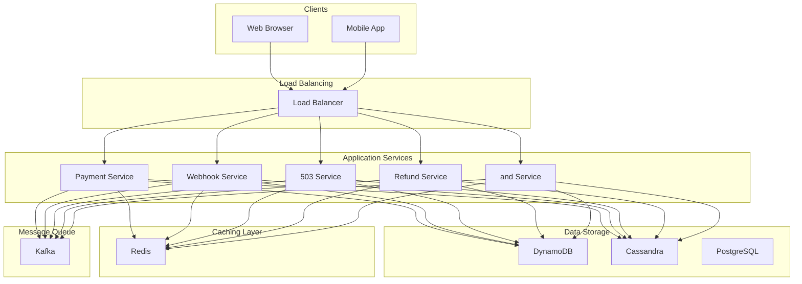
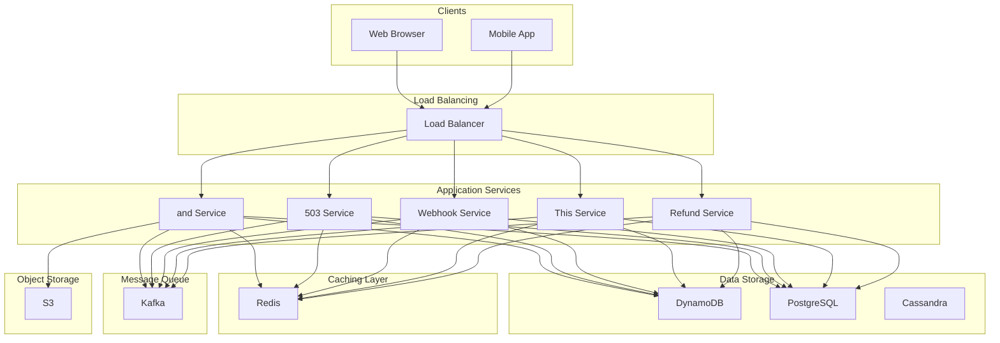
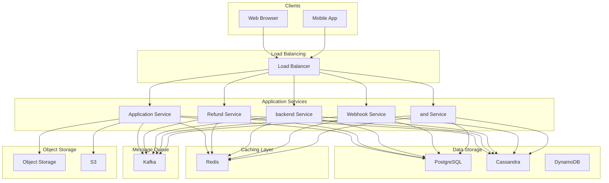

# Design Payment System

A payment system is the infrastructure that enables the transfer of money between parties, typically from a buyer to a seller, in exchange for goods or services.
At its core, a payment system coordinates the flow of funds across multiple financial institutions, handles various payment methods (credit cards, bank transfers, digital wallets), and ensures that transactions are processed securely, reliably, and in compliance with financial regulations.
**Popular Examples:** Stripe, PayPal, Square, Braintree
This problem tests your understanding of distributed systems, consistency guarantees, failure handling, and real-world business constraints. Payment systems have zero tolerance for errors, making them an excellent test of a candidate's ability to reason about reliability.
In this article, we will explore the **high-level design of a payment system** similar to Stripe.
Let's start by clarifying the requirements.
# 1. Clarifying Requirements
Before jumping into architecture diagrams, we need to understand exactly what we are building. Payment systems can range from simple payment gateways to full-featured financial platforms with subscriptions, marketplace payouts, and multi-currency support. The scope dramatically affects our design.
Here is how a requirements discussion might unfold in an interview:
**Candidate:** "What is the expected scale? How many transactions should the system handle per day?"
**Interviewer:** "Let's design for 10 million transactions per day, with peak loads around major shopping events."
**Candidate:** "What payment methods should we support?"
**Interviewer:** "Focus on credit/debit cards as the primary method. Bank transfers and digital wallets are nice-to-have."
**Candidate:** "Should we handle the actual card processing ourselves, or integrate with payment processors like Visa/Mastercard networks?"
**Interviewer:** "We'll integrate with external payment processors. Focus on the payment orchestration layer, not the card network integration details."
**Candidate:** "What are the consistency requirements? Can we ever lose a transaction or process it twice?"
**Interviewer:** "Absolutely not. Every transaction must be processed exactly once. Financial accuracy is non-negotiable."
**Candidate:** "Do we need to support refunds, chargebacks, and recurring payments?"
**Interviewer:** "Yes, refunds are a core requirement. Chargebacks and subscriptions can be discussed if time permits."
**Candidate:** "What latency is acceptable for a payment request?"
**Interviewer:** "The API should respond within 2-3 seconds. Users expect real-time feedback on whether their payment succeeded or failed."
This conversation reveals several important constraints. Let's formalize these into requirements.

## 1.1 Functional Requirements
Based on the discussion, here are the core capabilities our system must provide:
- **Process Payments:** Accept payment requests with card details and amount, process them through payment processors, and return success/failure status.
- **Idempotency:** Ensure each payment is processed exactly once, even if the client retries due to network failures.
- **Refunds:** Allow merchants to initiate full or partial refunds for completed transactions.
- **Payment Status:** Provide APIs to query the current status of any transaction.
- **Webhooks:** Notify merchants of payment events (success, failure, refund) via callbacks.

## 1.2 Non-Functional Requirements
Beyond features, payment systems have strict quality requirements that shape our architecture:
- **High Reliability:** The system must never lose a transaction. Zero data loss is mandatory.
- **Exactly-Once Processing:** Payments must be processed exactly once, no duplicates, no missed transactions.
- **High Availability:** Target 99.99% uptime. Payment failures directly impact merchant revenue.
- **Low Latency:** API response time should be under 2-3 seconds for 99th percentile.
- **Strong Consistency:** Users must see accurate, up-to-date transaction status at all times.
- **Security & Compliance:** Must be PCI-DSS compliant. Card data must be encrypted and tokenized.

The reliability and exactly-once processing requirements are what make payment systems particularly challenging. Most distributed systems settle for "at-least-once" delivery, but payment systems cannot afford that luxury.
# 2. Back-of-the-Envelope Estimation
Before diving into the design, let's run some quick calculations to understand the scale we are dealing with. These numbers will guide our architectural decisions, particularly around database capacity, queue sizing, and caching needs.

### 2.1 Traffic Estimates
Starting with the numbers from our requirements discussion:

#### Transaction Volume
We expect 10 million transactions per day. Let's convert this to transactions per second (TPS):
Traffic is rarely uniform throughout the day. During peak hours, especially around lunch breaks, evenings, and major sales events, we might see 10x the average load:
This is a manageable load for a well-designed system, but we need to plan for these peaks.

#### Read vs Write Ratio
Payment systems have an interesting access pattern. Each payment creates one write (the transaction record), but generates multiple reads:
- Merchants checking transaction status
- Webhook delivery retries
- Dashboard queries and reporting
- Reconciliation processes

A reasonable estimate is:
- Payment creation (writes): 10 million/day
- Status checks, webhook retries, dashboard queries (reads): 50 million/day
- Read/Write ratio: approximately **5:1**

### 2.2 Storage Estimates
Each transaction record needs to store several pieces of information. Let's break it down:

#### Per Transaction Storage:
- Transaction ID, merchant ID, customer info: ~100 bytes
- Payment details (amount, currency, method): ~50 bytes
- Status history and timestamps: ~100 bytes
- Audit logs and metadata: ~250 bytes

Total: approximately **500 bytes per transaction**

#### Annual Storage:

#### Ledger Entries:
Each transaction creates multiple ledger entries for double-entry bookkeeping, typically 2-4 entries per transaction (debit customer, credit merchant, credit fees, etc.):
Combined, we are looking at roughly **5 TB per year** of primary data. This is well within the capacity of a single PostgreSQL instance with good indexing, but we will want to plan for replication and archival.

### 2.3 Key Insights
These estimates reveal several important design implications:
1. **Write throughput is modest:** 115 TPS average (1,150 peak) is manageable for a single database with proper indexing. We do not need complex sharding from day one.
2. **Reads dominate:** With 5x more reads than writes, we should invest in caching and read replicas to keep the primary database focused on writes.
3. **Storage is predictable:** 5 TB/year means we can plan capacity well in advance. Archival strategies for old transactions will help manage long-term growth.
4. **Peak handling matters:** The 10x peak factor means our system needs headroom. Auto-scaling and queuing will help absorb traffic spikes.

# 3. Core APIs
With our requirements and scale understood, let's define the API contract. Payment APIs need to be precise and well-documented because merchants integrate them into their checkout flows. Any ambiguity leads to integration bugs and support tickets.
We will design three core endpoints: create payment, get payment status, and create refund.

### 3.1 Create Payment

#### Endpoint: POST /v1/payments
This is the most critical endpoint. When a customer clicks "Pay", the merchant's server calls this API to initiate the payment.

#### Request Parameters:
| Parameter | Type | Required | Description |
| --- | --- | --- | --- |
| idempotency_key | string | Yes | Unique key provided by the client to ensure exactly-once processing. |
| amount | integer | Yes | Payment amount in the smallest currency unit (e.g., cents for USD, pence for GBP). |
| currency | string | Yes | Three-letter ISO 4217 currency code (e.g., "USD", "EUR", "GBP"). |
| payment_method | string | Yes | Token representing the customer's payment method. |
| merchant_id | string | Yes | Identifier of the merchant initiating the payment. |
| description | string | No | Human-readable description of the payment, often shown on customer bank statements. |
| metadata | object | No | Key-value pairs for merchant-specific data. |

Network failures happen. When a merchant's server sends a payment request and does not receive a response (timeout, connection dropped), it does not know if the payment succeeded or failed. The safe thing to do is retry. 
Without idempotency keys, this retry could create a duplicate charge. By requiring the merchant to provide a unique key for each logical payment, we can detect retries and return the original result.

#### Example Request:

#### Success Response (201 Created):
Notice that the initial status is "processing", not "succeeded". Payment processing is asynchronous because we need to communicate with external payment processors, which can take a few seconds. The merchant should either poll for status updates or wait for a webhook notification.

#### Error Responses:
| Status Code | Meaning | When It Occurs |
| --- | --- | --- |
| 400 Bad Request | Invalid parameters | Content is empty, amount is negative, currency code is invalid |
| 401 Unauthorized | Invalid API key | The merchant's API key is missing or invalid |
| 409 Conflict | Idempotency key reused with different parameters | The merchant sent the same idempotency key with a different amount or payment method |
| 422 Unprocessable Entity | Payment method declined | The card was declined by the processor |
| 429 Too Many Requests | Rate limited | The merchant exceeded their API rate limit |

### 3.2 Get Payment Status

#### Endpoint: GET /v1/payments/{payment_id}
After creating a payment, merchants need to check its status. This endpoint returns the current state of a payment along with relevant details.

#### Path Parameters:
| Parameter | Type | Description |
| --- | --- | --- |
| payment_id | string | The unique identifier returned when the payment was created |

#### Success Response (200 OK):
The response includes the full payment details, making it useful for both status checks and displaying payment information on receipts or dashboards.

#### Error Responses:
| Status Code | Meaning | When It Occurs |
| --- | --- | --- |
| 404 Not Found | Payment does not exist | The payment ID was never created or is invalid |
| 401 Unauthorized | Invalid API key or wrong merchant | The API key does not have access to this payment |

### 3.3 Create Refund

#### Endpoint: POST /v1/refunds
When a customer returns a product or disputes a charge, merchants need to refund the original payment. Refunds can be full or partial.

#### Request Parameters:
| Parameter | Type | Required | Description |
| --- | --- | --- | --- |
| payment_id | string | Yes | The original payment to refund |
| amount | integer | No | Refund amount in smallest currency unit. If omitted, we issue a full refund. |
| reason | string | No | Reason for the refund, useful for record-keeping and disputes |
| idempotency_key | string | Yes | Ensures exactly-once refund processing, just like payment creation |

#### Example Request:

#### Success Response (201 Created):

#### Error Responses:
| Status Code | Meaning | When It Occurs |
| --- | --- | --- |
| 400 Bad Request | Invalid refund amount | Refund amount exceeds the original payment or remaining refundable amount |
| 404 Not Found | Payment not found | The payment ID does not exist |
| 409 Conflict | Already refunded | The payment has already been fully refunded |
| 422 Unprocessable Entity | Payment not refundable | The payment is not in a succeeded state (cannot refund a failed payment) |

### 3.4 API Design Considerations
A few design decisions worth highlighting:
**Amounts in smallest currency unit:** We use integers (5000 cents instead of 50.00 dollars) to avoid floating-point precision issues. Different currencies have different decimal places (JPY has 0, most have 2, some have 3), so using the smallest unit keeps the API consistent.
**Idempotency keys on mutating operations:** Both payment creation and refund creation require idempotency keys. GET requests are naturally idempotent (reading the same resource twice gives the same result), so they do not need special handling.
**Webhooks complement polling:** While merchants can poll the status endpoint, webhooks push updates to them. This is more efficient and provides faster feedback. We will cover webhook design in the deep dive section.
# 4. High-Level Design
Now we get to the interesting part: designing the system architecture. Rather than presenting a complex diagram upfront, we will build the design incrementally, adding components as we encounter challenges. This approach mirrors how you would tackle the problem in an interview.
At a high level, our payment system must satisfy three core requirements:
1. **Process Payments:** Accept payment requests and coordinate with external payment processors.
2. **Ensure Reliability:** Never lose a transaction, never process duplicates.
3. **Provide Visibility:** Allow merchants to query status and receive real-time notifications.

Payment systems have **zero tolerance for errors**. This means we need to design for reliability first, then optimize for performance. The architecture separates the synchronous API layer (where merchants send requests) from asynchronous payment processing (where we communicate with external processors).
**Why separate synchronous and asynchronous paths?** External payment processors can take 1-5 seconds to respond. If our API blocked until the processor responded, merchants would experience inconsistent latency, and timeouts would be common. By returning immediately (with status "processing") and handling the processor communication asynchronously, we provide predictable API latency while still ensuring reliable payment processing.
Let's build this architecture step by step, starting with payment creation.

## 4.1 Requirement 1: Processing Payments
When a merchant sends a payment request, several things need to happen:
1. Validate the request (amount positive, currency valid, API key authorized)
2. Check if we have seen this idempotency key before (duplicate detection)
3. Create a payment record in our database
4. Queue the payment for processing
5. Return a response to the merchant

Later, asynchronously:
1. Send the payment to the external processor
2. Update the payment status based on the processor's response
3. Notify the merchant via webhook

Let's introduce each component and explain its role.

### Components for Payment Processing

#### API Gateway
Every request enters through the API Gateway, which acts as the front door to our system. Before any business logic runs, the gateway handles several cross-cutting concerns:
- **Authentication:** Validates the merchant's API key and extracts their identity
- **Rate Limiting:** Enforces request quotas to prevent abuse and ensure fair usage
- **Request Validation:** Checks that required fields are present and properly formatted
- **SSL Termination:** Handles HTTPS encryption so backend services can communicate over internal networks
- **Request Logging:** Records every request for debugging and compliance

By centralizing these concerns at the gateway, our Payment Service can focus purely on business logic.

#### Payment Service
This is the brain of our payment processing. It orchestrates the entire workflow for creating payments:
1. Receives validated requests from the API Gateway
2. Checks the idempotency store for duplicate requests
3. Creates a payment record in the database with status "pending"
4. Publishes a message to the processing queue
5. Returns the payment ID and status to the merchant

The Payment Service is stateless, meaning any instance can handle any request. All state lives in the database and Redis. This makes horizontal scaling straightforward: add more instances behind the load balancer.

#### Idempotency Store (Redis)
A fast key-value store that tracks idempotency keys and their associated payment results. When a payment request arrives:
- If the key does not exist: store it with status "processing" and proceed
- If the key exists with a completed result: return the cached result immediately
- If the key exists with status "processing": return "payment in progress"

Redis is perfect for this because we need sub-millisecond lookups and the data is ephemeral (keys expire after 24-48 hours). We will explore idempotency handling in detail in the deep dive section.

#### Payment Database (PostgreSQL)
Stores all payment records, transaction states, and audit logs. We chose PostgreSQL because:
- **ACID transactions:** Payment state changes must be atomic. We cannot have a payment marked as "succeeded" without the corresponding ledger entries.
- **Strong consistency:** Merchants must see accurate status immediately after changes.
- **Complex queries:** We need to query by payment ID, merchant ID, date ranges, and status for reporting.
- **Proven reliability:** PostgreSQL is battle-tested for financial applications.

#### Message Queue (Kafka)
Decouples payment acceptance from payment processing. When the Payment Service creates a payment record, it publishes a message to Kafka. Payment Workers consume these messages and handle the actual processor communication.
Why use a queue instead of calling the processor directly?
1. **Reliability:** If the processor is down, messages wait in the queue until it recovers. No payments are lost.
2. **Retry handling:** Failed processor calls can be retried automatically with backoff.
3. **Load leveling:** During traffic spikes, the queue absorbs the burst and workers process at a sustainable rate.
4. **Observability:** Queue depth tells us if we are falling behind, enabling proactive scaling.

#### Payment Worker
Background workers that consume messages from Kafka and communicate with external payment processors. Each worker:
1. Reads a payment message from the queue
2. Calls the Payment Processor Gateway
3. Waits for the processor response
4. Updates the payment status in the database
5. Triggers webhook delivery

Workers are stateless and can be scaled horizontally. If processing is falling behind (queue growing), we add more workers.

#### Payment Processor Gateway (PSP Gateway)
An abstraction layer that integrates with external payment processors like Stripe, Adyen, or bank networks. Having this abstraction is valuable because:
- **Multiple processors:** We can route payments to different processors based on card type, region, or cost.
- **Unified interface:** The Payment Worker does not need to know processor-specific details.
- **Failover:** If one processor is down, we can route to a backup.
- **Format translation:** Each processor has its own API format. The gateway handles the translation.

### The Create Payment Flow in Action
Let's trace through what happens when a merchant creates a payment:
The key insight here is the separation between the synchronous response (steps 1-7) and asynchronous processing (steps 8-12). The merchant receives a response in under 500ms, while the actual payment processing happens in the background.

## 4.2 Requirement 2: Ensuring Exactly-Once Processing
Payment systems must guarantee that each payment is processed exactly once. Network failures, timeouts, and client retries are inevitable, and without proper handling, these can cause duplicate charges or lost payments.
Let's understand the problem with a concrete scenario:
This scenario happens more often than you might think. A customer on a flaky mobile connection, a merchant server that times out after 30 seconds, a load balancer that drops the connection, any of these can cause the merchant to retry a payment that already succeeded.

### Additional Components for Exactly-Once Processing

#### Idempotency Store (Enhanced)
We already mentioned Redis for idempotency, but let's look at how it actually works:
The Redis entry looks like this:
**Why 48-hour TTL?** Merchants need to be able to retry for a reasonable window, but we do not want to store idempotency keys forever. 48 hours covers the vast majority of retry scenarios while keeping storage manageable.

### Handling Edge Cases
Idempotency sounds simple, but there are several edge cases to handle:

#### Edge Case 1: Same key, different parameters
What if a merchant accidentally reuses an idempotency key for a completely different payment (different amount, different customer)?
We return `409 Conflict` with an error message explaining that the idempotency key was already used with different parameters. This prevents accidental key reuse from causing confusing behavior.

#### Edge Case 2: Processing timeout
What if a payment is stuck in "processing" for too long? Maybe the worker crashed, or the processor is not responding.
After 30 seconds of "processing" status, we allow the merchant to retry with the same idempotency key. Our system will:
1. Check if the original payment actually completed (by querying the processor)
2. If completed, return the result
3. If not completed, either resume processing or start fresh

#### Edge Case 3: Redis failure
If Redis is unavailable, we cannot check idempotency keys. What do we do?
We never process a payment without idempotency verification. If Redis is down, we return `503 Service Unavailable` and ask the merchant to retry. This is a strong stance, but it is the only way to guarantee exactly-once processing.
As a backup, we also store idempotency information in PostgreSQL. If Redis fails, we can fall back to database-based idempotency checks (slower, but functional).

## 4.3 Requirement 3: Providing Visibility via Webhooks
After a payment is processed, merchants need to know the result so they can update their own systems, send confirmation emails, fulfill orders, and so on. While they can poll our status API, webhooks provide a more efficient and timely solution.

### Additional Components for Webhooks

#### Event Queue
When a payment status changes, the Payment Worker publishes an event to a dedicated event queue. This decouples payment processing from webhook delivery, ensuring that slow or failing merchant endpoints do not affect payment processing.
Events include:
- `payment.succeeded`: Payment was successfully processed
- `payment.failed`: Payment was declined or failed
- `payment.refunded`: A refund was processed
- `payment.dispute.created`: A chargeback was filed (if we support this)

#### Webhook Service
Consumes events from the queue and delivers them to merchant endpoints. This service handles:
- **Endpoint management:** Storing and looking up which endpoints to notify for each merchant
- **Payload construction:** Building the webhook payload with event details
- **Signature generation:** Creating HMAC signatures so merchants can verify authenticity
- **Delivery with retries:** Sending webhooks and retrying failures with exponential backoff
- **Delivery tracking:** Recording whether each webhook was delivered successfully

### The Webhook Flow
Webhook delivery can be slow (network latency, slow merchant servers) and unreliable (merchant servers go down). If we delivered webhooks synchronously from the Payment Worker, a slow merchant endpoint would block payment processing. By using a separate queue and service, we isolate these concerns.

## 4.4 Putting It All Together
Now that we have covered the individual requirements, let's see how all the components fit together in the complete architecture:

### Component Summary
| Component | Purpose | Scaling Strategy |
| --- | --- | --- |
| API Gateway | Authentication, rate limiting, routing | Horizontal (add instances) |
| Payment Service | Payment lifecycle orchestration | Horizontal (stateless) |
| Refund Service | Refund processing and validation | Horizontal (stateless) |
| Idempotency Store | Fast duplicate detection | Redis Cluster |
| Payment Database | Transaction records, status history | Read replicas, then sharding |
| Ledger Database | Double-entry bookkeeping | Append-only, partitioned by date |
| Payment Queue | Reliable async processing | Kafka partitions |
| Payment Workers | Processor communication | Horizontal (add workers) |
| PSP Gateway | Payment processor abstraction | Horizontal (stateless) |
| Event Queue | Webhook event buffer | Kafka partitions |
| Webhook Service | Event delivery to merchants | Horizontal (add instances) |

The architecture follows a layered approach where each layer has a specific responsibility. This separation makes the system easier to understand, test, and scale independently.
# 5. Database Design
With the high-level architecture in place, let's zoom into the data layer. The database design is critical for payment systems because financial data requires strong consistency, complete audit trails, and efficient querying for both real-time operations and reporting.

## 5.1 Choosing the Right Database
Payment systems have strict requirements that influence our database choice:

#### What we need:
- **ACID transactions:** When we update a payment status and create ledger entries, both must succeed or both must fail. Partial updates (money debited but not credited) are catastrophic.
- **Strong consistency:** Merchants must see accurate status immediately after changes. Eventual consistency is not acceptable for payment state.
- **Complex queries:** We need to query by payment ID, merchant ID, date ranges, status, and more for reporting and reconciliation.
- **Audit requirements:** Financial regulations require complete audit trails with referential integrity.

Given these requirements, a relational database like PostgreSQL is the right choice.

#### Why PostgreSQL?
PostgreSQL also has excellent support for JSONB (for flexible metadata), partial indexes (for efficient status queries), and triggers (for audit logging).

#### Why not NoSQL?
Databases like DynamoDB or Cassandra optimize for horizontal scaling and eventual consistency, neither of which we need at our scale. Our query patterns are varied (by ID, by merchant, by date range, by status), and relational databases handle this naturally with indexes. NoSQL would require careful data modeling and potentially multiple tables for different access patterns.

## 5.2 Database Schema
Let's design the core tables. We have four main entities: Payments, Payment Events, Refunds, and Ledger Entries.

### Payments Table
This is the heart of our schema. Each row represents one payment request.
| Field | Type | Description |
| --- | --- | --- |
| payment_id | UUID | Primary key. We use UUIDs instead of sequential IDs to avoid exposing transaction volume and to work well in distributed systems. |
| idempotency_key | VARCHAR(255) | Client-provided key for duplicate detection. Combined with merchant_id, this must be unique. |
| merchant_id | UUID | The merchant who initiated this payment. Foreign key to a merchants table (not shown). |
| amount | BIGINT | Amount in smallest currency unit (cents). We use BIGINT to avoid floating-point issues and handle large amounts. |
| currency | CHAR(3) | ISO 4217 currency code (USD, EUR, GBP, etc.). |
| status | ENUM | Current payment state: pending, processing, succeeded, failed, refunded, partially_refunded. |
| payment_method_id | UUID | Reference to the tokenized payment method. Actual card details are stored securely elsewhere. |
| processor_transaction_id | VARCHAR(255) | The transaction ID returned by the external payment processor. Essential for reconciliation and support. |
| failure_code | VARCHAR(50) | Standardized error code if the payment failed (e.g., "card_declined", "insufficient_funds"). |
| failure_message | TEXT | Human-readable explanation of the failure. |
| metadata | JSONB | Merchant-provided key-value data. We store it for their use but do not interpret it. |
| created_at | TIMESTAMP WITH TIME ZONE | When the payment request was received. |
| updated_at | TIMESTAMP WITH TIME ZONE | When the status last changed. |

**Indexes:**
The partial index on status is particularly useful. Most payments are in terminal states (succeeded, failed), so indexing only the in-progress payments keeps the index small and fast.

### Payment Events Table
Every state change creates a new event, providing a complete audit trail.
| Field | Type | Description |
| --- | --- | --- |
| event_id | UUID | Primary key for this event. |
| payment_id | UUID | Reference to the payment this event belongs to. |
| event_type | ENUM | What happened: created, processing, succeeded, failed, refunded. |
| previous_status | ENUM | Status before this event. NULL for the first event. |
| new_status | ENUM | Status after this event. |
| processor_response | JSONB | Raw response from the payment processor. Invaluable for debugging and disputes. |
| created_at | TIMESTAMP WITH TIME ZONE | When this event occurred. |

**Why store the raw processor response?** When a customer disputes a charge or a merchant questions a decline, we need to see exactly what the processor told us. Storing the raw response in JSONB gives us complete forensic capability without having to anticipate every field we might need.

### Refunds Table
Tracks refund requests and their status.
| Field | Type | Description |
| --- | --- | --- |
| refund_id | UUID | Primary key for this refund. |
| payment_id | UUID | The original payment being refunded. |
| idempotency_key | VARCHAR(255) | Client-provided key for duplicate detection. |
| amount | BIGINT | Refund amount. Can be less than the original payment (partial refund). |
| status | ENUM | Current state: pending, processing, succeeded, failed. |
| reason | VARCHAR(255) | Why the refund was issued (optional). |
| processor_refund_id | VARCHAR(255) | ID from the payment processor. |
| created_at | TIMESTAMP WITH TIME ZONE | When the refund was requested. |
| updated_at | TIMESTAMP WITH TIME ZONE | When the status last changed. |

### Ledger Entries Table
Implements double-entry bookkeeping, which we will cover in detail in the deep dive section.
| Field | Type | Description |
| --- | --- | --- |
| entry_id | UUID | Primary key for this entry. |
| payment_id | UUID | Associated payment or refund. |
| account_id | UUID | The account being debited or credited. |
| entry_type | ENUM | Either 'debit' or 'credit'. |
| amount | BIGINT | Amount in smallest currency unit. Always positive. |
| currency | CHAR(3) | ISO 4217 currency code. |
| balance_after | BIGINT | Account balance after this entry. Useful for quick balance lookups. |
| created_at | TIMESTAMP WITH TIME ZONE | When this entry was created. |

**Critical property:** Ledger entries are **append-only**. We never update or delete them. If we need to reverse an entry, we create a new entry with the opposite direction. This is fundamental to financial auditing.
# 6. Design Deep Dive
The high-level architecture gives us a solid foundation, but system design interviews often go deeper into specific components.
In this section, we will explore the critical aspects that make or break a payment system: state machines, idempotency, failure handling, ledger design, webhooks, and reconciliation.
These are the topics that demonstrate deep understanding of payment systems.

## 6.1 Payment State Machine
Every payment goes through a series of states during its lifecycle. Managing these state transitions correctly is crucial for maintaining data integrity and providing accurate status to merchants.
The state machine is simple to understand but requires careful implementation. Let's look at the rules and edge cases.

### State Transition Rules
Each state has strict rules about which transitions are allowed:
| Current State | Allowed Transitions | Trigger |
| --- | --- | --- |
| pending | processing | Payment Worker picks up the message and sends to processor |
| processing | succeeded, failed | Processor returns a definitive response |
| succeeded | partially_refunded, refunded | Merchant initiates a refund |
| partially_refunded | refunded | Merchant refunds the remaining amount |
| failed | (terminal state) | No transitions allowed |
| refunded | (terminal state) | No transitions allowed |

Once a payment fails, we do not retry it automatically. The merchant needs to initiate a new payment request with a new idempotency key. This prevents confusion about which attempt succeeded and gives the merchant explicit control.

### Implementing Safe State Transitions
State changes must be atomic and respect the transition rules. Here is how we enforce this:
The `WHERE status = 'processing'` clause is crucial. If another process already changed the status, this UPDATE affects zero rows, and we know something went wrong. This is called **optimistic locking** and prevents race conditions without explicit locks.

### Handling Concurrent State Updates
What happens if two workers try to update the same payment simultaneously? Consider this scenario:
1. Worker A reads payment with status "processing"
2. Worker B reads the same payment (also sees "processing")
3. Worker A receives "succeeded" from processor, tries to update
4. Worker B receives "failed" from processor, tries to update

With our optimistic locking approach:
- Worker A's UPDATE succeeds (status was "processing")
- Worker B's UPDATE affects zero rows (status is now "succeeded")
- Worker B detects this and logs an error for investigation

This should never happen in a well-designed system (each payment should only be processed by one worker), but the database-level check provides a safety net.

### Idempotent State Transitions
State transitions should be idempotent. If we receive a duplicate webhook from the processor saying a payment succeeded, we should:
1. Check if the payment is already in "succeeded" state
2. If yes, return success without making changes
3. If no, something is wrong (investigate)

## 6.2 Idempotency and Exactly-Once Processing
We touched on idempotency earlier, but it deserves a deeper exploration. Idempotency is the single most important property of a payment system, and getting it right requires careful thought about timing, storage, and edge cases.

### Why Idempotency Is Critical
Consider the real-world scenarios that lead to retries:
Each of these scenarios can cause the same payment request to arrive multiple times. Without idempotency, each request creates a new payment, and the customer gets charged multiple times.

### Idempotency Key Design
The idempotency key is provided by the merchant and uniquely identifies a logical payment attempt. Here are the design considerations:
**Key format:** Should be opaque to us (we do not parse it), but typically merchants use:
- UUIDs: `550e8400-e29b-41d4-a716-446655440000`
- Order-based: `order_12345_payment_attempt_1`
- Timestamp-based: `merch_abc_20240115_103000_xyz`

**Key scope:** The key is scoped to the merchant. Two different merchants can use the same key without collision.
**Key lifetime:** We store idempotency records for 48 hours. After that, the same key can be reused. This is long enough for any reasonable retry scenario.

### The Idempotency Flow
Let's trace through exactly what happens when a request arrives:
The `NX` flag on Redis SET is crucial. It means "only set if not exists", making the check-and-set atomic. Without this, two concurrent requests could both see "key not found" and both proceed to process the payment.

### Idempotency in the Database
Redis gives us fast idempotency checks, but we also store idempotency information in PostgreSQL as a backup and for auditing:
If Redis is unavailable, we can fall back to this database constraint. Attempting to insert a duplicate (same merchant_id + idempotency_key) fails with a unique constraint violation, which we catch and handle.

### Edge Cases in Idempotency
**Parameter mismatch:** What if the same idempotency key comes with different parameters?
We return `409 Conflict` with an error message. The idempotency key should uniquely identify the intent, and changing parameters suggests either a bug or an attack. We store a hash of the original parameters and compare on subsequent requests.

#### Concurrent first requests
What if two requests with the same (new) idempotency key arrive at the same millisecond?
The Redis SET NX ensures only one wins. The other gets "key already exists" and treats it as a duplicate. Depending on timing, it might get "status: processing" and return 409, or it might get the final result.

#### Stuck processing
What if a payment gets stuck in "processing" state?
After 30 seconds, we consider the processing stale. A retry request can:
1. Check with the processor for the actual status
2. Update our records accordingly
3. Return the result

This handles cases where a worker crashed after starting to process but before recording the result.

## 6.3 Handling Payment Processor Failures
External payment processors are outside our control. They can fail, timeout, or return ambiguous responses. A robust payment system must handle these gracefully without losing money or data.

### Types of Processor Failures
| Failure Type | What Happens | Handling Strategy |
| --- | --- | --- |
| Timeout | Processor does not respond within 30 seconds | Retry with same idempotent request, then query processor for status |
| 5xx Error | Processor returns server error | Retry with exponential backoff |
| Network Error | Connection fails completely | Retry, then queue for later processing |
| Ambiguous Response | Connection drops mid-response | Query processor for transaction status |
| Declined | Processor says "no" | Return failure to merchant (not our problem) |

The trickiest case is the **ambiguous response**. We sent the request, the processor received it, but we never got a response. Did the payment go through? We do not know, and we must find out before doing anything else.

### Retry Strategy with Exponential Backoff
When the processor fails transiently, we retry with increasing delays:
The random jitter prevents the "thundering herd" problem where all retries happen at exactly the same time after a processor recovers.

### Circuit Breaker Pattern
If a processor is consistently failing, we should stop sending requests to avoid:
- Wasting resources on doomed requests
- Overwhelming the processor as it tries to recover
- Providing a poor experience while waiting for timeouts

#### How it works:
1. **Closed (normal):** Track the failure rate over a rolling window (e.g., last 10 seconds). If failure rate exceeds 50%, open the circuit.
2. **Open (fail-fast):** Immediately return an error to the caller without trying the processor. This gives the processor time to recover without being hammered with requests.
3. **Half-Open (testing):** After 30 seconds, allow one test request through. If it succeeds, close the circuit. If it fails, open it again.

### Multi-Processor Failover
For high availability, we integrate with multiple payment processors:

#### Routing considerations:
- **Primary processor:** Default choice for most transactions
- **Fallback processor:** Used when primary fails or has high latency
- **Geographic routing:** Use EU processor for EU cards, US processor for US cards
- **Cost optimization:** Some processors have better rates for certain card types

## 6.4 Double-Entry Ledger Design
Every serious payment system uses double-entry bookkeeping. This is not optional for financial compliance, it is a fundamental requirement that ensures money is never created or destroyed, only moved.

### Why Double-Entry?
The principle is simple: every transaction has exactly two sides. Money leaves one account and enters another. The total debits must always equal total credits. If they do not, there is an error.
In this example:
- Customer account is debited $50 (money leaves)
- Merchant account is credited $47.55 (money arrives)
- Our fee revenue is credited $2.45 (our cut)
- Total debits ($50) = Total credits ($47.55 + $2.45 = $50)

### Account Types in a Payment System
| Account Type | Description | Normal Balance |
| --- | --- | --- |
| Customer Receivable | Money we expect to receive from customers | Debit |
| Merchant Payable | Money we owe to merchants | Credit |
| Processing Fee Revenue | Fees we earn on transactions | Credit |
| Reserves | Funds held for potential chargebacks | Credit |
| Refund Liability | Money we owe for pending refunds | Credit |

### Ledger Entries for a Payment
When a $100 payment is processed with a 2.9% + $0.30 fee:
| Entry | Account | Debit | Credit |
| --- | --- | --- | --- |
| 1 | Customer Receivable | $100.00 |  |
| 2 | Merchant Payable |  | $96.80 |
| 3 | Fee Revenue |  | $3.20 |

The merchant receives $96.80 ($100 - $2.90 - $0.30), and we keep $3.20 as our fee.

### Ledger Entries for a Refund
When the $100 payment is refunded:
| Entry | Account | Debit | Credit |
| --- | --- | --- | --- |
| 1 | Merchant Payable | $96.80 |  |
| 2 | Fee Revenue | $3.20 |  |
| 3 | Customer Receivable |  | $100.00 |

This reverses the original entries. Note that we typically return the fee to the merchant as well (though policies vary).

### Implementation Principles
**1. Append-Only**
Ledger entries are never updated or deleted. If we make a mistake, we create correction entries, not edits. This is essential for audit trails.
**2. Atomic Transaction**
All entries for a single payment must be created together:
If any insert fails, none of them persist. We never have partial ledger entries.
**3. Balance Validation**
Periodically, we verify that the ledger balances:

## 6.5 Webhook Delivery and Reliability
Webhooks notify merchants of payment events in real-time. But merchant servers are outside our control, and they can be slow, down, or misconfigured. We need robust delivery and retry mechanisms.

### Webhook Events
| Event Type | Trigger | When Merchants Care |
| --- | --- | --- |
| payment.succeeded | Payment completed | Update order status, send confirmation email |
| payment.failed | Payment declined | Show error to customer, prompt retry |
| refund.created | Refund initiated | Update order status |
| refund.succeeded | Refund completed | Notify customer |
| payment.dispute.created | Chargeback filed | Gather evidence, contact customer |

### Delivery Guarantees
We provide **at-least-once delivery**. This means:
- We guarantee every event will be delivered eventually (as long as the merchant endpoint is eventually available)
- Merchants may receive the same event multiple times
- Merchants must handle duplicates using the event ID

Exactly-once delivery across system boundaries is impossible to guarantee. If a merchant server processes the webhook but crashes before sending the acknowledgment, we have no way to know it succeeded. We will retry, and the merchant sees it twice.

### Retry Schedule
When delivery fails, we retry with increasing intervals:
After 7 failed attempts over 3+ days, we give up automatic delivery. The event goes to a dead-letter queue, and we:
- Email the merchant about failed webhooks
- Show failed events in their dashboard
- Allow manual replay once they fix their endpoint

### Webhook Security
Merchants need to verify that webhooks actually came from us, not from an attacker:

#### 1. Signature Verification
Every webhook includes a signature header:
The signature is computed as:
Merchants use their webhook secret to recompute the signature and verify it matches.

#### 2. Timestamp Validation
The timestamp prevents replay attacks. Merchants should reject webhooks where the timestamp is more than 5 minutes old.

#### 3. IP Allowlisting
We publish our webhook source IP addresses. Merchants can allowlist these at their firewall for an additional layer of security.

### Webhook Architecture
Note the distinction between 4xx and 5xx errors:
- **4xx (client error):** The merchant's endpoint rejected the webhook (bad URL, authentication issue). Retrying will not help. Mark as failed and alert them.
- **5xx (server error):** The merchant's server had a problem. It might recover. Retry.

## 6.6 Reconciliation
Reconciliation ensures that our internal records match external sources, primarily the payment processors and our bank accounts. This is critical for financial accuracy and catching errors.

### Types of Reconciliation
| Type | Frequency | What We Compare |
| --- | --- | --- |
| Transaction-level | Per transaction | Our record vs processor response |
| Daily settlement | End of day | Our totals vs processor settlement report |
| Bank reconciliation | Daily/Weekly | Our records vs bank statement |

### The Reconciliation Process

### Common Discrepancies
| Issue | Likely Cause | Resolution |
| --- | --- | --- |
| Missing in our records | Timeout during processing, response lost | Query processor, update our records |
| Missing in processor | We think it succeeded, they do not | Investigate, likely need to refund |
| Amount mismatch | Currency conversion, fee calculation | Review fee structure, may need adjustment |
| Status mismatch | Async update not received | Query processor for current status |
| Duplicate in processor | Idempotency failure | Refund duplicate, investigate root cause |

### Automated vs Manual Reconciliation
Most reconciliation is automated. We download the processor's settlement file, parse it, and match each transaction against our records by processor transaction ID. Matches are marked as reconciled, and mismatches go to an exception queue.
The exception queue requires human review. An operations person investigates each discrepancy:
1. Is this a timing issue (settlement file was generated before we updated)?
2. Is this a real error (we need to create adjustment entries)?
3. Is this fraud (someone manipulated records)?

### Reconciliation Best Practices
1. **Never modify historical records directly.** Create adjustment entries in the ledger to correct errors.
2. **Allow for settlement timing.** Processors settle on T+1 or T+2 (one or two days after the transaction). Do not flag something as an exception until sufficient time has passed.
3. **Automate 95%+.** The goal is for humans to only review genuine exceptions, not routine matches.
4. **Alert on anomalies.** If the exception rate suddenly spikes, something is wrong. Investigate immediately.

# References
- [Stripe's API Design](https://stripe.com/docs/api) - Industry-leading payment API design patterns
- [Double-Entry Bookkeeping](https://en.wikipedia.org/wiki/Double-entry_bookkeeping) - Accounting fundamentals
- [Idempotency in APIs](https://stripe.com/docs/api/idempotent_requests) - Stripe's idempotency implementation

# Quiz

## Design Payment System Quiz
In a payment API, what is the primary purpose of an idempotency key on a Create Payment request?