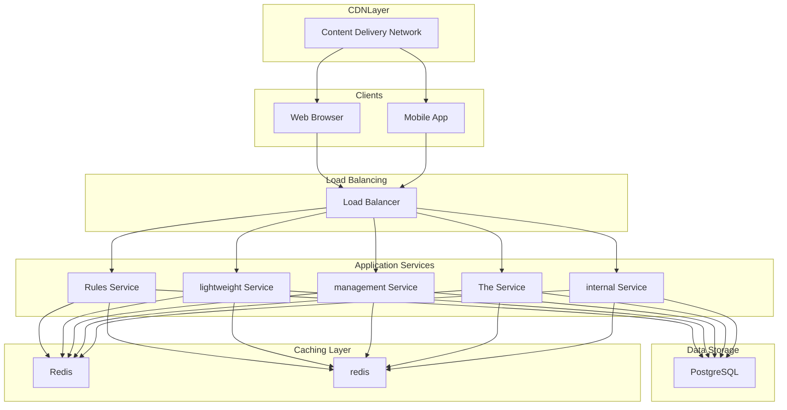

# Design Distributed Rate Limiter

## What is a Rate Limiter?

A rate limiter is a system component that controls the rate at which clients can make requests to a service within a specified time window.
The core idea is simple: track how many requests a client has made and reject or throttle additional requests once they exceed a predefined threshold.
This prevents abuse, protects backend resources, and ensures fair usage across all clients.
**Example:** If a system allows a maximum of **100 requests per minute**, any request beyond that limit within the same minute would either be **throttled (delayed)** or **rejected outright**, often with an HTTP `429 Too Many Requests` response.
In this article, we will dive into the system design of a **distributed rate limiter**, and explore the the 5 most commonly used **rate limiting algorithms **with examples, pros and cons.
This problem is a common choice in system design interviews because it touches on distributed systems, caching, algorithms, and real-time decision making.
It is also a fundamental building block that appears in almost every large-scale system.
Let’s begin by clarifying the requirements.

# 1. Requirements

Before starting the design, it's important to ask thoughtful questions to uncover hidden assumptions, clarify ambiguities, and define the system's scope more precisely.
Here is an example of how a discussion between the candidate and the interviewer might unfold:
**Candidate:** "What is the expected scale? How many requests per second should the rate limiter handle?"
**Interviewer:** "Let's design for a large-scale API platform handling around 10 million requests per second across all clients."
**Candidate:** "Should we rate limit by user, IP address, API key, or some other identifier?"
**Interviewer:** "We need flexibility. The system should support rate limiting by user ID, API key, and IP address. Different APIs might use different identifiers."
**Candidate:** "What should happen when a client exceeds the rate limit? Should we drop requests silently or return an error?"
**Interviewer:** "Return an HTTP 429 (Too Many Requests) error with headers indicating when the client can retry."
**Candidate:** "Do we need to support different rate limits for different APIs or user tiers?"
**Interviewer:** "Yes, premium users might have higher limits than free users. Different API endpoints might also have different limits."
**Candidate:** "Should rate limiting be exact or is approximate acceptable? For example, if the limit is 100 requests per minute, is 101 or 102 acceptable?"
**Interviewer:** "Some approximation is acceptable for performance reasons, but the system should be reasonably accurate."
**Candidate:** "What are the availability requirements? Can the rate limiter become a single point of failure?"
**Interviewer:** "The rate limiter must be highly available. If it fails, we should fail open, meaning allow requests through rather than block legitimate traffic."
After gathering the details, we can summarize the key system requirements.

## 1.1 Functional Requirements

- **Rate Limiting:** Limit the number of requests a client can make within a time window (e.g., 100 requests per minute).
- **Multiple Identifiers:** Support rate limiting by user ID, API key, IP address, or custom identifiers.
- **Configurable Rules:** Allow different rate limits for different APIs, endpoints, and user tiers.
- **Throttle Response:** Return HTTP 429 with appropriate headers (Retry-After, X-RateLimit-Remaining) when limits are exceeded.

## 1.2 Non-Functional Requirements

- **High Availability:** The rate limiter must not become a single point of failure. Target 99.99% availability.
- **Low Latency:** Rate limiting decisions must be made in single-digit milliseconds (p99 < 5ms) to avoid adding significant overhead to API calls.
- **Scalability:** Handle millions of requests per second across a distributed system.
- **Accuracy:** Provide reasonably accurate rate limiting, though slight approximation is acceptable for performance.

# 2. Back-of-the-Envelope Estimation

To understand the scale of our system, let's make some reasonable assumptions.

#### Request Volume

- Total requests: **10 million per second** across all clients
- Peak load (3x factor): **30 million requests per second**

#### Unique Clients

- Active unique clients per day: **10 million**
- Active unique clients at any moment: **1 million** (assuming 10% concurrency)

#### Rate Limit Checks

Each request requires:

- 1 read operation (check current count)
- 1 write operation (increment count)

At peak: `30M requests/sec × 2 operations = 60 million operations per second`

#### Storage (Per Client State)

Each rate limit record stores:

- Client identifier (~50 bytes)
- Request count (~8 bytes)
- Window timestamp (~8 bytes)
- Metadata (~34 bytes)

Total ≈ **100 bytes per client**
**Memory for 1M concurrent clients:** `1M × 100 bytes = 100 MB`
This is small enough to fit entirely in memory, making Redis or in-memory caching highly suitable.

#### Key Insight

The rate limiter is a **read-heavy, latency-sensitive** system where all data fits in memory. This makes in-memory data stores like Redis ideal for this use case.

# 3. Core APIs

The rate limiter needs APIs for both runtime decisions and configuration management.

### 1. Check Rate Limit (Internal API)

#### Endpoint: POST /ratelimit/check

This is the core API called by the API Gateway or application servers to check if a request should be allowed.

##### Request Parameters:

- **client_id** *(required)*: The identifier for the client (user ID, API key, or IP address).
- **resource** *(required)*: The API endpoint or resource being accessed (e.g., `/api/v1/users`).
- **tokens** *(optional)*: Number of tokens to consume (default: 1). Some expensive operations might consume multiple tokens.

##### Sample Response:

- **allowed**: Boolean indicating if the request is permitted.
- **remaining**: Number of requests remaining in the current window.
- **reset_at**: Unix timestamp when the rate limit window resets.
- **retry_after**: Seconds until the client can retry (only present if blocked).

##### Error Cases:

- `200 OK`: Rate limit check completed (allowed or blocked indicated in response body).
- `500 Internal Server Error`: Rate limiter unavailable (fail open, allow request).

### 2. Get Rate Limit Status

#### Endpoint: GET /ratelimit/status/{client_id}

Returns the current rate limit status for a client without consuming any quota.

##### Request Parameters:

- **client_id** *(required)*: The client identifier.
- **resource** *(optional)*: Specific resource to check. If omitted, returns status for all resources.

##### Sample Response:

- **limits**: Array of rate limit rules applied to this client.
- **limit**: Maximum requests allowed per window.
- **remaining**: Requests remaining.
- **reset_at**: When the window resets.

### 3. Configure Rate Limit Rules (Admin API)

#### Endpoint: PUT /ratelimit/rules

Creates or updates rate limiting rules.

##### Request Parameters:

- **resource** *(required)*: The API endpoint pattern (supports wildcards like `/api/v1/*`).
- **tier** *(optional)*: User tier (e.g., "free", "premium"). Default applies to all tiers.
- **limit** *(required)*: Maximum requests allowed.
- **window_seconds** *(required)*: Time window in seconds.
- **algorithm** *(optional)*: Rate limiting algorithm to use (token_bucket, sliding_window, etc.).

# 4. High-Level Design

At a high level, our rate limiting system must satisfy two core requirements:

1. **Real-time Decision Making:** Quickly determine if a request should be allowed or blocked.

2. **Distributed State Management:** Maintain accurate request counts across multiple servers.

The key insight is that rate limiting must happen **before** requests reach the backend services. This means the rate limiter sits in the critical path of every API call and must be extremely fast.
Instead of presenting the full architecture at once, we will build it incrementally by addressing one requirement at a time.
This approach is easier to follow and mirrors how you would explain the design in an interview.

The most fundamental requirement is checking whether a request should be allowed based on the client's recent activity.

### Components Needed

#### Rate Limiter Service

A lightweight service that receives rate limit check requests and returns allow/deny decisions.
**Responsibilities:**
- Receive client identifier and resource information
- Look up the applicable rate limit rules
- Check and update the client's request count
- Return the decision with rate limit headers

#### Rules Cache

An in-memory cache storing rate limit rules to avoid database lookups on every request.
**Responsibilities:**
- Cache rate limit rules (limits, windows, algorithms per resource/tier)
- Refresh periodically or on configuration changes
- Provide sub-millisecond rule lookups

#### Counter Store (Redis)

A distributed in-memory store that tracks request counts per client.
**Responsibilities:**
- Store request counts with automatic expiration
- Support atomic increment operations
- Provide sub-millisecond read/write latency

### Flow: Checking a Rate Limit

1. Client sends an API request to the **API Gateway**.

2. The **API Gateway** calls the **Rate Limiter Service** with the client identifier and resource.

3. The **Rate Limiter Service**:

4. The service returns an allow/deny decision with metadata (remaining requests, reset time).

5. If allowed, the Gateway forwards the request to the backend. If blocked, it returns HTTP 429.

    CDNNode --> Mobile

## 4.2 Requirement 2: Distributed Rate Limiting

In a distributed system with multiple API Gateway instances and Rate Limiter replicas, we need consistent counting across all nodes.

### The Challenge

Without coordination, each rate limiter instance might maintain its own local counter, allowing clients to exceed their limits by distributing requests across different servers.
**Example:**
- Rate limit: 100 requests per minute
- 4 API Gateway instances, each with local counters
- Client sends 25 requests to each instance
- Each instance sees only 25 requests, but total = 100 requests
- Client sends 4 more requests (1 to each instance) = 104 total, but all are allowed

### Solution: Centralized Counter Store

All rate limiter instances share a single, distributed counter store (Redis cluster).

#### Redis Cluster

A horizontally scalable Redis deployment that provides:
**Responsibilities:**
- Centralized, consistent view of all client counters
- Automatic sharding of keys across nodes
- High availability through replication
- Atomic operations (INCR, EXPIRE) for race-condition-free counting

### Flow: Distributed Rate Limit Check

1. Regardless of which Gateway or Rate Limiter handles a request, they all query the **same Redis cluster**.

2. Redis shards keys by client ID, ensuring all requests for a given client hit the same shard.

3. Atomic operations prevent race conditions when multiple requests arrive simultaneously.

## 4.3 Requirement 3: Rule Configuration

The system needs a way to define and update rate limiting rules without redeploying services.

### Additional Components Needed

#### Rules Database

A persistent store for rate limit configurations.
**Responsibilities:**
- Store rate limit rules (resource patterns, limits, windows, algorithms)
- Support CRUD operations for rule management
- Provide audit trail of configuration changes

#### Rules Service

A management service for rate limit configurations.
**Responsibilities:**
- Expose admin APIs for rule management
- Validate rule configurations
- Propagate rule changes to rate limiter instances

### Flow: Rule Configuration

1. Admin sends a rule configuration request to the **Rules Service**.

2. The service validates the rule and saves it to the **Rules Database**.

3. The service notifies all **Rate Limiter** instances to refresh their caches.

4. Rate limiters pull the updated rules and apply them immediately.

## 4.4 Putting It All Together

Here is the complete architecture combining all requirements:

### Core Components Summary

| Component | Purpose |
| --- | --- |
| Load Balancer | Distributes incoming traffic across API Gateways |
| API Gateway | Routes requests, calls rate limiter before forwarding |
| Rate Limiter Service | Makes allow/deny decisions based on rules and counters |
| Rules Cache | In-memory cache of rate limit rules for fast lookups |
| Redis Cluster | Distributed counter store for request tracking |
| Rules Database | Persistent storage for rate limit configurations |
| Rules Service | Admin API for managing rate limit rules |

# 5. Database Design

## 5.1 Storage Requirements

The rate limiter has two distinct storage needs:

1. **Counter Storage:** High-speed, ephemeral storage for request counts (Redis)

2. **Rules Storage:** Persistent storage for rate limit configurations (SQL or NoSQL)

## 5.2 Counter Storage (Redis)

Request counters are stored in Redis with keys structured for efficient lookups and automatic expiration.

### Key Structure

**Example:**

This key stores the request count for:

- Client: `user_123`
- Resource: `/api/v1/orders`
- Window: Unix timestamp `1703980800` (window start time)

### Value Structure

For simple algorithms (Fixed Window), the value is just an integer count.
For more complex algorithms (Token Bucket), the value is a hash:

| Field | Type | Description |
| --- | --- | --- |
| tokens | Float | Current number of tokens in the bucket |
| last_refill | Integer | Unix timestamp of last token refill |

## 5.3 Rules Storage (PostgreSQL)

Rate limit rules require persistent storage with support for complex queries.

### 1. Rate Limit Rules Table

Stores the rate limiting configurations.

| Field | Type | Description |
| --- | --- | --- |
| id | UUID (PK) | Unique identifier for the rule |
| resource_pattern | String | API endpoint pattern (supports wildcards) |
| tier | String | User tier (free, premium, enterprise) or NULL for default |
| limit | Integer | Maximum requests allowed per window |
| window_seconds | Integer | Time window duration in seconds |
| algorithm | Enum | Rate limiting algorithm (token_bucket, sliding_window, etc.) |
| enabled | Boolean | Whether the rule is active |
| priority | Integer | Rule priority (higher = evaluated first) |
| created_at | Timestamp | When the rule was created |
| updated_at | Timestamp | When the rule was last modified |

### 2. Client Overrides Table

Stores custom rate limits for specific clients.

| Field | Type | Description |
| --- | --- | --- |
| id | UUID (PK) | Unique identifier |
| client_id | String | The client identifier |
| resource_pattern | String | API endpoint pattern |
| limit | Integer | Custom limit for this client |
| window_seconds | Integer | Custom window duration |
| reason | String | Why this override exists |
| expires_at | Timestamp | When the override expires (NULL for permanent) |
| created_at | Timestamp | When the override was created |

# 6. Design Deep Dive

Now that we have the high-level architecture and database schema in place, let's dive deeper into some critical design choices.

## 6.1 Rate Limiting Algorithms

The choice of rate limiting algorithm significantly impacts accuracy, memory usage, and burst handling. A good algorithm should:

- **Be accurate** → Enforce limits close to the configured threshold
- **Be fair** → Not penalize clients for bursty but legitimate traffic patterns
- **Be memory-efficient** → Scale to millions of clients
- **Be simple to implement** → Easy to debug and maintain

Let's explore the five primary algorithms, from simple to sophisticated.

### Algorithm 1: Token Bucket

The token bucket is one of the most popular algorithms, used by Amazon and Stripe for API rate limiting.

#### How It Works

Imagine a bucket that holds tokens. The bucket has two key properties:

- **Capacity:** Maximum number of tokens the bucket can hold
- **Refill rate:** How many tokens are added per second

When a request arrives:

1. If there is at least 1 token, remove a token and allow the request

2. If the bucket is empty, reject the request

Tokens accumulate over time (up to the capacity), allowing for controlled bursts.

#### Example

Configuration: 10 tokens capacity, 1 token per second refill

#### Implementation (Redis)

#### Pros

- **Allows controlled bursts:** Clients can use saved-up tokens for short bursts
- **Smooth rate limiting:** Requests are not clustered at window boundaries
- **Memory efficient:** Only stores 2 values per client/resource

#### Cons

- **Slightly complex implementation:** Requires floating-point token calculations
- **Refill timing matters:** Inaccurate clocks can cause drift

### Algorithm 2: Leaky Bucket

The leaky bucket processes requests at a constant rate, similar to water leaking from a bucket at a fixed rate.

#### How It Works

Requests enter a queue (the bucket) and are processed at a fixed rate. If the queue is full, new requests are rejected.

- **Bucket size:** Maximum number of requests that can be queued
- **Outflow rate:** How many requests are processed per second

#### Example

Configuration: Bucket size = 5, Outflow rate = 2 requests/second

#### Pros

- **Constant output rate:** Smooth, predictable load on backend services
- **Simple to understand:** Queue-based model is intuitive

#### Cons

- **No burst handling:** Does not allow any bursts, even if the client was idle
- **Stale requests:** Old requests in the queue might be irrelevant by the time they are processed
- **Memory overhead:** Must store the actual queue, not just a counter

### Algorithm 3: Fixed Window Counter

The simplest algorithm that divides time into fixed windows and counts requests in each window.

#### How It Works

1. Divide time into fixed windows (e.g., each minute: 0:00-0:59, 1:00-1:59)

2. Maintain a counter for the current window

3. Increment counter on each request

4. If counter exceeds limit, reject request

5. Reset counter at the start of each new window

#### Example

Configuration: 100 requests per minute

#### Implementation (Redis)

#### Pros

- **Extremely simple:** Just increment a counter with expiration
- **Memory efficient:** One integer per client per window
- **Fast:** Single Redis operation (INCR)

#### Cons

- **Boundary burst problem:** Clients can send 2x the limit at window boundaries

**Boundary Burst Example:**

Limit: 100 requests per minute
This is a serious issue for systems that need strict rate limiting.

### Algorithm 4: Sliding Window Log

Maintains a log of all request timestamps and counts requests within a sliding window.

#### How It Works

1. Store the timestamp of every request

2. On each new request, remove timestamps older than the window

3. Count remaining timestamps

4. If count < limit, add new timestamp and allow request

5. Else, reject request

#### Example

Configuration: 5 requests per 10 seconds

#### Implementation (Redis)

#### Pros

- **Perfectly accurate:** No boundary issues, exact count within any sliding window
- **Fair:** Requests are counted precisely regardless of when they arrive

#### Cons

- **Memory intensive:** Stores every request timestamp (could be millions per client)
- **Slower:** Multiple Redis operations per request

### Algorithm 5: Sliding Window Counter (Recommended)

A hybrid algorithm that combines the efficiency of Fixed Window with the accuracy of Sliding Window Log.

#### How It Works

Maintain counters for the current and previous windows. Calculate the weighted count based on how far into the current window we are.
**Formula:**

#### Example

Configuration: 100 requests per minute

#### Implementation (Redis)

#### Pros

- **Memory efficient:** Only 2 counters per client per resource (same as Fixed Window)
- **Accurate:** Smooths out window boundary issues
- **Fast:** Just 2 Redis GETs and 1 INCR

#### Cons

- **Approximate:** Not perfectly accurate, but close enough for most use cases
- **Slightly more complex:** Requires weighted calculation

### Summary and Recommendation

| Algorithm | Accuracy | Memory | Speed | Burst Handling | Best For |
| --- | --- | --- | --- | --- | --- |
| Token Bucket | High | Low | Fast | Allows controlled bursts | APIs wanting to allow burst traffic |
| Leaky Bucket | High | Medium | Fast | No bursts | Constant-rate processing |
| Fixed Window | Low | Very Low | Very Fast | Poor (boundary issue) | Simple, non-critical rate limiting |
| Sliding Window Log | Perfect | High | Slow | N/A | Small-scale, exact requirements |
| Sliding Window Counter | High | Low | Fast | Good | General-purpose, recommended default |

**Recommendation:** Use **Sliding Window Counter** as the default algorithm. It provides the best balance of accuracy, performance, and memory efficiency. Use **Token Bucket** when you want to explicitly allow burst traffic patterns.

## 6.2 Distributed Rate Limiting Challenges

When rate limiting across multiple servers, several challenges emerge that do not exist in single-server deployments.

### Challenge 1: Race Conditions

Multiple requests arriving simultaneously can read the same counter value before any of them increment it.
**Example:**
- Limit: 100 requests
- Current count: 99
- 5 requests arrive simultaneously
- All 5 read count = 99, all 5 increment, all 5 allowed
- Final count: 104 (limit exceeded)

#### Solution: Atomic Operations

Use Redis atomic operations or Lua scripts to ensure read-increment-check happens atomically.
**Lua Script for Sliding Window Counter:**

This script executes atomically in Redis, preventing race conditions.

### Challenge 2: Synchronization Latency

In a geographically distributed system, requests might hit different data centers. Synchronizing counters across data centers adds latency.

#### Solution: Local Rate Limiting with Global Sync

**Approach 1: Split Limits**

Divide the global limit across data centers. If the global limit is 1000 requests/minute and you have 4 data centers, each data center gets 250 requests/minute.
**Pros:** No cross-datacenter coordination needed**Cons:** Unfair if traffic is unevenly distributed; clients in one region might be limited while capacity is unused elsewhere
**Approach 2: Async Sync with Local Enforcement**

Each data center maintains local counters and periodically syncs with a global view.

- Local rate limiter allows requests based on local counters
- Background process aggregates counts globally every few seconds
- If global count approaches limit, local limiters become more aggressive

**Pros:** Low latency for decisions**Cons:** Can temporarily exceed limits during sync delay
**Approach 3: Sticky Sessions**

Route all requests from a client to the same data center using consistent hashing on client ID.
**Pros:** Simple, no sync needed**Cons:** Reduces availability; if that data center fails, client is affected

### Challenge 3: Clock Skew

Servers might have slightly different clocks, causing inconsistent window calculations.

#### Solution: Use Redis Server Time

Instead of relying on application server clocks, use Redis TIME command for timestamp generation.
All rate limiter instances use the same Redis cluster, so they all see the same time.

## 6.3 Rate Limiter Placement

Where should the rate limiter sit in the request path? There are three common placements, each with trade-offs.

### Option 1: Client-Side Rate Limiting

The client tracks its own request rate and self-throttles.
**Pros:**
- No server-side overhead
- Fastest feedback loop for the client

**Cons:**
- Clients can be modified to bypass limits
- Malicious clients will ignore limits
- Cannot enforce global limits across clients

**Use Case:** Well-behaved internal services or SDKs that want to avoid hitting rate limits.

### Option 2: API Gateway / Load Balancer

Rate limiting happens at the edge, before requests reach application servers.
**Pros:**
- Protects all downstream services
- Single place to configure and monitor
- Can reject bad traffic early (saves compute)

**Cons:**
- Gateway becomes a potential bottleneck
- Limited visibility into application-specific context

**Use Case:** Most common approach. Suitable for general API rate limiting.

### Option 3: Application-Level / Middleware

Rate limiting logic runs within the application, often as middleware.
**Pros:**
- Full access to application context (user tier, subscription status)
- Can implement complex, business-specific rules
- No additional infrastructure

**Cons:**
- Every application must implement rate limiting
- Requests still reach application servers before being rejected

**Use Case:** Complex rate limiting that depends on application-specific data.

### Recommended Approach: Multi-Layer

Implement rate limiting at multiple layers for defense in depth:

| Layer | Rate Limit Type | Purpose |
| --- | --- | --- |
| CDN/Edge | IP-based, coarse | Block DDoS, obvious abuse |
| API Gateway | API key, user ID | Enforce subscription limits |
| Application | Business rules | Handle edge cases, premium features |

## 6.4 Handling Rate Limiter Failures

The rate limiter sits in the critical path of every request. If it fails, what happens to your API?

### Failure Modes

#### Fail Closed (Deny All)

If the rate limiter is unavailable, reject all requests.
**Pros:** Guarantees rate limits are never exceeded**Cons:** A rate limiter failure takes down your entire API
**Use Case:** Systems where exceeding rate limits is catastrophic (billing, financial transactions)

#### Fail Open (Allow All)

If the rate limiter is unavailable, allow all requests through.
**Pros:** API remains available even when rate limiter fails**Cons:** System could be overwhelmed during outage
**Use Case:** Most APIs where availability is more important than strict rate enforcement

### Recommended: Fail Open with Fallbacks

1. **Primary:** Distributed Redis cluster for rate limiting

2. **Fallback 1:** Local in-memory rate limiting (less accurate but functional)

3. **Fallback 2:** Fail open with aggressive monitoring and alerting

### Circuit Breaker Pattern

Implement a circuit breaker around the rate limiter:

- **Closed (Normal):** Rate limiter is healthy, use it
- **Open (Failed):** Rate limiter is unhealthy, bypass it
- **Half-Open (Probing):** Periodically test if rate limiter has recovered

This prevents cascading failures and allows graceful degradation.

## 6.5 Monitoring and Response Headers

Effective rate limiting requires visibility for both operators and clients.

### Response Headers

When returning rate limit responses, include headers that help clients understand their limits:

| Header | Description | Example |
| --- | --- | --- |
| X-RateLimit-Limit | Maximum requests allowed per window | 100 |
| X-RateLimit-Remaining | Requests remaining in current window | 42 |
| X-RateLimit-Reset | Unix timestamp when window resets | 1703980800 |
| Retry-After | Seconds to wait before retrying (429 only) | 30 |

**Example 429 Response:**

### Metrics to Monitor

| Metric | Description | Alert Threshold |
| --- | --- | --- |
| rate_limit.allowed | Requests allowed per second | N/A (baseline) |
| rate_limit.rejected | Requests rejected per second | > 1% of traffic |
| rate_limit.latency_p99 | 99th percentile check latency | > 10ms |
| rate_limit.redis_errors | Redis connection failures | > 0 per minute |
| rate_limit.fallback_used | Fallback rate limiter activations | > 0 |

### Alerting Rules

1. **High Rejection Rate:** If > 5% of requests are being rejected, investigate potential DDoS or misconfigured limits

2. **Latency Spike:** If p99 latency > 10ms, Redis might be overloaded or network issues

3. **Redis Unavailable:** If Redis errors > 0, failover is active; investigate immediately

4. **Single Client Domination:** If one client > 50% of rejected requests, possible abuse

## References

- [Rate Limiting Fundamentals](https://cloud.google.com/architecture/rate-limiting-strategies-techniques) - Google Cloud's comprehensive guide on rate limiting strategies
- [Stripe Rate Limiters](https://stripe.com/blog/rate-limiters) - How Stripe scaled their API rate limiting using token buckets
- [Kong Rate Limiting Plugin](https://docs.konghq.com/hub/kong-inc/rate-limiting/) - Production-grade rate limiting implementation in API Gateway
- [Redis Rate Limiting Patterns](https://redis.io/learn/develop/java/spring/rate-limiting/sliding-window) - Redis Labs' guide on implementing rate limiters

# Quiz

## Design Rate Limiter Quiz

In a distributed rate limiter, why is an in-memory store commonly chosen for rate-limit state?