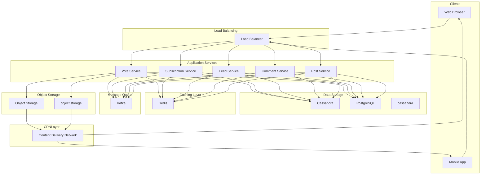

# Design Reddit

Reddit is a social news aggregation and discussion platform where users submit content (posts) to topic-based communities called "subreddits." Other users then vote and comment on these submissions, with the most popular content rising to the top.
The platform combines elements of a forum, social network, and content aggregator. Each subreddit functions as an independent community with its own rules, moderators, and culture.
Users can subscribe to subreddits that interest them, creating a personalized home feed of content from across the platform.
**Other Popular Examples:** Hacker News, Stack Overflow (Q&A variant), Quora
This problem is an excellent system design interview question because it tests your ability to design voting systems, ranking algorithms, nested comment trees, and personalized feed generation at scale.
In this chapter, we will explore the **high-level design of a Reddit-like platform**.
Let's start by clarifying the requirements:

# 1. Clarifying Requirements

Before diving into the design, it's important to ask thoughtful questions to uncover hidden assumptions, clarify ambiguities, and define the system's scope more precisely.
Here is an example of how a discussion between the candidate and the interviewer might unfold:
**Candidate:** "What is the expected scale? How many daily active users and posts should we support?"
**Interviewer:** "Let's design for 50 million daily active users, with about 1 million new posts and 10 million new comments per day."
**Candidate:** "What types of content can users post? Text only, or also images, videos, and links?"
**Interviewer:** "Support text posts, links, and images. Video hosting can be considered out of scope for now, though linking to external videos should work."
**Candidate:** "How should the feed be sorted? Do we need to support multiple sorting options like Hot, New, Top, and Best?"
**Interviewer:** "Yes, users should be able to sort by Hot (trending), New (chronological), Top (highest voted), and Best (optimized for quality). Hot is the default."
**Candidate:** "Should comments be flat or threaded? How deep can the nesting go?"
**Interviewer:** "Comments should be threaded (nested replies). There's no hard limit on depth, but we should handle deep threads gracefully."
**Candidate:** "Do we need to support real-time updates for votes and new comments?"
**Interviewer:** "Real-time is nice-to-have but not required. Near real-time (within a few seconds) is acceptable. Users can refresh to see the latest."
**Candidate:** "What about moderation features? Should we design for content removal, user bans, and spam detection?"
**Interviewer:** "Assume basic moderation exists. Focus on the core platform infrastructure, not the moderation tooling."
After gathering the details, we can summarize the key system requirements.

## 1.1 Functional Requirements

- **Subreddits:** Users can create and subscribe to topic-based communities.
- **Posts:** Users can create posts (text, link, or image) within subreddits.
- **Comments:** Users can comment on posts with support for nested/threaded replies.
- **Voting:** Users can upvote or downvote posts and comments.
- **Feed:** Users can view a personalized home feed (subscribed subreddits) or browse individual subreddits.
- **Sorting:** Support multiple sort orders: Hot, New, Top (by time period), Best.

- **Video Hosting:** Native video upload and streaming.
- **Chat/Messaging:** Direct messages between users.
- **Awards/Coins:** Virtual currency and award system.
- **Moderation Tools:** Advanced mod queue, automod, ban management.

## 1.2 Non-Functional Requirements

- **High Availability:** The system must be highly available (99.9% uptime). Users should always be able to browse content.
- **Low Latency:** Feed loading should complete within 200ms. Post and comment submission within 500ms.
- **Scalability:** Support 50M DAU, 1M posts/day, 10M comments/day, and hundreds of millions of votes per day.
- **Eventual Consistency:** Vote counts and rankings can be eventually consistent (delays of a few seconds acceptable).
- **Read-Heavy:** The system is extremely read-heavy. Optimize for fast reads.

# 2. Back-of-the-Envelope Estimation

To understand the scale of our system, let's make some reasonable assumptions.

#### Posts (Writes)

- New posts per day: **1 million**
- Average post QPS = `1,000,000 / 86,400` ≈ **12 QPS (steady state)**
- Peak post QPS (3x factor) ≈ **36 QPS**

#### Comments (Writes)

- New comments per day: **10 million**
- Average comment QPS = `10,000,000 / 86,400` ≈ **115 QPS (steady state)**
- Peak comment QPS (3x factor) ≈ **350 QPS**

#### Votes (Writes)

- Assume each DAU votes **10 times per day** on average
- Total votes per day = `50M × 10` = **500 million votes/day**
- Average vote QPS = `500,000,000 / 86,400` ≈ **5,800 QPS**
- Peak vote QPS (3x factor) ≈ **17,400 QPS**

#### Feed/Page Views (Reads)

- Assume each DAU views **50 pages per day** (feeds, posts, comments)
- Total page views = `50M × 50` = **2.5 billion views/day**
- Average read QPS = `2,500,000,000 / 86,400` ≈ **29,000 QPS**
- Peak read QPS (3x factor) ≈ **87,000 QPS**

This gives us a **read:write ratio of approximately 500:1** (counting all writes together).

#### Storage

**Posts (per year):**
- Posts per day: 1 million
- Average post size: ~5 KB (title, body, metadata)
- Daily post storage = `1M × 5 KB` = **5 GB/day**
- Annual post storage ≈ **1.8 TB/year**

**Comments (per year):**
- Comments per day: 10 million
- Average comment size: ~1 KB
- Daily comment storage = `10M × 1 KB` = **10 GB/day**
- Annual comment storage ≈ **3.6 TB/year**

**Votes (per year):**
- Votes per day: 500 million
- Vote record size: ~50 bytes (user_id, target_id, vote_type, timestamp)
- Daily vote storage = `500M × 50 bytes` = **25 GB/day**
- Annual vote storage ≈ **9 TB/year**

**Images (per year):**
- Assume 20% of posts include images
- Average image size: 500 KB
- Daily image storage = `200K × 500 KB` = **100 GB/day**
- Annual image storage ≈ **36 TB/year**

# 3. Core APIs

The Reddit-like platform needs APIs for content management, voting, and feed retrieval. Below are the core APIs required for the basic functionality.

### 1. Create Post

#### Endpoint: POST /api/v1/subreddits/{subreddit_id}/posts

This endpoint creates a new post within a subreddit.

##### Request Parameters:

- **title** _(required)_: Post title (max 300 characters).
- **type** _(required)_: "text", "link", or "image".
- **body** _(conditional)_: Text content for text posts.
- **url** _(conditional)_: URL for link posts.
- **image** _(conditional)_: Image file for image posts.
- **flair_id** _(optional)_: Post flair/category tag.

##### Sample Response:

- **post_id**: Unique identifier for the post.
- **permalink**: Permanent URL to the post.
- **created_at**: Creation timestamp.

##### Error Cases:

- `400 Bad Request`: Missing required fields or invalid content type.
- `401 Unauthorized`: User not authenticated.
- `403 Forbidden`: User banned from subreddit or subreddit is restricted.
- `404 Not Found`: Subreddit does not exist.

### 2. Get Feed

#### Endpoint: GET /api/v1/feed

This endpoint returns the user's personalized home feed or a subreddit feed.

##### Request Parameters:

- **subreddit_id** _(optional)_: If provided, returns feed for specific subreddit. Otherwise returns home feed.
- **sort** _(optional)_: "hot" (default), "new", "top", "best", "rising".
- **time_filter** _(optional)_: For "top" sort: "hour", "day", "week", "month", "year", "all".
- **cursor** _(optional)_: Pagination cursor for infinite scroll.
- **limit** _(optional)_: Number of posts to return (default: 25, max: 100).

##### Sample Response:

- **posts**: Array of post objects with metadata, vote counts, and comment counts.
- **next_cursor**: Cursor for fetching the next page.

##### Error Cases:

- `400 Bad Request`: Invalid sort or time filter.
- `404 Not Found`: Subreddit does not exist.

### 3. Get Post with Comments

#### Endpoint: GET /api/v1/posts/{post_id}

This endpoint retrieves a post and its comment tree.

##### Request Parameters:

- **comment_sort** _(optional)_: "best" (default), "top", "new", "controversial", "old".
- **comment_limit** _(optional)_: Max comments to return (default: 200).
- **depth** _(optional)_: Max nesting depth to return (default: 10).

##### Sample Response:

- **post**: Full post object with content and metadata.
- **comments**: Nested tree structure of comments.

### 4. Create Comment

#### Endpoint: POST /api/v1/posts/{post_id}/comments

##### Request Parameters:

- **body** _(required)_: Comment text (max 10,000 characters).
- **parent_id** _(optional)_: Parent comment ID for replies. If omitted, comment is top-level.

##### Sample Response:

- **comment_id**: Unique identifier for the comment.
- **created_at**: Comment timestamp.

### 5. Vote

#### Endpoint: POST /api/v1/vote

This endpoint handles upvotes, downvotes, and vote removal for both posts and comments.

##### Request Parameters:

- **target_type** _(required)_: "post" or "comment".
- **target_id** _(required)_: ID of the post or comment.
- **direction** _(required)_: 1 (upvote), -1 (downvote), or 0 (remove vote).

##### Sample Response:

- **success**: Boolean indicating operation result.
- **new_score**: Updated score (upvotes minus downvotes).

##### Error Cases:

- `400 Bad Request`: Invalid direction or target type.
- `404 Not Found`: Target post or comment does not exist.

### 6. Subscribe to Subreddit

#### Endpoint: POST /api/v1/subreddits/{subreddit_id}/subscribe

##### Request Parameters:

- **action** _(required)_: "subscribe" or "unsubscribe".

##### Sample Response:

- **success**: Boolean indicating operation result.
- **subscriber_count**: Updated subscriber count.

# 4. High-Level Design

At a high level, our system must satisfy four core requirements:

1. **Content Creation:** Users can create posts and comments within subreddits.

2. **Voting System:** Users can upvote/downvote content, affecting rankings.

3. **Feed Generation:** Generate ranked feeds for home page and individual subreddits.

4. **Comment Threading:** Display nested comment trees efficiently.

The system is **extremely read-heavy** (500:1 ratio), so we must optimize aggressively for the read path while ensuring writes are durable and eventually consistent.
Instead of presenting the full architecture at once, we'll build it incrementally by addressing one requirement at a time.
This approach is easier to follow and mirrors how you would explain the design in an interview.

Users need to create posts within subreddits and add comments to posts. This is the write path of our system.

### Components Needed

#### API Gateway

The entry point for all client requests. Handles authentication, rate limiting, and routes requests to appropriate services.

#### Post Service

Manages post creation, retrieval, and updates.
**Responsibilities:**
- Validate post content and subreddit permissions
- Store post metadata
- Handle image uploads (via pre-signed URLs to object storage)
- Publish events for downstream processing

#### Comment Service

Manages comment creation and retrieval.
**Responsibilities:**
- Validate comment content
- Maintain parent-child relationships for threading
- Store comment data

#### Object Storage

Stores images and other media associated with posts.

#### Database

Stores posts, comments, and their metadata.

### Flow: Creating a Post

1. Client sends a `POST` request with post content.

2. For image posts, **Post Service** generates a pre-signed URL for direct upload to **Object Storage**.

3. Post Service validates the content (title length, allowed content types, user permissions).

4. Post Service inserts the post record into the **Database**.

5. Post Service publishes a `PostCreated` event to the **Event Queue** for downstream processing (feed indexing, notifications).

6. Returns the new post ID and permalink to the client.

### Flow: Creating a Comment

1. Client sends a `POST` request with comment content and optional parent_id.

2. **Comment Service** verifies the target post exists.

3. Comment Service validates content and inserts the comment record.

4. Publishes `CommentCreated` event for updating comment counts.

5. Returns the new comment ID to the client.

    CDNNode --> Mobile

## 4.2 Requirement 2: Voting System

Voting is the core mechanic that determines content ranking. Users can upvote, downvote, or remove their vote on posts and comments.

### Components Needed

#### Vote Service

Handles vote processing with high throughput.
**Responsibilities:**
- Record individual votes (for audit and undo)
- Update vote counts efficiently
- Prevent duplicate votes
- Handle vote changes (upvote to downvote)

#### Cache Layer (Redis)

Stores hot vote counts for fast reads and write aggregation.

### Flow: Casting a Vote

1. Client sends a vote request (upvote, downvote, or remove).

2. **Vote Service** checks the database for an existing vote by this user on this target.

3. If the user already voted:

- Calculate the delta (e.g., changing from upvote to downvote = -2)
- Update the vote record

1. If this is a new vote:

- Insert a new vote record
- Apply the vote (+1 or -1)

1. Update the score in **Redis** for fast reads.

2. Publish `VoteChanged` event for feed ranking recalculation.

3. Return the updated score to the client.

### Handling High Vote Throughput

With ~6,000 votes per second average (17,000 peak), we need efficient vote counting:
**Write Path:**
- Write individual vote records to database (for audit, undo capability)
- Update cached counters in Redis (INCRBY/DECRBY)

**Read Path:**
- Always read scores from Redis cache
- Periodically sync cache to database for durability

## 4.3 Requirement 3: Feed Generation

The feed is the primary interface for content discovery. We need to generate ranked lists of posts for:

- **Home Feed:** Posts from user's subscribed subreddits
- **Subreddit Feed:** Posts within a single subreddit
- **Popular/All:** Trending posts across the entire platform

### Additional Components Needed

#### Feed Service

Orchestrates feed generation by combining ranking data with post metadata.
**Responsibilities:**
- Fetch ranked post IDs from ranking cache
- Hydrate posts with full metadata
- Handle pagination
- Filter blocked users/subreddits

#### Ranking Service

Computes and maintains ranked post lists using various algorithms.
**Responsibilities:**
- Compute Hot, New, Top, Rising scores
- Maintain sorted indexes for each subreddit
- Update rankings based on vote events
- Pre-compute popular feeds

#### Subscription Service

Manages user subscriptions to subreddits.
**Responsibilities:**
- Store user-subreddit relationships
- Provide list of subscribed subreddits for feed generation

### Flow: Loading the Home Feed

1. Client requests the home feed with sort preference.

2. **Feed Service** retrieves the user's subscribed subreddits.

3. Feed Service checks cache for pre-computed merged rankings.

4. On cache miss, **Ranking Service** merges hot posts from subscribed subreddits.

5. Feed Service fetches full post metadata from the database.

6. Applies user-specific filters (hidden posts, blocked users).

7. Returns the paginated feed to the client.

### Flow: Loading a Subreddit Feed

Subreddit feeds are simpler since we only need to look at one subreddit's rankings, which are pre-computed and cached.

## 4.4 Requirement 4: Comment Threading

Reddit's nested comment system allows infinite-depth replies, creating tree structures that can be complex to store and retrieve efficiently.

### Additional Components Needed

#### Comment Tree Builder

Constructs the nested comment tree from flat database records.
**Responsibilities:**
- Fetch comments for a post
- Build tree structure from parent-child relationships
- Sort at each level based on user preference
- Handle "load more" for large threads

### Flow: Loading Comments

1. Client requests a post with comments.

2. **Post Service** fetches post data.

3. **Comment Service** retrieves comments:

- First checks Redis cache for pre-built tree
- On cache miss, fetches comments from database
- Builds tree structure from parent-child relationships
- Sorts comments at each level
- Caches the result

1. Returns post with nested comment tree.

## 4.5 Putting It All Together

After covering all requirements individually, here is the complete architecture:

### Core Components Summary

| Component | Purpose |
| --- | --- |
| CDN | Serve images and static assets with low latency |
| API Gateway | Route requests, authentication, rate limiting |
| Post Service | Create and retrieve posts |
| Comment Service | Create and retrieve threaded comments |
| Vote Service | Process votes with high throughput |
| Feed Service | Generate personalized and subreddit feeds |
| Ranking Service | Compute and maintain post rankings |
| Subscription Service | Manage user-subreddit subscriptions |
| Event Queue | Decouple writes from async processing |
| Background Workers | Update rankings, sync caches, index search |
| Redis Cluster | Cache rankings, vote counts, comment trees |
| PostgreSQL | Store posts, comments, users, subscriptions |
| Cassandra | Store votes (high write throughput) |
| Elasticsearch | Full-text search for posts and comments |

# 5. Database Design

## 5.1 SQL vs NoSQL

Our system has different data access patterns that benefit from different database types:
**Posts, Comments, Users, Subreddits:**
- Relational data with clear schemas
- Need for complex queries (joins, aggregations)
- Moderate write volume
- **Choice: PostgreSQL**

**Votes:**
- Extremely high write volume (6K+ QPS)
- Simple key-value access pattern
- Eventual consistency acceptable
- **Choice: Cassandra**

**Rankings and Counters:**
- Need for sorted sets and atomic operations
- Sub-millisecond reads required
- Ephemeral data (can be recomputed)
- **Choice: Redis**

**Search Index:**
- Full-text search across posts and comments
- Complex query support (filters, facets)
- **Choice: Elasticsearch**

## 5.2 Database Schema

#### 1. Subreddits Table (PostgreSQL)

Stores subreddit metadata.

| Field | Type | Description |
| --- | --- | --- |
| subreddit_id | UUID (PK) | Unique identifier |
| name | VARCHAR(21) | Unique subreddit name (r/name) |
| title | VARCHAR(100) | Display title |
| description | TEXT | Sidebar description |
| creator_id | UUID (FK) | User who created subreddit |
| subscriber_count | INTEGER | Number of subscribers |
| is_nsfw | BOOLEAN | Adult content flag |
| created_at | TIMESTAMP | Creation timestamp |

**Indexes:**
- `idx_subreddits_name` UNIQUE on `name`

#### 2. Posts Table (PostgreSQL)

Stores post content and metadata.

| Field | Type | Description |
| --- | --- | --- |
| post_id | UUID (PK) | Unique identifier |
| subreddit_id | UUID (FK) | Parent subreddit |
| author_id | UUID (FK) | Post author |
| title | VARCHAR(300) | Post title |
| type | ENUM | 'text', 'link', 'image' |
| body | TEXT | Text content (for text posts) |
| url | TEXT | External URL (for link posts) |
| image_url | TEXT | Image URL (for image posts) |
| score | INTEGER | Upvotes minus downvotes |
| upvotes | INTEGER | Total upvotes |
| downvotes | INTEGER | Total downvotes |
| comment_count | INTEGER | Number of comments |
| is_deleted | BOOLEAN | Soft delete flag |
| created_at | TIMESTAMP | Creation timestamp |

**Indexes:**
- `idx_posts_subreddit_created` on `(subreddit_id, created_at DESC)` - New sort
- `idx_posts_subreddit_score` on `(subreddit_id, score DESC)` - Top sort
- `idx_posts_author` on `author_id` - User's posts

#### 3. Comments Table (PostgreSQL)

Stores comments with parent references for threading.

| Field | Type | Description |
| --- | --- | --- |
| comment_id | UUID (PK) | Unique identifier |
| post_id | UUID (FK) | Parent post |
| author_id | UUID (FK) | Comment author |
| parent_id | UUID (FK) | Parent comment (NULL for top-level) |
| body | TEXT | Comment content |
| score | INTEGER | Upvotes minus downvotes |
| upvotes | INTEGER | Total upvotes |
| downvotes | INTEGER | Total downvotes |
| depth | INTEGER | Nesting level (0 for top-level) |
| path | LTREE | Materialized path for efficient tree queries |
| is_deleted | BOOLEAN | Soft delete flag |
| created_at | TIMESTAMP | Creation timestamp |

**Indexes:**
- `idx_comments_post_path` on `(post_id, path)` - Fetch comment tree
- `idx_comments_post_score` on `(post_id, score DESC)` - Top comments
- `idx_comments_author` on `author_id` - User's comments

**Note:** The `path` column uses PostgreSQL's LTREE extension for efficient hierarchical queries. Example path: `root.abc123.def456` represents a reply to comment `abc123` under the root.

#### 4. Votes Table (Cassandra)

Stores individual votes for deduplication and vote changes.

| Field | Type | Description |
| --- | --- | --- |
| target_type | TEXT (PK) | 'post' or 'comment' |
| target_id | UUID (PK) | Post or comment ID |
| user_id | UUID (CK) | Voter's user ID |
| direction | TINYINT | 1 (up), -1 (down) |
| created_at | TIMESTAMP | Vote timestamp |

**Partition Key:** `(target_type, target_id)` **Clustering Key:** `user_id`
This allows efficient queries for:

- Check if user voted on item: `WHERE target_type=? AND target_id=? AND user_id=?`
- Get all votes for item: `WHERE target_type=? AND target_id=?`

#### 5. Subscriptions Table (PostgreSQL)

Stores user subscriptions to subreddits.

| Field | Type | Description |
| --- | --- | --- |
| user_id | UUID (PK) | Subscriber |
| subreddit_id | UUID (PK) | Subreddit |
| created_at | TIMESTAMP | Subscription time |

**Composite Primary Key:** `(user_id, subreddit_id)`

#### 6. Users Table (PostgreSQL)

Stores user account information.

| Field | Type | Description |
| --- | --- | --- |
| user_id | UUID (PK) | Unique identifier |
| username | VARCHAR(20) | Unique username |
| email | VARCHAR(255) | Email address |
| password_hash | VARCHAR(255) | Hashed password |
| karma | INTEGER | Total karma score |
| created_at | TIMESTAMP | Account creation |

# 6. Design Deep Dive

Now that we have the high-level architecture and database schema in place, let's dive deeper into some critical design choices.

## 6.1 Ranking Algorithms

The ranking algorithm determines which content surfaces to users. Different sort modes use different algorithms.

### Hot Ranking (Reddit's Classic Algorithm)

The "Hot" algorithm balances recency with popularity. A post with moderate votes posted recently can rank higher than an older post with many votes.
**Reddit's Hot Score Formula:**

Where:

- `score` = upvotes - downvotes
- `created_epoch` = seconds since Reddit epoch (Dec 8, 2005)
- `sign(score)` = 1 if positive, -1 if negative, 0 if zero

**How it works:**
- The logarithm means each order of magnitude in votes adds the same boost
- 10 votes ≈ +1, 100 votes ≈ +2, 1000 votes ≈ +3
- The time component continuously increases
- Every 12.5 hours (45000 seconds) adds +1 to the score
- This means a 10-vote post now beats a 100-vote post from 12.5 hours ago

**Implementation:**

### Best Ranking (Wilson Score)

The "Best" algorithm is used for comments. It answers: "What's the probability this content is good, given the votes we've seen?"
**Wilson Score Confidence Interval:**

Where:

- `p` = upvotes / total_votes (observed proportion)
- `n` = total votes
- `z` = 1.96 (for 95% confidence)

**Why Wilson Score?**
- A comment with 1 upvote, 0 downvotes (100%) shouldn't rank above one with 100 upvotes, 10 downvotes (91%)
- Wilson accounts for sample size uncertainty
- With few votes, the confidence interval is wide (lower score)
- With many votes, we're more confident in the true quality

### Top Ranking

Simple sort by score (upvotes - downvotes) within a time window.
**Time windows:** Hour, Day, Week, Month, Year, All Time

### New Ranking

Simple chronological sort by creation time.

### Rising Ranking

Identifies posts gaining votes quickly. Compares recent vote velocity to historical average.
Posts with high rising scores are gaining momentum and may become hot soon.

### Pre-Computing Rankings

Computing rankings on-the-fly for every request is expensive. Instead, pre-compute and cache:
**Redis Data Structures:**
**Update Strategy:**
- On new post: Add to all ranking sets
- On vote: Recalculate hot score, update sorted set
- Periodic job: Recalculate all scores (handles time decay)

## 6.2 Comment Tree Storage and Retrieval

Storing and retrieving nested comment trees efficiently is one of Reddit's more challenging problems. Let's explore different approaches.

### Approach 1: Adjacency List (Simple Parent Reference)

Each comment stores a reference to its parent.
**Pros:**
- Simple schema
- Easy inserts (just set parent_id)

**Cons:**
- Fetching a tree requires recursive queries or multiple round trips
- Building the tree in application code is complex
- Inefficient for deep trees

### Approach 2: Materialized Path

Store the full path from root to each comment.
**Pros:**
- Fetch entire subtree with single query: `WHERE path <@ 'root.abc123'`
- Easy to determine depth and ancestors
- PostgreSQL LTREE extension provides efficient indexing

**Cons:**
- Path updates are expensive if comment is moved (rare for Reddit)
- Path length grows with depth

**Fetching comments:**

### Approach 3: Nested Sets

Store left/right boundaries for each node.
**Pros:**
- Very fast subtree queries
- Single query to get descendants

**Cons:**
- Inserts require updating many rows (rebalancing)
- Not practical for high-write scenarios like Reddit

### Recommended Approach: Materialized Path + Caching

Use materialized path (LTREE) for storage, with aggressive caching:
**Cache Structure:**
**Cache Invalidation:**
- New comment: Invalidate post's comment cache
- Vote on comment: Update score in cache (or invalidate)
- TTL: 5 minutes for active posts, longer for older posts

### Handling Large Comment Threads

Popular posts can have 10,000+ comments. Loading all comments is impractical.
**Solution: Lazy Loading**

1. Initially load top N comments (e.g., 200) with limited depth

2. Show "load more comments" links for:

- Collapsed deep threads (beyond depth 10)
- Additional top-level comments (pagination)
- Hidden low-score comments

**API Response Structure:**

## 6.3 Home Feed Generation

The home feed aggregates posts from all subreddits a user subscribes to. This is computationally expensive at scale.

### The Challenge

- User subscribes to 50 subreddits
- Each subreddit has thousands of recent posts
- Need to merge and rank across all subscriptions
- Must be fast (< 200ms)

### Approach 1: Fan-out on Read (Pull Model)

When user requests feed:

1. Get user's subscriptions

2. For each subreddit, fetch top N hot posts

3. Merge all posts and re-rank

4. Return top results

**Pros:**
- Always fresh content
- No storage overhead for pre-computed feeds
- Simple architecture

**Cons:**
- High latency for users with many subscriptions
- Redundant computation (same merge for users with similar subscriptions)
- Doesn't scale well for power users

### Approach 2: Fan-out on Write (Push Model)

When a post is created or becomes hot:

1. Find all users subscribed to that subreddit

2. Add post to each user's pre-computed feed

**Pros:**
- Read is simple: just fetch user's feed list
- Very fast reads

**Cons:**
- Massive write amplification (popular subreddit = millions of feed updates)
- Storage intensive
- Stale data if update pipeline lags

### Approach 3: Hybrid Model (Recommended)

Combine both approaches based on subreddit size:
**For Small/Medium Subreddits (< 1M subscribers):**
- Use fan-out on read
- Cache merged feeds per user with short TTL

**For Large Subreddits (> 1M subscribers):**
- Pre-compute "hot posts" list
- Include in everyone's feed merge at read time

**For Popular/All Feed:**
- Pre-compute global hot feed
- Update every few minutes

### Feed Caching Strategy

**Invalidation:**
- User subscribes/unsubscribes: Delete their feed cache
- New vote on post: Update subreddit's sorted set
- New post: Add to subreddit's sorted set

## 6.4 Scaling Vote Storage

With 500 million votes per day, the vote storage system needs special attention.

### Why Cassandra for Votes?

| Requirement | Why Cassandra |
| --- | --- |
| High write throughput | Distributed writes, no single leader |
| Simple access patterns | Key-value lookups (did user vote on item?) |
| Eventual consistency OK | Vote counts can lag by seconds |
| Horizontal scaling | Add nodes as volume grows |

### Vote Table Design

**Primary Key Design:**

This allows:

- Efficient single-vote lookup: Get user's vote on specific item
- Range query: Get all votes for an item (for recomputation)

**Example Queries:**

### Vote Count Caching

Don't query Cassandra for counts on every read. Instead:
**Update Flow:**

1. Write vote record to Cassandra (durable)

2. Update Redis counter (fast reads)

3. Publish event to Kafka

4. Worker batch-updates PostgreSQL (for queries, exports)

### Handling Vote Spam

Protect against vote manipulation:

1. **Rate Limiting:** Max votes per user per minute

2. **Velocity Checks:** Flag sudden vote spikes on a post

3. **Shadow Banning:** Accept votes from suspicious accounts but don't count them

4. **IP/Device Fingerprinting:** Detect multi-account manipulation

## 6.5 Search Implementation

Users need to search for posts, comments, subreddits, and users.

### Search Architecture

### Elasticsearch Index Design

**Posts Index:**
**Search Query Example:**

### Indexing Strategy

**Near Real-Time Indexing:**

1. Post/comment created → Event published to Kafka

2. Search indexer consumes events

3. Bulk index to Elasticsearch (batched for efficiency)

4. Typical delay: 1-5 seconds

**Reindexing:**
- Periodic full reindex for schema changes
- Use index aliases for zero-downtime switches

## 6.6 Scaling Considerations

### Database Sharding

**Posts and Comments (PostgreSQL):**
- Shard by `subreddit_id`
- Each shard handles a subset of subreddits
- Hot subreddits may need dedicated shards

**Votes (Cassandra):**
- Already distributed by partition key
- Add nodes to scale horizontally

**Users:**
- Shard by `user_id`
- Or use single large instance (50M users is manageable)

### Caching Strategy Summary

| Data | Cache | TTL | Invalidation |
| --- | --- | --- | --- |
| Hot rankings per subreddit | Redis Sorted Set | Continuous updates | On vote/new post |
| User's home feed | Redis List | 60 seconds | On subscription change |
| Comment trees | Redis JSON | 5 minutes | On new comment/vote |
| Vote counts | Redis Integer | None | On vote |
| User sessions | Redis Hash | 24 hours | On logout |

### Multi-Region Deployment

For global availability:

1. **Active-Passive:** Single write region, read replicas globally

2. **Read Path:** Route to nearest read replica

3. **Write Path:** Route to primary region

4. **Caching:** Regional Redis clusters for hot data

## References

- [Reddit's Architecture](https://www.infoq.com/presentations/Reddit-Architecture/) - Kevin Rose on Reddit's early architecture
- [Ranking Posts at Reddit](https://medium.com/hacking-and-gonzo/how-reddit-ranking-algorithms-work-ef111e33d0d9) - Explanation of Hot and Best algorithms
- [Storing Hierarchical Data in PostgreSQL](https://www.postgresql.org/docs/current/ltree.html) - LTREE extension documentation
- [Cassandra Data Modeling](https://cassandra.apache.org/doc/latest/cassandra/data_modeling/) - Best practices for high-throughput writes
- [Designing Data-Intensive Applications](https://dataintensive.net/) by Martin Kleppmann - Comprehensive distributed systems guide
- [Building Timeline at Scale](https://blog.twitter.com/engineering/en_us/topics/infrastructure/2017/the-infrastructure-behind-twitter-scale) - Twitter's approach to feed generation

# Quiz

## Design Reddit Quiz

For a Reddit-like system that is extremely read-heavy, which approach most directly helps meet a 200ms feed latency target at large scale?