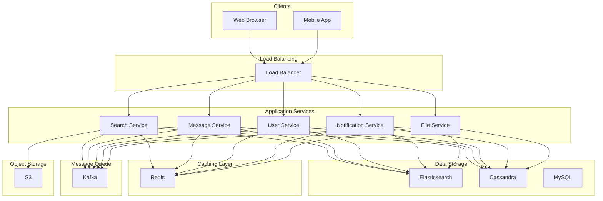
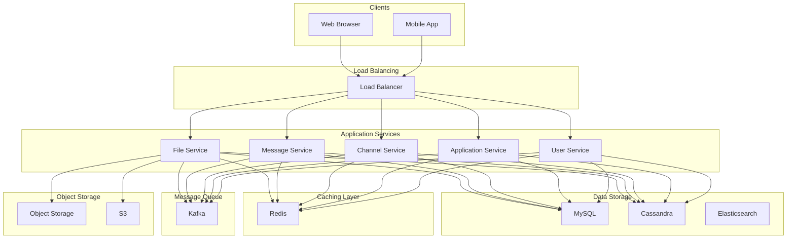
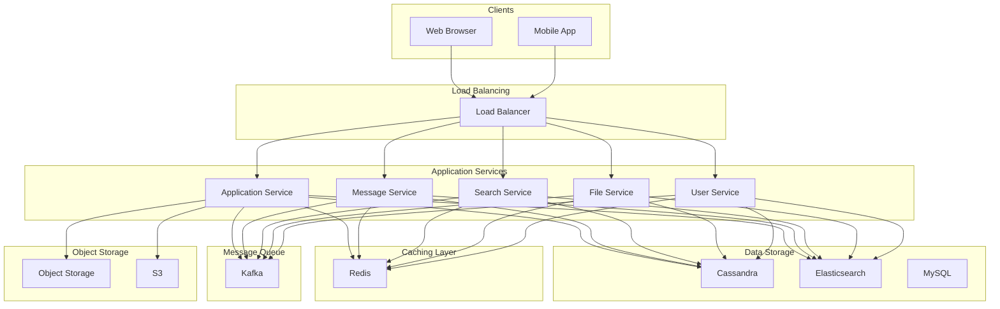

# Design Slack

## What is Slack?

Slack is a workplace communication platform that organizes conversations into channels, enabling teams to collaborate in real-time.
Unlike consumer messaging apps, Slack is built around workspaces (organizations) where team members communicate through public channels, private channels, and direct messages.
Beyond plain messaging, Slack supports file sharing, search, integrations with third-party tools, and features like notifications and mentions that keep conversations organized.
The core idea is to replace scattered email threads with organized, searchable, real-time conversations. Users can create channels for projects, teams, or topics, share files, integrate with external tools, and search through their entire message history.
**Other Popular Examples:** Microsoft Teams, Discord (for communities),
In this chapter, we will walk through the **high-level design of a platform like Slack**.
This system design problem tests your understanding of real-time communication, multi-tenancy, search systems, and the complexities of building a platform that serves both small teams and large enterprises.
Let’s begin by clarifying the requirements.
# 1. Clarifying Requirements
Before diving into the design, it's important to ask thoughtful questions to uncover hidden assumptions, clarify ambiguities, and define the system's scope more precisely.
Here is an example of how a discussion between the candidate and the interviewer might unfold:
**Candidate:** "What is the expected scale? How many organizations and users should we support?"
**Interviewer:** "Let's design for 10 million daily active users across 500,000 workspaces. Some workspaces have 10 users, others have 100,000+."
**Candidate:** "What are the primary communication methods? Channels only, or also direct messages?"
**Interviewer:** "Both. Public channels, private channels, and direct messages between users. Channels can have up to 10,000 members."
**Candidate:** "Should we support threaded conversations within channels?"
**Interviewer:** "Yes, threading is essential. Users should be able to reply to specific messages without cluttering the main channel."
**Candidate:** "How important is search? Should users be able to search through all their message history?"
**Interviewer:** "Search is critical. Users need to search messages, files, and channels across their workspace. It's a core feature."
**Candidate:** "What about integrations and bots? Should we support external applications posting messages?"
**Interviewer:** "Yes, but keep it high-level. Webhooks and bot users should be able to post messages to channels."
**Candidate:** "Do we need to support multiple workspaces per user?"
**Interviewer:** "Yes. A user can belong to multiple workspaces and switch between them."
**Candidate:** "What are the latency and availability requirements?"
**Interviewer:** "Messages should be delivered in real-time, under 200ms. The system should be highly available, targeting 99.99% uptime."

## 1.1 Functional Requirements
- **Channels:** Users can create public and private channels within a workspace. Messages in public channels are visible to all workspace members.
- **Direct Messages:** Users can send private messages to individuals or small groups (up to 8 people).
- **Threaded Replies:** Users can reply to specific messages, creating a thread without cluttering the main channel.
- **Search:** Users can search messages, files, and channels within their workspace.
- **Mentions & Notifications:** Users receive notifications when mentioned (@user, @channel, @here) or when keywords they track appear.
- **Presence:** Users can see who is online, away, or in do-not-disturb mode.
- **File Sharing:** Users can share files in channels and DMs.
- **Integrations:** External applications and bots can post messages via webhooks.

#### Out of Scope:
- **Voice/Video Calls:** Huddles and video conferencing.
- **Screen Sharing:** Real-time screen sharing capabilities.
- **Workflow Builder:** Automated workflows and forms.
- **Enterprise Grid:** Multi-workspace administration for large enterprises.

## 1.2 Non-Functional Requirements
- **Low Latency:** Messages should be delivered within 200ms for online users.
- **High Availability:** 99.99% uptime. Workplaces depend on Slack for critical communication.
- **Scalability:** Support 10M+ DAU, with individual workspaces ranging from 10 to 100,000+ members.
- **Durability:** Messages must never be lost. Full message history should be searchable.
- **Multi-tenancy:** Strict data isolation between workspaces. A user in Workspace A cannot see Workspace B's data.
- **Consistency:** Messages should appear in correct order within a channel.

# 2. Back-of-the-Envelope Estimation
To understand the scale of our system, let's make some reasonable assumptions.

#### Assumptions
- **Daily Active Users (DAU):** 10 million
- **Workspaces:** 500,000
- **Average workspace size:** 20 users (highly variable: 10 to 100,000)
- **Messages per user per day:** 50
- **Average message size:** 200 bytes (text + metadata)
- **Channels per workspace:** 50 (average)
- **Average channel size:** 30 members

#### Message Throughput
- **Total messages per day:** 10M users x 50 messages = **500 million messages/day**
- **Average messages per second:** 500M / 86,400 = **~5,800 messages/second**
- **Peak load (3x factor):** **~17,500 messages/second**

#### Connection Load
- **Concurrent connections:** If 20% of DAU are online at any time = **2 million concurrent connections**
- **Peak concurrent connections:** **~4 million**

Enterprise users tend to be online during business hours, creating predictable peak times.

#### Storage (Per Day)
- **Message storage:** 500M messages x 200 bytes = **100 GB/day**
- **Annual storage:** 100 GB x 365 = **~36 TB/year** (messages only)
- **With files:** File storage can be 10x message storage, depending on usage patterns

#### Search Index
- **Indexed messages:** With 36 TB/year of messages, the search index could be 50-100% of raw data size
- **Search QPS:** If 5% of users search once per day = 500K searches/day = **~6 QPS average**, **~50 QPS peak**

# 3. Core APIs
The messaging platform needs APIs for channels, messages, and real-time communication. Below are the core APIs.

### 1. Send Message

#### Endpoint: POST /channels/{channel_id}/messages
Sends a message to a channel or DM.

##### Request Parameters:
- **channel_id** *(required)*: ID of the channel or DM.
- **content** *(required)*: Message text (supports markdown).
- **thread_ts** *(optional)*: Timestamp of parent message if this is a threaded reply.
- **attachments** *(optional)*: Array of file IDs to attach.
- **mentions** *(optional)*: Array of user IDs being mentioned.

##### Sample Response:
- **message_id**: Unique message identifier.
- **ts**: Message timestamp (also serves as unique ID within channel).
- **channel_id**: Channel where message was posted.
- **created_at**: Server timestamp.

##### Error Cases:
- `400 Bad Request`: Invalid message format.
- `403 Forbidden`: User not a member of the channel.
- `404 Not Found`: Channel does not exist.
- `429 Too Many Requests`: Rate limit exceeded.

### 2. Fetch Messages

#### Endpoint: GET /channels/{channel_id}/messages
Retrieves message history for a channel.

##### Request Parameters:
- **channel_id** *(required)*: ID of the channel.
- **cursor** *(optional)*: Pagination cursor.
- **limit** *(optional)*: Number of messages (default: 100, max: 1000).
- **oldest** *(optional)*: Start of time range (Unix timestamp).
- **latest** *(optional)*: End of time range (Unix timestamp).

##### Sample Response:
- **messages**: Array of message objects.
- **has_more**: Boolean indicating more messages exist.
- **response_metadata**: Contains next_cursor for pagination.

### 3. Create Channel

#### Endpoint: POST /channels
Creates a new channel in the workspace.

##### Request Parameters:
- **name** *(required)*: Channel name (lowercase, no spaces).
- **is_private** *(optional)*: Boolean, default false.
- **description** *(optional)*: Channel purpose/description.
- **member_ids** *(optional)*: Initial members to add.

### 4. Search Messages

#### Endpoint: GET /search
Searches messages across the workspace.

##### Request Parameters:
- **query** *(required)*: Search query string.
- **sort** *(optional)*: Sort order (`relevance` or `timestamp`).
- **count** *(optional)*: Number of results (default: 20).
- **filters** *(optional)*: Filter by channel, user, date range.

##### Sample Response:
- **messages**: Array of matching messages with highlights.
- **total**: Total number of matches.
- **pagination**: Next page cursor.

### 5. Get Channel Members

#### Endpoint: GET /channels/{channel_id}/members
Lists all members of a channel.

##### Request Parameters:
- **channel_id** *(required)*: ID of the channel.
- **cursor** *(optional)*: Pagination cursor.
- **limit** *(optional)*: Number of members to return.

# 4. High-Level Design
At a high level, our system must satisfy four core requirements:
1. **Real-time Messaging:** Messages should reach channel members instantly.
2. **Channel-based Communication:** Messages are organized into channels with varying membership sizes.
3. **Search:** Users need to search their entire message history quickly.
4. **Multi-tenancy:** Strict isolation between workspaces.

The key architectural insight is that Slack's channel model creates a **variable fanout** problem. A message to a 10-person channel behaves differently than a message to a 10,000-person channel.
Instead of presenting the full architecture at once, we'll build it incrementally by addressing one requirement at a time.

## 4.1 Requirement 1: Real-time Channel Messaging
Let's start with the core use case: User A posts a message to a channel, and all online channel members receive it instantly.

### Components Needed

#### Real-time Servers
Stateful servers that maintain persistent WebSocket connections with clients. Each server handles thousands of concurrent connections.
**Responsibilities:**
- Maintain WebSocket connections with clients
- Subscribe users to channels they're members of
- Push messages to connected users in real-time
- Handle connection lifecycle (connect, disconnect, heartbeat)

#### Channel Service
Manages channel metadata and membership.
**Responsibilities:**
- Create, update, delete channels
- Manage channel membership
- Provide channel member lists for fanout
- Enforce channel permissions (public vs private)

#### Message Service
Handles message persistence and retrieval.
**Responsibilities:**
- Persist messages to the database
- Generate message timestamps (ts)
- Handle message edits and deletions
- Retrieve message history

#### Pub/Sub System (Redis)
Enables real-time message distribution across servers.
**Responsibilities:**
- Each channel maps to a pub/sub topic
- Real-time servers subscribe to channels on behalf of connected users
- Messages are published to channel topics for instant fanout

### Flow: Posting a Channel Message
1. **User A** sends a message to [#general](app://obsidian.md/index.html#general) through their WebSocket connection.
2. Real-time Server 1 forwards the message to the **Message Service** for persistence.
3. Message Service stores the message and returns a timestamp (ts).
4. Real-time Server 1 publishes the message to the Redis pub/sub topic `channel:general`.
5. All Real-time Servers subscribed to `channel:general` receive the message.
6. Each server pushes the message to its connected users who are members of [#general](app://obsidian.md/index.html#general).

### Channel Subscription Management
When a user connects:
1. Client establishes WebSocket connection to a Real-time Server
2. Server fetches user's channel memberships from Channel Service
3. Server subscribes to Redis pub/sub topics for each channel
4. When user joins/leaves channels, subscriptions are updated dynamically

## 4.2 Requirement 2: Handling Large Channels
Small channels (10-100 members) work well with direct pub/sub fanout. But what about channels with 10,000+ members?

### The Large Channel Problem
- **Pub/sub limitations:** Redis pub/sub delivers to all subscribers, but with 10,000 members distributed across hundreds of servers, every server receives every message.
- **Connection concentration:** If a channel has 10,000 members and 500 Real-time Servers, each server might only have 20 members, but receives all messages.
- **Hot partition:** Popular channels create hot spots.

### Solution: Tiered Fanout Architecture

#### Small Channels (< 500 members): Direct Pub/Sub
Messages flow directly through Redis pub/sub for minimal latency.

#### Large Channels (500+ members): Queue-based Fanout
1. Message is placed in a message queue (Kafka)
2. Fanout workers consume messages in parallel
3. Each worker is responsible for a subset of channel members
4. Workers send targeted messages to specific Real-time Servers

This approach:
- Distributes fanout work across multiple workers
- Reduces pub/sub topic cardinality
- Enables backpressure handling for message spikes

## 4.3 Requirement 3: Search
Search is a core feature. Users need to find messages, files, and channels quickly.

### Components Needed

#### Search Service
Handles search queries and returns results.
**Responsibilities:**
- Parse and optimize search queries
- Execute searches against the search index
- Rank and filter results
- Apply access control (users can only search what they can see)

#### Search Index (Elasticsearch)
Stores searchable message content.
**Responsibilities:**
- Full-text indexing of messages
- Support for filters (channel, user, date range)
- Relevance scoring
- Handle workspace isolation (multi-tenancy)

#### Indexing Pipeline
Asynchronously indexes new messages.
**Responsibilities:**
- Consume new messages from message queue
- Transform and enrich message data
- Write to Elasticsearch
- Handle index updates for edits/deletions

### Search Architecture

### Search Flow
1. User submits search query: "quarterly report from:@john in:#finance"
2. Search Service parses the query into structured filters
3. Service checks user's channel memberships for access control
4. Query is executed against Elasticsearch with workspace and access filters
5. Results are ranked by relevance and returned with highlights

### Multi-tenancy in Search
Each workspace's data must be isolated. Two approaches:
**Approach 1: Index per Workspace**
- Each workspace has its own Elasticsearch index
- Simple isolation, but many small indexes are inefficient

**Approach 2: Shared Index with Workspace Field (Recommended)**
- All messages in shared indexes
- Every document has `workspace_id` field
- All queries include `workspace_id` filter
- More efficient for small workspaces

## 4.4 Requirement 4: Threads
Threads allow users to reply to specific messages without cluttering the main channel.

### Thread Data Model
Each thread reply references its parent message:
- **Parent message:** Has `thread_ts = null`, but gains `reply_count` and `latest_reply` when replied to
- **Thread reply:** Has `thread_ts = parent_message.ts`

### Thread Behavior
- Thread replies appear in the thread view, not the main channel
- The parent message shows reply count and avatars of participants
- Users can "follow" threads to get notifications
- Threads can be viewed inline or in a side panel

### Thread Delivery
When a thread reply is posted:
1. Message is saved with `thread_ts` pointing to parent
2. Parent message's `reply_count` is incremented
3. Notification sent to thread participants (not entire channel)
4. Main channel sees "X replied to a thread" summary

## 4.5 Putting It All Together
Here's the complete architecture combining all requirements:

### Core Components Summary
| Component | Purpose |
| --- | --- |
| Load Balancer | Distributes WebSocket connections across real-time servers |
| API Gateway | Handles REST API requests, authentication, rate limiting |
| Real-time Servers | Maintain WebSocket connections, deliver messages instantly |
| Message Service | Handles message persistence, edits, deletions |
| Channel Service | Manages channels, membership, permissions |
| User Service | User profiles, preferences, workspace membership |
| Search Service | Handles search queries with access control |
| Notification Service | Processes mentions, generates push notifications |
| Kafka | Message queue for async processing, fanout, indexing |
| Fanout Workers | Distribute messages to real-time servers for large channels |
| Indexing Pipeline | Indexes messages into Elasticsearch |
| Redis | Pub/sub for small channels, caching, presence |
| Message DB | Primary message storage (sharded by workspace) |
| Elasticsearch | Full-text search index |
| S3 | File and attachment storage |

# 5. Database Design

## 5.1 SQL vs NoSQL
For a system like Slack, we need to consider:
- **Transactional integrity:** Channel membership changes need ACID guarantees
- **Complex queries:** Fetching unread counts, channel lists with metadata
- **Sharding requirement:** Large workspaces need horizontal scaling
- **Time-series access:** Messages are typically accessed by time range

**Recommendation:** Use a **sharded relational database** like Vitess (MySQL) or CockroachDB.
- Relational model fits channel/membership structure well
- Sharding by `workspace_id` provides tenant isolation
- Strong consistency for membership and permissions
- Efficient range queries for message history

For very high-scale deployments, message storage could use Cassandra for write throughput, with a relational database for metadata.

## 5.2 Database Schema

### 1. Workspaces Table
Stores workspace (organization) information.
| Field | Type | Description |
| --- | --- | --- |
| workspace_id | UUID (PK) | Unique workspace identifier |
| name | VARCHAR(100) | Workspace name |
| domain | VARCHAR(100) | Workspace URL domain (e.g., company.slack.com) |
| plan | VARCHAR(20) | Subscription plan (free, pro, enterprise) |
| created_at | Timestamp | When workspace was created |

### 2. Users Table
Stores user information within a workspace.
| Field | Type | Description |
| --- | --- | --- |
| user_id | UUID (PK) | Unique user identifier |
| workspace_id | UUID (FK, Shard Key) | Workspace the user belongs to |
| email | VARCHAR(255) | User's email |
| display_name | VARCHAR(100) | Display name in workspace |
| status | VARCHAR(50) | Custom status message |
| presence | ENUM | online, away, dnd, offline |
| created_at | Timestamp | When user joined workspace |

**Index:** `(workspace_id, email)` for user lookup within workspace.

### 3. Channels Table
Stores channel information.
| Field | Type | Description |
| --- | --- | --- |
| channel_id | UUID (PK) | Unique channel identifier |
| workspace_id | UUID (FK, Shard Key) | Workspace the channel belongs to |
| name | VARCHAR(80) | Channel name (lowercase, no spaces) |
| is_private | Boolean | Whether channel is private |
| is_dm | Boolean | Whether this is a DM/group DM |
| topic | TEXT | Channel topic |
| purpose | TEXT | Channel purpose/description |
| member_count | Integer | Number of members (denormalized) |
| created_by | UUID (FK) | User who created the channel |
| created_at | Timestamp | Creation time |

**Index:** `(workspace_id, name)` for channel lookup by name.

### 4. Channel Members Table
Maps users to channels.
| Field | Type | Description |
| --- | --- | --- |
| channel_id | UUID (PK, FK) | Channel ID |
| user_id | UUID (PK, FK) | User ID |
| workspace_id | UUID (Shard Key) | Workspace ID for sharding |
| last_read_ts | VARCHAR(20) | Timestamp of last read message |
| joined_at | Timestamp | When user joined channel |
| role | ENUM | member, admin |

**Index:** `(user_id, workspace_id)` for fetching user's channels.

### 5. Messages Table
Stores all messages.
| Field | Type | Description |
| --- | --- | --- |
| message_id | UUID (PK) | Unique message identifier |
| workspace_id | UUID (Shard Key) | Workspace ID for sharding |
| channel_id | UUID (FK) | Channel where message was posted |
| user_id | UUID (FK) | User who sent the message |
| ts | VARCHAR(20) | Message timestamp (e.g., "1234567890.123456") |
| thread_ts | VARCHAR(20) | Parent message ts (null if not a reply) |
| content | TEXT | Message text content |
| edited_at | Timestamp | When message was last edited (null if never) |
| reply_count | Integer | Number of thread replies (0 if none) |
| created_at | Timestamp | Server timestamp |

**Index:** `(channel_id, ts)` for fetching messages by time range.**Index:** `(channel_id, thread_ts, ts)` for fetching thread replies.

### 6. User Channel State Table
Tracks per-user, per-channel state like unread counts
| Field | Type | Description |
| --- | --- | --- |
| user_id | UUID (PK) | User ID |
| channel_id | UUID (PK) | Channel ID |
| workspace_id | UUID (Shard Key) | Workspace ID |
| last_read_ts | VARCHAR(20) | Last message the user read |
| mention_count | Integer | Unread mentions in this channel |
| is_muted | Boolean | Whether user muted this channel |

# 6. Design Deep Dive
Now that we have the high-level architecture and database schema in place, let's dive deeper into some critical design choices.

## 6.1 Real-time Connection Management
Managing millions of persistent WebSocket connections is one of the biggest infrastructure challenges.

### Connection Distribution

#### The Problem
When a user connects, which Real-time Server should handle them?
**Requirements:**
- Load should be balanced across servers
- Users in the same channel ideally connect to the same servers (reduces cross-server communication)
- Server failures shouldn't lose all connections at once

#### Approach 1: Random Assignment
Load balancer assigns connections randomly (or round-robin).
**Pros:** Simple, even distribution**Cons:** Channel members scattered across all servers, maximum cross-server traffic

#### Approach 2: Workspace-Based Routing
Route users from the same workspace to the same servers.
**Pros:** Most messages stay within a few servers**Cons:** Large workspaces overwhelm single servers, uneven distribution

#### Approach 3: Consistent Hashing (Recommended)
Use consistent hashing on `user_id` to assign connections.
**Pros:**
- Even distribution
- Predictable routing (helpful for debugging)
- Graceful handling of server additions/removals

**Cons:** Channel members still distributed (but pub/sub handles this)

### Connection Lifecycle

### Handling Server Failures
When a Real-time Server crashes:
1. All WebSocket connections are terminated
2. Clients detect disconnection and attempt reconnection
3. Reconnection goes to a different server (consistent hashing with server list change)
4. New server re-subscribes to user's channels
5. Client fetches any missed messages via REST API

**Key insight:** Messages are persisted before acknowledgment, so no messages are lost. Clients may experience brief delays during failover.

## 6.2 Notification System
Slack's notification system is nuanced: not every message generates a notification.

### Notification Rules
| Event | Who Gets Notified |
| --- | --- |
| DM message | All DM participants |
| @user mention | Mentioned user |
| @channel mention | All channel members |
| @here mention | Online channel members |
| Keyword match | Users who configured that keyword |
| Regular channel message | No notification (badge only) |
| Thread reply | Thread participants + @mentioned users |

### Notification Flow
1. Message Service publishes message to Kafka
2. Notification Processor consumes the message
3. Processor extracts mentions (@user, @channel, @here) from content
4. Processor matches against user-configured keywords
5. For each notification target:

### Mention Extraction
Mentions are extracted during message processing:

### Notification Preferences
Users can configure:
- **Global DND hours:** No notifications during specified times
- **Per-channel settings:** Mute channel, notify only on mentions
- **Keyword alerts:** Get notified when specific words appear
- **Mobile push preferences:** All messages, DMs only, mentions only, nothing

## 6.3 Message Ordering and Consistency
Ensuring messages appear in the correct order is crucial for usability.

### Slack's Timestamp-Based Ordering
Slack uses a unique approach: the message timestamp (`ts`) serves as both:
- **Unique identifier** within a channel
- **Ordering key** for display

Format: `"1234567890.123456"` (Unix timestamp with microseconds)

#### Why This Works
- Timestamps are naturally ordered
- High precision (microseconds) minimizes collisions
- Easy to implement pagination (fetch messages where `ts > X`)
- Readable for debugging

#### Handling Collisions
If two messages arrive in the same microsecond:
1. Server detects collision
2. Increment the microsecond portion until unique
3. This preserves order and uniqueness

### Ordering Guarantees
**Within a channel:** Messages from all users appear in `ts` order**Across channels:** No global ordering guarantee (nor needed)**Eventual consistency:** Brief periods where different users see slightly different order

### The "Edit Race" Problem
What if User A edits a message while User B is replying to the original?
1. User B's client has the original message
2. User A's edit is processed
3. User B's reply references the old content

**Solution:** Edits show edit history, and replies quote the original text at reply time.

## 6.4 Presence System
Presence shows whether colleagues are available (online, away, DND).

### Presence States
| State | Meaning |
| --- | --- |
| Active | User is actively using Slack (green dot) |
| Away | User hasn't interacted recently (empty dot) |
| DND | Do not disturb enabled (Z icon) |
| Offline | User is not connected |

### Presence Architecture

### Presence Update Flow
1. **Client activity:** Client sends periodic heartbeats (every 30 seconds)
2. **Presence calculation:**
3. **Storage:** Presence stored in Redis with TTL (expires if no heartbeat)
4. **Fanout:** Presence changes published to interested users

### Presence Fanout Optimization
Sending presence updates to all contacts is expensive. Optimizations:
**Approach 1: Lazy Presence**
- Don't broadcast presence changes
- Clients query presence when viewing channel/DM
- Cache presence with short TTL

**Approach 2: Interest-Based Subscription**
- Users subscribe to presence of people in open channels/DMs
- When channel is closed, unsubscribe
- Reduces fanout to relevant connections

**Approach 3: Presence Aggregation (Recommended)**
- Batch presence updates (every 5 seconds)
- Send delta updates only (changed users)
- Reduces message frequency significantly

### Workspace Presence Scope
In Slack, presence is **workspace-scoped**. A user can be:
- Active in Workspace A
- Away in Workspace B
- Offline in Workspace C

Each workspace tracks presence independently.

## 6.5 Multi-tenancy and Workspace Isolation
Strict isolation between workspaces is non-negotiable. User in Company A must never see Company B's data.

### Isolation Strategies

#### Data Layer Isolation
**Database sharding by workspace_id:**
- All queries include `workspace_id` in WHERE clause
- Shard key ensures data physically separated
- Cross-workspace queries are impossible by design

**Search index isolation:**
- Every Elasticsearch document includes `workspace_id`
- All search queries filter by `workspace_id`
- Index-level permissions as backup

#### Application Layer Isolation
**Authentication context:**
- Every API request is scoped to a workspace
- JWT tokens include `workspace_id` claim
- Services validate workspace access on every request

**Service boundaries:**
- Services never fetch data across workspaces in single query
- APIs don't accept multiple workspace IDs

### Multi-Workspace Users
Users can belong to multiple workspaces (different companies, clients, etc.).
**User identity:**
- Global user identity (email-based)
- Workspace-specific profile (display name, avatar, status)
- Workspace-specific permissions

**Workspace switching:**
- Client maintains separate WebSocket connections per workspace
- Or single connection with workspace context in messages
- Each workspace has independent unread counts, preferences

## 6.6 File Sharing Architecture
File sharing is integral to workplace communication.

### Upload Flow
1. Client requests an upload URL from File Service
2. File Service generates a presigned S3 URL (time-limited, scoped to workspace)
3. Client uploads directly to S3 (bypasses application servers)
4. Client posts message referencing the uploaded file
5. Message includes file metadata (name, size, preview URL)

### File Access Control
- Files inherit channel permissions
- Presigned URLs for downloads (time-limited)
- Files searchable by name and content (for supported types)
- File deletion follows message retention policies

### Preview Generation
For common file types (images, PDFs, documents):
1. S3 triggers Lambda function on upload
2. Lambda generates thumbnails/previews
3. Previews stored in S3 with predictable naming
4. Clients fetch previews for inline display

## 6.7 Search Implementation Details
Search is one of Slack's most valuable features. Let's explore the implementation.

### Index Structure
Each message document in Elasticsearch:

### Query Types
**Simple text search:**
**Filtered search:**
**Phrase search:**

### Access Control in Search
Before returning results, filter by user's accessible channels:
1. Fetch user's channel memberships
2. Add channel filter to Elasticsearch query
3. For private channels, verify membership
4. For DMs, verify participation

### Search Ranking
Results ranked by:
1. **Relevance score:** How well content matches query
2. **Recency:** Newer messages ranked higher
3. **Channel affinity:** Messages from user's active channels boosted
4. **Interaction signals:** Messages with reactions/replies may rank higher

# References
- [Slack Engineering Blog - Scaling Datastores](https://slack.engineering/scaling-datastores-at-slack-with-vitess/) - How Slack uses Vitess for sharding
- [Slack Architecture Overview](https://slack.engineering/flannel-an-application-level-edge-cache/) - Flannel edge cache architecture
- [Building Real-time Features](https://slack.engineering/real-time-messaging-infrastructure/) - Real-time infrastructure at Slack
- [Elasticsearch at Scale](https://www.elastic.co/customers/slack) - How Slack uses Elasticsearch for search
- [WebSocket Scaling Patterns](https://ably.com/topic/scaling-websocket) - Patterns for scaling WebSocket connections
- [Designing Data-Intensive Applications](https://dataintensive.net/) - Fundamentals of distributed systems design

# Quiz

## Design Slack Quiz
In a Slack-like system, what is the primary purpose of a workspace boundary?