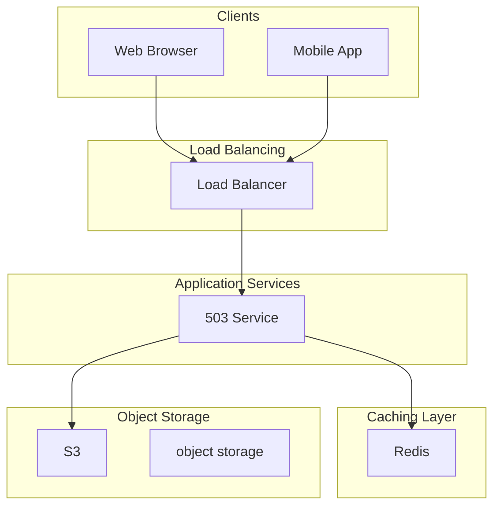

# Design a Time-Series Database

A **Time-Series Database (TSDB)** is a specialized database optimized for storing, querying, and analyzing data points indexed by time.
Each data point typically consists of a timestamp, a metric name, a value, and optional tags or labels.
Unlike general-purpose databases that handle arbitrary queries equally well, TSDBs are built from the ground up for append-heavy workloads and time-range queries.
They excel at ingesting millions of data points per second and retrieving data for specific time windows efficiently.
**Popular Examples:** [InfluxDB](https://www.influxdata.com/), [TimescaleDB](https://www.timescale.com/), [Prometheus](https://prometheus.io/), [Amazon Timestream](https://aws.amazon.com/timestream/), [QuestDB](https://questdb.io/)
What makes time-series data special? Three characteristics shape everything about how we design for it:

1. **Append-only writes:** Once a CPU measurement is recorded, you never go back and change it. Data flows in one direction, from the present into history.

2. **Time-range queries:** Almost every query filters by time. "Show me CPU usage for the last hour" or "What was the p99 latency yesterday between 2pm and 3pm?" Queries that span arbitrary time ranges need to be fast.

3. **Recency bias:** Recent data is queried far more often than old data. The metrics from the last hour matter more than metrics from last month. This asymmetry opens up optimization opportunities.

This problem is a common choice in system design interviews, especially for roles involving monitoring, observability, IoT, or financial systems.
It tests your understanding of write-optimized storage engines, data compression techniques, and query optimization for time-based access patterns.
The challenge is not just storing data, but doing it at scale while keeping queries fast.
In this chapter, we will explore the **high-level design of a time-series database**.
Let's start by clarifying the requirements:

# 1. Clarifying Requirements

Before diving into the design, it's important to ask thoughtful questions to uncover hidden assumptions, clarify ambiguities, and define the system's scope more precisely.
Here is an example of how a discussion between the candidate and the interviewer might unfold:
**Candidate:** "What is the expected data ingestion rate? How many metrics per second should the system handle?"
**Interviewer:** "Let's design for 10 million data points per second at peak."
**Candidate:** "What does a typical data point look like? What information does it contain?"
**Interviewer:** "Each data point has a timestamp, a metric name, a numeric value, and a set of key-value tags for filtering."
**Candidate:** "What types of queries should the system support?"
**Interviewer:** "Primarily time-range queries like 'give me CPU usage for server X from 2pm to 3pm'. Also aggregations like average, max, min over time windows."
**Candidate:** "How long should data be retained? Do we need different granularities for old data?"
**Interviewer:** "Raw data for 30 days, downsampled data (1-minute averages) for 1 year, and hourly aggregates for 3 years."
**Candidate:** "What are the latency requirements for writes and reads?"
**Interviewer:** "Writes should be acknowledged within 100ms. Queries over recent data (last hour) should return in under 100ms. Historical queries can take a few seconds."
**Candidate:** "Should the system support real-time alerting or streaming queries?"
**Interviewer:** "Let's focus on batch queries for now. Alerting can be a follow-up topic."
After gathering the details, we can summarize the key system requirements.

## 1.1 Functional Requirements

- **Data Ingestion:** Accept high-throughput writes of timestamped metric data with tags.
- **Time-Range Queries:** Retrieve data points within a specified time window for a given metric and tag combination.
- **Aggregations:** Support common aggregation functions (sum, avg, min, max, count) over time intervals.
- **Downsampling:** Automatically reduce data granularity for older data to save storage.
- **Retention Policies:** Automatically delete or archive data beyond specified retention periods.

We are intentionally excluding some features to keep the design focused:

- Real-time alerting and streaming queries (these deserve their own system)
- Complex joins across metrics (not a typical TSDB use case)
- Full-text search on tags (use a dedicated search engine)

## 1.2 Non-Functional Requirements

- **High Write Throughput:** Handle 10 million data points per second at peak.
- **Low Query Latency:** Recent data queries (last hour) should return in under 100ms.
- **Scalability:** Horizontally scale to accommodate growing data volumes.
- **Durability:** No data loss once a write is acknowledged.
- **High Availability:** System should remain operational during node failures (99.9% availability).

# 2. Back-of-the-Envelope Estimation

Before diving into the architecture, let's run some quick calculations to understand the scale we are dealing with.
These numbers will guide our design decisions, particularly around storage architecture, partitioning strategies, and whether we can get away with simpler solutions or need to go distributed from the start.

### 2.1 Traffic Estimates

Starting with the numbers from our requirements discussion:

#### Write Traffic (Data Ingestion)

We are designing for 10 million data points per second at peak. Let's understand what this means on a daily basis:
To put this in perspective, that is roughly 3 million data points per second sustained.
A typical server might emit 100-500 metrics per second, so we are talking about monitoring infrastructure in the range of 10,000-30,000 servers.

#### Read Traffic (Queries)

Time-series databases are typically write-heavy, but queries are not trivial either. Let's assume:
Most queries scan a 1-hour window for a specific metric and host combination. At 100 data points per second per metric (typical for CPU, memory metrics), that is:
So each query might need to scan hundreds of thousands of data points and aggregate them. This is why query optimization matters.

### 2.2 Storage Estimates

Each data point consists of several components:

#### Component Breakdown:

- **Timestamp:** 8 bytes (64-bit Unix timestamp in nanoseconds)
- **Metric name:** ~20 bytes average (e.g., `cpu.usage`, `memory.free`)
- **Value:** 8 bytes (64-bit float)
- **Tags:** ~64 bytes average (2-3 key-value pairs like `host=server-1,region=us-east`)

#### Raw Storage (30 Days):

That is nearly 800 TB of uncompressed data for just one month. Storing this naively would be expensive and unwieldy.

#### The Compression Advantage:

Here is where time-series data shines. Because of its predictable patterns, it compresses extremely well:

- Timestamps are sequential (delta encoding reduces them to a few bits)
- Values change slowly (CPU at 45%, 46%, 44% compresses well with XOR encoding)
- Tags repeat across millions of points (dictionary encoding is very effective)

Typical compression ratios for time-series data range from 10:1 to 20:1. Let's use a conservative 10:1:

| Time Period | Raw Data Points | Uncompressed | Compressed (10:1) |
| --- | --- | --- | --- |
| 1 Day | 259 billion | ~26 TB | ~2.6 TB |
| 30 Days | 7.8 trillion | ~778 TB | ~78 TB |
| 1 Year (downsampled) | ~4.7 trillion | ~470 TB | ~47 TB |

### 2.3 Key Insights from These Numbers

These estimates reveal several important design implications:

1. **Write throughput is the primary challenge.** 10 million points per second is substantial. A single disk can handle maybe 100,000 random IOPS. We need to convert random writes into sequential writes, and we need to distribute across many nodes.

2. **Compression is not optional.** Without it, we would need nearly 800 TB for just 30 days of data. With compression, that drops to under 80 TB, which is manageable.

3. **Partitioning by time is essential.** Queries almost always filter by time range. If data is partitioned by time (e.g., 2-hour chunks), we can skip 99% of the data for most queries.

4. **Hot vs cold data matters.** Recent data is queried frequently and needs fast access. Data from last month is rarely touched. We can use cheaper storage for older data.

5. **Downsampling saves storage.** Keeping second-level granularity for a year would require hundreds of terabytes. Aggregating to 1-minute averages reduces that by 60x.

# 3. Core APIs

With our requirements and scale understood, let's define the API contract. A time-series database has a focused API surface, primarily write and query operations.
Unlike general-purpose databases with rich SQL dialects, TSDBs optimize for a narrow set of access patterns, and the API reflects that.
Let's walk through each endpoint.

### 3.1 Write Data Points

#### Endpoint: POST /write

This is the primary ingestion endpoint. Clients send batches of data points, and the system acknowledges once they are durably stored.
Batching is critical for performance, sending one point at a time would never achieve our 10 million points per second target.

#### Request Body:

| Parameter | Type | Required | Description |
| --- | --- | --- | --- |
| points | array | Yes | Array of data point objects to write |
| points[].metric | string | Yes | Name of the metric (e.g., cpu.usage, memory.free) |
| points[].timestamp | integer | Yes | Unix timestamp in milliseconds or nanoseconds |
| points[].value | number | Yes | Numeric value of the measurement |
| points[].tags | object | No | Key-value pairs for filtering (e.g., {"host": "server-1"}) |

#### Example Request:

#### Success Response (200 OK):

The response is intentionally minimal. At 10 million points per second, every byte in the response adds up. We confirm success and the count, nothing more.

#### Error Responses:

| Status Code | Meaning | When It Occurs |
| --- | --- | --- |
| 400 Bad Request | Invalid input | Malformed timestamp, missing required fields, invalid metric name |
| 429 Too Many Requests | Rate limited | Client exceeded their write quota |
| 503 Service Unavailable | System overloaded | Backpressure from storage layer, cluster unhealthy |

The `503` response is important for handling backpressure. When the system cannot keep up with incoming data, it is better to reject writes explicitly than to queue indefinitely and eventually crash.

### 3.2 Query Data Points

#### Endpoint: POST /query

This endpoint retrieves data points matching specified criteria.
We use POST instead of GET because query parameters can be complex (multiple tags, nested aggregations) and may exceed URL length limits.

#### Request Body:

| Parameter | Type | Required | Description |
| --- | --- | --- | --- |
| metric | string | Yes | Name of the metric to query |
| start_time | integer | Yes | Start of time range (Unix timestamp) |
| end_time | integer | Yes | End of time range (Unix timestamp) |
| tags | object | No | Filter by tag key-value pairs |
| aggregation | string | No | Function: avg, sum, min, max, count, p50, p99 |
| interval | string | No | Time bucket size for aggregation (e.g., 1m, 5m, 1h) |

#### Example Request:

This query asks: "Give me the average CPU usage for server-1, broken into 5-minute buckets, for the time window from 1pm to 2pm."

#### Success Response (200 OK):

Each entry in the `data` array represents one time bucket with its aggregated value. The timestamp marks the start of each bucket.

#### Error Responses:

| Status Code | Meaning | When It Occurs |
| --- | --- | --- |
| 400 Bad Request | Invalid query | Time range is invalid, unknown aggregation function |
| 404 Not Found | No data | No data exists for this metric/tag combination |
| 504 Gateway Timeout | Query too slow | Query exceeded time limit (e.g., scanning too much data) |

The `504` response handles the case where a user accidentally queries a year of data without aggregation.
Rather than consuming resources indefinitely, we timeout and ask them to narrow the query or add aggregation.

### 3.3 Delete Data

#### Endpoint: DELETE /data

Allows deletion of data by time range and metric. This is primarily used for data correction (bad data was ingested) or compliance (user data deletion requests).

#### Request Body:

| Parameter | Type | Required | Description |
| --- | --- | --- | --- |
| metric | string | Yes | Name of the metric to delete |
| start_time | integer | Yes | Start of time range to delete |
| end_time | integer | Yes | End of time range to delete |
| tags | object | No | Only delete points matching these tags |

#### Success Response (200 OK):

#### Error Responses:

| Status Code | Meaning | When It Occurs |
| --- | --- | --- |
| 400 Bad Request | Invalid parameters | Malformed time range or metric name |
| 403 Forbidden | Not authorized | User lacks delete permissions |

Deletes are relatively rare in time-series databases. Most data removal happens automatically through retention policies rather than explicit deletes.

### 3.4 API Design Considerations

A few design decisions worth noting:
**Why batch writes?** At 10 million points per second, we cannot afford one network round-trip per point. Clients batch hundreds or thousands of points into each request, amortizing network overhead.
**Why POST for queries?** Complex queries with multiple tag filters, nested aggregations, and large time ranges would create unwieldy URLs. POST with a JSON body is cleaner and has no length limits.
**Timestamps in request vs response:** We accept timestamps in the request but always return them in the response. This makes the API symmetric and helps with debugging.
**No pagination for query results:** Time-series queries typically return manageable result sets (hours or days of aggregated data). If pagination is needed, use smaller time windows or larger aggregation intervals.

# 4. High-Level Design

Now we get to the interesting part: designing the system architecture.
Rather than presenting a complex diagram upfront, we will build the design incrementally, starting with the core challenges and adding components as we need them.
This mirrors how you would approach the problem in an interview.
Our time-series database has two fundamental operations:

1. **Write Path:** Accept millions of data points per second and store them durably.

2. **Read Path:** Query and aggregate data quickly, especially for recent time ranges.

The write-to-read ratio in time-series databases is unusual. Unlike Pastebin or URL shorteners where reads dominate, TSDBs are write-heavy.
We might ingest 10 million points per second but only handle 100,000 queries. This asymmetry shapes our entire design.
The key insight is that time-series data has predictable patterns we can exploit:

- **Append-only:** Once a CPU measurement is recorded, it never changes. We can use append-optimized storage structures.
- **Time-ordered:** Data arrives roughly in timestamp order. We can organize storage by time for efficient range queries.
- **Recency bias:** Recent data is queried far more than old data. We can keep hot data on fast storage and cold data on cheap storage.
- **High compressibility:** Values change slowly (CPU at 45%, 46%, 44%). Specialized compression can achieve 10-20x ratios.

Let's build the architecture step by step, starting with the write path.

The first challenge is handling 10 million data points per second. To put this in perspective, a typical SSD can handle around 100,000 random IOPS.
If we tried to write each data point directly to disk as a separate operation, we would need 100 SSDs just for writes. That is not practical.
The solution is to convert random writes into sequential writes through buffering and batching.
Instead of writing each point individually, we accumulate points in memory and flush them to disk in large batches. Sequential writes are an order of magnitude faster than random writes.
Let's introduce the components we need.

### Components for the Write Path

#### Write API Gateway

Every write request enters through the API Gateway. It handles the concerns common to all requests: SSL termination, request validation, authentication, and routing.
When the system is overloaded, the gateway applies backpressure by returning 503 errors rather than accepting more data than we can handle.

#### Ingest Nodes

These are stateless workers that process incoming data points. Each node maintains an in-memory buffer where it accumulates data points.
When the buffer reaches a size threshold (e.g., 64 MB) or a time threshold (e.g., 2 seconds), the node flushes the buffer to the storage layer.
Why multiple ingest nodes? At 10 million points per second, a single node would be overwhelmed. We distribute the load across many nodes, each handling a fraction of the traffic.

#### Write-Ahead Log (WAL)

Here is the durability problem: if we buffer data in memory and the node crashes before flushing, we lose that data. The Write-Ahead Log solves this.
Before acknowledging a write to the client, we append the data points to a sequential log file. If the node crashes, we can replay the WAL to recover the buffered data.
The WAL is append-only and sequential, so it is extremely fast. We can write to it at nearly disk bandwidth speed.

### The Write Flow in Action

Let's trace through this:

1. **Client sends a batch:** Clients batch hundreds or thousands of points into each request. At 10 million points per second, that might be 10,000 requests per second with 1,000 points each.

2. **Gateway validates and routes:** The gateway checks the request format and routes it to an available ingest node using round-robin or consistent hashing.

3. **WAL append:** The ingest node appends the data points to its Write-Ahead Log. This is a sequential write to disk, very fast.

4. **Acknowledge to client:** Once the WAL write is confirmed, we can safely acknowledge to the client. Their data is durable.

5. **Buffer accumulation:** The data points are added to an in-memory buffer. We do not write to the storage engine yet.

6. **Periodic flush:** Every few seconds (or when the buffer is full), the ingest node compresses the buffer and writes it to the storage engine as a single large file.

7. **WAL cleanup:** After the flush is confirmed, we can mark those WAL entries as persisted and eventually garbage collect them.

**Why this two-phase approach?** It separates durability (fast, must happen synchronously) from storage optimization (can happen asynchronously). We acknowledge writes quickly while still organizing data efficiently for queries.

    S1 --> StorageS3

## 4.2 Requirement 2: Efficient Storage

With data ingested, we need to store it efficiently. Our back-of-envelope calculations showed we are dealing with roughly 78 TB of compressed data for 30 days.
How do we organize this data for both fast writes and fast queries?
The answer lies in a storage pattern that has become standard for time-series databases: **time-based partitioning** with **LSM-tree inspired storage**.

### Why Time-Based Partitioning?

Consider how users query time-series data.
Almost every query includes a time range: "Show me CPU usage from 2pm to 3pm." If we organize data by time, we can skip entire sections of storage that fall outside the query window.
With 2-hour partitions covering 24 hours of data, a 1-hour query touches at most one partition. That is 92% of data skipped without even reading it.

### The Storage Architecture

Let's walk through each component:

#### Memory Buffer (MemTable)

When an ingest node flushes its buffer, the data goes into an in-memory sorted structure. This keeps the most recent data instantly queryable without disk access.
The MemTable is sorted by series ID and timestamp for efficient lookups.

#### Immutable Partition Files

When the MemTable reaches a size threshold, it is flushed to disk as an immutable file. "Immutable" is key here. Once written, these files never change.
This simplifies caching, replication, and crash recovery. If you need to delete or update data, you write a new file (which we will discuss in the compaction section).
Each partition file covers a fixed time range (e.g., 2 hours) and contains:

- Compressed columnar data
- Sparse index for fast lookups
- Bloom filters for series existence checks
- Metadata (time range, series count, file size)

#### Compactor

Over time, many small partition files accumulate. This hurts query performance because each file needs to be opened and scanned separately.
The Compactor runs in the background, merging small files into larger ones.
Compaction also handles:

- Removing deleted data (tombstones are written during deletes, then removed during compaction)
- Merging overlapping time ranges
- Re-applying compression for better ratios

#### Metadata Store

A separate database (often something like etcd or a lightweight embedded store) tracks:

- Which partitions exist and their time ranges
- Which series are in each partition
- Partition state (active, compacting, archived)
- Tag indices for filtering

This metadata is small and fits entirely in memory, enabling fast query planning.

## 4.3 Requirement 3: Fast Queries

Now for the read path. When an engineer opens a dashboard at 3 AM trying to debug a production issue, query performance is critical.
They need to see CPU spikes, memory trends, and error rates, ideally in under a second.
The query path is separate from the write path for good reason. Writes and reads have different performance characteristics and would interfere with each other if they shared resources.
Writes benefit from batching and sequential I/O. Reads benefit from parallel scanning and caching.

### Components for the Read Path

#### Query API Gateway

The gateway receives queries and orchestrates their execution. It is responsible for:

- Parsing and validating the query
- Planning execution (which partitions to scan, how to distribute work)
- Collecting partial results from query nodes
- Aggregating final results

For complex queries that span many partitions, the gateway coordinates a scatter-gather pattern: it sends sub-queries to multiple nodes, collects their partial results, and merges them into the final response.

#### Query Nodes

These are stateless workers that execute queries against the storage layer. Given a time range and tag filters, they:

- Identify relevant partition files using the metadata store
- Scan only the series that match the tag filters (using the inverted tag index)
- Decompress and read the required data
- Compute partial aggregations (if requested)
- Return results to the gateway

#### Query Cache

Some queries are repeated frequently. A dashboard might refresh every 30 seconds, asking for "CPU usage in the last 5 minutes" over and over.
Caching these results can dramatically reduce load on the storage layer.
The cache is tricky for time-series data because queries involve time ranges, and new data constantly arrives.
We typically cache with short TTLs (10-30 seconds) and invalidate based on time rather than data changes.

### The Query Flow in Action

Let's trace through this:

1. **Query arrives:** The client asks for average CPU usage for server-1 between 2pm and 3pm, bucketed into 5-minute intervals.

2. **Cache check:** The gateway checks if we have a cached result for this exact query. Usually a miss, but repeated dashboard refreshes will hit.

3. **Query planning:** The gateway consults the metadata store to find which partitions contain data for 2pm-3pm. Let's say partitions P5 and P6 cover this range.

4. **Scatter:** The gateway sends sub-queries to query nodes. Node 1 handles P5, Node 2 handles P6. This parallelism is key for fast queries.

5. **Partition scan:** Each query node reads its assigned partitions. Using the tag index, it quickly identifies which series match `host=server-1`. It then reads only those series, skipping everything else.

6. **Partial aggregation:** Each node computes the 5-minute averages for its data. This reduces the data volume sent back to the gateway.

7. **Gather and merge:** The gateway receives partial results from both nodes and merges them. Since time ranges do not overlap, this is usually just concatenation.

8. **Cache and return:** The final result is cached (with a short TTL) and returned to the client.

## 4.4 Putting It All Together

Now that we have designed both the write and read paths, let's step back and see the complete architecture.
We have also added background workers that we have not discussed yet: the Compactor, Downsampler, and Retention Manager.
The architecture follows a layered approach, with each layer having specific responsibilities:
**Client Layer:** Users and systems interact through two paths. Metrics collectors and applications send data through the write path. Dashboards and queries come through the read path.
**Write Path:** The Write API Gateway validates and routes incoming data. Ingest nodes buffer and batch data before writing. The WAL ensures durability. Data flows into hot storage for immediate queryability.
**Read Path:** The Query API Gateway orchestrates query execution. The Query Cache reduces load for repeated queries. Query nodes scan partitions in parallel and compute aggregations.
**Storage Layer:** Data lives in multiple tiers based on age and access patterns. Hot partitions (last 24 hours) stay on fast SSDs. Warm partitions (last 30 days) can be on slower storage. Cold data moves to object storage for cost-effective long-term retention.
**Background Workers:** These run continuously to maintain the system:
- **Compactor:** Merges small partition files into larger ones for better query performance
- **Downsampler:** Creates lower-resolution aggregates (1-minute, 1-hour averages) from raw data
- **Retention Manager:** Deletes or archives data that has exceeded its retention period

### Component Responsibilities Summary

| Component | Primary Responsibility | Scaling Strategy |
| --- | --- | --- |
| Write API Gateway | Validate, route, backpressure | Horizontal (stateless) |
| Ingest Nodes | Buffer, WAL, batch writes | Horizontal (partition by series) |
| Write-Ahead Log | Durability before ack | Per-node (replicated) |
| Query API Gateway | Plan, scatter-gather, merge | Horizontal (stateless) |
| Query Cache | Reduce repeated query load | Redis Cluster |
| Query Nodes | Scan, filter, aggregate | Horizontal (stateless) |
| Metadata Store | Track partitions, indices | Replicated (etcd, Raft) |
| Hot Partitions | Store recent data | Distributed across nodes |
| Compactor | Merge files, remove deletes | One per node or centralized |
| Downsampler | Create aggregates | Background job |
| Retention Manager | Delete expired data | Background job |

# 5. Database Design

With the high-level architecture in place, let's zoom into the data layer. Time-series databases use specialized storage models that differ significantly from traditional relational databases.
Understanding these choices is crucial for building a performant system.

## 5.1 Choosing the Right Storage Model

The first decision is how to organize data on disk. The two main options are row-oriented and column-oriented storage, and the choice has profound implications for both writes and reads.

### Why Columnar Storage Wins for Time-Series

Consider what happens when you run a typical query: "What was the average CPU usage across all servers in the last hour?"
With **row-oriented storage**, you read every field of every row (timestamp, metric name, value, tags), even though you only need the values. Most of that I/O is wasted.
With **column-oriented storage**, you read only the value column. The timestamp and tags columns are untouched unless you need them for filtering.
This is a massive I/O saving when you are aggregating millions of data points.

| Factor | Row-Oriented | Column-Oriented |
| --- | --- | --- |
| Typical query (aggregation) | Read entire rows | Read only needed columns |
| Compression | Moderate (mixed data types) | Excellent (similar values) |
| Write pattern | Good for single rows | Better for batches |
| Time-series fit | Poor | Excellent |

The compression advantage is significant. In a column of CPU values, most entries will be similar (say, between 40-60%).
Specialized compression algorithms can represent these as small deltas, achieving 10-20x compression.
In row storage, the variety of data types (strings, integers, floats) limits compression effectiveness.
**Our choice:** Columnar storage, implemented using a format similar to Apache Parquet or ORC. This gives us excellent compression, efficient aggregations, and compatibility with modern analytics tools.

## 5.2 Data Schema

Time-series data has a specific structure that we need to model efficiently. Let's define the core concepts and their schema.

### The Concept of a "Series"

A **series** is a unique combination of metric name and tag set. For example:

- `cpu.usage{host=server-1, region=us-east}` is one series
- `cpu.usage{host=server-2, region=us-east}` is a different series
- `memory.free{host=server-1, region=us-east}` is yet another series

Each series contains many data points, where each point is just a (timestamp, value) pair.

### Schema Tables

#### 1. Time Series Data Table

The core table storing actual data points. Each row is a data point.

| Field | Type | Description |
| --- | --- | --- |
| series_id | UInt64 | Identifier linking to series metadata |
| timestamp | UInt64 | Unix timestamp in nanoseconds |
| value | Float64 | The metric value |

We use a numeric `series_id` instead of storing the full metric name and tags with every data point. This dramatically reduces storage (8 bytes vs potentially 100+ bytes per point).

#### 2. Series Metadata Table

Maps series IDs to their human-readable names and tags.

| Field | Type | Description |
| --- | --- | --- |
| series_id | UInt64 (PK) | Unique identifier |
| metric_name | String | Name of the metric (e.g., cpu.usage) |
| tags | Map<String, String> | Key-value tags (e.g., {host: server-1}) |

This table is small (one row per unique series) and fits entirely in memory. It enables fast translation between series IDs and their metadata.

#### 3. Tag Index Table (Inverted Index)

Enables efficient filtering by tags. Instead of scanning all series to find those matching `host=server-1`, we look them up directly.

| Field | Type | Description |
| --- | --- | --- |
| tag_key | String | The tag key (e.g., host) |
| tag_value | String | The tag value (e.g., server-1) |
| series_ids | Array<UInt64> | All series IDs with this tag |

For a query filtering by `host=server-1`, we look up this index and get the list of matching series IDs instantly. No full scan required.

## 5.3 Physical Storage Layout

On disk, data is organized into time-partitioned files. This layout is fundamental to achieving fast queries and efficient retention.

#### Why this layout?

- **Partition pruning:** A query for "2pm to 3pm" only opens partitions covering that range. All other partitions are skipped entirely.
- **Parallel scanning:** Different partitions can be read by different query nodes simultaneously. This is how we achieve fast queries over large time ranges.
- **Easy retention:** Deleting old data is trivial. Just delete the partition directories older than the retention period. No row-by-row deletion needed.
- **Efficient compaction:** Within a partition, files can be merged and recompressed without affecting other partitions.

#### Inside a Parquet file:

Each row group contains compressed column data, typically around 128 MB before compression. The footer contains statistics (min/max values, row counts) that enable further query optimization.

# 6. Design Deep Dive

The high-level architecture gives us a solid foundation, but system design interviews often go deeper into specific components.
In this section, we will explore the trickiest parts of our design: the write path optimization, compression techniques, query strategies, downsampling, and replication.
These are the topics that distinguish a good system design answer from a great one.

## 6.1 Write Path Optimization

The write path is where the magic happens. At 10 million points per second, we are operating at the edge of what is physically possible. Let's understand why this is hard and how we solve it.

### The Fundamental Challenge

Consider what happens if we try to write each data point directly to disk:
Clearly, writing each point as a separate disk operation is not viable. We need a different approach.

### The LSM-Tree Solution

LSM (Log-Structured Merge) trees are the standard solution for write-heavy workloads. The key insight is converting random writes into sequential writes.
Instead of placing each data point at its final location immediately, we batch points in memory and write them sequentially in large chunks.
Let's trace through each step:

#### Step 1: Write-Ahead Log (WAL)

Before anything else, we append the data points to a sequential log file. This is fast because:

- Sequential writes run at nearly full disk bandwidth (500+ MB/s on NVMe)
- No seeking, no random access, just append
- The WAL can handle millions of operations per second

The WAL provides durability. If the node crashes, we replay the WAL to recover any data that was in memory but not yet flushed to permanent storage.

#### Step 2: MemTable Insertion

Data points are inserted into an in-memory sorted structure (typically a skip list or red-black tree). This is extremely fast, just microseconds per operation.
The MemTable is sorted by series ID and timestamp, which will help with query performance later.

#### Step 3: Acknowledge to Client

At this point, we can tell the client their write succeeded. The data is:

- Durable (in the WAL)
- Queryable (in the MemTable)

We do not wait for the data to be written to permanent storage files.

#### Step 4: Flush to Disk

When the MemTable reaches a size threshold (typically 64-256 MB), a background thread:

1. Makes the current MemTable immutable

2. Creates a new MemTable for incoming writes

3. Writes the immutable MemTable to disk as an SSTable (Sorted String Table)

4. Deletes the corresponding WAL entries

Because we write an entire MemTable at once, this is a large sequential write, efficient for disk I/O.

#### Step 5: Compaction

Over time, we accumulate many SSTable files. Each file represents data from one flush. Queries need to check all files, which gets slow.
Compaction merges small files into larger ones, maintaining good query performance.

### Why This Works

The separation between the fast path (synchronous) and background path (asynchronous) is key:

| Operation | Latency | Throughput |
| --- | --- | --- |
| WAL append | ~10 microseconds | 1M+ ops/sec |
| MemTable insert | ~1 microsecond | 10M+ ops/sec |
| Flush to SSTable | ~100 milliseconds | N/A (background) |

The client experiences only the fast path latency. The expensive disk operations happen in the background.

### The Batching Multiplier

Client-side batching amplifies our efficiency:

- **Without batching:** 10M requests/sec, each with 1 point
- **With 1000-point batches:** 10K requests/sec, each with 1000 points

Network overhead, request parsing, and WAL writes all benefit from larger batches. Most time-series collectors (like Telegraf or Prometheus) batch by default.

## 6.2 Time-Series Compression

Compression is not a nice-to-have for time-series databases. It is essential. Without it, we would need 780 TB for 30 days of data. With good compression, that drops to under 80 TB.
The difference in storage cost alone makes compression a first-class concern.
The good news is that time-series data compresses extremely well, often 10-20x better than general-purpose data. Let's understand why and how.

### Why Time-Series Data is So Compressible

Time-series data has three properties that compression algorithms love:

1. **Timestamps are predictable.** Data points often arrive at regular intervals (every second, every 10 seconds). If we know one timestamp and the interval, we can predict the rest.

2. **Values change slowly.** CPU usage does not jump from 10% to 90% every second. It hovers around similar values: 45.2%, 45.8%, 44.9%. These small variations compress well.

3. **Tags repeat.** Every data point from server-1 has the same tag: `host=server-1`. Storing this string 3 million times per second would be wasteful.

### Compression Technique 1: Delta Encoding for Timestamps

Instead of storing absolute timestamps, we store the difference from the previous value.
The first value is stored in full (8 bytes). Each subsequent value is just the delta (can be stored in 2 bytes for most cases).
For perfectly regular intervals, all deltas are identical, and we can store just the interval once.

#### Taking it further: Delta-of-Delta

In real systems, timestamps are not perfectly regular. Network latency causes slight variations:
The delta-of-deltas are tiny numbers that can be encoded in just a few bits each. This is the approach used by Facebook's Gorilla paper, achieving 15-20x compression on timestamps.

### Compression Technique 2: XOR Encoding for Values

Floating-point values like 45.23 and 45.25 look different to humans, but their binary representations share most bits. XOR encoding exploits this.
The XOR result has mostly zeros, with differences clustered in a few positions. Instead of storing 8 bytes, we can store:

- A flag indicating "same as previous" (if XOR is all zeros)
- Or the position and length of the non-zero region (typically 2-3 bytes)

This technique, also from the Gorilla paper, achieves 4-10x compression on metric values.

### Compression Technique 3: Dictionary Encoding for Tags

Tags are the lowest-hanging fruit. The string `{"host": "server-1", "region": "us-east"}` is 50+ bytes. But we only have thousands of unique tag combinations across millions of data points.
**The solution: build a dictionary.**

This achieves 10-50x compression on tags, and the dictionary itself is small enough to fit in memory.

### The Complete Compression Pipeline

After time-series-specific encoding, we apply a general-purpose block compressor (LZ4, Zstd, or Snappy) for additional gains.
The final result is 8-12 bytes per data point, compared to 100 bytes uncompressed.

### Algorithm Trade-offs

| Algorithm | Compression | Encode Speed | Decode Speed | Use Case |
| --- | --- | --- | --- | --- |
| Gorilla (XOR) | 10-15x | Very Fast | Very Fast | Hot data |
| Delta-of-Delta | 15-20x | Very Fast | Very Fast | Timestamps |
| LZ4 | 2-3x | Fast | Very Fast | Block compression |
| Zstd | 3-5x | Medium | Fast | Cold storage archival |

**Our recommendation:** Use Gorilla-style compression for timestamps and values (as described in Facebook's paper), dictionary encoding for tags, and LZ4 for block compression. This gives us ~10x overall compression with minimal CPU overhead during queries.

## 6.3 Query Optimization

When an engineer opens Grafana at 3 AM to debug a production incident, they need answers fast. A dashboard that takes 10 seconds to load is not just annoying, it is dangerous.
The system might be on fire while they wait.
Query optimization in a time-series database is about doing less work, not faster work. The best query is one that reads as little data as possible to get the answer.

### Strategy 1: Partition Pruning

This is the single most important optimization. By organizing data into time-based partitions, we can skip most of the data entirely.
Consider a query: "Show me CPU usage from 2pm to 3pm today."
Out of 12 partitions, we scan just one. That is 92% of the data skipped without reading a single byte.

### Strategy 2: Tag Index Lookups

Partition pruning filters by time. Tag indices filter by everything else.
When a query includes `host=server-1`, we do not want to scan all series and check each one. Instead:

1. Look up `host=server-1` in the inverted tag index

2. Get back a list of series IDs: [42, 156, 892]

3. Scan only those three series, skip the other 10,000

Without tag indices, every query would be a full scan. With them, most queries touch a tiny fraction of the data.

### Strategy 3: Pre-Aggregation

Sometimes users query large time ranges: "Show me daily CPU averages for the last year." That is 365 days x 86,400 seconds = 31.5 million data points to aggregate.
Pre-aggregation solves this by computing common aggregates in advance:
For the "daily averages for a year" query:

- Without pre-aggregation: read 31.5 million points
- With pre-aggregation: read 365 pre-computed daily values

That is a 86,000x reduction in data processed.

### The Query Execution Pipeline

Here is how all these optimizations work together:

### Caching: The Final Layer

For dashboards that refresh every 30 seconds with the same query, caching results avoids repeated computation.

| Cache Layer | What It Stores | TTL | Hit Rate |
| --- | --- | --- | --- |
| Query Result | Complete query response | 10-60 sec | High for dashboards |
| Metadata | Series IDs, tag mappings | 1 hour | Very high |
| Block | Decompressed data blocks | LRU eviction | Medium |

Caching in time-series databases has a nice property: historical data never changes. A cached result for "CPU from 2pm to 3pm yesterday" is valid forever.
Only queries touching "now" need careful cache invalidation.

## 6.4 Downsampling and Retention

Data has a lifecycle. The CPU reading from 30 seconds ago might be critical for debugging a live incident. The same reading from 6 months ago?
Probably useful only for capacity planning trends, if at all.
Storing full-resolution data forever would be astronomically expensive. At our scale (259 billion points per day), keeping raw data for a year would require petabytes of storage.
Instead, we use a tiered approach: keep high-resolution data for recent periods, and progressively reduce resolution as data ages.

### The Tiered Storage Model

| Tier | Resolution | Retention | Storage Cost | Query Latency |
| --- | --- | --- | --- | --- |
| Hot | 1 second | 7 days | $$$ (NVMe SSD) | < 10 ms |
| Warm | 1 minute | 30 days | $$ (SSD/HDD) | < 100 ms |
| Cold | 1 hour | 1 year | $ (S3 Standard) | < 1 second |
| Archive | 1 day | 3+ years | ¢ (S3 Glacier) | Minutes |

### How Downsampling Works

Downsampling is the process of converting high-resolution data into lower-resolution summaries. The trick is preserving enough information to answer typical queries.
For each time bucket (say, 1 minute), we compute and store:
By storing multiple aggregates, we can answer different query types:

- "Average CPU over the last month" uses the avg values
- "Peak CPU spike last week" uses the max values
- "Total requests last month" uses the sum values

The downsampler runs as a background job, processing old data in batches.
It reads raw data, computes aggregates for each interval, writes to the downsampled partition, and marks the raw data for deletion.

### Retention Enforcement

Deleting old data is where time-based partitioning really shines. Because each partition covers a specific time range, deletion is trivial:

1. **Identify expired partitions:** Query metadata for partitions older than retention period

2. **Delete entire directories:** No row-by-row deletion, just `rm -rf partition_dir`

3. **Update metadata:** Remove partition from the registry

This is orders of magnitude faster than traditional database deletion. We are not scanning through billions of rows looking for old timestamps. We are just deleting files.

## 6.5 High Availability and Replication

Monitoring systems have a peculiar requirement: they need to be available even when everything else is failing.
If your time-series database goes down during an incident, you lose visibility into what is happening. That is exactly when you need it most.
High availability in our context means the system keeps accepting writes and serving queries even when nodes fail. Let's explore how to achieve this.

### The Replication Trade-off

Replication introduces a fundamental tension between consistency, availability, and latency. For time-series data, we can make some favorable trade-offs:

- **Writes must be durable:** Losing metrics data during an incident is unacceptable
- **Reads can be slightly stale:** Seeing data from 1 second ago is usually fine
- **Latency matters:** We cannot wait 100ms for every write to replicate globally

### Quorum-Based Replication

Our recommended approach is quorum writes with relaxed reads. Here is how it works:
**Configuration: N=3, W=2, R=1**
- **N=3:** Each piece of data is stored on 3 nodes
- **W=2:** A write is acknowledged after 2 nodes confirm
- **R=1:** Reads can be served by any single node

This configuration means:

- We can tolerate 1 node failure without data loss (2 nodes still have the data)
- Writes are acknowledged quickly (no need to wait for all 3 replicas)
- Reads are fast (no quorum needed, any node can respond)

The trade-off is that reads might occasionally see slightly stale data. For metrics dashboards, this is acceptable.

### Partitioned Replication

At our scale (10M points/sec), no single replica set can handle all the traffic. We partition data across multiple replica sets:
Each partition has its own leader and followers. A node failure affects only that partition, not the entire cluster.
Queries that span multiple partitions use scatter-gather: the coordinator queries each partition in parallel and merges results.

### Failure Scenarios and Recovery

| Scenario | Impact | Automatic Recovery |
| --- | --- | --- |
| Single node crash | Minimal. Traffic shifts to replicas. | Leader election in ~seconds. Replica rebuilt from peers. |
| Network partition | Quorum side continues operating. Minority side rejects writes. | Heals when network recovers. |
| Disk failure | Data on that disk is lost. Other replicas have copies. | Node rebuilt from peer replicas. |
| Full AZ failure | If replicas are AZ-distributed, other AZs serve traffic. | May need manual intervention for data rebalancing. |

### Leader Election with Raft

When a leader node fails, the remaining replicas need to elect a new leader. We use the Raft consensus protocol for this:

1. Followers detect leader timeout (no heartbeat for ~150ms)

2. A follower becomes a candidate and requests votes

3. Majority vote elects the new leader

4. New leader starts accepting writes

This typically completes in under 1 second, minimizing write disruption.

### Recommended Architecture

For a time-series database at our scale:

1. **Write path:** Quorum writes (N=3, W=2) for durability

2. **Read path:** Read from any replica (R=1) for speed

3. **Partitioning:** By metric name hash, each partition 3x replicated

4. **Leader election:** Raft consensus for each partition

5. **Cross-AZ:** Distribute replicas across availability zones

This provides strong durability guarantees while keeping write latency low and reads fast.

# References

- [Facebook Gorilla Paper](https://www.vldb.org/pvldb/vol8/p1816-teller.pdf) - Time-series compression techniques used by Facebook
- [InfluxDB Storage Engine](https://docs.influxdata.com/influxdb/v2/reference/internals/storage-engine/) - Details on TSM (Time-Structured Merge Tree)
- [Prometheus TSDB](https://prometheus.io/docs/prometheus/latest/storage/) - Storage internals of Prometheus

# Quiz

## Design Time Series Database Quiz

Which workload pattern most strongly motivates using a time-series database design over a general-purpose database?