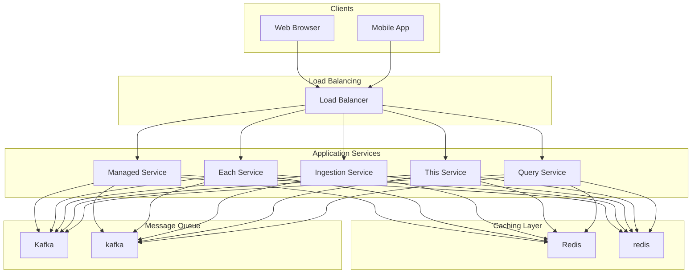

# Design Top K

## What is a Top K System?

A Top K system identifies and returns the K most frequent, popular, or highest-scoring items from a large dataset or continuous stream of events.
The core challenge is maintaining accurate counts across billions of events while providing real-time or near-real-time results.
This requires careful trade-offs between memory usage, accuracy, and latency.
**Popular Examples:** Twitter Trending Topics, YouTube Trending Videos, Amazon Best Sellers, Google Trending Searches, Spotify Top Charts
This problem tests your understanding of streaming algorithms, distributed counting, and trade-offs between precision and scalability.
In this chapter, we will explore the **high-level design of a Top K system**.
Let's start by clarifying the requirements:

# 1. Clarifying Requirements

Before diving into architecture diagrams, we need to understand exactly what we are building. A Top K system for search queries looks different from one for video views.
The time windows matter, the accuracy requirements matter, and the expected scale dramatically affects our design choices.
Here is how a requirements discussion might unfold in an interview:
**Candidate:** "What kind of events are we tracking? Search queries, clicks, purchases?"
**Interviewer:** "Let's design for search queries, but the system should be generalizable to other event types."
**Candidate:** "What is the expected scale? How many events per second?"
**Interviewer:** "Assume 100,000 queries per second at peak, with billions of unique queries over time."
**Candidate:** "What time windows do we need to support? Real-time, hourly, daily?"
**Interviewer:** "We need to support multiple time windows: last 1 minute, last 1 hour, last 24 hours, and last 7 days."
**Candidate:** "How fresh should the results be? Can we tolerate a few seconds of delay?"
**Interviewer:** "For the 1-minute window, results should update within 5-10 seconds. Longer windows can have up to 1-minute delay."
**Candidate:** "Is exact accuracy required, or can we accept approximate results?"
**Interviewer:** "Approximate results are acceptable for heavy hitters. We care about identifying the top items, not exact counts."
**Candidate:** "What value of K should we support?"
**Interviewer:** "K can range from 10 to 1000, but most common queries will be for Top 10 or Top 100."
This conversation reveals several important constraints. We are dealing with high throughput, multiple time windows, and the flexibility to accept approximate results in exchange for scalability.
Let's formalize these into requirements.

## 1.1 Functional Requirements

Based on the discussion, here is what the system must do:

- **Event Ingestion:** Accept and process high-volume event streams (search queries, clicks, views).
- **Top K Query:** Return the K most frequent items for a given time window.
- **Multiple Time Windows:** Support various windows: 1 minute, 1 hour, 24 hours, 7 days.
- **Real-time Updates:** Results should reflect recent activity within acceptable latency bounds.

## 1.2 Non-Functional Requirements

Beyond features, here are the qualities that make the system production-ready:

- **High Throughput:** Handle 100,000+ events per second.
- **Low Latency:** Query response time under 100ms (p99).
- **Scalability:** Scale horizontally as event volume grows.
- **Availability:** System should remain operational during partial failures (99.9% uptime).
- **Accuracy Trade-off:** Accept approximate counts to achieve scalability, but ensure heavy hitters are correctly identified.

The last point deserves emphasis. In a Top K system, we care more about relative ordering than absolute precision.
If "iPhone 16" has 100,000 searches and "Galaxy S24" has 95,000, we need to get the ordering right. Whether the exact count is 100,000 or 99,847 matters less.

# 2. Back-of-the-Envelope Estimation

Before diving into the design, let's run some calculations to understand the scale we are dealing with.
These numbers will guide our architectural decisions, particularly around memory usage, storage, and the feasibility of exact versus approximate counting.

### 2.1 Traffic Estimates

Starting with the numbers from our requirements discussion:

#### Event Ingestion

We expect 100,000 queries per second at peak, with an average of about 50,000 QPS:
This is substantial traffic. For perspective, processing 100,000 events per second means each event has only 10 microseconds of "budget" if processed sequentially.
We will need parallel processing and efficient data structures.

#### Query Traffic

Top K queries are much less frequent than events. A reasonable estimate might be 1,000 queries per second, mostly for the homepage or dashboard views:
This is easily manageable, especially if we pre-compute and cache the results.

### 2.2 Unique Items and Distribution

Understanding the distribution of queries is crucial for our design:
This high cardinality (many unique items) is what makes Top K challenging. If we only had 10,000 unique queries, we could store exact counts for everything in a small hash map.
With 500 million unique items, we need to be smarter.

#### Zipf's Law and Heavy Hitters

Search queries follow a Zipf distribution, where a small number of popular queries account for most of the traffic:
This is good news for our design. We only need accurate counts for the heavy hitters (the frequently occurring items).
The long tail of rare queries can be counted approximately or even ignored for Top K purposes.

### 2.3 Memory Requirements

Let's estimate how much memory we would need for different approaches:

#### Exact Counting (Naive Approach)

If we store exact counts for every unique query:
This is technically feasible on a single machine with enough RAM, but it is expensive and does not scale well. As unique items grow, memory grows linearly.

#### Approximate Counting (Count-Min Sketch)

A probabilistic data structure like Count-Min Sketch uses fixed memory regardless of unique item count:
The difference is dramatic: 148 GB versus 3 MB. This is why approximate algorithms are essential at scale.

#### Result Storage

The actual Top K results are tiny:
Pre-computed results fit easily in cache and can be served with sub-millisecond latency.

### 2.4 Key Insights

These estimates reveal several important design implications:

1. **Approximate counting is not optional.** At 500 million unique items, exact counting requires too much memory. Probabilistic data structures reduce memory by 10,000x.

2. **Heavy hitters dominate.** Zipf's law means we can focus accuracy on the top items. The long tail matters less for Top K.

3. **Pre-compute results.** With only ~232 KB of result data per time window, we should pre-compute Top K and serve from cache rather than computing on demand.

4. **Event ingestion is the bottleneck.** At 100,000 events per second, ingestion needs careful design. Query serving is comparatively easy.

# 3. Core APIs

The Top K system needs just two APIs: one for ingesting events and one for querying results. Let's design both with careful attention to usability and performance.

### 3.1 Ingest Event

#### Endpoint: POST /events

This endpoint accepts individual events or batches for processing.
Because event ingestion is high-volume and latency-sensitive, the API acknowledges receipt immediately and processes events asynchronously.

#### Request Body:

| Parameter | Type | Required | Description |
| --- | --- | --- | --- |
| event_type | string | Yes | Type of event (e.g., "search", "click", "view"). Allows the system to track multiple event types separately |
| item_id | string | Yes | The item being tracked. For search queries, this is the query string itself |
| timestamp | ISO 8601 | No | When the event occurred. Defaults to server time if not provided. Useful for late-arriving events |
| metadata | object | No | Additional context like region, device type, or user segment. Can be used for filtered Top K queries |

#### Example Request (Single Event):

#### Example Request (Batch):

For high-throughput scenarios, clients can send batches to reduce HTTP overhead:

#### Success Response (202 Accepted):

We return 202 (Accepted) rather than 201 (Created) to indicate that events are queued for processing, not yet fully processed. This sets appropriate expectations for the client.

#### Error Responses:

| Status Code | Meaning | When It Occurs |
| --- | --- | --- |
| 400 Bad Request | Invalid input | Missing required fields, malformed JSON, or invalid event_type |
| 413 Payload Too Large | Batch too big | Batch exceeds maximum size (e.g., 1000 events) |
| 429 Too Many Requests | Rate limited | Client is sending events faster than allowed |
| 503 Service Unavailable | System overloaded | Kafka or downstream services are not accepting events |

**Why async processing?** At 100,000 events per second, we cannot afford to wait for each event to be fully counted before responding. The API gateway validates the request format and pushes to a message queue immediately. The actual counting happens downstream.
**Why batch support?** HTTP overhead (connection setup, headers, TLS handshake) adds up at high volumes. Batching 100 events into one request can reduce overhead by 10x or more.

### 3.2 Get Top K

#### Endpoint: GET /top-k

This endpoint returns the K most frequent items for a specified time window. Because results are pre-computed and cached, responses are fast.

#### Query Parameters:

| Parameter | Type | Required | Description |
| --- | --- | --- | --- |
| k | integer | Yes | Number of top items to return (1-1000) |
| window | string | Yes | Time window: "1m", "1h", "24h", or "7d" |
| event_type | string | No | Filter by event type. Defaults to "search" |

#### Example Request:

#### Success Response (200 OK):

The `generated_at` timestamp tells the client when this result was computed.
The `freshness_seconds` field indicates how old the data is, which is useful for displaying "updated X seconds ago" in the UI.

#### Error Responses:

| Status Code | Meaning | When It Occurs |
| --- | --- | --- |
| 400 Bad Request | Invalid parameters | K out of range, unsupported window, invalid event_type |
| 404 Not Found | No data available | No events have been processed for this window yet |
| 503 Service Unavailable | Cache unavailable | Result cache is down, cannot serve pre-computed results |

**Why pre-compute?** Computing Top K on demand would require scanning through millions of counters, taking seconds. By pre-computing results every few seconds and caching them, we serve requests in milliseconds.
**Why return counts?** The counts help users understand the magnitude of trends. "iPhone 16" with 145,000 searches is clearly dominant compared to "weather tomorrow" with 65,000. Note that these are approximate counts, but they are accurate enough for this purpose.

# 4. High-Level Design

Now we get to the interesting part: designing the system architecture.
Rather than presenting a complex diagram upfront, we will build the design incrementally, starting with the core problem and adding components as we encounter challenges.
At the highest level, our system needs to do two things:

1. **Ingest and count events:** Accept millions of events per second and maintain frequency counts.

2. **Compute and serve Top K:** Periodically identify the K most frequent items and serve this list to clients.

These are fundamentally different workloads with different characteristics.
Event ingestion is write-heavy, high-throughput, and must be durable. Top K queries are read-heavy, latency-sensitive, and can tolerate some staleness.
This separation allows us to optimize each path independently.
Let's build the architecture step by step.

The first challenge is accepting 100,000+ events per second without losing data or creating bottlenecks. A single server processing events synchronously would fall over immediately.
We need a design that buffers, parallelizes, and processes events efficiently.

### Components Needed

#### API Gateway

The entry point for all incoming events. It handles concerns that are common across all requests:

- **Rate limiting:** Prevents any single client from overwhelming the system
- **Request validation:** Rejects malformed requests before they consume resources
- **Load balancing:** Distributes traffic across multiple backend instances

The gateway does not process events, it just validates and forwards them. This keeps it fast and stateless.

#### Message Queue (Kafka)

This is the key to handling high throughput. Instead of processing each event synchronously, the gateway publishes events to Kafka and returns immediately.
This decouples producers from consumers and provides several benefits:

- **Buffering:** Kafka absorbs traffic spikes, smoothing out bursts
- **Durability:** Events are persisted to disk, ensuring no data loss
- **Parallelism:** Multiple consumers can read from Kafka simultaneously
- **Backpressure:** If consumers fall behind, Kafka holds events until they catch up

We partition the Kafka topic by `item_id` hash, so all events for the same item go to the same partition. This will be important for accurate counting.

#### Ingestion Service

Stateless workers that read from Kafka and update counters. Each service:

- Consumes events from one or more Kafka partitions
- Maintains local counts in memory (for batching)
- Periodically flushes counts to the central count store

Running multiple ingestion services provides horizontal scalability. Add more services to handle more throughput.

#### Count Store

Where we maintain the frequency counts. This could be Redis, a time-series database, or in-memory data structures, depending on our accuracy and performance requirements.
We will explore the options in the deep dive.

### The Ingestion Flow

Let's trace through what happens when events arrive:
The key insight is the separation between acknowledgment and processing. The client gets a response in milliseconds (after Kafka ack), but actual counting happens asynchronously.
This is acceptable because our results are already expected to have a few seconds of delay.
**Why batch local counts before flushing?** Updating the central store for every single event would create 100,000 writes per second. By batching locally and flushing every few seconds, we reduce this to a few hundred writes per second while losing only a small amount of freshness.

    S5 --> QueueKafka

## 4.2 Requirement 2: Top K Computation

Once events are counted, we need to efficiently identify the K most frequent items. This is where the algorithmic challenges begin.

### The Problem

With 500 million unique items, we cannot simply scan through all counts and sort them. That would take seconds, far too slow for real-time results. We need smarter approaches.

### Additional Components

#### Aggregation Service

This service is responsible for computing Top K from the distributed counters. It runs periodically (triggered by the scheduler) and performs three steps:

1. Read counts from the count store (or from multiple ingestion nodes)

2. Run a Top K algorithm (heap-based selection or similar)

3. Write the results to the result cache

For different time windows, we run different aggregation jobs with different frequencies:

- 1-minute window: Run every 5-10 seconds
- 1-hour window: Run every 30-60 seconds
- 24-hour window: Run every few minutes
- 7-day window: Run every 10-15 minutes

#### Result Cache (Redis)

Stores the pre-computed Top K results. This is what the Query Service reads from. The cache is small (just a few hundred KB per window) and serves queries with sub-millisecond latency.

#### Scheduler

A simple cron-like service that triggers aggregation jobs at the right intervals. In production, this might be Kubernetes CronJobs, AWS EventBridge, or Airflow.

### The Query Flow

Serving Top K queries is now trivial:
Because results are pre-computed, the query path is just a cache lookup. No computation happens at query time. This is how we achieve sub-100ms latency even under high query load.

## 4.3 Requirement 3: Multiple Time Windows

Supporting multiple time windows (1 minute, 1 hour, 24 hours, 7 days) requires careful design. We cannot simply keep one big counter per item because old events need to "fall off" as time passes.

### Time-Based Bucketing

The solution is to partition counts into time buckets. Instead of storing "iPhone 16: 100,000 total," we store counts per time bucket:

#### How it works:

Each incoming event increments the counter for its current time bucket. To compute the count for a time window, we sum the counts across all relevant buckets.

#### Sliding vs. Tumbling Windows

There are two approaches to windowing:

- **Tumbling windows:** Fixed, non-overlapping windows. The "last hour" resets exactly on the hour.
- **Sliding windows:** The window slides continuously. "Last hour" always means "60 minutes ago until now."

Sliding windows provide a better user experience (no jarring resets) but are more complex to implement. We use hopping windows as a compromise: fixed-size windows that advance by a small hop interval.
With 1-minute buckets and a 1-minute hop, our "last hour" result is at most 1 minute stale, which is acceptable for our requirements.

### Bucket Expiration

Old buckets need to be cleaned up to prevent unbounded storage growth. Each bucket has a TTL:

| Window | Bucket Size | Buckets Retained | Total Storage |
| --- | --- | --- | --- |
| 1 minute | 1 second | 60 | 60 buckets |
| 1 hour | 1 minute | 60 | 60 buckets |
| 24 hours | 1 hour | 24 | 24 buckets |
| 7 days | 1 day | 7 | 7 buckets |

When a bucket's time passes, it is no longer needed for any window and can be deleted. Redis TTLs handle this automatically.

## 4.4 Putting It All Together

Now let's see the complete architecture with all components:

### Data Flow Summary

**Write Path (Event Ingestion):**

1. Client sends events to API Gateway

2. Gateway validates and publishes to Kafka

3. Ingestion services consume from Kafka

4. Services update counts in Redis (time-bucketed)

5. Older data flows to Time-Series DB for historical analysis

**Read Path (Top K Query):**

1. Client requests Top K from Query Service

2. Query Service reads pre-computed results from Redis

3. Results returned in milliseconds

**Computation Path (Background):**

1. Scheduler triggers Aggregation Service periodically

2. Aggregation Service reads counts from Redis

3. Computes Top K using heap-based selection

4. Stores results back in Redis for Query Service

### Component Summary

| Component | Purpose | Scaling Strategy |
| --- | --- | --- |
| API Gateway | Validation, rate limiting | Horizontal (stateless) |
| Kafka | Event buffering and durability | Add partitions |
| Ingestion Service | Event counting | Horizontal (one per partition) |
| Redis Cluster | Counters and cached results | Add nodes to cluster |
| Aggregation Service | Compute Top K | Single leader with failover |
| Query Service | Serve Top K results | Horizontal (stateless) |
| Time-Series DB | Historical data | Managed service |

# 5. Database Design

With the high-level architecture in place, let's zoom into the data layer. The choice of storage and data structures significantly affects both performance and accuracy.

## 5.1 Storage Requirements

Our Top K system has two distinct storage needs:

#### Hot Storage (Redis):

- Real-time counter updates at 100K+/second
- Time-bucketed data for sliding windows
- Pre-computed Top K results for fast queries
- Requirement: Sub-millisecond latency, high write throughput

#### Cold Storage (Time-Series DB):

- Historical data beyond 7 days
- Trend analysis and anomaly detection
- Ad-hoc analytical queries
- Requirement: Efficient time-range queries, compression

## 5.2 Redis Data Structures

Redis is our workhorse for hot data. Let's design the data structures for each use case.

### Real-Time Counters

We use Redis Hashes to store counts per time bucket:
Why Hashes? Redis Hashes are memory-efficient for storing many fields under one key. They also support atomic increment operations (`HINCRBY`), which is essential for concurrent updates.

### Pre-Computed Top K Results

We use Redis Sorted Sets to store Top K results:
Sorted Sets keep members ordered by score automatically. Getting the top K is a single `ZREVRANGE` command that runs in O(log N + K) time.

### Accessing Top K Results

## 5.3 Time-Series Database

For data beyond our hot windows (older than 7 days), we use a time-series database like InfluxDB, TimescaleDB, or ClickHouse.
**Schema Design:**

| Field | Type | Description |
| --- | --- | --- |
| timestamp | DateTime | Bucket start time |
| event_type | String | Type of event |
| item_id | String | The tracked item |
| count | Integer | Aggregated count for this bucket |

**Partitioning:** By time (daily or weekly partitions) for efficient range queries and automatic data retention.
**Use Cases:**
- "What was trending last month?"
- "How has this item's popularity changed over time?"
- "Detect anomalies in traffic patterns"

The time-series DB is not on the critical path for real-time Top K. It is populated asynchronously from Redis and used for analytics.

## 5.4 Storage Summary

| Data Type | Storage | Access Pattern | Retention |
| --- | --- | --- | --- |
| Real-time counters | Redis Hash | Write-heavy, increment | Hours to days |
| Top K results | Redis Sorted Set | Read-heavy, range query | Always fresh |
| Historical counts | Time-Series DB | Analytical queries | Months to years |

# 6. Design Deep Dive

Now that we have the high-level architecture and storage design in place, let's dive deeper into the critical design decisions.
These are the topics that distinguish a good answer from a great one in a system design interview.

## 6.1 Counting at Scale: Exact vs. Approximate

The fundamental challenge in Top K systems is counting efficiently at massive scale. With 500 million unique items, exact counting becomes impractical.
Let's explore the approaches, starting with the naive solution and progressively improving.

### Approach 1: Exact Counting with Hash Maps

The simplest approach is to store exact counts for every unique item in a distributed hash map (like Redis Hashes).

#### How It Works:

1. For each event, look up the item in the hash map

2. If it exists, increment the counter: `counts[item_id] += 1`

3. If it does not exist, initialize it: `counts[item_id] = 1`

4. To find Top K, scan all entries and use a min-heap of size K

#### Pros:

- 100% accurate, no estimation errors
- Simple to understand and implement
- Uses standard data structures available in any language

#### Cons:

- Memory grows linearly with unique items (500M items × 58 bytes = 29 GB)
- Top K computation requires O(N log K) scan through all items
- Does not scale well as cardinality increases

**When to Use:** Small-scale systems with fewer than 1 million unique items, or when exact accuracy is legally/regulatorily required.

### Approach 2: Count-Min Sketch (Approximate)

A Count-Min Sketch is a probabilistic data structure that uses fixed memory to estimate frequencies. It trades perfect accuracy for massive memory savings.

#### How It Works:

1. Create a 2D array of counters with `d` rows and `w` columns

2. Use `d` different hash functions (one per row)

3. For each event:

4. To query count:

The minimum is used because collisions can only increase counts, never decrease them. Taking the minimum reduces overestimation.

#### Example:

#### Memory Formula:

For error rate ε (as a fraction of total count) and confidence δ:

- Width: `w = e/ε` where e is Euler's number (~2.718)
- Depth: `d = ln(1/δ)`

For ε = 0.001 (0.1% error) and δ = 0.01 (99% confidence):

- w = 2718 counters
- d = 5 rows
- Total: 2718 × 5 × 4 bytes = **54 KB** regardless of unique item count

#### Pros:

- Fixed memory independent of unique items (54 KB vs 29 GB)
- Fast O(d) updates and queries
- Never underestimates (errors are always overestimates)

#### Cons:

- Cannot enumerate items (only query specific items)
- Overestimates counts, especially for rare items
- Needs a separate structure to track which items exist

**When to Use:** When you need frequency estimates for specific items and memory is constrained. Not directly usable for Top K (since you cannot enumerate items).

### Approach 3: Space-Saving Algorithm (Heavy Hitters)

The Space-Saving algorithm is specifically designed for finding frequent items using bounded memory. Unlike Count-Min Sketch, it maintains a list of items and can directly produce Top K.

#### How It Works:

1. Maintain a fixed-size table of M entries (item, count, error)

2. For each event:

The error field tracks potential overestimation. When we replace an item, we do not know if the new item truly had old_min occurrences or zero. The error bounds this uncertainty.

#### Example:

**Guarantee:** Any item with true frequency > N/M (where N is total events and M is table size) is guaranteed to be in the table. This means if M = 1000, any item appearing in more than 0.1% of events will be tracked.

#### Pros:

- Guaranteed accuracy for heavy hitters
- Fixed memory (exactly M entries)
- Directly produces Top K (just sort the table)
- Fast O(1) amortized updates with proper data structures

#### Cons:

- Less accurate for items just outside Top K
- Requires careful tuning of table size M

**When to Use:** Real-time Top K detection with strict memory constraints. Excellent for finding heavy hitters.

### Approach 4: Hybrid (Recommended for Production)

The best production systems combine multiple approaches:

#### How It Works:

1. **Hot Tier:** Track the top 10,000 items with exact counts in Redis

2. **Warm Tier:** Use Count-Min Sketch for everything else

3. **Promotion:** When an item's CMS estimate exceeds a threshold, promote it to the hot tier

4. **Demotion:** Periodically demote cold items from the hot tier back to CMS

This gives us exact counts for the items that matter (the ones likely to appear in Top K) while using minimal memory for the long tail.

### Comparison Summary

| Approach | Memory | Accuracy | Top K Support | Best For |
| --- | --- | --- | --- | --- |
| Exact HashMap | O(N) | 100% | Yes (slow) | < 1M items |
| Count-Min Sketch | O(1) | ~99% | No (need item list) | Frequency queries |
| Space-Saving | O(K) | High for top items | Yes (direct) | Real-time heavy hitters |
| Hybrid | O(K) | ~100% for top items | Yes | Production at scale |

**Recommendation:** Use the **Hybrid approach** for production systems. It provides exact counts for items that could appear in Top K while using bounded memory for everything else.

## 6.2 Distributed Counting

With 100,000 events per second, a single machine cannot handle all counting. We need to distribute the work across multiple servers. This introduces coordination challenges.

### Approach 1: Partitioned Counters

Partition events by item hash so each partition handles a subset of items.

#### How It Works:

1. Hash each item_id to determine which partition handles it

2. Each partition maintains its own counters independently

3. For Top K query: each partition returns its local Top K, then merge

#### Pros:

- Scales horizontally (add partitions for more throughput)
- No coordination needed for counting (each partition is independent)
- Hash distribution balances load across partitions

#### Cons:

- Query requires fan-out to all partitions
- Skewed item popularity can create hot partitions

### Approach 2: Replicated Counters with Local Aggregation

Each ingestion node counts locally, then periodically flushes to a central store.

#### How It Works:

1. Each ingestion node maintains local counters in memory

2. Every T seconds (e.g., 5 seconds), nodes flush local counts to Redis

3. Flush uses atomic increment: `HINCRBY counts:bucket item_id local_count`

4. After flush, local counters reset to zero

#### Pros:

- Reduced write pressure on Redis (batched writes)
- Local counting is extremely fast (in-memory)
- Simple to implement and reason about

#### Cons:

- Counts lag by up to T seconds
- Node crash loses T seconds of local data

#### Why This Works:

If we have 100K events/second across 10 nodes, each node sees ~10K events/second. Without batching, that is 10K Redis writes/second per node.
With 5-second batching, each node does just one write per item it saw in that window.
If a node saw 1000 unique items in 5 seconds with 50K events, it does 1000 HINCRBY operations instead of 50K individual writes. That is a 50x reduction in Redis operations.

### Approach 3: Kafka Streams with State Stores

Use a stream processing framework for distributed counting with exactly-once semantics.

#### How It Works:

1. Events flow into a Kafka topic, partitioned by item_id

2. Kafka Streams application consumes events

3. Each processor maintains local state (counts) in RocksDB

4. State is backed up to Kafka for fault tolerance

5. Windowed aggregations emit results at window boundaries

#### Pros:

- Exactly-once semantics (Kafka handles duplicates)
- Built-in windowing support (tumbling, hopping, sliding)
- Fault-tolerant (state is recovered from Kafka changelog)

#### Cons:

- Higher operational complexity
- Latency depends on window configuration
- Requires Kafka expertise

### Recommendation

For most systems, **Approach 2 (Replicated Counters with Local Aggregation)** offers the best balance of simplicity and performance.
Use Kafka Streams if you need exactly-once guarantees and already have Kafka infrastructure.

## 6.3 Computing Top K Efficiently

Once we have counts, we need to find the K largest. Let's look at the algorithms.

### Approach 1: Full Sort

Sort all items by count, take the first K.
For 500 million items, this would take minutes. Not viable for real-time.

### Approach 2: Min-Heap Selection

Maintain a min-heap of size K while scanning items. This is the standard approach.
**Algorithm:**
**Example (K=3):**

This is much better than full sorting. For K=100 and N=500M, we do ~500M comparisons and ~500M × log(100) ≈ 3.3B heap operations in the worst case.
In practice, most items have low counts and are skipped early.

### Approach 3: Pre-Aggregated Top K

Instead of computing Top K from scratch each time, maintain a running Top K that updates incrementally.

#### How It Works:

1. Maintain the current Top K in a data structure that supports:

2. Track the threshold (count of K-th item)

3. On each count update:

This amortizes the Top K computation across updates rather than computing from scratch periodically.
**Best For:** Systems where counts update frequently and you need continuously fresh Top K without batch recomputation.

### Recommendation

| Scenario | Best Approach |
| --- | --- |
| Batch computation (periodic) | Min-Heap O(N log K) |
| Real-time updates | Pre-Aggregated with threshold |
| Memory-constrained | Space-Saving algorithm |

For our system with periodic aggregation, **Min-Heap** is the right choice. It is simple, well-understood, and fast enough for periodic recomputation.

## 6.4 Handling Time Windows

Supporting multiple time windows efficiently is crucial. Let's dive into the implementation strategies.

### Tumbling vs. Hopping vs. Sliding Windows

#### Tumbling Windows:

- Fixed, non-overlapping
- Easy to implement (just bucket by window start time)
- Boundary effect: results "jump" at window boundaries

#### Hopping Windows:

- Fixed size, but windows overlap
- More stable results (less jumpy)
- More storage (overlapping buckets)

#### Sliding Windows:

- Always represents "last X minutes" from now
- Smoothest user experience
- Most complex to implement efficiently

### Implementation: Hierarchical Buckets

We use fine-grained buckets that can be aggregated into larger windows:
This hierarchical approach balances granularity with storage:

| Window | Granularity | Buckets Stored | Staleness |
| --- | --- | --- | --- |
| 1 minute | 1 second | 60 | ≤ 1 second |
| 1 hour | 1 minute | 60 | ≤ 1 minute |
| 24 hours | 1 hour | 24 | ≤ 1 hour |
| 7 days | 1 day | 7 | ≤ 1 day |

### Implementation in Redis

**Aggregation Flow:**

1. Events increment per-second buckets in real-time

2. Every minute, aggregate second buckets into minute bucket

3. Every hour, aggregate minute buckets into hour bucket

4. Every day, aggregate hour buckets into day bucket

Each level aggregates the previous level, keeping storage bounded.

## 6.5 Handling Hot Items and Skewed Data

Real-world data is not uniform. A few items receive orders of magnitude more traffic than others. This skew creates challenges.

### The Problem

If "Taylor Swift" gets 50,000 events per second during a concert announcement while most items get less than 1 per second:

- The Redis key for "Taylor Swift" becomes a hot spot
- The partition handling this item gets overwhelmed
- Single-threaded Redis commands queue up

### Solution 1: Sharded Counters

Split hot item counters across multiple shards:
**Implementation:**

This distributes writes across N shards, reducing contention by N times.

### Solution 2: Local Write Buffering

Buffer writes locally and flush in batches:
Instead of 523 individual writes, we do 1 batched write. This reduces Redis operations by the batch factor.

### Solution 3: Probabilistic Sampling for Extreme Items

For items with extremely high traffic, count a sample and extrapolate:
This reduces write load by 10x while maintaining statistical accuracy. The count will be slightly noisy but still correct in aggregate.

### Combining Solutions

In practice, we use all three:

1. **Local buffering** for all items (reduces writes by 10-100x)

2. **Sharded counters** for known hot items (identified by historical data)

3. **Sampling** for unexpected spikes (automatic when traffic exceeds threshold)

## 6.6 Fault Tolerance and Recovery

What happens when components fail? A production system must handle failures gracefully.

### Kafka Failure

- **Impact:** Events cannot be published
- **Mitigation:** API Gateway buffers events in memory
- **Recovery:** Once Kafka recovers, buffered events are published
- **Data Loss:** Only if gateway buffer overflows (very high traffic + long outage)

### Redis Failure

- **Impact:** Counts cannot be updated, results cannot be served
- **Mitigation:** Redis Cluster with replicas; automatic failover
- **Recovery:** Replica promotes to primary within seconds
- **Data Loss:** Counts from last flush interval (5-10 seconds)

### Ingestion Service Crash

- **Impact:** Events in that node's local buffer are lost
- **Mitigation:** Kafka rebalances partitions to healthy nodes
- **Recovery:** New node picks up from Kafka's committed offset
- **Data Loss:** Local buffer (5-10 seconds of counts)

### Aggregation Service Failure

- **Impact:** Top K results become stale
- **Mitigation:** Results are cached; stale data is better than no data
- **Recovery:** Restart and recompute from current counts
- **Data Loss:** None (counts are durable in Redis)

### Consistency Model

The system provides **eventual consistency**:

- Counts may lag by seconds (async processing)
- Results may lag by the aggregation interval
- No events are lost (Kafka durability)
- Heavy hitters are correctly identified despite small timing variations

For a Top K system, this is acceptable. Users care about trends, not millisecond precision. A 5-second delay in reflecting a new trending topic is imperceptible.

# References

- [Count-Min Sketch Paper](http://dimacs.rutgers.edu/~graham/pubs/papers/cm-full.pdf) - Original paper by Cormode and Muthukrishnan on probabilistic counting
- [Redis Sorted Sets Documentation](https://redis.io/docs/latest/develop/data-types/sorted-sets/) - How to use sorted sets for leaderboards and rankings
- [Kafka Streams Windowing](https://kafka.apache.org/documentation/streams/developer-guide/dsl-api.html#windowing) - Stream processing with tumbling and hopping windows
- [Twitter's Real-Time Trending](https://blog.twitter.com/engineering/en_us/topics/infrastructure/2021/processing-billions-of-events-in-real-time-at-twitter-) - How Twitter processes billions of events for trending topics

# Quiz

## Design Top K Quiz

In a Top K system, why is a message queue commonly placed between the API gateway and the ingestion processors?