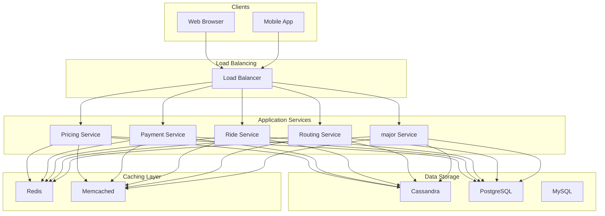

# Design Uber

## What is Uber?

Uber is a ride-hailing platform that connects passengers with drivers through a mobile or web application.
Users can request a ride, get matched with a nearby driver, track the ride in real time, and pay seamlessly through the app.
Drivers, in turn, can accept ride requests, navigate to pickup locations, and receive payments.
In this chapter, we will explore the **high-level design of a ride-hailing platform like Uber.**

Let’s start by clarifying the requirements.

# 1. Requirement Gathering

Before diving into the design, lets outline the functional and non-functional requirements.


### Functional Requirements:

1. **Ride requests: **Riders should be able to input their pickup and destination locations and request a ride.

2. **ETA/Fare Estimation: **The system should provide an estimated time of arrival (ETA) and estimated fare to riders before they confirm the booking.

3. **Driver-rider matching: **The system should match riders with available drivers who are in close proximity.

4. **Accept/Decline**: Drivers should be able to accept or decline incoming ride requests.

5. **Driver tracking**: Once a rider is matched with a driver, the rider should be able to track the driver’s location and view the estimated time of arrival (ETA).

6. **Ratings**: Both riders and drivers should have the ability to rate each other after a ride is completed.

7. **Payments**: The user should be able to complete the payment after the ride is completed.


### Non-Functional Requirements:

1. **Low latency**: The system should provide real-time location updates and fast driver-rider matching.

2. **High availability**: The system should be up 24/7 with minimal downtime.

3. **Scalability**: The system must handle peak loads (e.g., New Year’s Eve, sporting events).

# 2. Capacity Estimation


#### Assumptions

- **Total Users: **50 million riders, 5 million drivers
- **Daily Active Users (DAU): **10 million riders, 1 million drivers
- **Peak concurrent users**: 1 million riders, ~100,000 drivers (assuming 10% of DAUs are active at peak hours)
- **Average Daily Ride Requests:** 10 million globally
- **Peak rides per second (RPS): **~5,000


### Location Updates

- A driver sends a location update **every 3 seconds** while active.
- Assuming **100,000 active drivers** at peak time:

### Data Storage Estimation


#### User & Driver Profiles

- **Rider profile**: ~2 KB per user (name, email, phone, payment method, preferences)
- **Driver profile**: ~5 KB per driver (vehicle details, license, payment details, ratings)
- **Total storage for 50M users**: (50M × 2 KB) + (5M × 5 KB) = (**100 + 25) GB = 125 GB**


#### Ride Data

Each ride stores:

- Ride ID (UUID) → 16 bytes
- Rider ID, Driver ID → 8 bytes each
- Start & end location (lat/lon) → 16 bytes
- Fare, pickup/dropoff time → 24 bytes
- Status → 8 bytes

**Total ride entry size:** ~80 bytes
- **Total daily rides:** 10M
- **Storage per day:** 10M × 80 Bytes = **800 MB**
- **Storage per year (365 days):** **~300 GB**


### Network Bandwidth Estimation

Each API call (ride request, driver update, fare estimation, etc.) contributes to network usage.

- **Ride requests per second**: ~5,000 RPS
- **Driver location updates per second**: ~33,333 RPS
- **Total peak API requests**: ~40,000 RPS

Assuming an **average API payload size** of **5 KB**, network bandwidth usage at peak:

- **40,000 RPS × 5 KB = 200 MB/sec**


# 3. High-Level Design

Here’s a breakdown of the key components:


### 1. Client Applications (Rider & Driver)

These are the primary user-facing interfaces for interacting with the system.

- Riders can **request rides**, **track drivers in real-time**, **make payments**, and **rate drivers**.
- Drivers can **accept or decline ride requests**, **update their availability**, and **navigate routes**.
- The applications communicate with the backend via an **API Gateway** using **HTTPS REST or gRPC**.


### 2. API Gateway / Load Balancer

The **API Gateway** serves as the central entry point for all external requests.
It handles:

- **Request Routing**: Receives requests from client applications and directs them to the appropriate microservices.
- **Load Balancing**: Distributes traffic across multiple instances of a service to prevent overloading.
- **Security**: Performs authentication (token validation) and authorization.


### 3. Core Microservices

The system can be divided into three major service groups: **User Management, Ride Management, and Post-Ride Management**.


#### 1. User Management

Responsible for managing riders and drivers.

- **Rider Service:**
- **Driver Service:**


#### 2. Ride Management

Handles the **end-to-end lifecycle of a ride**, from request to completion.

- **Ride Service:**
- **Matching Service:**
- **Location Service:**
- **Routing Service:**
- **Pricing Service:**


#### 3. Post-Ride Management

Handles payments and ratings after the ride is completed.

- **Payment Service:**
- **Rating Service:**


# 4. Database Design

The system requires a combination of **SQL (relational database)** for structured transactional data and **NoSQL (document-based or key-value stores)** for high-volume, real-time operations.


### 4.1 SQL Database (Transactional Data)

A **relational database (e.g., PostgreSQL, MySQL)** is used for **structured, transactional data** that requires strong consistency. This includes user accounts, ride history, payments, and ratings.


### 4.2 NoSQL Database (High-volume, Real-time Data)

A **document-based NoSQL database (e.g., MongoDB, DynamoDB)** is used for high-frequency, real-time data that doesn’t require strict consistency.


#### Driver Location Collection

Stores frequent driver location updates for real-time operations.
**Example Document**:
**Index**:
- **driver_id**: For quick lookup of a particular driver’s last known location.
- **Geospatial index** on `location` to query by proximity (e.g., find drivers within X km of a rider).

A **high-performance caching layer (e.g., Redis, Memcached)** can be used to reduce database load and improve response times.
We will discuss more approaches to support **nearby driver queries** in the deep dive later.

# 5. API Design

Below is a **RESTful API design** that aligns with the microservices architecture described earlier.
The APIs are grouped based on the microservice responsible for handling their logic and data.

- **Public APIs**: Exposed to client applications (rider and driver apps).
- **Internal APIs**: Used for inter-service communication, not directly accessible by clients.

Here we will only cover the APIs that are most relevant to this problem.

### 5.1 Driver Service (Public)

#### Update Driver Location

### 5.2 Ride Service (Public)

#### Request a Ride


#### Get Ride Details

**Response:**


### 5.3 Matching Service (Internal)

Responsible for finding the nearest available driver. Often called by the **Ride Service**.


#### Find Nearest Driver

**Response**:


#### Assign Driver

**Response**:

### 5.4 Location Service (Public)

#### Receive Driver Location Update (High-frequency endpoint)


#### Get Driver Location

**Response**:


### 5.5 Routing Service (Internal)

Computes optimal routes and ETAs. Generally invoked by the **Ride Service** or **Matching Service.**


#### Get Route & ETA

**Response**:


### 5.6 Pricing Service (Internal)

Calculates fare estimates, including surge pricing or dynamic pricing based on supply-demand.


#### Get Fare Estimate

**Response**:

### 5.7 Rating Service (Public)

#### Submit Rating


#### Get Ratings for a User

**Response**:


### API Considerations

1. **Authentication & Security**

2. **Response Codes & Error Handling**

3. **Pagination & Filtering**

4. **Internal vs. External Endpoints**

5. **Rate Limiting: **Public APIs are protected with **rate limits** to prevent abuse.

6. **Event-Driven Triggers**


# 6. Design Deep Dive

Lets dive into the core use cases that the system need to support.


``
```m# 6.1 Booking a Ride


#### Rider Initiates a Ride Request

- The rider opens the app, enters pickup and destination locations, and taps a “Request Ride” button.
- The request (including the rider’s ID and locations) is sent to the **API Gateway** via HTTPS.
- The API Gateway authenticates the request (validates the rider’s JWT token, etc.) and forwards it to the **Ride Service**.


#### Ride Service Creates a New Ride

- **Creates a new ride record** in the **SQL database** with status set to something like `REQUESTED`.
- Calls the **Pricing Service** to get a fare estimate and calls the **Routing Service **to get the ETA before finalizing the request.


#### Matching Service Locates an Available Driver

- Once the rider confirm the request, the Ride Service invokes the **Matching Service**. It passes the ride’s pickup coordinates and other details (rider ID, ride ID, etc.).
- Matching Service queries the** Location Service** (or a geo-enabled data store) to find online drivers within a certain radius of the pickup location.
- **Sorts or ranks** these drivers based on proximity, driver rating, or other business logic (e.g., driver acceptance rate, predicted demand).
- **Selects** the best candidate (closest and/or most suitable driver).
- Sends a **push notification** to the selected driver’s mobile app, requesting acceptance of the ride.
- The driver sees ride details (pickup location, estimated fare) and can accept or decline (within a time limit e.g., 30 seconds).


#### Driver Accepts (or Declines) the Ride

- If the driver **accepts**, the driver app notifies the Matching Service.
- If the driver **declines**, the Matching Service selects the **next** available driver from its candidate list.
- Upon driver acceptance, the Matching Service updates the Ride Service with the assigned driver.
- The Ride Service **updates** the ride record in the database to reflect the assigned driver and new status (`DRIVER_ASSIGNED`).


#### Rider Receives Confirmation

- The Ride Service notifies the rider (via an app push message) that a driver is assigned.
- The app displays the driver’s name, vehicle details, and **real-time ETA** (calculated via the **Routing Service**).

    S1 --> StorageS3
```





## 6.2 Finding Nearby Drivers

Finding nearby drivers is a **core use case** in any ride-hailing system. It must be **fast, accurate, and scalable** to handle **millions of concurrent ride requests** efficiently.


### 1. Naïve Solution: Using a Relational Database (SQL)

A **basic approach** is to store **driver locations in a SQL database (e.g., MySQL, PostgreSQL)** and query nearby drivers using **Haversine formula**.
**Schema Example (PostgreSQL):**
**Query: Finding Drivers within 5 km (Using Haversine Formula)**
**Pros:**
- Easy to implement.
- Works for small-scale applications.

**Cons:**
- **Slow for large datasets** (full table scan every time).
- **Not scalable** for millions of requests.
- **No spatial indexing**, leading to high latency.


### 2. Using Database Extensions like PostGIS

**PostGIS** is a spatial database extension for PostgreSQL, allowing **geospatial indexing**.


#### Query: Finding Nearby Drivers Using PostGIS

**Pros:**
- **Faster than naive SQL** due to **geospatial indexing**.
- **More accurate results** than naive SQL.

**Cons:**
- **Still not ideal for large-scale applications** (queries slow down with millions of users).
- **Indexes require frequent updates**, which is expensive in real-time applications.


### 3. Geohashing (Efficient Grid-Based Search)

**Geohashing** converts **latitude & longitude** into a **string representation** by **dividing the world into hierarchical grids**. Nearby locations have **similar geohashes**, allowing efficient lookups.
**How Geohashing Works:**

1. The world is **divided into a grid** with cells of different sizes.

2. Each **latitude/longitude pair is converted into a unique hash string** (e.g., `"9q9hv" for San Francisco`).

3. To find **nearby drivers**, search for drivers in the **same or adjacent geohash regions**.

**Example: Storing Driver Locations in Redis (Key-Value Store)**

`GEOADD drivers -122.4194 37.7749 "driver_123"`
**Query: Finding Drivers in a 5 km Radius**

`GEORADIUS drivers -122.4194 37.7749 5 km WITHDIST`
**Pros:**
- **Extremely fast lookups** (O(log n) complexity).
- **Efficient for large-scale systems**.
- **Easily scalable** with distributed databases.

**Cons:**
- **Geohashing regions are not circular** (they are rectangular), leading to **false positives**.
- **Handling edge cases** (drivers near region boundaries require extra queries).


### 4. Quadtree (Hierarchical Spatial Indexing)

A **quadtree** is a **tree-based spatial data structure** that recursively divides a 2D space into **quadrants**.


#### How Quadtree Works

1. The **map is recursively divided** into **four quadrants**.

2. Each **driver's location is stored** in the smallest quadrant possible.

3. To **find nearby drivers**, **search within relevant quadrants**.

**Example: Querying a Quadtree for Nearby Drivers**

`quadtree.find_nearby(lat=37.7749, lon=-122.4194, radius=5000)`
**Pros:**
- Efficient **logarithmic search time** (O(log n)).
- Good **spatial accuracy** compared to geohashing.

**Cons:**
- More **complex to implement**.
- **Insertion & deletion of drivers** require rebalancing the quadtree.


### 5. What Does Uber Actually Use?

Uber originally used **Geohashing**, but later switched to **H3: Hexagonal Hierarchical Spatial Index**.

## What is H3?

H3 is an **open-source geospatial indexing system** developed by Uber.

- It **divides the world into hexagonal cells** instead of squares (used in Geohashing).
- Each hexagon has **better spatial coverage** (less overlap, more uniform).
- H3 supports **hierarchical indexing**, allowing **efficient nearby searches**.


#### Why Hexagons?

- **Uniform coverage** (less distortion than squares).
- **Efficient neighbor searches** (hexagons naturally fit together).
- **Scales well** for high-volume ride-hailing applications.


#### How Uber Finds Nearby Drivers Using H3

1. Convert each **driver’s location into an H3 hexagon ID**.

2. Store **drivers in a distributed key-value store** (e.g., **Cassandra, Redis**).

3. To find nearby drivers:

**Pros:**
- **Highly scalable** (used in production by Uber, Google, and others).
- **Fast nearest-neighbor lookups**.
- **More accurate than Geohashing** (hexagons cover space better).
- **Optimized for distributed storage**.

**Cons:**
- **Requires a dedicated infrastructure** (custom storage solutions).
- **More complex than traditional geospatial databases**.

## 6.3 Real-Time Tracking


#### Driver Location Updates

- Driver's app **captures GPS coordinates** (latitude & longitude) every **3 seconds**.
- The app **sends location data** to the **Location Service** via an API call.
- The **Location Service** validates and **stores the latest position** in an in-memory datastore (e.g., **Redis, DynamoDB**).
- Since driver locations **frequently change**, we use a **fast, ephemeral storage system** like **Redis** with **geospatial indexing**.


#### Rider Tracking the Driver’s Location

There are two ways for the rider’s app to receive real-time updates:

- **Polling (API Calls Every Few Seconds)**
- **WebSockets (Push Updates)**

**Recommendation:** **Use WebSockets **for real-time tracking while allowing polling as a fallback.
When a ride starts, the Rider app opens a WebSocket connection to receive live location updates.

- Rider app subscribes to driver’s location updates via WebSocket.
- The Location Service sends live updates every 3 seconds.
- The rider’s app renders the driver's position on the map dynamically.


## 6.4 ETA Computation (Estimated Time of Arrival)

ETA is calculated for **two parts** of the trip:

1. **Pickup ETA**: Time for the nearest available driver to reach the rider’s pickup location.

2. **Drop-off ETA**: Time to travel from pickup to destination.


#### Find the closest available drivers

- Query the **Location Service** (or a geospatial index) to get nearby **active drivers**.
- The Matching Service may pre-filter drivers based on availability, ratings, and past cancellations.


#### Determine the estimated pickup time

- Use the **Routing Service** to compute the time for each nearby driver to reach the rider.
- Consider **real-time traffic conditions** when calculating time.
- Select the **driver with the shortest ETA** (or apply business logic to prioritize).


#### Calculate the estimated drop-off time

- The Routing Service computes the optimal route **from pickup to drop-off location**.
- Adjust travel time based on **historical trip data and real-time traffic updates**.


#### ETA Recalculation

- Periodically, the Ride Service may call the **Routing Service** to recalculate ETAs based on traffic or route changes.
- This updated ETA is then shown to the rider.


## 6.5 Fare Estimation

The **Pricing Service** calculates the estimated fare before booking confirmation. It considers multiple factors.
A common ride fare formula follows this structure:
`Total Fare = Base Fare + (Cost per km × Distance)+(Cost per minute × Time) + Surge Multiplier + Tolls`
Where:

- **Base Fare** → Fixed charge to start a ride (e.g., $2.00).
- **Cost per km** → Charge per unit distance traveled.
- **Cost per minute** → Charge for time spent in traffic or waiting.
- **Surge Pricing** → Additional multiplier when demand is high.
- **Tolls & Taxes** → Additional charges based on location.


#### Steps for Fare Estimation

1. **Retrieve distance and time from the Routing Service**

2. **Check for surge pricing**

3. **Apply pricing formula**

4. **Return estimated fare**

## 6.6 Handling Payments Post-Ride


#### Ride Completion

- When the ride status changes to `COMPLETED` (usually via the driver’s app), the **Ride Service** updates the ride record in the SQL database.
- The rider is notified via the app that the ride has ended and a payment will be processed.


#### Final Fare Calculation

- The **Ride Service** retrieves essential data points: distance traveled, time in transit, surge multiplier
- The **Ride Service** calls the **Pricing Service** with updated metrics to **calculate the final fare**.
- The **Ride Service** sets `fare` in the ride record, ensuring the final fare is now locked in for payment processing.


#### Payment Authorization & Processing

- The **Ride Service** or an **Event-Driven** workflow (e.g., a message queue event “RideCompleted”) triggers the **Payment Service** to handle the financial transaction.
- The Payment Service looks up the rider’s **default payment method** (credit card, digital wallet, etc.) in the **User Service** or a secure vault.
- If no valid payment method exists, the system may prompt the rider to update payment information.
- The Payment Service **initiates a charge** via an **external payment gateway** (e.g., Stripe, PayPal).
- The payment gateway processes the charge asynchronously. Once the payment is successful (or fails), it **triggers a webhook event** to notify Payment Service.
- Payment Service updates the **Payment Status** in the database (`PENDING → SUCCESS/FAILED`).

# Quiz


## Design Uber Quiz

Which component should be optimized most aggressively for low latency when a rider requests a ride during peak hours?