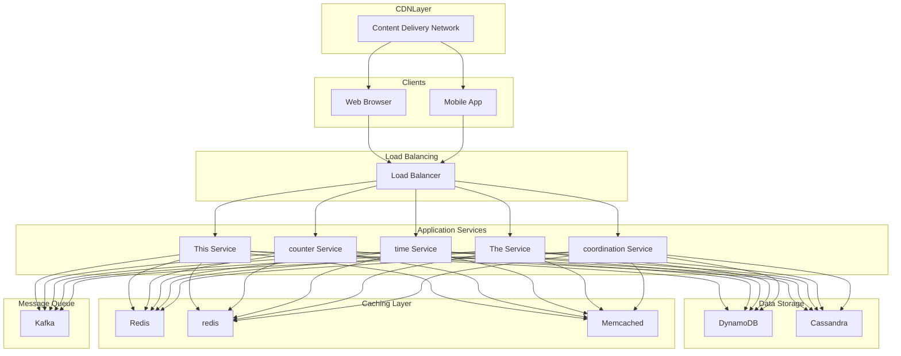

# Design URL Shortener

## What is an URL Shortener?

A URL shortener is a service that converts long URLs into compact, easy-to-share aliases. When users access the short URL, they are redirected to the original destination.
An url shortener  makes links easier to share on social media, track for analytics, and remember.
**Popular Examples: **[tinyurl.com](https://tinyurl.com/)**, **[bitly.com](https://bitly.com/)
This problem is a common choice in system design interviews and serves as a great starting point to practice designing scalable, high-traffic systems.
In this chapter, we will explore the **high-level design of a URL shortener**.
Lets start by clarifying the requirements.

# 1. Clarifying Requirements

Before starting the design, it's important to ask thoughtful questions to uncover hidden assumptions, clarify ambiguities, and define the system's scope more precisely.
Here is an example of how a discussion between the candidate and the interviewer might unfold:
**Candidate:** "What is the expected scale? How many new URLs per day and how many redirects?"
**Interviewer:** "Let's aim for 10 million new URLs per day and a 100:1 read-to-write ratio."
**Candidate**: "What characters are allowed in the shortened URL?"
**Interviewer**: "Shortened URL can be a combination of numbers (0-9) and characters (a-z, A-Z)."
**Candidate:** "Should users be able to specify custom aliases for their URLs?""
**Interviewer:** "Custom aliases are a nice-to-have feature if time permits."
**Candidate:** "Do short URL need to expire after a certain time?"
**Interviewer:** "Yes, there should be a default expiration date, with the option for users to override it."
**Candidate:** "Do we need analytics like click counts?"
**Interviewer:** "Basic click counts would be good, but advanced analytics is not required."
After gathering the details, we can summarize the key system requirements.

## 1.1 Functional Requirements

- **Shorten URL:** Given a long URL, generate a unique short URL.
- **Redirect:** When a short URL is accessed, redirect the user to the original long URL.
- **Custom Aliases:** Allow users to create custom short codes (if available).
- **Expiration:** Support link expiration with default and custom TTLs.
- **Analytics:** Track basic click counts for each short URL.

## 1.2 Non-Functional Requirements

- **High Availability:** The system must be highly available (e.g., 99.99%).
- **Low Latency:** Redirect requests must complete in under 50ms (p99).
- **Uniqueness:** Each long URL should map to a unique short URL.
- **Scalability:** Should handle a large number of read and write requests (100:1 read-to-write ratio).
- **Durability:** Once a short URL is created, the mapping must not be lost.

# 2. Back-of-the-Envelope Estimation

To understand the scale of our system, let’s make some reasonable assumptions.

#### Assumptions:

- New links created: **10 million per day**
- **100:1 read/write ratio** ~**1 billion redirects per day**

#### Writes (URL Shortening)

- Average write QPS = `10,000,000 / (24 * 3600)` ≈ **115 QPS (steady state)**
- Peak write load (3x factor) ≈ **350 QPS**

#### Reads (Redirects)

- Average read QPS = `1,000,000,000 / (24 * 3600)` ≈ **11,500 QPS (steady state)**
- Peak read load (3x factor) ≈ **35,000 QPS**

#### Storage (5 Years)

Each URL mapping stores:

- Short code: ~7 characters = 7 bytes
- Long URL: average 200 characters = 200 bytes
- User ID: UUID = 36 bytes
- Timestamps, metadata: ~50 bytes

**Total per record: ~300 bytes**
- URLs per year: `10M/day * 365 days` = **3.65 billion URLs/year**
- Storage per year: `3.65B * 300 bytes` = **~1.1 TB/year**
- 5-year storage: **~5.5 TB**

#### Short Code Length

Using Base62 encoding (a-z, A-Z, 0-9):

- 6 characters: 62^6 = **56.8 billion** unique codes
- 7 characters: 62^7 = **3.5 trillion** unique codes

With 3.65 billion URLs per year, a **7-character code** provides ample headroom for decades of growth.

# 3. Core APIs

The URL shortener service needs a minimal but powerful set of APIs to create, manage, and resolve shortened links. Below are the core** **endpoints.

### 1. Create Short URL

#### Endpoint: POST /shorten

This endpoint takes a long URL (and optional parameters) and generates a corresponding short URL.

##### Sample Request:

- **long_url** *(required)*: The original URL that needs shortening.
- **custom_alias** *(optional)*: A user-defined alias for the short link (e.g., `/my-link`). If provided, the system validates uniqueness.
- **expiry_date** *(optional)*: Timestamp when the short link should expire. If omitted, the link is permanent (or defaults to a system-wide policy).
- **user_id** *(optional)*: Identifies the user creating the link. Useful for analytics, access control, and management features.

##### Sample Response:

- **short_url**: The shortened link generated by the system.
- **long_url**: The original URL.
- **expiry_date**: The expiration timestamp (if set).
- **created_at**: When the short link was created.

##### Error Cases:

- `409 Conflict`: If a custom alias already exists.
- `400 Bad Request`: If the URL is invalid.
- `401 Unauthorized`: If the user is not authenticated.

### 2. Redirect to Long URL

#### Endpoint: GET /{short_code}

This endpoint takes the short URL key and redirects the user to the corresponding long URL.

##### Sample Response:

- `301 Moved Permanently`: Used when the short link is permanent.
- `302 Found`: Can be used for temporary redirects (if expiry or temporary policy applies).

##### Behavior:

- If the short URL exists and is active, return an HTTP redirect.
- If the link has expired, return `410 Gone`.
- If the link does not exist, return `404 Not Found`.

### 3. Get URL Analytics

#### Endpoint: GET /analytics/{short_code}

Retrieves click statistics for a short URL.

##### Sample Response:

# 4. High-Level Design

At a high level, our system must satisfy two core requirements:

1. **URL Shortening:** Users should be able to submit a long URL and receive a shortened version.

2. **Redirection:** When users access the short URL, they should be redirected to the original long URL.

Since the system has a **100:1 read-to-write ratio** (1 billion reads vs. 10 million writes daily), we should design the read path (redirects) to be extremely optimized.
We will separate the write service from the read service so each can scale independently.
Instead of presenting the full architecture at once, we'll build it incrementally by addressing one requirement at a time. This approach mirrors how you would explain the design in an interview.

When a user submits a long URL, we need to generate a unique short code, store the mapping, and return the short URL.

## Components Needed

### 1. Clients

Clients are end-users or applications interacting with the system via** **web browsers, mobile apps, or third-party integrations (e.g., APIs).
They use:

- `POST /shorten`  to generate short URLs.
- `GET /{short_code}`  to resolve and access the original URLs.

### 2. Load Balancer

The **Load Balancer** sits in front of all application servers and plays a key role in ensuring **high availability and scalability**.
**Responsibilities:**
- Distributes incoming traffic across multiple application servers.
- Ensures high availability and fault tolerance by rerouting traffic if one server fails.
- Can also perform SSL termination and basic request filtering (e.g., rate limiting).

### 3. URL Generation Service

This service handles all **write operations**, including creation and management of new short URLs.
**Key Responsibilities:**
- Validating input URLs.
- Generating unique short codes.
- Handling **custom aliases** provided by users.
- Storing metadata like expiry date, creation time, and user ID.

Since write traffic is relatively low compared to reads, this service doesn’t need to scale aggressively.

### 4. Redirection Service

The **Redirection Service** handles the overwhelming majority of traffic — typically **billions of GET requests per day**. It must be **ultra-fast**, **stateless**, and **horizontally scalable**.
**Responsibilities:**
- Looks up the original long URL for a given short code.
- Determine if the link is still valid (not expired or deleted).
- Issues an HTTP **301 (Permanent)** or **302 (Temporary)** redirect based on the system’s policy.
- Caches frequently accessed mappings to minimize database hits.

This component’s design should focuse on **low latency**, **caching efficiency**, and **high read throughput**.

### 5. Database

The database stores the mapping between **short codes and long URLs**, along with relevant metadata.
Must support:

- **High read throughput** to sustain redirection traffic.
- **Write durability** to ensure links are not lost.

### Flow: Creating a Short URL

1. Client sends a `POST /api/v1/shorten` request with the long URL.

2. The **Load Balancer** routes the request to a **URL Shortening Service** instance.

3. The service validates the URL format and generates a unique short code.

4. The service stores the mapping (short_code -> long_url) in the **Database**.

5. The service returns the complete short URL to the client.

    CDNNode --> Mobile

## 4.2 Requirement 2: URL Redirection

When a user clicks a short URL, we need to look up the original URL and redirect them.

### Additional Components Needed

#### Redirection Service

This service handles all read operations. Since reads dominate (1 billion per day), this service must be highly optimized.
**Responsibilities:**
- Look up the long URL for a given short code.
- Check if the link is expired.
- Return an HTTP redirect response.

#### Cache Layer (Redis)

To achieve sub-50ms latency at 35,000 QPS, we need a distributed cache.
**Responsibilities:**
- Store frequently accessed URL mappings.
- Reduce database load for popular links.
- Provide sub-millisecond lookup times.

### Flow: Redirecting to Original URL

1. Client requests `GET /abc123`.

2. The **Load Balancer** routes to a **Redirection Service** instance.

3. The service first checks the **Redis Cache** for the short code.

4. On cache hit, return the long URL immediately.

5. On cache miss, query the **Database**, then populate the cache.

6. The service validates the link is not expired.

7. Return an HTTP 302 redirect to the original URL.

# 5. Database Design

## 5.1 SQL vs NoSQL

To choose the right database for our needs, let's consider some factors that can affect our choice:

- We need to store billions of records.
- Most database operations are simple key-value lookups.
- Read queries are much higher than write queries.
- We don't need joins between tables.
- Database needs to be highly scalable and available.

Given these points, a **NoSQL database** like **DynamoDB** or **Cassandra** is a better option due to their ability to efficiently handle billions of simple key-value lookups and provide high scalability and availability.

## 5.2 Database Schema

Even though our system is simple, we should carefully design the schema to support both **redirection** and **user management**. At a minimum, we need two core tables.

### 1. URL Mappings Table

Stores the relationship between a short code and its corresponding long URL.

| Field | Type | Description |
| --- | --- | --- |
| short_code | String (PK) | Unique identifier, partition key |
| long_url | String | Original destination URL |
| user_id | String | Creator's user ID (optional) |
| created_at | Timestamp | When the link was created |
| expires_at | Timestamp | When the link expires |
| click_count | Integer | Number of redirects |
| is_custom | Boolean | Whether this is a custom alias |

**Indexes:**
- Primary key on `short_code` for fast lookups.
- Secondary index on `user_id` to list a user's links.

### 2. Users Table (Optional)

Stores user-related information for personalization, analytics, and management.

| Field | Type | Description |
| --- | --- | --- |
| user_id | String (PK) | Unique user identifier |
| email | String | User's email address |
| created_at | Timestamp | Account creation date |
| api_key | String | For programmatic access |

# 6. Design Deep Dive

Now that we have the high-level architecture and database schema in place, let’s dive deeper into some critical design choices.

## 6.1 Unique URL Generation

The **short code generation strategy** is one of the most critical aspects of a URL shortener. A good algorithm should ensure that the generated codes are:

- **Unique** → No collisions between different URLs.
- **Compact** → Small enough to keep the short link truly “short.”
- **Efficient** → Generated quickly without bottlenecks.
- **Scalable** → Should work across distributed servers.

Let's explore three primary approaches, moving from simple to highly scalable.

### Approach 1: Hashing + Encoding (Deterministic)

This is one of the simplest and most popular techniques for generating short URLs.
The idea is to use a **cryptographic hash function** to create a unique fingerprint of the long URL, then **encode** it into a compact, URL-safe string.

#### How It Works

##### 1. Canonicalize the URL

Before hashing, the URL must be standardized to avoid generating multiple short links for what is essentially the same destination.
**Example: **The following URLs all point to the same page but would hash differently if not normalized:
**Canonicalization Steps:**
- Convert the domain to lowercase.
- Remove default ports (`:80` for HTTP, `:443` for HTTPS).
- Normalize trailing slashes.
- Remove unnecessary query parameters (if business logic allows).

After canonicalization, these all become: 

##### 2. Generate a Hash

Apply a **cryptographic hash function** like `SHA-256`, `SHA-1`, or `MD5` to the canonicalized URL.
For example:
This gives us a **fixed-length fingerprint** (128 bits for MD5, 256 bits for SHA-256).

##### 3. Truncate and Encode

We don’t need the full hash, it’s too long for a short link.
Instead, we take the first few bytes (e.g., 48 bits = 6 bytes) and **encode** them using **Base62**.

#### Why Base62?

Base62 encoding uses a 62-character set (`A-Z`, `a-z`, `0-9`) that is URL-friendly.
It's preferred over Base64, which includes `+` and `/`, characters that have special meaning in URLs and would require escaping.
A 48-bit number, when Base62 encoded, produces a compact code of approximately 8 characters (`62^7 < 2^48 < 62^8`).
This allows **~281 trillion** (62⁸) unique short codes, more than enough for most systems.

#### Example Workflow:

1. User submits a request to generate short url for the long url: 

2. Generate an MD5 hash of the long URL. MD5 produces a 128-bit hash, typically a 32-character hexadecimal string: `1b3aabf5266b0f178f52e45f4bb430eb`

3. Instead of encoding the entire 128-bit hash, we typically use a portion of the hash (e.g., the first few bytes) to create a more manageable short URL. First 6 bytes of the hash: `1b3aabf5266b`

4. Convert these bytes to decimal: `1b3aabf5266b` (hexadecimal) → `47770830013755` (decimal)

5. Encode the result into a Base62 encoded string: `DZFbb43`

The specific choice of 6 bytes (48 bits) is important because it produces a decimal number that typically converts to a Base62 string of approximately 7 characters.
This method is **deterministic.** The same long URL will *always* produce the same short code.
This means:

- You can detect duplicates easily.
- Multiple servers can generate codes independently without coordination.

#### Collision Risks

However, **hash collisions** are possible because we truncate the hash.
Two different URLs could (rarely) produce the same short code:
→ Might both hash to → `DZFbb43`
Even though cryptographic hash collisions are rare, truncation reduces the available bit space, making collisions statistically inevitable at scale.

#### Collision Resolution Strategies

When a newly generated short code already exists in the database (detected via a UNIQUE constraint violation), we need a fallback strategy.

##### 1. Re-hash with a Salt

Add a **random salt** or nonce to the original URL and hash again: `hash = sha256(url + salt)`
Repeat until a unique short code is found.

##### 2. Append a Suffix

Attach a small counter or suffix to the colliding short code:
Both methods eliminate duplicates but come with trade-offs. 
**Trade-off:** Both resolution strategies negate the stateless benefit by requiring at least one database lookup, adding latency and complexity to the write path.

### Approach 2: Global Counter (Non-Deterministic)

This is one of the **simplest and most reliable** ways to generate short URLs.
Instead of hashing, it relies on a **global, monotonically increasing counter** to ensure every short code is **unique** by design.

#### How It Works

The entire system revolves around a **centralized counter service** that generates the *next available integer ID* in sequence and never repeats it.

#### 1. Request a Unique ID

When an application server receives a request to shorten a URL, it contacts a **Counter Service** typically implemented with a fast in-memory data store like **Redis**, **etcd**, or **Zookeeper**.
Redis provides the `INCR` command, which is **atomic** by nature.
Each time this command is called, Redis:

- Locks the key temporarily.
- Increments its value by one.
- Returns the new value.
- Releases the lock.

**Atomicity ensures** that even under extreme concurrency, no two servers can ever get the same number.

#### 2. Encode the ID

The application server receives the unique integer ID (e.g., `123456789`) from the counter service. It then applies **Base62 encoding** to this number to create the final, compact short code.

##### Example Growth:

- ID `1,000` -> Base62 `g8`
- ID `1,000,000` -> Base62 `4c9B`
- ID `1,000,000,000` -> Base62 `15ftgG`

Even after generating **a billion short URLs**, the code length stays under **6–7 characters**, which is extremely efficient.

#### End-to-End Example

#### Pros

- **Guaranteed Uniqueness**: Each ID is globally unique. No collision detection or retry logic needed.
- **Simplicity and Speed: **Just one operation (`INCR`) per short URL.** **Sub-millisecond latency in Redis or etcd.
- **Deterministic Length: **Short codes grow logarithmically with the total number of URLs.

#### Cons

- **Centralized Bottleneck: **Every URL creation request must pass through the counter service.Throughput is limited by the counter’s network and CPU capacity.
- **Single Point of Failure (SPOF): **If the counter service (Redis, etc.) crashes, **no new URLs can be generated**. The read path (redirection) still works, but the write path halts.
- **Predictability: **Since IDs are sequential, they can be easily guessed or decoded. A malicious user could increment IDs to discover private short links.

#### Addressing the Limitations

To scale and secure this approach, modern URL shorteners extend it in two key ways.

##### Sharded Counters

Instead of one global counter, deploy **multiple counters**, each responsible for a subset of IDs.For example, 1024 counters distributed across regions or shards.
Each ID combines:

- A **shard ID** (10 bits → up to 1024 shards)
- A **local counter value** (remaining bits)

**Formula:** `global_id = (shard_id << 20) | local_counter`
This gives each shard up to 2²⁰ (≈1 million) IDs before wraparound.
**Benefits:**
- Removes the single bottleneck.
- Enables horizontal scaling.
- Still guarantees global uniqueness if shard IDs are unique.

**Trade-off:** Slightly more complexity in managing shards and ensuring IDs don’t overlap.

##### ID Obfuscation

To prevent sequential IDs from being easily decoded **shuffle bits** using a simple **Feistel cipher** or **XOR mask**.
The transformation is reversible (so you can still decode IDs if needed). This produces short codes that appear random even though they are derived from sequential IDs.
This adds privacy without sacrificing performance.

### Approach 3: Distributed unique ID generator

This is the industry-standard solution for generating unique, non-deterministic IDs at a massive scale. It's a hybrid approach that avoids the need for a centralized counter.

#### How It Works

Each ID is a **64-bit integer** made up of multiple components that together guarantee uniqueness even across thousands of machines.

##### 1. Timestamp (41 bits)

This represents the number of **milliseconds since a custom epoch** (a chosen start date, e.g., `Jan 1, 2020`).** **Using a **custom epoch** instead of the Unix epoch extends the lifetime of the system.
41 bits can store `2^41` milliseconds, approximately **69.7 years** of continuous operation.
So if your epoch starts in 2025, you’ll have ID space until roughly **2094**.

##### 2. Worker ID (10 bits)

Each worker (application server or service instance) gets a **unique identifier** at startup.

- 10 bits → `2^10 = 1,024` unique workers per cluster.
- Each worker can generate IDs **independently** without collisions.

**Worker ID Assignment: **When a worker starts up, it connects to a coordination service like **ZooKeeper** or **etcd**. It registers itself and requests a unique worker ID, which it holds for its lifetime or for a set "lease" period. This startup coordination is vital to prevent two workers from accidentally using the same ID.

##### 3. Sequence Number (12 bits)

This is a local, in-memory counter that tracks how many IDs the worker has generated within the **same millisecond**.

- 12 bits → `2^12 = 4,096` IDs per millisecond per worker.
- That’s **4.09 million IDs per second per worker** at full speed!

If a worker hits 4,096 requests within one millisecond, it must **wait** for the clock to tick to the next millisecond before continuing.

#### Pros:

- **Highly Scalable and Available: **ID generation is completely decentralized. If you need more write throughput, you simply add more application servers (workers). The failure of one worker has zero impact on the ability of other workers to continue generating IDs.
- **Time-Ordered (K-Sortable): **IDs are roughly monotonically increasing. When these IDs are used as primary keys, new records are inserted near the end of the index. This is extremely efficient for writes and allows for highly effective time-based range queries (e.g., "get all links created yesterday").
- **Ultra-Low Latency: **IDs are generated in-memory with **no network hops**.

#### Cons:

- **Clock Synchronization Required: **If a worker’s clock drifts backward (e.g., NTP sync issue), it might generate **duplicate timestamps**, breaking uniqueness.
- **Infrastructure Overhead: **The system requires** a** **reliable coordination service** (e.g., ZooKeeper or etcd) to assign unique Worker IDs and s**trict time synchronization** across all servers using NTP or cloud time services.

### Summary and Recommendation

| Strategy | Pros | Cons | Best For |
| --- | --- | --- | --- |
| Hashing | Deterministic, stateless generation. | Inevitable collisions require complex resolution. | Services where deduplicating identical URLs is a key feature. |
| Global Counter | Guaranteed uniqueness, simple logic. | Central bottleneck, predictable IDs. | Small to medium-sized applications with moderate traffic. |
| Distributed ID | Highly scalable, k-sortable, high throughput. | Complex to implement, sensitive to clock skew. | Large-scale, distributed systems requiring high availability and performance. |

## 6.2 Fast URL Redirections

The **redirection service** is the most **performance-critical component** of a URL shortener.
Every time a user clicks a short link, this service must:

1. **Resolve** the short code into the original long URL.

2. **Redirect** the user as fast as possible.

Even tiny delays (just a few milliseconds) can degrade user experience at scale, especially when serving **billions of redirects per day**.

### Choosing the Right Redirect Code

Before optimizing performance, we must decide how to perform the redirect. 
The choice between **301**, **302**, and **307** affects both **speed** and **control**.

#### 301 vs. 302 Redirects

##### 301 (Moved Permanently)

A `301` redirect tells browsers to **permanently caches** the redirect. Future clicks on the same short link will go directly to the long URL without contacting your service again.
**Pros: Fastest for the end-user** after the first visit. Reduces load on your service significantly.
**Cons:** You **lose all control and analytics**. You can no longer update the destination URL or count subsequent clicks, as the browser bypasses you completely.
**Best for:** Links that should never change (e.g., permanent marketing URLs).

##### 302/307 (Temporary Redirect)

A `302 Found` or `307 Temporary Redirect` tells the browser that the destination **might change** in the future. The browser **contacts your service** on every click to resolve the short code.
**Pros: **Accurate **click tracking** and **analytics**.** **You can **update** or **expire** short links anytime.
**Cons: **Slightly higher latency (each request hits your service).** **Adds read load to your infrastructure.

##### Recommendation

Use **302** by default. It provides flexibility, analytics, and updatability, critical for any modern URL shortener.

### The Read Path

To achieve low latency globally, we design a "waterfall" lookup path. The system tries to find the long URL in the fastest, closest cache available.
It only proceeds to the next, slower layer on a cache miss.

#### Layer 1: Browser Cache

If a **301 redirect** was previously issued, the browser already knows the final URL. The request **never reaches your servers,** the user is instantly redirected.

#### Layer 2: CDN / Edge Cache

For global services, a **Content Delivery Network (CDN)** is essential. CDNs like **Cloudflare**, **Akamai**, or **Fastly** maintain edge servers near users worldwide.
**Cache Hit: **The CDN instantly serves the cached `302` response with the long URL (≈10–50 ms latency).
**Cache Miss: **The CDN forwards the request to your **origin server**.

#### Layer 3: In-Memory Cache (Redis/Memcached)

At your application layer, the first lookup happens in a **distributed in-memory cache**.

- **Cache Key:** The short code (e.g., `xyz`).
- **Cache Value:** The long URL.

**Cache Hit: **The application server immediately returns** **the long URL. The CDN then **caches this response** for future users (cache-aside pattern).
**Cache Miss: **If not found in Redis, the application proceeds to the final layer, the database.

#### Layer 4: Database (Source of Truth)

The database holds the **authoritative mapping** of short codes to long URLs. Since lookups are simple key-value reads, **NoSQL stores** like **DynamoDB**, **Cassandra**, or **ScyllaDB** are ideal.
**Query Example:**

Once retrieved:

1. The app **writes the result to Redis** (with a TTL, e.g., 24 hours).

2. The next lookup will hit Redis instead of the database.

3. The app returns the `302` response to the CDN, which caches it.

## 6.3 Supporting Custom Aliases

Custom aliases allow users to create human-readable short codes instead of system-generated ones.
**For example:**

This feature is especially valuable for **marketing campaigns**, **social media sharing**, and **brand consistency**, where memorability and aesthetics matter.
However, supporting custom aliases introduces challenges around **validation**, **uniqueness**, and **race conditions** that must be carefully handled to maintain system integrity.

#### 1. API Design

The API for link creation should accept an optional `custom_alias` parameter along with the long URL.
If the `custom_alias` field is not provided, the service falls back to **auto-generating** a short code using the ID generation algorithm.

#### 2. Rigorous Validation

Before creating a custom alias, the system must validate it against strict rules to prevent conflicts, misuse, or routing errors.

- **Character Set**: The alias must only contain URL-safe characters. A regular expression like `^[a-zA-Z0-9_-]+$` is typically used to enforce this.
- **Length Limits**: Enforce minimum and maximum lengths (e.g., 3-50 characters) to prevent abuse and maintain usability.
- **Reserved Words**: The system must check the alias against a blocklist of reserved words. This list should include application routes (`/api`, `/admin`, `/login`), common terms (`/help`, `/contact`), and any potentially offensive words. This prevents users from hijacking critical application paths.

All checks should occur **before** any database operation to minimize load on backend systems.

#### 3. Ensuring Uniqueness and Handling Race Conditions

This is the most **critical** aspect of custom alias creation.

##### The Race Condition Problem

Two users could try to claim the same custom alias (`summer-sale`) at the exact same moment.

1. User A's request checks if `summer-sale` exists. (It doesn't).

2. User B's request checks if `summer-sale` exists. (It still doesn't).

3. User A's request inserts the record. (Success).

4. User B's request tries to insert the record. (This will either fail or create a duplicate, depending on the database schema).

Without proper safeguards, both requests might initially think the alias is free leading to duplicate entries or inconsistent state.

##### The Reliable Solution

Instead of relying on application logic, use the **database itself** as the source of truth by defining a **UNIQUE constraint** on the alias column.
**Schema Example:**

## 6.4 Supporting Link Expiration

Link expiration is essential for maintaining both **security** and **data hygiene**.
It is commonly used in:

- **Time-sensitive campaigns**, such as marketing or event promotions.
- **Security-critical use cases**, like password reset or invitation links.
- **System maintenance**, to prevent indefinite data growth.

Without proper expiration handling, a URL shortener’s database could grow endlessly, degrading performance and increasing storage costs.
There are two primary ways to handle expired links: **Active Deletion** and **Passive Expiration.**

### 1. Active Deletion (Background Job)

In this model, a **scheduled worker process** periodically scans the database for expired links and deletes them.
**Example:**

Typically, this runs every hour or day using a background job scheduler such as **Cron**, **Celery**, or **Airflow**.

#### Pros

- **Keeps the database clean:** Old records are removed regularly, reducing storage costs.
- **Improves performance over time:** Fewer stale entries mean faster queries.

#### Cons

- **Resource-intensive:** Scanning large tables frequently can burden the database, especially at scale.
- **Not real-time:** A link might stay active for minutes or hours after expiration until the job executes.
- **Operational overhead:** Requires maintaining a reliable, scalable background worker infrastructure.

### 2. Passive Expiration (Real-Time Check)

In this approach, the link is never physically deleted when it expires.
Instead, the **application layer** checks the expiration timestamp during the redirect lookup.
**Logic:**

#### Pros

- **Real-time precision:** The link becomes inactive exactly at the expiration moment.
- **Low overhead:** A simple timestamp comparison adds negligible latency.
- **Simple to implement:** No additional background processes are required.

#### Cons

- **Data retention:** Expired links remain in the database indefinitely, consuming storage.
- **Potential analytics noise:** Expired links still appear in historical datasets unless filtered.

### 3. Recommended Hybrid Approach

A **hybrid strategy** combines the precision of passive expiration with the efficiency of occasional cleanup.

##### Step 1: Passive Expiration for Read Path

- Every redirect request performs a real-time expiration check.
- Users experience instant and accurate expiration behavior.

##### Step 2: Lazy Cleanup for Data Hygiene

- Run a **low-frequency background job** (weekly or monthly) to delete or archive long-expired links.
- This prevents unbounded growth without adding continuous load to the database.

### 4. Caching and Expiration Consistency

A crucial design consideration is ensuring **all cache layers respect link expiration**.
If not handled carefully, caches might continue serving redirects **after** the link has expired.

##### Problem Example

- A link expires in **5 minutes (300 seconds)**.
- The CDN or Redis cache entry is set with **TTL = 24 hours**.
- Even after the link expires, cached redirects will still be served, violating user expectations and potentially creating security risks.

##### Solution

When writing to any cache, set the **cache TTL to the smaller of**:
`TTL_cache = min(link.remaining_lifetime, default_cache_ttl)`
This ensures **cache TTLs align with link lifetimes** to prevent expired redirects from being served.

## 6.5 Analytics – Click Count

A modern URL shortening system is not complete without **analytics**. The most fundamental metric is **click count** — the number of times each shortened link is accessed.
This data powers insights such as:

- How many people clicked a link.
- Which campaigns perform best.
- Where and when traffic originates.

However, counting clicks accurately at scale introduces challenges related to **performance**, **consistency**, and **real-time aggregation**.

### What Is a "Click"?

A **click** is registered whenever a user follows a shortened link that results in a **successful redirect** to the target URL.
To prevent double counting, certain conditions are typically applied:

- Only **HTTP 302/301** redirects count.
- Requests resulting in **expired**, **invalid**, or **bot traffic** are excluded.
- Repeated requests from the same user within a short time window may be ignored.

### Click Logging Flow

When a user clicks a short link, two things happen simultaneously:

1. The user must be redirected **instantly** (performance-critical).

2. The system must **record the click** for analytics (accuracy-critical).

To avoid slowing down the redirect path, these actions are separated into **synchronous** and **asynchronous** operations.
This **decoupled design** ensures the redirect latency remains low while analytics are processed asynchronously.

### Design Approaches

#### Approach 1: Direct Increment (Simple, Suitable for Low Scale)

Each redirect increments a counter directly in the database or cache.
**Pros**
- Simple and easy to implement.
- Click counts are always up to date.

**Cons**
- Write-heavy. Each redirect triggers a DB write.
- Causes row-level contention under high concurrency.

#### Approach 2: Buffered Counting (Recommended for Scale)

For high-traffic systems, direct increments are inefficient. Instead, **accumulate clicks in memory or a fast cache** and **flush** them periodically to the database.
**Workflow**

1. When a user clicks a link, increment a counter in Redis:

2. A background job periodically aggregates and updates the persistent store:

3. Reset the Redis counter after flushing.
**Pros**
- Significantly reduces database writes.
- Handles high concurrency efficiently.
- Redis operations are atomic and fast.

**Cons**
- Counts in the UI may lag slightly behind real time (depending on flush interval).

#### Approach 3: Event Streaming (For Real-Time Analytics)

Large-scale systems such as Bitly or Google Analytics use **event-driven pipelines**.
Each click generates an **event** that flows through systems like:

- **Kafka / Kinesis** → message ingestion
- **Flink / Spark Streaming** → aggregation
- **Cassandra / Druid / ClickHouse** → analytics storage

This enables real-time dashboards and flexible queries across billions of clicks.
**Pros**
- Real-time analytics and flexible aggregation (by country, device, time).
- Scales horizontally to billions of events.

**Cons**
- Higher operational complexity and cost.
- Requires managing streaming infrastructure.

## 6.6 Handling High Availability

The redirect service is critical. Here's how to ensure 99.99% availability.

### Multi-Region Deployment

Deploy services in multiple geographic regions:

- **Primary region:** Handles all writes.
- **Read replicas:** Each region has read replicas of the database.
- **DNS routing:** Route users to the nearest region using latency-based DNS.

### Database Replication

For DynamoDB:

- Enable Global Tables for automatic multi-region replication.
- Writes in any region propagate to all regions within seconds.

For Cassandra:

- Configure replication factor of 3.
- Use `LOCAL_QUORUM` for reads to ensure consistency within a region.

### Graceful Degradation

If the database is unreachable:

1. Serve from cache (read path continues working).

2. Queue writes for retry (write path degrades gracefully).

3. Return cached stale data rather than errors.

# Summary

Designing a URL shortener teaches fundamental distributed systems concepts:

| Topic | Key Takeaway |
| --- | --- |
| ID Generation | Trade-off between simplicity (counter) and scalability (Snowflake) |
| Caching | Essential for read-heavy workloads, cache-aside pattern |
| Database Choice | NoSQL for simple key-value access patterns at scale |
| Expiration | Hybrid approach: passive check + active cleanup |
| Analytics | Decouple from critical path using buffered counting |
| Availability | Multi-region deployment, replication, graceful degradation |

The key insight is that this system is read-heavy (100:1 ratio), so optimize aggressively for the read path while keeping writes simple and reliable.

# References

- [Twitter Snowflake](https://blog.twitter.com/engineering/en_us/a/2010/announcing-snowflake) - Original announcement of Twitter's distributed ID generation
- [Base62 Encoding](https://en.wikipedia.org/wiki/Base62) - Understanding URL-safe encoding schemes
- [DynamoDB Best Practices](https://docs.aws.amazon.com/amazondynamodb/latest/developerguide/best-practices.html) - AWS guide for NoSQL database design
- [Redis as a Cache](https://redis.io/docs/manual/client-side-caching/) - Official Redis documentation on caching patterns

# Quiz

## Design URL Shortener Quiz

In a URL shortener with a 100:1 read-to-write ratio, which component most directly helps keep redirect latency under 50ms (p99)?