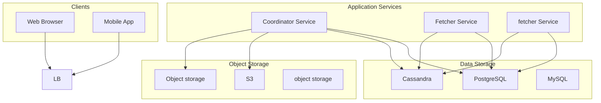

# Design a Web Crawler

## What is a Web Crawler?

A web crawler, also known as a spider or bot, is a system that automatically browses the internet to discover and collect web pages.
The collected data is typically stored and indexed for use in applications such as search engines, analytics, or archiving.
For example, Google Search relies heavily on web crawlers to continuously fetch and update its index of billions of pages.
In recent years, they’ve also become essential for training **large language models (LLMs)** by collecting massive amounts of publicly available text data from across the internet.
Web crawlers serve many purposes beyond search engines.
They power price comparison sites, archive the web for historical preservation, gather data for machine learning datasets, monitor brand mentions, and detect copyright violations.
The core challenges remain the same regardless of the use case: discover URLs efficiently, download content politely, handle failures gracefully, and manage the sheer volume of data.
In this article, we’ll walk through the end-to-end design of a **scalable, distributed web crawler**.
Let’s begin by clarifying the requirements.

# 1. Requirement Gathering

Before we start drawing boxes and arrows, let's define what our crawler needs to do.

## 1.1 Functional Requirements

1. **Fetch Web Pages:** Given a URL, the crawler should be able to download the corresponding content.

2. **Store Content:** Save the fetched content for downstream use.

3. **Extract Links:** Parse the HTML to discover hyperlinks and identify new URLs to crawl.

4. **Avoid Duplicates:** Prevent redundant crawling and storage of the same URL or content. Both URL-level and content-level deduplication should be supported.

5. **Respect robots.txt:** Follow site-specific crawling rules defined in `robots.txt` files, including disallowed paths and crawl delays.

6. **Handle Diverse Content Types:** Support HTML as a primary format, but also be capable of recognizing and handling other formats such as PDFs, XML, images, and scripts.

7. **Freshness:** Support recrawling of pages based on content volatility. Frequently updated pages should be revisited more often than static ones.

## 1.2 Non-Functional Requirements

1. **Scalability:** The system should scale horizontally to crawl billions of pages across a large number of domains.

2. **Politeness:** The crawler should avoid overwhelming target servers by limiting the rate of requests to each domain.

3. **Extensibility:** The architecture should allow for easy integration of new modules, such as custom parsers, content filters, storage backends, or processing pipelines.

4. **Robustness & Fault Tolerance:** The crawler should gracefully handle failures whether it's a bad URL, a timeout, or a crashing worker node without disrupting the overall system.

5. **Performance:** The crawler should maintain high throughput (pages per second), while also minimizing fetch latency.

In a real system design interview, you may only be expected to address a subset of these requirements.
Focus on what’s relevant to the problem you’re asked to solve, and clarify assumptions early in the discussion.

# 2. Back-of-the-Envelope Estimation

Let's do some quick math to understand the scale we are dealing with. These numbers will guide our architecture decisions and help us sanity-check our design.

### 2.1 Crawl Rate

Starting with our target of 1 billion pages per month:
At roughly 400 pages per second average, with capacity for over 1,000 pages per second during peaks, we need significant parallelism.
A single machine cannot achieve this, we need a distributed fleet of crawlers.

### 2.2 Storage Requirements

#### Raw Page Storage:

The average web page is around 500 KB when you include HTML, but most of that is boilerplate. After compression, we can expect around 100 KB per page.
We are looking at petabyte-scale storage. This rules out simple single-server solutions and points us toward distributed storage systems.

#### Metadata Storage:

We also need to store metadata about each URL: when it was last crawled, its priority, robots.txt rules, and so on. Estimate about 1 KB per URL.

### 2.3 Bandwidth

#### Download Bandwidth:

We need substantial network capacity distributed across our crawler fleet.

### 2.4 Machine Count Estimation

Let's estimate how many crawler machines we need.
A single crawler machine with a good network connection can handle maybe 50 fetches per second (accounting for network latency, DNS lookups, and page parsing).
Some fetches will be slow due to distant or overloaded servers.
This is just for fetching. We also need machines for:

- URL frontier management
- Content parsing and extraction
- Duplicate detection
- Storage

A production crawler at this scale would have 50-100 machines total.

# 3. Core APIs

A web crawler is primarily an internal system, but it exposes APIs for monitoring, control, and feeding downstream systems. Let's define the key interfaces.

### 3.1 Add URLs

#### Endpoint: POST /urls

This API allows external systems to inject URLs into the crawl queue. It is used for adding seed URLs or prioritizing specific pages for immediate crawling.

#### Request Body:

#### Request Parameters:

| Parameter | Type | Required | Description |
| --- | --- | --- | --- |
| urls | array | Yes | List of URLs to add |
| urls[].url | string | Yes | The URL to crawl |
| urls[].priority | enum | No | Priority level: "critical", "high", "normal", "low". Default is "normal" |
| urls[].force_recrawl | boolean | No | If true, recrawl even if recently fetched |

#### Response:

### 3.2 Crawl Status

#### Endpoint: GET /status

Returns the current health and performance metrics of the crawler. Useful for monitoring dashboards.

#### Response:

### 3.3 Export Crawled Pages

#### Endpoint: GET /pages

Retrieves crawled page content and metadata. This feeds downstream systems like search indexers.

#### Request Parameters:

| Parameter | Type | Required | Description |
| --- | --- | --- | --- |
| url | string | No | Fetch specific URL |
| domain | string | No | Filter by domain |
| crawled_after | timestamp | No | Only pages crawled after this time |
| limit | integer | No | Maximum pages to return. Default 100 |
| cursor | string | No | Pagination cursor |

#### Example Request:

#### Example Response:

# 4. High-Level Design

With requirements clear and scale estimated, let's design the system architecture. We will build it incrementally, adding components as we address each requirement.
This mirrors how you would explain the design in an interview.
At the highest level, a web crawler is a loop: fetch a URL, parse the content, extract new URLs, add them to the queue, and repeat.
The challenge is making this loop work at massive scale while handling all the edge cases.
Let's design each component by addressing the requirements one at a time.

The first thing we need is a way to manage which URLs to crawl and in what order. This component is called the URL Frontier, and it is far more sophisticated than a simple queue.

### The Problem

A naive approach would use a FIFO queue: add URLs to the back, take them from the front. This fails for several reasons:

1. **Politeness:** If we add 10,000 URLs from example.com consecutively, we would hammer that single server with 10,000 requests. We need to spread requests across domains.

2. **Priority:** A news homepage should be crawled before an obscure archived page. FIFO does not handle priorities.

3. **Deduplication:** The same URL might be discovered from multiple pages. We should not crawl it multiple times.

### The Solution: Multi-Queue Architecture

The URL Frontier has multiple layers:

#### 1. Deduplication Filter

Before adding any URL, we check if we have seen it before. This uses a combination of:

- In-memory bloom filter for fast "definitely not seen" checks
- Database lookup for confirmed duplicates

#### 2. Prioritizer

Each URL gets assigned a priority based on:

- Domain authority (PageRank-like score)
- Path depth (homepage > deep pages)
- Freshness requirements
- Explicit priority from API

#### 3. Priority Queues

URLs are placed in queues by priority level. The system pulls from higher priority queues first.

#### 4. Per-Host Queues

Within each priority level, URLs are further organized by host. This enables the politeness constraint.

#### 5. Host Selector

The selector picks which host to crawl next, ensuring:

- No host is crawled more frequently than its rate limit allows
- We make progress across many hosts concurrently
- High-priority hosts are preferred when multiple are ready

### Implementation Considerations

At our scale (10 billion URLs), the frontier cannot fit entirely in memory on a single machine. We need a distributed solution:

- **Partitioning:** Partition URLs by host hash. Each frontier worker handles a subset of hosts.
- **Persistent Storage:** Use RocksDB or similar for on-disk storage of the URL queues.
- **Coordination:** A central scheduler assigns hosts to workers and tracks rate limits.

    S1 --> StorageS3

## 4.2 Content Fetching: The Fetcher Service

With URLs ready to crawl, we need workers to actually download the pages. The fetcher service is the workhorse of the crawler.

### Components Needed

#### DNS Resolver

Converting hostnames to IP addresses is expensive. DNS lookups can take 10-100ms, and at 400 requests per second, that adds up. We run our own caching DNS resolver that:

- Caches results based on TTL
- Pre-fetches for hosts we will visit soon
- Falls back to multiple DNS providers

#### Robots.txt Checker

Before fetching any page, we check the site's robots.txt file. This file specifies which paths crawlers can and cannot access.
We cache robots.txt per domain (typically for 24 hours) to avoid fetching it for every page.

#### HTTP Client

The HTTP client handles the actual page download. It must:

- Follow redirects (up to a limit, typically 5-10)
- Handle different HTTP versions (1.1, 2, 3)
- Respect timeouts (typically 30 seconds max)
- Handle SSL/TLS properly
- Send appropriate headers (User-Agent, Accept-Encoding)

#### Validator

After fetching, we validate the response:

- Check HTTP status code (200 OK, redirects, errors)
- Verify Content-Type is HTML (for our HTML-focused crawler)
- Check for soft 404s (pages that return 200 but say "not found")
- Detect error pages that websites serve instead of real content

### The Fetching Flow

Here is how a URL flows through the fetcher:

1. **Get URL:** The fetcher pulls the next URL from the frontier.

2. **DNS Resolution:** Resolve the hostname to an IP address using our caching resolver.

3. **Robots Check:** Verify we are allowed to fetch this URL per robots.txt.

4. **HTTP Request:** Send the request and receive the response.

5. **Handle Response:** Process based on status code (success, redirect, error).

6. **Store or Retry:** Store successful fetches, retry transient failures.

### Distributed Fetcher Architecture

At 400+ pages per second, a single fetcher is not enough. We need a fleet:
Each fetcher:

- Pulls URLs from a partition of the frontier (usually by host hash)
- Maintains its own connection pool for efficiency
- Sends fetched content to storage and the parsing queue

The host-based partitioning ensures that all requests to a single domain go through the same fetcher, making rate limiting straightforward.

## 4.3 Content Processing: Parser and Extractor

Once we have downloaded pages, we need to process them. This involves parsing the HTML and extracting useful information.

### Components Needed

#### HTML Parser

The parser converts raw HTML into a structured DOM that we can work with. HTML on the web is often malformed, missing closing tags, using deprecated elements, or mixing character encodings.
We use a lenient parser that handles these gracefully.

#### Link Extractor

We need to find all links on the page to discover new URLs. This means:

- Finding `<a href="...">` tags
- Resolving relative URLs to absolute
- Normalizing URLs (removing fragments, handling encoding)
- Filtering obvious non-HTML resources (images, PDFs, etc.)

#### Content Extractor

For pages we want to index, we extract:

- Title from `<title>` tag
- Main content text (stripped of boilerplate, navigation, ads)
- Metadata (description, keywords, Open Graph tags)
- Structured data (JSON-LD, microdata)

### The Parsing Flow

**URL Normalization** is critical for deduplication. These URLs all point to the same content:
We normalize by:

- Lowercasing the scheme and host
- Removing default ports (80 for HTTP, 443 for HTTPS)
- Removing fragments (#section)
- Sorting query parameters
- Removing tracking parameters (utm_*, fbclid, etc.)

## 4.4 Duplicate Detection

The web is full of duplicates. The same article appears on different URLs, sites mirror each other, and news aggregators copy content. We need to detect duplicates to avoid wasting resources.

### URL-Level Deduplication

This is straightforward. Before adding a URL to the frontier, check if we have seen it before.
**Data Structure:** A distributed hash set storing all seen URLs.
At 10 billion URLs, this set requires:
This fits across a small cluster with replication.

### Content-Level Deduplication

Harder but more valuable. Different URLs might serve identical content:

- http vs https versions
- www vs non-www
- Mobile-specific URLs
- Syndicated content on multiple sites

We use **SimHash** for near-duplicate detection. SimHash creates a fingerprint that is similar for similar content.
Two documents with a Hamming distance less than 3 between their SimHashes are likely duplicates.
SimHash is elegant because similar documents produce similar hashes, unlike cryptographic hashes where one character change completely changes the output.

## 4.5 Storage System

We need to store both the crawled content and metadata about URLs. These have different access patterns and requirements.

### Content Store

Raw HTML content is write-heavy and read-occasionally. We write every page we crawl but only read when building indexes or serving cached versions.
**Requirements:**
- High write throughput (400 pages/sec × 500 KB = 200 MB/sec)
- Sequential reads (for batch processing)
- Compression (to reduce 500 TB to manageable size)
- Durability (data should survive machine failures)

**Solution:** Distributed file system like HDFS or object storage like S3.
We use the WARC (Web ARChive) format, the standard for web archiving. Each WARC file contains multiple pages with full HTTP headers and response bodies.

### URL Metadata Store

URL metadata needs fast point lookups and updates.
**Requirements:**
- Fast reads by URL (check if crawled, get last crawl time)
- Fast updates (update priority, crawl status)
- Range scans (find URLs needing recrawl)

**Solution:** Distributed key-value store like Cassandra or a sharded MySQL/PostgreSQL.

| Field | Type | Description |
| --- | --- | --- |
| url_hash | BIGINT (PK) | SHA-256 of normalized URL |
| url | VARCHAR | Full URL |
| domain | VARCHAR | Domain for filtering |
| last_crawl | TIMESTAMP | When last successfully crawled |
| next_crawl | TIMESTAMP | When to crawl next |
| priority | TINYINT | Crawl priority (0-255) |
| status | ENUM | pending, crawled, failed, blocked |
| content_hash | CHAR(64) | For duplicate detection |
| error_count | INT | Consecutive failures |

## 4.6 Putting It All Together

Now let's see how all the components connect:

### Data Flow Summary

1. **URL Injection:** Seed URLs or API requests enter the URL Frontier.

2. **URL Selection:** The Frontier selects the next URL based on priority and politeness constraints.

3. **DNS Resolution:** The fetcher resolves the hostname using the cached DNS resolver.

4. **Robots Check:** Verify the URL is allowed by the site's robots.txt.

5. **Page Fetch:** Download the page via HTTP.

6. **Content Storage:** Store the raw HTML in the content store.

7. **Parsing:** Parse HTML and extract links.

8. **Link Processing:** Normalize and filter links, add new URLs to the Frontier.

9. **Duplicate Detection:** Compute content hash, check for duplicates.

10. **Metadata Update:** Update URL metadata with crawl results.

### Component Summary

| Component | Purpose | Key Challenge |
| --- | --- | --- |
| URL Frontier | Manage crawl queue with priorities | Balance priority vs. politeness |
| DNS Resolver | Hostname to IP resolution | High-performance caching |
| Robots Checker | Enforce robots.txt rules | Cache and parse rules efficiently |
| Fetcher Fleet | Download web pages | Handle failures, scale horizontally |
| HTML Parser | Parse malformed HTML | Robustness to bad markup |
| Link Extractor | Find and normalize URLs | Handle relative URLs, edge cases |
| Duplicate Detector | Detect duplicate content | Near-duplicate with SimHash |
| Content Store | Store raw HTML | Petabyte-scale, compressed |
| URL Metadata DB | Track URL states | Fast lookups and updates |

# 5. Database Design

Let's look more closely at the data we need to store and how to structure it.

## 5.1 Storage Systems Overview

A web crawler uses multiple storage systems, each optimized for its specific access patterns:

#### Why Not Just Use One Database?

Different components have very different needs:

| Data Type | Size | Access Pattern | Best Storage |
| --- | --- | --- | --- |
| URL Metadata | 10 TB | Random reads/writes | Key-value store |
| Page Content | 500 TB | Sequential writes, batch reads | Object storage |
| Robots.txt | 100 GB | Read-heavy, TTL-based | Distributed cache |
| DNS Cache | 10 GB | Read-heavy, TTL-based | In-memory cache |

## 5.2 URL Metadata Schema

This is the core operational database. Every URL we know about has an entry here.
**Primary Table: `urls`**

| Field | Type | Description |
| --- | --- | --- |
| url_hash | BIGINT | Primary key, hash of normalized URL |
| url | TEXT | Full URL (compressed) |
| domain_hash | BIGINT | Hash of domain for partitioning |
| created_at | TIMESTAMP | When URL was discovered |
| last_crawled_at | TIMESTAMP | Last successful fetch |
| next_crawl_at | TIMESTAMP | When to crawl again |
| crawl_priority | TINYINT | 0 (highest) to 255 (lowest) |
| status | ENUM | pending, in_progress, crawled, failed, blocked |
| http_status | SMALLINT | Last HTTP response code |
| content_hash | CHAR(16) | SimHash for dedup |
| content_length | INT | Size of last fetched content |
| error_count | TINYINT | Consecutive failures |
| depth | TINYINT | Distance from seed URL |

**Indexes:**
**Partitioning Strategy:**

With 10 billion rows, we need horizontal partitioning. Partition by `domain_hash`:
This keeps URLs from the same domain in the same partition, which is essential for politeness enforcement.
**Secondary Table: `domains`**

Track domain-level information:

| Field | Type | Description |
| --- | --- | --- |
| domain_hash | BIGINT | Primary key |
| domain | VARCHAR | Domain name |
| robots_txt | TEXT | Cached robots.txt content |
| robots_fetched_at | TIMESTAMP | When robots.txt was last fetched |
| crawl_delay | INT | Crawl-delay from robots.txt (seconds) |
| default_priority | TINYINT | Default priority for this domain |
| last_accessed_at | TIMESTAMP | Last request to this domain |
| total_urls | BIGINT | Count of known URLs |
| crawled_urls | BIGINT | Count of successfully crawled |

## 5.3 Content Storage Format

For storing the actual page content, we use the WARC format. WARC is the standard for web archiving, used by the Internet Archive and Common Crawl.
**WARC Record Structure:**

Each WARC file contains multiple records, compressed with gzip. Files are typically 1 GB each for efficient storage and processing.
**Storage Layout:**

## 5.4 Caching Strategy

Several components benefit significantly from caching.
**Robots.txt Cache:**

| Key | Value | TTL |
| --- | --- | --- |
| domain_hash | robots.txt content + parsed rules | 24 hours |

We parse robots.txt once and cache the structured rules, not just the raw text.
**DNS Cache:**

| Key | Value | TTL |
| --- | --- | --- |
| hostname | IP address(es) | Varies by DNS TTL |

Respect DNS TTL but enforce a minimum (5 minutes) and maximum (24 hours).
**URL Seen Filter:**

For fast deduplication, we maintain an in-memory Bloom filter of seen URL hashes. This catches most duplicates without a database lookup.
False positives (thinking we have seen a URL when we have not) are acceptable. The occasional missed URL will be discovered through other links.

# 6. Detailed Component Design

Now let's dive into the most interesting and challenging aspects of the design. These are the topics that show depth of understanding in an interview.

## 6.1 URL Frontier: Balancing Priority and Politeness

The URL frontier is deceptively complex. It must answer "what should I crawl next?" while satisfying multiple constraints that often conflict.

### The Core Tension

Consider this scenario:

- We have 100,000 URLs queued from news.com (high priority, just linked from homepage)
- We have 10 URLs queued from smallblog.net (medium priority)
- Our rate limit is 1 request per second per domain

If we simply pick the highest priority URL, we would crawl one news.com page per second and ignore smallblog.net for 28 hours.
But we could be crawling both simultaneously since they are different domains.

### Multi-Level Queue Architecture

The solution is a two-level queue structure:
**Back Queues (Priority-Based):**

URLs enter back queues based on priority. A URL's priority is determined by:

- Domain authority (sites with higher PageRank get higher priority)
- Freshness needs (frequently changing pages get higher priority)
- Depth from seed (shallower pages get higher priority)
- Explicit priority from API

**Front Queues (Host-Based):**

URLs are routed to per-host front queues. Each front queue represents a single domain and tracks its own rate limit.
**Selection via Min-Heap:**

A min-heap tracks when each front queue is next available for crawling. The heap is keyed by `next_allowed_time = last_request_time + crawl_delay`.
**Selection Algorithm:**

This ensures we always respect rate limits while making progress across many hosts concurrently.

### Adaptive Crawl Scheduling

Different pages need different refresh rates. We learn optimal frequencies from observed change patterns.
**Change Detection:**

When we recrawl a page, we check if the content changed:
**Adaptive Interval Adjustment:**

Over time, pages settle into appropriate refresh intervals:

- News homepages: recrawl every 15-30 minutes
- Active blogs: recrawl daily
- Static documentation: recrawl weekly
- Archived content: recrawl monthly

## 6.2 Distributed Crawling Architecture

At 400+ pages per second, we need multiple crawler machines working in coordination. This introduces challenges around work distribution and avoiding duplicate crawls.

### Partitioning Strategy

We partition work by domain (host). Each crawler machine is responsible for a subset of domains:
This partitioning has key advantages:

1. **Politeness is local:** All requests to a domain go through one crawler, making rate limiting straightforward.

2. **DNS caching is local:** Each crawler can cache DNS results for its domains efficiently.

3. **Robots.txt is local:** Each crawler maintains robots.txt cache for its domains.

### Coordinator Service

A central coordinator manages the crawler fleet:
**Responsibilities:**

1. **Domain Assignment:** Maintain the mapping from domains to crawlers. Use consistent hashing so adding/removing crawlers minimizes redistribution.

2. **Health Monitoring:** Track heartbeats from each crawler. Detect failures quickly.

3. **Rebalancing:** When a crawler fails, reassign its domains to healthy crawlers. When a new crawler joins, redistribute load.

### Handling Crawler Failures

Crawler machines will fail. We need to recover gracefully:
**Detection:** If a crawler misses 3 consecutive heartbeats (15 seconds), consider it dead.
**Recovery:**

1. Coordinator reassigns failed crawler's domains to surviving crawlers.

2. In-progress URLs might be lost. Mark them as failed and retry later.

3. URL frontier state is checkpointed to durable storage, so we can recover the queue.

**State Checkpointing:**

## 6.3 Handling Politeness and Robots.txt

Being a good web citizen is not optional. Ignoring politeness can get your crawler blocked, your IP blacklisted, or even lead to legal issues.

### Robots.txt Deep Dive

The robots.txt file tells crawlers what they can and cannot fetch:
**Parsing Rules:**

1. Match User-agent rules from most specific to least specific.

2. First matching Allow/Disallow rule wins.

3. If no rule matches, allow by default.

4. Respect Crawl-delay as minimum time between requests.

**Caching Strategy:**

Cache robots.txt for 24 hours. If the fetch fails, use a cached version if available. If no robots.txt exists (404), assume everything is allowed.

### Rate Limiting Implementation

We enforce rate limits at multiple levels:
**Per-Domain Rate Limit:**
**Per-IP Rate Limit:**

Many small sites share a single IP (shared hosting). We also track per-IP request rates:
**Global Rate Limit:**

Prevent the crawler from overwhelming our own infrastructure:

### Handling Blocks and Errors

Websites can block crawlers. We need to detect and handle this:
**Response Handling:**

| Status | Meaning | Action |
| --- | --- | --- |
| 200 | Success | Process and store |
| 301/302 | Redirect | Follow (up to 10 hops) |
| 403 | Forbidden | Exponential backoff for domain |
| 404 | Not found | Mark URL as gone |
| 429 | Too many requests | Increase domain delay |
| 500-599 | Server error | Retry with backoff |
| Timeout | Network issue | Retry with backoff |

**Exponential Backoff:**

## 6.4 Duplicate Detection Strategies

The web is full of duplicates. Detecting them saves storage, bandwidth, and processing time.

### URL-Level Duplicates

These are the easy ones. The same URL discovered multiple times.
**Approach: Hash Set with Bloom Filter**

1. **Normalize:** Apply URL normalization (lowercase, remove fragments, sort params).

2. **Bloom Filter:** Check in-memory bloom filter. If definitely not present, proceed. If possibly present, check database.

3. **Database Check:** Look up in URL metadata DB.

4. **Decision:** Skip if seen, add if new.

The bloom filter catches most duplicates without a database lookup, providing significant speedup.

### Content-Level Duplicates

More interesting. Different URLs serving identical or near-identical content.
**Exact Duplicates (MD5/SHA-256):**

Fast and catches exact duplicates. But fails for near-duplicates (same content with different ads, timestamps, or minor variations).
**Near-Duplicates (SimHash):**

SimHash creates a fingerprint where similar content produces similar fingerprints. The Hamming distance between fingerprints indicates similarity.
**SimHash Algorithm:**
**Comparison:**
**Efficient Lookup:**

Finding near-duplicates requires checking against all stored SimHashes. With billions of pages, brute force is too slow.
Solution: **Bit-sampling tables**

1. Store each SimHash in multiple tables, indexed by different bit subsets.

2. To find near-duplicates of hash H:

This reduces comparison from O(N) to O(candidates).

## 6.5 Handling Dynamic Content

Modern websites increasingly rely on JavaScript to render content. A simple HTTP request might return a mostly-empty page with JavaScript that fetches and renders the actual content.

### The JavaScript Rendering Problem

Our basic fetcher only sees the skeleton. Important content is invisible.

### Solution Approaches

**1. Detect and Skip (Simplest):**

Detect JS-heavy pages by:

- Checking text-to-HTML ratio
- Looking for common JS framework markers
- Detecting mostly-empty content

For many use cases, skipping JS-heavy pages is acceptable.
**2. Headless Browser Rendering:**

Use a pool of headless Chrome instances to render pages:

- Load page in headless browser
- Wait for JavaScript execution (3-10 seconds)
- Extract rendered DOM
- Store the rendered HTML

**Challenges with Browser Rendering:**
- Resource intensive (CPU, memory)
- Much slower (seconds vs. milliseconds)
- Difficult to scale

**Hybrid Approach:**

This gives us the best of both worlds: fast fetching for static pages, rendered content for JS-heavy pages.
**3. API Discovery:**

Some sites have APIs that return data in JSON format. If we can discover these APIs:
The API response is often cleaner and easier to process than rendered HTML. Discovering APIs requires analyzing network requests made by pages.

## 6.6 Spider Traps and Infinite URLs

Some websites, intentionally or accidentally, generate infinite URLs. A crawler must detect and avoid these traps.

### Types of Spider Traps

**Calendar Traps:**
**Session ID Traps:**
**Infinite Depth:**
**Pagination Traps:**

### Detection and Prevention

**1. Depth Limiting:**
**2. Per-Domain URL Limits:**
**3. Pattern Detection:**

Detect and filter URL patterns that generate infinite variations:
**4. URL Signature Grouping:**

Convert URLs to signatures by replacing variable parts with placeholders:
**5. Content Similarity:**

If many URLs produce nearly identical content (same SimHash), the pattern is likely a trap:

# Summary

| Topic | Key Takeaways |
| --- | --- |
| URL Frontier | Two-level queues (priority + per-host). Min-heap for selection. Adaptive scheduling based on change frequency. |
| Distributed Crawling | Partition by domain hash. Central coordinator for assignment. Checkpoint state for recovery. |
| Politeness | Cache and respect robots.txt. Per-domain and per-IP rate limits. Exponential backoff on errors. |
| Duplicate Detection | Bloom filter + database for URL dedup. SimHash with bit-sampling for content near-duplicates. |
| Dynamic Content | Detect JS-heavy pages. Headless browser rendering for subset. Consider API discovery. |
| Spider Traps | Depth limits, domain URL caps, pattern detection, URL signature analysis. |

# References

- [Web Crawling and Indexing](https://nlp.stanford.edu/IR-book/html/htmledition/web-crawling-and-indexes-1.html) - Stanford Introduction to Information Retrieval textbook chapter on crawling
- [The Anatomy of a Large-Scale Hypertextual Web Search Engine](http://infolab.stanford.edu/~backrub/google.html) - Original Google paper describing Googlebot architecture
- [Common Crawl](https://commoncrawl.org/) - Open repository of web crawl data with documentation on their crawling methodology
- [WARC File Format](https://iipc.github.io/warc-specifications/specifications/warc-format/warc-1.1/) - Official specification for the Web ARChive format used to store crawled data

# Quiz

## Design Web Crawler Quiz

In a distributed web crawler, what is the primary purpose of the URL frontier?