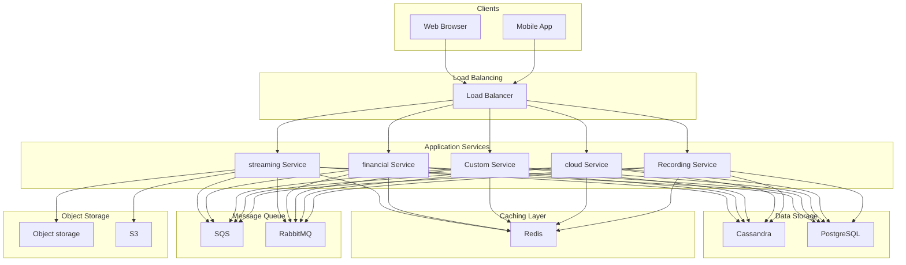
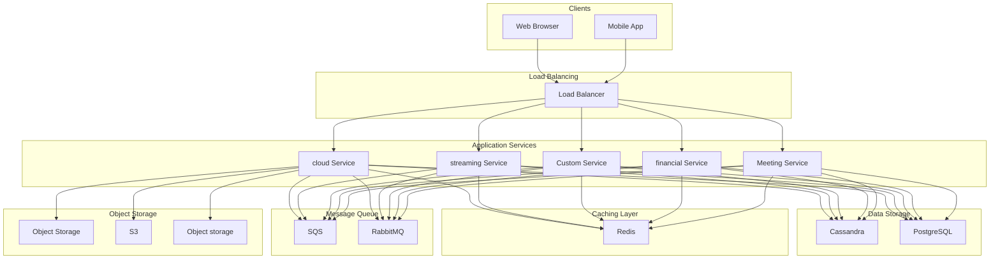
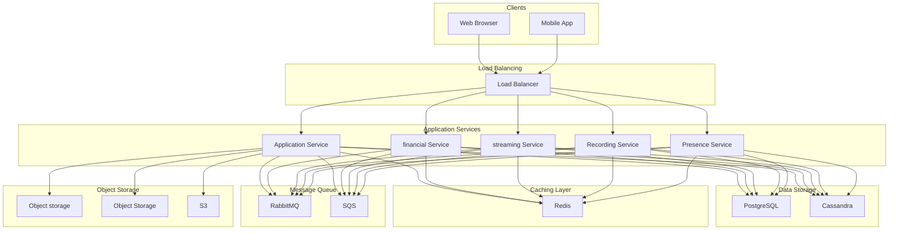

# Design Video Conferencing System like Zoom

## What is a Video Conferencing System?

A video conferencing system enables real-time audio and video communication between multiple participants over the internet. Users can join meetings, share their screens, exchange messages, and collaborate remotely.
The core challenge is delivering low-latency, synchronized audio and video streams to potentially hundreds of participants while handling varying network conditions, device capabilities, and geographic distribution.
**Popular Examples:** [Zoom](https://zoom.us/), [Google Meet](https://meet.google.com/), [Microsoft Teams](https://www.microsoft.com/en-us/microsoft-teams), [Webex](https://www.webex.com/)
This system design problem tests your understanding of **real-time communication protocols**, **media streaming architectures**, and scaling strategies for **latency-sensitive systems**.
In this chapter, we will explore the **high-level design of a video conferencing system like Zoom**.
Lets start by clarifying the requirements.
# 1. Clarifying Requirements
Before diving into architecture diagrams, we need to understand exactly what we are building. 
Video conferencing systems can range from simple 1-on-1 video calls to enterprise solutions supporting thousands of participants with recording, transcription, and breakout rooms. 
The scope shapes every decision we make, so getting clarity upfront is essential.
Here is how a requirements discussion might unfold in an interview:
**Candidate:** "What is the expected scale? How many concurrent meetings and participants should we support?"
**Interviewer:** "Let's design for 10 million concurrent meetings with an average of 5 participants per meeting. We should also support large meetings with up to 1,000 participants."
**Candidate:** "What features are required? I am thinking video, audio, screen sharing, and chat as the basics."
**Interviewer:** "Video and audio are core features, obviously. Screen sharing and in-meeting chat are required. Recording would be nice to have, but not critical for the initial design."
**Candidate:** "What latency is acceptable for the video and audio streams?"
**Interviewer:** "For a good user experience, end-to-end latency should be under 200ms. Anything above 400ms feels noticeably delayed."
**Candidate:** "Should meetings be scheduled in advance, or can users start instant meetings?"
**Interviewer:** "Both. Users should be able to schedule meetings and also start instant meetings with a shareable link."
**Candidate:** "How should we handle participants with poor network connections?"
**Interviewer:** "The system should adapt to varying network conditions and device capabilities. Someone on a weak connection should still be able to participate, even if their video quality is lower."
**Candidate:** "What about security? Do meetings need passwords or waiting rooms?"
**Interviewer:** "Yes. Meetings should support passwords, waiting rooms for host approval, and end-to-end encryption for sensitive meetings."
After gathering the details, we can summarize the key system requirements.

## 1.1 Functional Requirements
- **Join/Leave Meetings:** Users can create, join, and leave video meetings.
- **Audio/Video Streaming:** Real-time audio and video transmission between participants.
- **Screen Sharing:** Participants can share their screen with others.
- **In-Meeting Chat:** Text messaging during meetings.
- **Meeting Scheduling:** Users can schedule meetings in advance and generate invite links.
- **Host Controls:** Mute participants, remove users, enable waiting room.
- **Recording:** (Nice-to-have) Record meetings for later playback.

## 1.2 Non-Functional Requirements
For a real-time communication system, the non-functional requirements are just as critical as the features themselves. You can have all the features in the world, but if the video is choppy or the audio is delayed, users will abandon your product.
- **Low Latency:** End-to-end latency under 200ms for real-time interaction.
- **High Availability:** 99.99% uptime for meeting infrastructure.
- **Scalability:** Support 10 million concurrent meetings, 50 million concurrent participants.
- **Adaptive Quality:** Adjust video quality based on network conditions.
- **Global Reach:** Low latency for users worldwide.
- **Security:** Encryption, meeting passwords, waiting rooms.

With requirements in hand, let us run some quick calculations to understand the scale we are dealing with. These numbers will guide our infrastructure decisions.
# 2. Back-of-the-Envelope Estimation
Before we start designing, let us run some quick calculations to understand the scale we are dealing with. These numbers will reveal important constraints and guide our architectural decisions. 
More importantly, they will show us why certain naive approaches simply will not work.

### 2.1 Meeting Scale
Starting with our baseline numbers from the requirements discussion:
- Concurrent meetings: **10 million**
- Average participants per meeting: **5**
- Total concurrent participants: `10M × 5` = **50 million**
- Large meetings (100+ participants): roughly **1%** of meetings = **100,000 meetings**

50 million concurrent video streams is a staggering number. To put it in perspective, that is roughly equivalent to streaming live video to every person in South Korea, simultaneously. When you think about it that way, the engineering challenge becomes more tangible.

### 2.2 Bandwidth Requirements
Video is notoriously bandwidth-hungry. Unlike text or images that you fetch once, video is a continuous stream of data. Here are typical bandwidth requirements per video stream:
| Quality | Upload | Download (per stream) | Typical Use Case |
| --- | --- | --- | --- |
| 1080p HD | ~3 Mbps | ~3 Mbps | Desktop with good network |
| 720p | ~1.5 Mbps | ~1.5 Mbps | Standard quality |
| 480p | ~500 Kbps | ~500 Kbps | Mobile or limited bandwidth |
| Audio only | ~100 Kbps | ~100 Kbps | Fallback mode |

Let us calculate the bandwidth for a typical 5-person meeting at 720p quality:
- **Upload:** Each participant uploads their own stream = **1.5 Mbps**
- **Download:** Each participant downloads streams from 4 other people = `4 × 1.5` = **6 Mbps**
- **Total per participant:** **7.5 Mbps**

This might not sound like much for one person, but watch what happens when we scale it up.

### 2.3 The Bandwidth Problem
If every participant used 7.5 Mbps:
To put that in perspective, the total internet bandwidth globally is estimated around 800 Tbps. Our naive calculation would require nearly 500x the entire internet's bandwidth. Clearly, something is wrong with this approach.
This calculation is intentionally absurd, and that is the point. It reveals exactly why we cannot take a naive approach to video conferencing. We need clever optimizations at every layer:
1. **Distributed media servers close to users:** If participants in Tokyo are talking to each other, their video should not need to travel to Virginia and back. Local servers reduce both bandwidth usage on the internet backbone and latency.
2. **Selective forwarding:** In a 10-person meeting, you do not need HD video of everyone simultaneously. Most of the time, you are focused on whoever is speaking. We can send high-quality video for the active speaker and lower quality (or nothing) for others.
3. **Adaptive bitrate:** When someone's network gets congested, we reduce their video quality rather than letting packets drop. A 480p video that runs smoothly is better than a 1080p video that freezes every few seconds.
4. **Simulcast layers:** Senders encode their video at multiple quality levels simultaneously. The server can then choose which quality to forward to each recipient based on their needs and network conditions.

### 2.4 Media Server Capacity
Media servers (which we will call SFUs, for Selective Forwarding Units) are the workhorses of our system. Each server handles receiving video streams from participants and selectively forwarding them to other participants.
A typical SFU can handle somewhere between 200-500 concurrent participants, depending on the hardware configuration and how many streams each participant is receiving. Let us use 500 as a reasonable estimate for capacity planning:
That is a substantial number of servers. In practice, we would distribute these across multiple data centers globally to reduce latency and provide redundancy. A user in Singapore should connect to a server in Singapore, not one in Ohio.

### 2.5 Storage for Recording
Recording is listed as a nice-to-have feature, but let us estimate the storage requirements to understand what we are signing up for:
- 1 hour of 720p video ≈ **1 GB** (after compression)
- Average meeting duration: **45 minutes** = 0.75 hours
- Assume **10%** of meetings enable recording

Over a month, that adds up to over 22 PB of storage. This is exactly why cloud storage like S3 with lifecycle policies (automatically moving older recordings to cheaper storage tiers like Glacier) is essential. Without intelligent tiering, storage costs would quickly become unsustainable.
# 3. Core APIs
With the scale understood, let us define the API contract. Our video conferencing system needs two fundamentally different types of APIs:
1. **REST APIs** for meeting management: creating meetings, scheduling, configuring settings. These are your standard request-response APIs.
2. **Real-time APIs** (WebSocket) for signaling during active meetings: joining, media negotiation, chat messages. These need to be bidirectional and low-latency.

The REST APIs handle everything before and after the meeting. The WebSocket APIs handle everything during the meeting. Let us start with the REST endpoints.

### 3.1 Create Meeting
**Endpoint:** `POST /meetings`
This is the starting point for every meeting. When a host clicks "New Meeting" or "Schedule Meeting," the client calls this endpoint. The meeting can be scheduled for a future time or started immediately.
**Request Parameters:**
| Parameter | Required | Description |
| --- | --- | --- |
| host_id | Yes | User ID of the meeting creator |
| title | No | Human-readable meeting title (e.g., "Weekly Team Standup") |
| scheduled_time | No | ISO 8601 timestamp for scheduled meetings. Null for instant meetings |
| duration | No | Expected duration in minutes. Helps with calendar integration and resource planning |
| password | No | Meeting password for access control. If not provided, system can auto-generate one |
| settings | No | Object containing meeting settings (waiting_room, mute_on_entry, allow_screen_share) |

**Sample Response:**
The `host_key` is worth noting. It allows the host to start the meeting and access host controls (muting, removing participants, ending the meeting) even if they join from a different device than the one they used to create the meeting.
**Error Cases:**
| Status Code | Meaning | When It Occurs |
| --- | --- | --- |
| 400 Bad Request | Invalid input | scheduled_time in the past, invalid settings format |
| 401 Unauthorized | Not authenticated | Missing or invalid auth token |
| 429 Too Many Requests | Rate limited | User creating meetings too quickly (abuse prevention) |

### 3.2 Join Meeting
**Endpoint:** `POST /meetings/{meeting_id}/join`
This is the gateway to actually participating in a meeting. When a user clicks a meeting link, the client calls this endpoint to get everything it needs to establish a media connection. The response contains critical information for setting up the real-time communication.
**Request Parameters:**
| Parameter | Required | Description |
| --- | --- | --- |
| meeting_id | Yes | The meeting to join (from URL path) |
| user_id | Yes | ID of the user joining |
| password | Conditional | Required if meeting has password protection |
| device_info | No | Client capabilities (supported codecs, max resolution, device type) |

**Sample Response:**
Let us break down what these fields mean:
- **signaling_server_url:** The WebSocket endpoint for real-time communication during the meeting
- **ice_servers:** STUN and TURN servers for NAT traversal (we will explain these in detail later)
- **token:** A JWT that authenticates this participant to the media infrastructure
- **meeting_state:** Current state of the meeting so the UI can render correctly immediately

**Error Cases:**
| Status Code | Meaning | When It Occurs |
| --- | --- | --- |
| 403 Forbidden | Access denied | Invalid password or user not on invite list |
| 404 Not Found | Meeting not found | Meeting does not exist or has already ended |
| 423 Locked | Meeting locked | Host locked the meeting, no new participants allowed |

### 3.3 Leave Meeting
**Endpoint:** `POST /meetings/{meeting_id}/leave`
When a participant clicks "Leave Meeting," the client should call this endpoint to clean up resources properly. This triggers cleanup: removing them from the participant list, stopping their media streams, and notifying other participants.
What if the client disconnects unexpectedly (network failure, browser crash, laptop battery dies)? The server detects this through WebSocket heartbeat timeouts and performs the cleanup automatically after a grace period.
**Request Parameters:**
| Parameter | Required | Description |
| --- | --- | --- |
| meeting_id | Yes | Meeting being left |
| participant_id | Yes | ID of the leaving participant |

### 3.4 Update Media State
**Endpoint:** `PUT /meetings/{meeting_id}/participants/{participant_id}/media`
Participants frequently toggle their audio and video during meetings. You mute yourself while eating, turn off your camera when you step away, or start screen sharing to present. This endpoint updates their media state and notifies other participants so their UI updates accordingly.
**Request Parameters:**
| Parameter | Required | Description |
| --- | --- | --- |
| audio_enabled | No | Boolean to mute/unmute microphone |
| video_enabled | No | Boolean to enable/disable camera |
| screen_sharing | No | Boolean to start/stop screen sharing |

In practice, media state changes are often sent over the WebSocket connection for lower latency. Nobody wants to wait 200ms for their mute button to respond. The REST endpoint provides a fallback and makes the state queryable for participants who join mid-meeting.

### 3.5 Send Chat Message
**Endpoint:** `POST /meetings/{meeting_id}/chat`
In-meeting chat is a supporting feature that proves surprisingly useful. You can share a link without interrupting the speaker, ask a clarifying question without unmuting, or have a side conversation with a colleague.
**Request Parameters:**
| Parameter | Required | Description |
| --- | --- | --- |
| sender_id | Yes | User sending the message |
| message | Yes | Message content (text, possibly with formatting) |
| recipient_id | No | For private messages. Null means broadcast to everyone |

Like media state updates, chat messages are typically sent over WebSocket for real-time delivery. The REST endpoint is useful for message history retrieval and persistence.
# 4. High-Level Design
Now for the interesting part. We need to design an architecture that can handle four distinct concerns:
1. **Meeting Management:** Creating, scheduling, and managing millions of meetings
2. **Real-Time Media:** Streaming audio and video with sub-200ms latency
3. **Signaling:** Coordinating connection setup and media negotiation between participants
4. **Supplementary Features:** Chat, screen sharing, and recording

These concerns have very different characteristics. Meeting management is standard CRUD operations. Real-time media is a completely different beast, requiring specialized protocols and infrastructure. The architecture needs to handle both gracefully.
Rather than dropping a complex architecture diagram on you all at once, let us build the system incrementally. We will start with the simplest requirement (meeting management) and progressively add the components needed for real-time media. 
This approach mirrors how you would actually design such a system: starting with the basics and layering complexity as needed.

## 4.1 Meeting Management
Before any video streams flow, we need the infrastructure to create and manage meetings. This is the "boring" CRUD part of the system, but it is essential.
Without it, users cannot schedule meetings, cannot share meeting links, and cannot configure settings. Every video call starts here.

### Components Needed
Let us introduce the components we need for meeting management:
**API Gateway** serves as the entry point for all client requests. It handles authentication (verifying the user is who they claim to be), routes requests to the appropriate backend services, and enforces rate limiting to prevent abuse. Every request, whether creating a meeting or joining one, passes through this gateway first.
**Meeting Service** manages the meeting lifecycle. It creates new meetings, generates unique meeting IDs and passwords, stores meeting settings (like whether to enable waiting room or mute participants on entry), and validates that users have permission to perform actions on meetings.
**Meeting Database** persists all meeting metadata. This includes meeting settings, scheduled times, the host user, and participant lists. We use a relational database like PostgreSQL here because meeting data is structured and we need ACID guarantees.

### Flow: Creating a Meeting
When a host clicks "New Meeting" and creates a meeting, here is what happens behind the scenes:
The flow is straightforward:
1. **Host sends request:** The request arrives at the API Gateway with the user's authentication token
2. **Authentication check:** API Gateway validates the session/token and confirms the user is who they claim to be
3. **Meeting creation:** Meeting Service generates a unique meeting ID (like 123-456-789) and hashes any password the host provided
4. **Persistence:** Meeting metadata is stored in PostgreSQL with ACID guarantees
5. **Response:** Host receives the meeting ID, a shareable join URL, and a host key for elevated privileges

This is a simple architecture that you would find in any CRUD application. If this were all we needed to build, the system design would be over in 10 minutes. The complexity comes next, when we need to actually connect people with video.

## 4.2 Real-Time Media Streaming
This is where video conferencing gets interesting, and where the real engineering challenges begin. Unlike traditional request-response APIs where a few hundred milliseconds of latency is perfectly acceptable, video calls become unusable the moment latency exceeds 200-300ms.

### The Challenge
Video conferencing has unique requirements that make it fundamentally different from typical web applications:
- **Ultra-low latency:** Sub-200ms end-to-end for natural conversation. If someone speaks and you hear them 500ms later, you will both start talking at the same time, creating that awkward "no, you go ahead" dance.
- **Bidirectional real-time streams:** Unlike video streaming services like Netflix (where you download from a server), every participant is both uploading and downloading video simultaneously. This is a very different traffic pattern.
- **NAT traversal:** Most users are behind firewalls or NAT routers. Your laptop does not have a public IP address that other participants can connect to directly. Establishing connections requires specialized protocols to punch through these barriers.
- **Adaptive quality:** When a participant's network degrades, the system must automatically reduce video quality rather than buffering or dropping frames. Users would rather see a slightly blurry video than a frozen screen.

### Components Needed
To handle real-time media, we need three new components that work together:
**Signaling Server** coordinates the connection setup between participants. Before video can flow, clients need to exchange information about their network addresses, supported codecs, and other session parameters. The signaling server facilitates this exchange using WebSocket connections. It relays messages like "Alice wants to start her video" or "Bob's network address is X."
**Media Server (SFU)** is the workhorse of our system. SFU stands for Selective Forwarding Unit. It receives video streams from each participant and selectively forwards them to other participants. We will explore different media server architectures in the deep dive section.
**TURN Server** provides a fallback when direct connections fail. Many corporate networks have strict firewalls that block direct peer connections. In these cases, media must be relayed through a TURN server. It adds a bit of latency but ensures connectivity for everyone.

### WebRTC: The Foundation
You cannot build a modern video conferencing system without understanding WebRTC (Web Real-Time Communication). 
It is the standard protocol that enables real-time audio and video in web browsers and native apps. Every major browser supports it, which means users can join video calls without installing anything.
WebRTC handles an enormous amount of complexity for us. Here is what it provides out of the box:
- **Media capture and transmission** using optimized codecs (VP8, VP9, H.264 for video; Opus for audio)
- **NAT traversal** through ICE (Interactive Connectivity Establishment), which figures out how to connect peers behind firewalls
- **Encryption** built-in via DTLS for key exchange and SRTP for encrypted media. All WebRTC traffic is encrypted by default.
- **Congestion control** that automatically adjusts quality based on available bandwidth
- **Automatic codec negotiation** so clients with different capabilities can still communicate

The protocol stack might look intimidating at first, but each layer has a specific job:
Let us break down the key protocols in this stack:
**STUN** (Session Traversal Utilities for NAT) helps clients discover their public IP address and port. When you are behind a NAT router at home or in an office, you do not know your public address. Your laptop might have an IP like 192.168.1.42, but that is not routable on the internet. STUN servers tell you what address the outside world sees when your packets arrive, which is essential for establishing peer connections.
**TURN** (Traversal Using Relays around NAT) is the fallback when direct connections are impossible. Some corporate firewalls are so strict that even after STUN, peers cannot connect directly. Symmetric NATs, in particular, make direct connections nearly impossible. TURN relays the media through a server, which adds latency but guarantees connectivity. You would rather have a slightly delayed call than no call at all.
**ICE** (Interactive Connectivity Establishment) orchestrates the whole process. It tries multiple connection paths simultaneously, including direct connections, STUN-assisted connections, and TURN relay, then picks the best one that actually works. This is why video calls usually work even on restrictive networks.

### Flow: Joining a Meeting and Establishing Media
When a user clicks a meeting link and joins a call, a lot happens behind the scenes. The process might seem complex, but each step is essential for establishing a reliable media connection. Let us walk through it:
Let us break down each phase:
**Phase 1: Signaling Connection**
The client establishes a WebSocket connection to the signaling server. This persistent connection will be used for all control messages during the meeting: join notifications, mute events, chat messages, and more. The server responds with the current meeting state, including who is already in the call, whether someone is screen sharing, and if recording is active.
**Phase 2: SDP Exchange**
SDP (Session Description Protocol) is how WebRTC clients describe their capabilities. The client generates an "offer" that essentially says: "I support these video codecs (H.264, VP8), I want to send video at up to 1080p, and here are my encryption keys." The SFU responds with an "answer" that says: "OK, I will accept H.264 at 720p with these settings." This negotiation ensures both sides agree on how to communicate.
**Phase 3: ICE Connectivity**
Both sides exchange ICE candidates, which are potential network paths (IP addresses and ports) that might work for connecting. The client discovers its candidates using STUN servers, and the SFU provides its candidates (the SFU has a public IP, so this is simpler). WebRTC tries all combinations simultaneously and picks the best working path. This is why calls often work even on restrictive networks: ICE finds a way through.
**Phase 4: Media Flow**
Once ICE negotiation succeeds, encrypted media (audio and video) flows between the client and SFU using UDP packets. The SFU then forwards streams from other participants back to this client. At this point, the user sees and hears the other meeting participants.

## 4.3 Signaling and Coordination
While media is the bulk of the bandwidth, signaling is the glue that holds everything together. Without proper signaling, participants would not know when others join or leave, would not be able to negotiate media connections, and would not see when someone mutes or unmutes their microphone. 
Signaling is lightweight in terms of bandwidth but critical for the user experience.

### Additional Components Needed
**Presence Service** tracks who is currently in each meeting in real-time. When you join a call and see the participant list with names and avatars, that data comes from the presence service. It also broadcasts join/leave events so everyone's UI stays in sync.
**Redis Pub/Sub** enables horizontal scaling of signaling servers. With millions of participants, we cannot run everything on a single signaling server. We need many of them. But here is the problem: when a message needs to reach all participants in a meeting, those participants might be connected to different signaling servers. Redis Pub/Sub distributes the message to all relevant servers, which then forward it to their connected clients.

### Signaling Protocol Messages
Here are the core message types exchanged over WebSocket:
| Message Type | Direction | Purpose |
| --- | --- | --- |
| join | Client → Server | Request to join a meeting |
| participant_joined | Server → Clients | Notify everyone that someone new joined |
| participant_left | Server → Clients | Notify everyone that someone left |
| offer | Client → Server | SDP offer for media negotiation |
| answer | Server → Client | SDP answer from media server |
| ice_candidate | Bidirectional | ICE candidates for establishing connectivity |
| mute | Client → Server | Participant muted/unmuted their audio |
| video_toggle | Client → Server | Participant enabled/disabled their camera |
| media_state | Server → Clients | Broadcast updated media state to all participants |
| chat | Client → Server | Chat message sent |
| chat_broadcast | Server → Clients | Chat message delivered to recipients |

## 4.4 Chat and Screen Sharing
These features augment the core video experience. They are not as technically complex as video streaming, but they are essential for a complete meeting experience. Many meetings would be far less productive without the ability to share a link in chat or present slides to the group.

### In-Meeting Chat
Chat is straightforward compared to media handling. The infrastructure we built for signaling handles it nicely:
1. Client sends a chat message over the existing WebSocket connection to the Signaling Server
2. Signaling Server broadcasts the message to all participants in the meeting (or just the recipient for private messages)
3. Messages are optionally stored in a database for meeting history and compliance

The key design decision is whether to persist chat messages. For enterprise use cases, compliance requirements often mandate that chat history be retained. Healthcare organizations, financial services, and legal firms may need to keep records of all communications. 
For casual meetings between friends, ephemeral chat that disappears after the call ends might be preferred for privacy.

### Screen Sharing
Screen sharing reuses the same WebRTC infrastructure we built for video, with one key difference: instead of capturing from a camera, the client captures from the screen.
Here is how it works:
1. User clicks "Share Screen" in the meeting UI
2. Browser shows a system picker to select which screen, window, or browser tab to share
3. Client captures the selected content using the browser's `getDisplayMedia()` API
4. A new media track is created specifically for the screen content
5. This track is sent to the SFU as an additional stream, separate from the user's webcam
6. SFU forwards the screen share stream to all other participants
7. Other clients display the screen share prominently, typically in the main view area

One important consideration: screen sharing typically requires higher resolution than webcam video because viewers need to read text and see details clearly. A 720p webcam video of your face looks perfectly fine. But a 720p screen share of a code editor or spreadsheet would be blurry and hard to read. 
Most systems send screen shares at higher resolution (1080p or higher) and dynamically adjust framerate based on content. A static presentation slide does not need 30 fps, but a video playing in a shared browser tab does.

## 4.5 Putting It All Together
Here is the complete architecture combining all requirements:
Notice how there are two distinct data paths through the system:
1. **Control Path (dashed lines):** WebSocket connections for signaling, going through the Signaling Servers and Redis for coordination. These carry small, infrequent messages like "Alice joined" or "Bob muted his mic."
2. **Media Path (thick lines):** UDP connections carrying actual audio/video data, going directly to SFU servers. These carry the heavy load: continuous streams of video frames and audio samples.

This separation is intentional and important. Control messages are small (a few hundred bytes) and infrequent (maybe a few per second during an active meeting). Media streams are large (megabits per second) and continuous (30-60 packets per second per stream). Mixing them on the same path would create bottlenecks and unpredictable latency for the control messages.

### Core Components Summary
Here is a quick reference for all the components in our architecture:
| Component | Purpose | Example Technologies |
| --- | --- | --- |
| API Gateway | Authentication, routing, rate limiting | Kong, AWS API Gateway, Nginx |
| Meeting Service | Meeting CRUD, scheduling, permissions | Custom service (any language) |
| Signaling Server | WebSocket connections, SDP/ICE relay | Socket.io, custom implementation |
| Media Server (SFU) | Receive and selectively forward media | mediasoup, Jitsi, Janus, LiveKit |
| TURN Server | Relay media when direct connection blocked | coturn, Twilio TURN |
| Presence Service | Track who is in which meeting | Custom + Redis |
| Recording Service | Capture and transcode recordings | FFmpeg, AWS MediaConvert |
| Redis Pub/Sub | Cross-server message distribution | Redis Cluster |

# 5. Database Design
Video conferencing has diverse data storage needs, and no single database fits all of them well. We have metadata that needs ACID transactions, real-time presence data that needs sub-millisecond access, time-series chat messages, and multi-gigabyte video recordings. 
Let us analyze each data type and pick the appropriate storage.

## 5.1 Choosing the Right Databases
Our system handles four distinct types of data, each with different characteristics:
| Data Type | Characteristics | Access Pattern |
| --- | --- | --- |
| Meeting metadata | Structured, relational (meetings → hosts → participants) | Read-heavy, complex queries |
| Chat messages | Append-only, time-ordered | Write-heavy during meetings, read by time range |
| Presence data | Ephemeral, changes frequently | Very high frequency reads/writes |
| Recordings | Large binary files (GB+) | Write once, read occasionally |

Each of these has different requirements, and trying to use a single database for all of them would result in poor performance or compromised functionality. 
Here are our storage choices:

#### PostgreSQL for meeting metadata
Meetings have clear relationships (host creates meeting, participants join meeting), we need ACID transactions for operations like "create meeting and add host as first participant," and we want complex queries like "find all upcoming meetings for user X." PostgreSQL handles all of this well.

#### Redis for presence and real-time state
When you open a meeting, you need to instantly know who is in it. Redis gives us sub-millisecond reads and writes. The data is ephemeral (we do not care about presence state from yesterday), so the lack of strong durability is acceptable. In-memory speed is what matters here.

#### Cassandra for chat messages
Chat during a meeting is append-only (messages are never modified or deleted), time-ordered (we query by time range), and potentially high-volume (large meetings can generate thousands of messages). Cassandra excels at these time-series workloads with its write-optimized storage engine.

#### S3 for recordings
Recordings are large files (potentially gigabytes each) that are written once and read occasionally. Object storage is cheap, durable (11 nines on S3), and handles large files without any issues.

## 5.2 Database Schema
With our storage choices made, let us design the schemas. Here is how data flows between our storage systems:
Let us define the schema for each table. These schemas are designed for the access patterns we identified earlier.

#### 1. Users Table (PostgreSQL)
Basic user account information. Nothing surprising here.
| Field | Type | Description |
| --- | --- | --- |
| user_id | UUID (PK) | Unique identifier |
| email | VARCHAR(255) | User's email address, unique |
| name | VARCHAR(100) | Display name shown in meetings |
| avatar_url | VARCHAR(500) | Profile picture URL |
| created_at | TIMESTAMP | Account creation time |
| updated_at | TIMESTAMP | Last profile update |

#### 2. Meetings Table (PostgreSQL)
This is the core table. Every meeting, scheduled or instant, gets a row here.
| Field | Type | Description |
| --- | --- | --- |
| meeting_id | UUID (PK) | Unique meeting identifier (also used in join URLs) |
| host_id | UUID (FK → Users) | User who created the meeting |
| title | VARCHAR(255) | Human-readable meeting title |
| password_hash | VARCHAR(255) | bcrypt hash of meeting password (null if no password) |
| scheduled_time | TIMESTAMP | When meeting is scheduled (null for instant meetings) |
| duration_minutes | INTEGER | Expected duration for calendar integration |
| status | ENUM | One of: 'scheduled', 'active', 'ended' |
| settings | JSONB | Flexible settings object (waiting_room, mute_on_entry, etc.) |
| created_at | TIMESTAMP | When meeting was created |
| started_at | TIMESTAMP | When meeting actually started (null if not started) |
| ended_at | TIMESTAMP | When meeting ended (null if still active) |

The `settings` column uses JSONB for flexibility. Meeting settings evolve over time (new features, new options), and JSONB lets us add new settings without schema migrations.
**Indexes:**
- `(host_id, created_at DESC)` for "show me my recent meetings"
- `(status, scheduled_time)` for "find upcoming scheduled meetings"
- `(status) WHERE status = 'active'` partial index for finding active meetings quickly

#### 3. Participants Table (PostgreSQL)
Tracks every participant who has ever joined a meeting. This provides meeting history and enables analytics.
| Field | Type | Description |
| --- | --- | --- |
| participant_id | UUID (PK) | Unique identifier for this participation |
| meeting_id | UUID (FK → Meetings) | Meeting that was joined |
| user_id | UUID (FK → Users) | User who joined (null for anonymous guests) |
| display_name | VARCHAR(100) | Name shown in the meeting |
| joined_at | TIMESTAMP | When they joined |
| left_at | TIMESTAMP | When they left (null if still in meeting) |
| role | ENUM | One of: 'host', 'co_host', 'participant' |

**Indexes:**
- `(meeting_id, joined_at)` for listing participants in a meeting
- `(user_id, joined_at DESC)` for "show me my meeting history"

#### 4. Chat Messages Table (Cassandra)
Cassandra uses a different data model than PostgreSQL. We partition by `meeting_id` so all messages for a meeting are stored on the same node, enabling efficient range queries.
| Field | Type | Description |
| --- | --- | --- |
| meeting_id | UUID | Meeting the message belongs to (partition key) |
| message_id | TIMEUUID | Time-based unique ID (clustering key, also acts as timestamp) |
| sender_id | UUID | User who sent the message |
| sender_name | TEXT | Denormalized sender name for display without joins |
| content | TEXT | Message content |
| recipient_id | UUID | Null for public messages, user_id for private |

**Primary Key:** `(meeting_id, message_id)`
- **Partition Key:** `meeting_id` ensures all messages for a meeting are co-located
- **Clustering Key:** `message_id` ensures messages are sorted by time within the partition

This schema allows efficient queries like "get all messages for meeting X between time A and time B" without scanning the entire database.

#### 5. Recordings Table
Metadata about recordings. The actual video files live in S3; this table just stores references.
| Field | Type | Description |
| --- | --- | --- |
| recording_id | UUID (PK) | Unique identifier |
| meeting_id | UUID (FK → Meetings) | Meeting that was recorded |
| storage_url | VARCHAR(500) | S3 URL for the recording file |
| storage_key | VARCHAR(255) | S3 object key for direct access |
| duration_seconds | INTEGER | Recording duration |
| file_size_bytes | BIGINT | File size for display and quota tracking |
| status | ENUM | One of: 'recording', 'processing', 'ready', 'failed' |
| created_at | TIMESTAMP | When recording started |
| completed_at | TIMESTAMP | When processing finished |

**Index:** `(meeting_id)` for finding recordings of a meeting
# 6. Design Deep Dive
The high-level architecture gives us the blueprint, but system design interviews often go deeper into specific components. This is where you demonstrate deep understanding of the problem domain. 
Let us explore the critical design decisions that separate a good video conferencing system from a great one.
We will cover six key topics:
1. Media server architecture (SFU vs MCU)
2. Handling large meetings (scalability)
3. Dealing with network variability
4. Signaling server scalability
5. Recording architecture
6. Security considerations

## 6.1 Media Server Architecture: SFU vs MCU
This is the single most important architectural decision in a video conferencing system. Get it wrong, and you will either be unable to scale or will have unacceptable latency. Interviewers love this topic because it reveals whether you truly understand the constraints of real-time media.
There are three main approaches to routing video between participants: Mesh, MCU, and SFU. Each has distinct trade-offs, and understanding them is essential.

### Approach 1: Mesh (Peer-to-Peer)
In a mesh topology, every participant sends their video stream directly to every other participant. There is no server in the middle, just direct connections between all pairs of users.
Let us work through the math for a 4-person meeting:
This might not sound too bad for 4 people. But watch what happens as the meeting grows.
This looks elegant on paper. No servers to run, no infrastructure costs, and the lowest possible latency since data goes directly between peers without any middleman.
**Pros:**
- **Lowest latency:** Direct peer-to-peer means no server processing delay
- **No server costs:** You do not need to run any media infrastructure
- **Privacy:** Video never passes through a third-party server, only the participants themselves

**Cons:**
- **Does not scale:** With N participants, each person makes N-1 connections. For 10 people, that is 9 connections per person and 45 total connections in the meeting. For 20 people, it is 190 connections. The math becomes absurd quickly.
- **Bandwidth explosion:** If each video stream is 1.5 Mbps, a user in a 5-person call uploads 6 Mbps (their stream to 4 people). In a 10-person call, they upload 13.5 Mbps. Most home internet connections cannot sustain this.
- **CPU intensive:** The encoder must produce separate streams for each recipient, or multiple copies need to be sent. This drains laptop batteries and makes fans spin up.

**When to use:** Only for very small calls (2-4 participants). Some systems, including Zoom, use mesh for 1-on-1 calls because the simplicity and low latency are worth it. For larger meetings, they switch to a server-based architecture.

### Approach 2: MCU (Multipoint Control Unit)
MCU takes the opposite approach. A central server receives every participant's video stream, decodes them all, composites them into a single video (think of a grid layout you might see on TV with multiple news feeds), re-encodes this composite, and sends the single combined stream to each participant.
The server does all the heavy lifting. Let us see what this looks like:
The MCU architecture is wonderful for clients. They only upload one stream and download one stream, regardless of how many participants are in the call. 
A 4-person call and a 100-person call require the same bandwidth from each client.
**Pros:**
- **Minimal client bandwidth:** Each client uploads 1 stream, downloads 1 stream, regardless of meeting size
- **Works on weak devices:** Clients do not need powerful CPUs since they only decode one stream
- **Consistent layout:** Server controls the video layout, so everyone sees exactly the same thing

**Cons:**
- **Extremely high server CPU:** Video decoding and encoding are computationally expensive operations. Doing it for every participant in every meeting in real-time requires serious hardware.
- **Added latency:** The decode-mix-encode pipeline adds 100-300ms of latency on top of network latency. This can push total latency past the 200ms threshold where conversations become awkward.
- **Very expensive to scale:** Those CPU-intensive servers cost money. A lot of money. At scale, the economics simply do not work.
- **Quality degradation:** Every encode/decode cycle loses some quality. The composite video looks worse than the original streams.

**When to use:** MCU is largely obsolete for general video conferencing. It is sometimes still used for broadcasting scenarios (where you want a produced, consistent layout) or for interoperability with legacy video conferencing equipment that cannot handle multiple streams. But for modern video conferencing at scale, it is not the answer.

### Approach 3: SFU (Selective Forwarding Unit) - Recommended
SFU is the sweet spot that modern video conferencing systems use. The server receives streams from each participant and **forwards them without transcoding**. This is the key insight that makes SFU work: forwarding packets is cheap, transcoding is expensive.
The SFU never decodes the video. It just looks at packet headers, decides where each packet should go, and forwards it. This is something network hardware is extremely good at.
The "Selective" in SFU is the clever part. The server does not blindly forward all streams to everyone. It makes intelligent decisions about what to send where:
- **Active speaker detection:** Only forward high-quality video of whoever is currently speaking. Everyone else can get lower quality or no video at all.
- **Bandwidth adaptation:** If a client has poor network, send them lower quality streams rather than nothing.
- **Visibility-based:** Only send video for participants visible in the client's current view. If someone scrolled to page 2 of the gallery, why waste bandwidth sending them video of people on page 1?

**Pros:**
- **Low server CPU:** No transcoding means you can run SFU on commodity hardware. A single server can handle many more participants than an MCU.
- **Low latency:** Packet forwarding adds minimal delay, typically under 10ms.
- **Scalable:** A single SFU can handle hundreds of participants because it is not doing CPU-intensive work.
- **Flexible:** The "selective" part means you can implement sophisticated optimization strategies without changing the fundamental architecture.

**Cons:**
- **Higher client bandwidth than MCU:** Clients download multiple streams instead of one composite. A 5-person call means receiving 4 streams instead of 1.
- **Higher client CPU than MCU:** Clients must decode multiple video streams simultaneously. This can be an issue on very old or weak devices.

### Comparison Summary
Here is how the three approaches stack up:
| Architecture | Server CPU | Server Bandwidth | Client Bandwidth | Client CPU | Latency | Practical Limit |
| --- | --- | --- | --- | --- | --- | --- |
| Mesh | None | None | Very High | High | Lowest | 4-5 participants |
| MCU | Very High | Low | Low | Low | High (+200ms) | 50+ participants |
| SFU | Low | High | Medium | Medium | Low | 500+ participants |

**Recommendation:** Use SFU. This is what Zoom, Google Meet, Microsoft Teams, and virtually every modern video conferencing system uses. It provides the best balance of latency, scalability, and cost.
For extremely large meetings (1000+ participants), you can cascade multiple SFUs together. We will discuss how that works in the next section.

## 6.2 Handling Large Meetings (Scalability)
A single SFU server can handle a lot, but not unlimited participants. Hardware constraints like CPU, memory, and network bandwidth typically limit a single server to 200-500 concurrent participants depending on the quality settings and how many streams each participant is receiving.
This works fine for most meetings. But what happens when you need to support a company all-hands with 1,000 employees? Or a webinar with 10,000 attendees watching a product launch?

### The Challenge
The problem has several dimensions:
- A single SFU maxes out at 200-500 participants before hitting hardware limits
- Large meetings (1,000+ participants) need multiple SFUs working together seamlessly
- Participants are often geographically distributed. Someone in Sydney has 150ms latency to a server in Virginia.
- Despite the distributed infrastructure, everyone still needs to see and hear each other as if they were in one unified meeting

### Approach 1: Cascading SFUs
The most common solution is to connect multiple SFUs together, with each SFU handling a subset of participants. Think of it like a network of relay stations, where each SFU serves its local participants and exchanges relevant streams with other SFUs.
Here is how cascading works in practice:
1. **Geographic routing:** Participants connect to the SFU nearest to them based on latency. A user in Tokyo connects to SFU-Asia, a user in London to SFU-EU. This minimizes the distance each participant's video needs to travel.
2. **Local distribution:** Each SFU handles its local participants normally, forwarding streams between them with minimal latency. If two people in the same region are talking to each other, their video never leaves that region's SFU.
3. **Inter-SFU exchange:** SFUs exchange streams between themselves. When someone in the US speaks, SFU-US sends that stream to SFU-EU and SFU-Asia, which then distribute it to their local participants.
4. **Selective exchange:** Smart implementations only exchange streams that are needed. If only the CEO in the US is speaking during an all-hands, only that one stream needs to be shared across SFUs, not all 500 participant streams.

**Pros:**
- **Horizontal scaling:** Add more SFUs as the meeting grows. Need to support more people in Asia? Add another SFU node in Singapore.
- **Lower latency:** Users connect to nearby servers instead of one central location. The 150ms penalty for crossing the Pacific is only paid when necessary.
- **Fault isolation:** If SFU-Asia crashes, US and EU participants can continue their meeting (though they temporarily lose the Asia participants).

**Cons:**
- **Inter-SFU bandwidth:** Each unique stream that needs to be seen cross-region must travel between SFUs. This adds up for interactive meetings where many people speak.
- **Complexity:** Coordinating which streams go where requires careful orchestration. The system needs to track who is speaking, who is visible in each participant's view, and route accordingly.
- **Added latency for cross-region:** A US participant seeing an Asia participant's video experiences the latency of the inter-SFU hop.

### Approach 2: Selective Subscription
Here is a key insight that dramatically changes how we think about large meetings: in a 100-person meeting, nobody is actually watching 100 video streams at once. The human eye focuses on one or two things at a time. Your brain cannot process 100 simultaneous video feeds. So why send streams nobody is looking at?
Selective subscription means the SFU only sends streams that the client actually needs right now:
1. **Active Speaker Detection:** The person currently talking gets their video sent in high quality to everyone. They are the focus of attention. Everyone else? Thumbnail quality is sufficient, or no video at all if they are not visible.
2. **Thumbnail Mode:** For the gallery view showing many participants, send low-resolution thumbnails (360p or even 180p). At thumbnail size, you cannot tell the difference between 360p and 1080p anyway.
3. **Pagination:** If the gallery view shows 25 participants per page, only send video for those 25 people. The other 75 people on page 2, 3, and 4? Do not send their video until someone actually scrolls to that page.
4. **Audio Mixing:** Instead of sending 100 separate audio streams (which would be cacophonous anyway), the SFU can mix them into a single stream containing just the top 3-4 speakers.

This is exactly how Zoom handles meetings with hundreds of participants. You are not really receiving 200 video streams. You are receiving maybe 25-30, with most of them being tiny thumbnails. The bandwidth savings are dramatic.

### Approach 3: Simulcast
Selective subscription decides **which** streams to send. Simulcast addresses a related question: **what quality** to send for each stream.
The problem is that different recipients have different needs. The active speaker should be shown in high quality on everyone's screen. But that same person should appear as a tiny thumbnail on someone else's gallery view. How do you handle both without transcoding on the server?
With simulcast, each participant encodes their video at multiple resolutions simultaneously and uploads all of them to the SFU:
- **High layer:** 1080p at 2.5 Mbps (for when you are the active speaker)
- **Medium layer:** 720p at 1 Mbps (for normal gallery view)
- **Low layer:** 360p at 300 Kbps (for tiny thumbnails or poor network conditions)

The SFU receives all three layers from every participant, but selectively forwards different layers to different recipients based on their specific situation:
- **What they need:** Is this the active speaker? Send the high layer. Just a regular participant in the gallery? Send the low layer.
- **What they can handle:** Participant on a poor network? Send the low layer regardless of what they need. Participant on a good network? They can receive high layers.

The beauty of simulcast is that the SFU can switch layers instantly. When someone becomes the active speaker, the SFU immediately starts forwarding their high layer. When their network degrades, the SFU drops them to a lower layer. No re-encoding needed, just packet routing decisions.
**Pros:**
- **Instant adaptation:** Switch quality layers in milliseconds
- **No server transcoding:** SFU just picks which packets to forward
- **Per-recipient optimization:** Each viewer gets the quality appropriate for their situation

**Cons:**
- **Higher sender bandwidth:** Uploading 3 layers costs about 3x bandwidth
- **Higher sender CPU:** Encoding 3 resolutions simultaneously is CPU-intensive

## 6.3 Handling Network Variability
In a perfect world, every packet arrives exactly when expected, in order, with consistent timing. In reality? Packets get lost, delayed, arrive out of order, and network conditions change from moment to moment.
WiFi is particularly problematic. Walk to a different room and your bandwidth drops. Microwave running? Interference spikes packet loss. Neighbor's kid starts a YouTube binge? Your shared cable connection gets congested.

### The Challenges
- **Packet loss:** 1-5% packet loss is common on WiFi and cellular networks. On a bad connection, it can spike to 10-20%.
- **Jitter:** Packets arrive at irregular intervals. One packet arrives in 50ms, the next in 200ms, the next in 80ms.
- **Bandwidth fluctuations:** Available bandwidth changes rapidly, especially on mobile networks.
- **Latency spikes:** Round-trip time can suddenly jump from 50ms to 500ms.

Let us look at strategies to handle these issues.

### Strategy 1: Jitter Buffer
The problem with jitter is that video playback expects frames to arrive at regular intervals (e.g., every 33ms for 30fps video). When packets arrive at irregular times, you get stuttering and artifacts.
The solution is to buffer incoming packets before playing them:
1. Instead of playing packets immediately as they arrive, hold them in a buffer
2. Wait until you have enough packets to handle expected timing variations
3. Play packets at regular intervals from the buffer, smoothing out the irregular arrivals

**The Trade-off:** Larger buffer means smoother playback but adds latency. A 200ms jitter buffer adds 200ms to your end-to-end latency. For real-time conversation, you want the buffer as small as possible while still handling the typical jitter on the connection.
**Adaptive Jitter Buffer:** Smart implementations start with a small buffer (e.g., 20ms) and dynamically grow it if jitter increases. When conditions stabilize, they shrink it back down. This gives you low latency when the network is good and smooth playback when it is not.

### Strategy 2: Forward Error Correction (FEC)
What if we could recover from packet loss without waiting for retransmission? FEC sends redundant data alongside the original packets, allowing the receiver to reconstruct lost packets mathematically.
Here is the basic idea:
1. For every N packets of actual data, generate R redundancy packets using error-correcting codes
2. Send all N + R packets
3. If up to R packets are lost, the receiver can reconstruct them from what did arrive

**The Trade-off:** FEC uses extra bandwidth (sending N+R packets instead of N). If you are sending 50% redundancy (R = N/2), you are using 50% more bandwidth. But you avoid the latency penalty of retransmission.
**When to use FEC:** FEC is most valuable when packet loss is moderate (1-5%) and you cannot tolerate the round-trip delay of retransmission. For very high loss rates, FEC alone is not enough. For very low loss rates, the bandwidth overhead is not worth it.

### Strategy 3: Adaptive Bitrate
Perhaps the most important strategy is adapting video quality to network conditions in real-time. When the network degrades, reduce quality before the user experiences stuttering or freezing.
The system continuously monitors network metrics:
- **Packet loss rate:** Are packets being dropped?
- **Round-trip time (RTT):** How long does it take for acknowledgments to come back?
- **Available bandwidth:** Estimated from the rate at which packets can be sent without loss

Based on these metrics, the system adjusts:
- **Resolution:** 1080p → 720p → 480p → 360p
- **Frame rate:** 30fps → 24fps → 15fps
- **Bitrate:** Direct control over encoder output size

With simulcast, adaptation is instant. The SFU simply starts forwarding a different layer. Without simulcast, the encoder must change its parameters, which can take a second or two to take effect.

### Strategy 4: NACK and Retransmission
Sometimes the simplest solution works: if a packet is lost, ask for it again.
NACK (Negative Acknowledgment) is the mechanism for this. When the receiver detects a missing packet (by noticing a gap in sequence numbers), it sends a NACK message back to the sender requesting retransmission.
Here is the flow:
**The Trade-off:** Retransmission adds at least one round-trip time (RTT) of latency. If your RTT is 100ms, you will not have the packet for at least 100ms after you notice it is missing.
**When to use NACK:**
NACK works well when:
- RTT is low (under 100ms)
- The missing packet is critical (like a video keyframe)
- FEC did not cover the loss

Most systems use NACK as a fallback when FEC fails to recover a lost packet.

## 6.4 Signaling Server Scalability
We have talked about scaling media servers (SFUs), but what about the signaling servers? 
These are the servers that handle WebSocket connections for all participants. They relay chat messages, mute/unmute events, participant joins and leaves, and all the other coordination that makes a meeting work.
With 50 million concurrent participants, that is 50 million persistent WebSocket connections. A single server can handle maybe 50,000-100,000 connections with decent hardware. So we need hundreds of signaling servers.

### The Challenge
Here is where it gets interesting: participants in the same meeting might be connected to different signaling servers. When Alice (connected to Server 1) sends a chat message, it needs to reach Bob (who happens to be connected to Server 2). How do you make this work seamlessly?
We need a way to distribute messages across servers so that everyone in a meeting receives updates, regardless of which server they are connected to.

### Architecture: Pub/Sub for Cross-Server Communication

#### How It Works
1. **Connection Distribution:** A load balancer distributes incoming WebSocket connections across all signaling servers. Participants in the same meeting might end up on different servers.
2. **Meeting Channels:** Each active meeting has a channel in Redis Pub/Sub. When a meeting starts, all signaling servers that have participants in that meeting subscribe to its channel.
3. **Message Flow:**
4. **Local State:** Each signaling server tracks which of its connected clients belong to which meetings. This allows efficient local fanout without querying external systems.

### Sticky Sessions
WebSocket connections can drop and reconnect (network blip, switching from WiFi to cellular, etc.). When a client reconnects, it is helpful if they reconnect to the same server that already has their state.
**Sticky sessions** (session affinity) in the load balancer ensure that reconnections from the same client go to the same server when possible. This avoids the need to re-synchronize state after every brief disconnect.

### Handling Server Failures
Servers fail. Hardware dies, software crashes, deployments happen. The system must handle this gracefully:
1. **Heartbeats:** Clients send periodic ping messages. If the server stops responding, the client knows to reconnect elsewhere. Similarly, servers detect dead client connections by missing heartbeats.
2. **Reconnection:** When a client detects a dead connection, it reconnects through the load balancer. It might land on a different server.
3. **State Recovery:** The new server does not have this client's state. It queries Redis/database to find out which meeting the client was in, what their media state was, and re-subscribes to the appropriate channels.

## 6.5 Recording Architecture
Recording was listed as a "nice-to-have" in our initial requirements, but for enterprise customers, it is often essential. Companies need recordings for training sessions, legal compliance, onboarding new team members, and knowledge sharing. 
The demand for recordings is significant, so let us explore how to build this capability properly.

### Two Approaches
**Client-Side Recording** is the simple approach. The host's device records locally and uploads after the meeting ends.
- **Pros:** No server infrastructure needed, simple to implement
- **Cons:** Unreliable (what if the host's laptop crashes?), quality depends on host's hardware, requires host to have storage and bandwidth for upload, only captures what the host sees

**Server-Side Recording** is what production systems use. A specialized "recording bot" joins the meeting as an invisible participant and captures everything.

### How Server-Side Recording Works
The flow works like this:
1. **Start Recording:** When the host clicks "Record," the backend spins up a recording bot
2. **Join as Participant:** The bot joins the meeting through the SFU, just like any other participant. From the SFU's perspective, it is just another client subscribing to streams.
3. **Capture Streams:** The bot receives all audio and video streams. It writes raw media data to fast local storage (SSD).
4. **Stop Recording:** When the host stops recording, the bot disconnects and uploads the raw recordings to a processing queue.
5. **Post-Processing:** A separate service processes the raw recordings:
6. **Delivery:** Final recording is stored in S3. Host receives a notification with download link.

### Storage and Processing Pipeline
**Raw Recording Storage:** Recording bots need fast local SSDs. Writing multiple HD video streams to disk in real-time requires high I/O throughput. Plan for 100+ MB/s write speed per concurrent recording.
**Processing Queue:** Use a job queue (SQS, RabbitMQ) to manage transcoding jobs. Recordings can be processed asynchronously since users do not expect instant availability. This smooths out load spikes.
**Transcoding:** FFmpeg is the standard tool for video processing. For scale, cloud services like AWS MediaConvert or Elastic Transcoder handle the heavy lifting.
**Final Storage:** S3 with lifecycle policies. Hot storage for recent recordings (30 days), then transition to cheaper storage tiers (S3 Infrequent Access, then Glacier for archival).

### Cost Optimization Tips
- **Skip empty streams:** If a participant's video is off, do not allocate recording bandwidth for them
- **Aggressive compression:** Recordings do not need real-time quality. You can compress more heavily than live streams.
- **Tiered storage:** Old recordings rarely get accessed. Move them to Glacier after 90 days.
- **Quota limits:** Set storage limits per user/organization to prevent runaway costs

## 6.6 Security Considerations
Remember "Zoom-bombing" during the early pandemic days? Uninvited guests would join public meetings and display inappropriate content, sometimes in front of children attending virtual school. It was a PR nightmare for Zoom and a wake-up call for the entire industry. Security is not optional for video conferencing.
Beyond Zoom-bombing, video conferencing systems handle genuinely sensitive communications: business strategy discussions, medical consultations, legal client meetings, job interviews. The system must protect against unauthorized access and eavesdropping.

### Meeting Access Control
**Meeting Passwords** are the first line of defense. When creating a meeting, the system generates a random password (or the host chooses one). The password is hashed before storage since you should never store plaintext passwords. Anyone trying to join must provide the correct password. 
This alone stops most casual intrusions, though it does not stop someone who has been given the password by a legitimate participant.
**Waiting Room** provides human verification and is the answer to the password-sharing problem. Even with the correct password, new participants wait in a "lobby" until the host explicitly admits them. The host sees the participant's name and optionally a video preview before deciding whether to let them in. 
This catches the scenario where a meeting link gets posted on social media or forwarded inappropriately.
**Meeting Lock** is the nuclear option. Once all expected participants have joined, the host can lock the meeting. No new participants can join, period. Even with the correct password and host approval, latecomers are blocked until the host explicitly unlocks. This is useful for sensitive meetings where you want absolute certainty about who is present.

### Encryption
Video conferencing encryption operates at two levels, and understanding the difference is important for security-conscious organizations.
**Encryption in Transit** is the baseline that all modern systems provide. All signaling goes over TLS (HTTPS for REST APIs) or WSS (WebSocket Secure). Media streams are encrypted using DTLS-SRTP, which is built into WebRTC. This protects against eavesdroppers on the network path: your ISP, a hacker at the coffee shop, and anyone else along the route cannot read your video streams.
However, there is a nuance here. With standard encryption in transit, the SFU can decrypt the media. It needs to in order to do things like simulcast layer switching and active speaker detection. If someone compromises the SFU server itself, they could potentially access the media.
**End-to-End Encryption (E2EE)** addresses this concern. Media is encrypted on the sender's device with keys that only meeting participants have. The SFU forwards encrypted packets without being able to decrypt them. Even if someone hacks the SFU or serves a legal warrant to the video conferencing company, they get encrypted data they cannot read.
**E2EE Trade-offs:** E2EE sounds like the obvious right choice, but it comes with real challenges:
- **No server-side features:** The SFU cannot do active speaker detection, simulcast layer switching, or audio mixing because it cannot see the content. This means E2EE meetings often have worse performance and fewer features.
- **No server-side recording:** Recording bots cannot decrypt the streams, so recording must happen on a participant's device. This is less reliable and creates compliance challenges.
- **Key management complexity:** How do you share encryption keys securely when new participants join mid-meeting? This is a hard cryptographic problem.

For these reasons, most systems make E2EE optional. They default to standard encryption in transit for everyday meetings, which is secure enough for most purposes, and offer E2EE for highly sensitive conversations where the trade-offs are acceptable.

### Authentication and Authorization
**User Authentication** determines who the user is. Modern systems integrate with OAuth providers (Google, Microsoft) or enterprise SSO (SAML, OIDC). This means users do not need yet another password to remember.
**Meeting Authorization** determines what a user can do. Can they join this meeting? Are they the host? Can they share their screen? Role-based permissions (host, co-host, participant) control these capabilities.
# References
- [WebRTC Official Documentation](https://webrtc.org/) - Comprehensive guide to WebRTC protocols and APIs
- [Zoom Engineering Blog](https://medium.com/zoom-developer-blog) - Insights into Zoom's architecture decisions
- [RFC 8825: WebRTC Overview](https://datatracker.ietf.org/doc/html/rfc8825) - IETF specification for WebRTC
- [High Performance Browser Networking by Ilya Grigorik](https://hpbn.co/) - Deep dive into WebRTC and real-time communication
- [Jitsi Meet Architecture](https://jitsi.github.io/handbook/docs/architecture) - Open-source video conferencing architecture documentation
- [Mediasoup Documentation](https://mediasoup.org/documentation/) - Popular open-source SFU implementation

# Quiz

## Design Zoom Quiz
For a Zoom-like system, which component is primarily responsible for achieving low-latency media delivery by staying geographically close to participants?